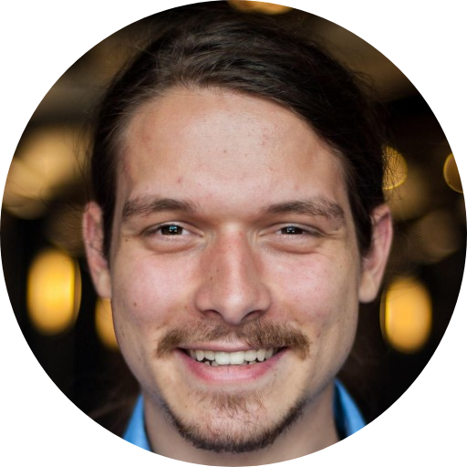

<!-- TODO(a11y): 1 localized body image(s) have empty alt text -->

<figure class="">

</figure>

## ************Interview with******** Grayson Carroll****

**GitHub:** [@carrollgt91](https://github.com/carrollgt91)  |  **Slack:** [@grayson](https://openmined.slack.com/team/U6NFS5M36)

---

********Where are you based?********

> “Nashville, TN, USA.”

********What do you do?********

> “Team Lead and Senior Software Engineer at FortyAU, a software consultancy based in Nashville, TN and Denver, CO.”

********What are your specialties?********

> “Project Management, Vision-Setting, Full-Stack Web Development.”

********How and when did you originally come across OpenMined?********

> “I went to college with Andrew Trask at Belmont! When the project was first getting kicked off, he reached out to me to let me know what he was working on and get me plugged into the community.”

********What was the first thing you started working on within OpenMined?********

> “I did a bit of work in simplifying the local development setup for the ecosystem by ensuring everything could be run within Docker.”

********And what are you working on now?********

> “Opus, the private identity server project. We’re creating a “digital passport” to make verifying your identity and various data points about yourself easy while fully maintaining your privacy.”

********What would you say to someone who wants to start contributing?********

> “Jump in! This is one of the most supportive and accessible open source communities I’ve ever seen. There are tons of places where you can engage with folks to help you find a good place to get started, regardless of your skill set or background.”

****Please recommend one interesting book, podcast or resource to the OpenMined community.****

> “Daring Greatly – Brene Brown. This book has changed the way that I live and lead. It focuses on how being vulnerable can empower you to live a more wholehearted life. Her other books are great, too!”
