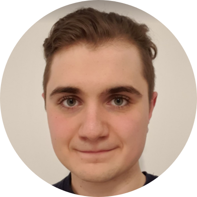

<!-- TODO(a11y): 1 localized body image(s) have empty alt text -->

<figure class="">

</figure>

## ************Interview with************ Tudor Cebere

LinkedIN: [@tudorcebere](https://www.linkedin.com/in/ioan-tudor-cebere-b18b0713a/)  |  Github: [@tudorcebere](https://github.com/tudorcebere)  |  Twitter: [@tcebere](https://twitter.com/TCebere)

********Where are you based?********

> “Bucharest, Romania”

********What do you do?********

> “Currently, I took a gap year between my BSc and MSc, and I am working full time on Syft.”

********What are your specialties?********

> “In the past, I’ve worked as a Machine Learning Research Engineer, now I am doing mostly Python development. Overall, I am interested in Machine Learning Systems and Privacy-Preserving Technologies.”

********How and when did you originally come across OpenMined?********

> “Initially, I’ve received a notification from Udacity that this new course will be released with fancy words like “AI” and “Privacy” in it, made a part of it and that was it. A few months later, I participated in a contest with George Muraru and a few other faculty colleagues, the topic being machine learning in healthcare. It struck me that we can use Syft to present Federated Learning in healthcare, the jury was impressed, and we found ourselves winners of the big prize. Afterwards, George became a contributor, he told me about the lovely community, a few months later, I joined OM as well.”

********What was the first thing you started working on within OpenMined?********

> “I have started working on the Syft core, which I am still working on 1 year later. Many things changed, I’m no longer a git noob, I became a walking python interpreter, and I am still learning a ton of stuff every day. I remember that my first big PR took like 2 months to get merged, being focused on making the Plans API feel similar to the usual Python function API. It was a deep dive into the whole codebase and made me confident about improving multiple parts of the project.”

********And what are you working on now?********

> “My main focus is the Syft library, I feel really connected to this project, and I would like to see it production-ready at some point. I enjoy working with the team, as it’s friendly and full of exciting ideas regarding how to integrate more privacy preserving technologies, how to make remote execution better, the work being at a nice boarder between engineering and research. As side projects, I’ve started reading theory on Secure Multi-Party Computation and more recently, Differential Privacy.”

********What would you say to someone who wants to start contributing?********

> “Do it right away, break stuff and ask the contributors to help you out. You will become better in time, and before you know it, you will be helping others. It’s enriching to see that something you’ve helped to build gets used and solves real problems. Reach out to the devs, ask how you can help and start digging right away.”

****Please recommend one interesting book, podcast or resource to the OpenMined community.****

> “I’ll present two of my recent discoveries in terms of books and podcasts:
> 
> – Arthur C. Clarke: Childhood’s End – A superior race occupies Earth and helps humans reach an ideal society. It’s interesting to analyse the shift in interests, the recent emerging conflicts in this new society and what breaks the peace.
> 
> – Huberman Lab Podcast – a relatively fresh podcast, it explains neuroscience to all noobs that would like to understand it and never have been good at biology or chemistry. Even if there are only 6 episodes until the writing moment, their quality and impact are incredible. The latest episode: “How to Focus to Change Your Brain” has been so fascinating that I’ve had to relisten to parts of it.”
