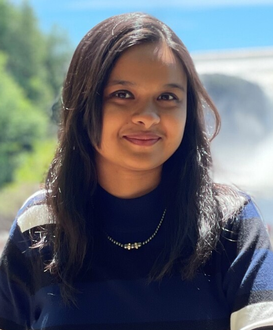

<!-- TODO(a11y): 1 localized body image(s) have empty alt text -->

<figure class="">

</figure>

## Interview with Zarreen Reza

Github: [@znreza](https://github.com/znreza)

**Where are you based?**

> Montreal, Canada

**What do you do (i.e. studying, working, etc.)?**

> I am working as an AI Research Scientist.

**What   are   your   specialties   (i.e.   Python   development,   Javascript development, community organization, etc.)?**

> My expertise is in doing research and develop AI-powered solutions using Machine   Learning,   Deep   Learning,   PETs,   Probabilistic   Graphical   Models, Causal Inference etc. For development, I highly rely on Python, Tensorflow and PyTorch. I   also   enjoy   leadership   and   mentorship   roles   and   creating   educational contents on the above-mentioned topics.

**How and when did you originally come across OpenMined?**

> I joined OpenMined in January 2020. I was stuck at home in the middle of the COVID-19 pandemic and looking for open-source developer communities to join and learn something new. One day I came across a tweet from Andrew Trask with an invite to join OpenMined. I joined the slack community and got surprised by the massive amount of exciting projects everyone was working on. My first introduction to the world of PETs also happened through OpenMined.

**What was the first thing you started working on within OpenMined?**

> The first team I was in was the Writing Team. I also used to attend some weekly study groups led by few amazing community members where there used to be presentations on topics like Differential Privacy, Homomorphic Encryption, etc.

**And what are you working on now?**

> Recently I graduated from the OpenMined Padawan program. Throughout the program, I learned so many new things about PySyft, Differential Privacy,  SMPC etc. and got some cool ideas to work with in the process. Currently I am working with the partnership team where I deliver weekly learning tutorials on remote private data science using PySyft. I also educate the partners through the tutorials and help them understand the potentials PySyft can offer in solving a wide range of valuable use-cases for their organisations.

**What would you say to someone who wants to start contributing?**

> I would say, please go through the [OpenMined PySyft repository](https://github.com/OpenMined/PySyft) in Github. It  has great documentations and almost everything you need to get started with PySyft. The repo also has a great deal of [examples](https://github.com/OpenMined/PySyft/tree/0.7.0/notebooks) of the usage of PySyft for Differential Privacy, remote data science, etc. Additionally, I would highly recommend going through some previous Padawan notebooks which cover a lot of these topics with great detail and give you the intuition behind using each component.

> Finally, be sure to check out this [very helpful guide](https://openmined.github.io/PySyft/guides/) to get an idea of the entire workflow that takes place in remote data science using PySyft. If you are stuck at any point, or get any questions, please don’t hesitate to ask them in slack. Everyone is extremely helpful in this community, and they will have you covered.

**Please recommend one interesting book, podcast or resource to the OpenMined community.**

> I   have   recently   finished  reading  Atomic   Habits   by  James   Clear.   This   book talks about following four simple laws to build good habits and break the bad ones  in  our  lives.  One  of  my  favorite   quotes  from  the   book  is,  _“All   big things   come   from   small   beginnings.   The   seed   of   every   habit   is  a single, tiny decision”._

> If   you   are   into   podcasts,   I   would   highly   recommend   checking   out   Naval Ravikant podcasts, especially the one on The Knowledge Project channel and the one with Joe Rogan. His podcasts cover a wide range of topics from science, technology, past, future and life. I also occasionally listen to the Lex Fridman podcasts, especially when he invites guests from non-traditional or unique backgrounds like David Kipping and Jordan Peterson.
