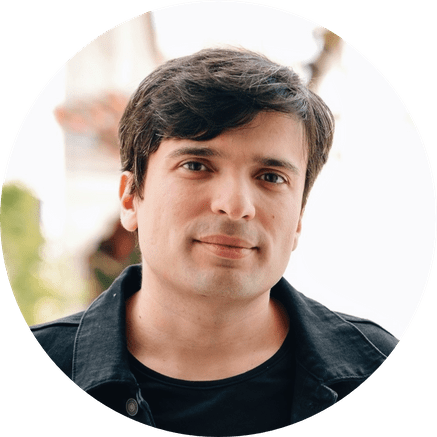

<!-- TODO(a11y): 1 localized body image(s) have empty alt text -->

<figure class="">

</figure>

## ************Interview with********** Thiago Costa Porto**

Github: [@tcp](https://github.com/tcp)  |  Twitter: [@1tcp](https://twitter.com/1tcp)  |  LinkedIN: [@thiagocostaporto](https://www.linkedin.com/in/thiagocostaporto)

****************Where are you based?****************

> _“_I’m based in Lisbon, Portugal. I’m originally from Belo Horizonte, Brazil._“_

****************What do you do?****************

> _“_After getting my BSc degree in Computer Science at UFMG in Brazil, I went to Sweden for my masters and the US for my PhD in Operations Research. I’m super into optimization, sports analytics and data visualization. I’ve been developing web applications since I was a teenager and earlier this year I jumped on the opportunity to lead OpenMined’s Web and Mobile team._“_

****************What are your specialties?****************

> _“_I have lived through a succession of frameworks and tools for building web applications. These days, I use React in front end development — and Next.js is pretty nice — and I quite enjoy Vue and Svelte as well. In the back end, I’m more used to using Flask and Express, although I’ve been getting back to Ruby here and there.
> 
> Data visualization is a passion of mine and I love the entire d3.js library.
> 
> I feel at home using JavaScript, but I still have nostalgia feelings for C. I’m trying to expand the repertoire by including Rust and I’m a regular at OpenMined’s _Rust Thursdays_. That’s a great way to learn more about Rust while contributing to our OpenMined libraries. And it’s open for anyone to join. Stop by #rust in our community Slack to code with us!_“_

****************How and when did you originally come across OpenMined?****************

> _“_It was actually Patrick who introduced me to OpenMined. Back in 2018, I was one of the owners of a software house in Brazil and he was a client. We were working together on a web application and he happened to mention OpenMined and talk about the community, what they were doing and how much it was growing.
> 
> I checked it out and it was fantastic! Privacy is a topic of interest which I’m very concerned about, so it was great to join the community and learn not only about the problems related to privacy in many domains but to become part of this group of highly skilled, highly educated individuals coming together and working on the solutions._“_

****************What was the first thing you started working on within OpenMined?****************

> _“_PyGrid! I did some proof-of-concept work with PyGrid which was eye opening to grasp what it is possible to do with the “syft-grid ecosystem”. Very excited for what’s coming next._“_

****************And what are you working on now?****************

> _“_I’m basically “taking over” OpenMined’s web platforms — [OpenMined Education](https://courses.openmined.org), [the website](https://www.openmined.org/), [PyGrid Admin](https://github.com/openmined/pygrid-admin), [this blog](https://blog.openmined.org/)! — and leading the transition to new versions of these platforms or creating new web applications. Plus, the Web and Mobile team is developing many other web applications that will be unveiled in the next couple of months. These are very exciting times!
> 
> If you want to jump in and help us develop our web platforms, please reach out in the #web-and-mobile channel on Slack!_“_

****************What would you say to someone who wants to start contributing?****************

> _“_Just do it! OpenMined is a fantastic place to learn and build interesting tools. There are lots of skilled contributors who will help you out and the support team is amazing. Reach out to us, we are friendly!
> 
> More importantly, your contributions will help tons of people worldwide and you will be working on tools that help solving impactful real world problems that everyone can relate to. Just do it!_“_

********Please recommend one interesting book, podcast or resource to the OpenMined community.********

> _“_I really enjoy the [Lex Fridman](https://www.youtube.com/playlist?list=PLrAXtmErZgOdP_8GztsuKi9nrraNbKKp4) podcast. It’s awesome! Lex has such a unique way to talk to the guests and the topics are varied, ranging from philosophy, to aliens (it is a favorite topic for Lex), AI, teaching, learning, future technology, and many others. He talks to very influential people and it’s remarkable how interesting and filled with content these interviews are. He’s done some 3-hour, 4-hour long podcasts that are not hard to listen to._“_
