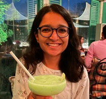

<!-- TODO(a11y): 1 localized body image(s) have empty alt text -->

<figure class="">

</figure>

## Interview with Fiza Husain

Github: [@fiza11](https://github.com/fiza11)

**Where are you based?**

> I’m currently based in New Delhi, India.

**What do you do (i.e. studying, working, etc.)?**

> I’m in my fourth year of Bachelor’s in Computer Science at IIIT Hyderabad.

**  
What   are   your   specialties   (i.e.   Python   development,   Javascript  
development, community organization, etc.)?**

> My   areas   of   expertise   are  Reinforcement   Learning   and   Differential Privacy, and   my   language   of   choice   is   Python.   My   research   topic   is   Privacy   and Generalization in Deep Reinforcement Learning.

**How and when did you originally come across OpenMined?**

> I came across OpenMined through a co-researcher and friend of mine, who introduced me to it and I started contributing after that.

**What was the first thing you started working on within OpenMined?**

> I started working on the PySyft library. I started  solving linting errors and adding documentation that helped me understand the code and then continued working on the library by extending its functionality.

**And what are you working on now?**

> I’m currently a member of the Differential Privacy team working on extending the functionality of PySyft.

**What would you say to someone who wants to start contributing?**

> I would advise them to look up beginner issues on the github repo and just start tackling one. The OpenMined community is very welcoming and everyone helps each other. The community is super active on Slack, and I would also encourage newcomers to ask questions freely and without the fear of being judged.

**Please recommend one interesting book, podcast or resource to the  
OpenMined community.**

> I really like listening to Lex Fridman podcast. The podcasts are not only interesting and insightful, but also deeply self-reflective. If someone is into AI and technical domain, they’ll love this podcast.
