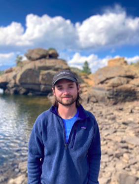

<!-- TODO(a11y): 1 localized body image(s) have empty alt text -->

<figure class="">

</figure>

## Interview with Jack Bandy

Github: [@jackbandy](https://github.com/jackbandy)

**Where are you based?**

> Chicago, Illinois (? Lexington, Kentucky)

**What do you do (i.e. studying, working, etc.)?**

> I’m currently a PhD Candidate in [Northwestern’s Technology and Social Behavior program](https://tsb.northwestern.edu/). In September, I will start as an assistant professor of computer science at [Transylvania University](https://www.transy.edu/)!

**  
What are your specialties (i.e. Python development, Javascript development, community organization, etc.)?**

> Algorithm auditing, platform transparency, data science, social media analytics.

**How and when did you originally come across OpenMined?**

> While I was interning at a social media company, some of my colleagues were [exploring](https://blog.openmined.org/announcing-our-partnership-with-twitter-to-advance-algorithmic-transparency/) ways to share data and improve algorithmic transparency while preserving user privacy. OpenMined’s approach to data governance is a promising method for doing so, and I  stayed connected with the community to continue exploring the potential.

**What was the first thing you started working on within OpenMined?**

> My initial work was focused on using the OpenMined stack for algorithm auditing, which  basically entails testing platforms like Twitter to understand the impact of their algorithmic systems.

> If more companies shared data through technologies like PySyft, researchers could answer more questions about platforms – for example, which users benefit the most from algorithms? How much does disinformation get amplified? To what extent do people experience digital “echo chambers?” — all while preserving user privacy.

**And what are you working on now?**

> Currently, I am pretty focused on finishing my dissertation ?. After that, I am looking forward to testing new versions of PySyft that could expand the possibilities of algorithm auditing and enable important research into social media and other digital platforms.

**What would you say to someone who wants to start contributing?**

> Like many collective action projects, open-source software benefits from a lot of people contributing a little bit. No contribution is too small! I also suggest connecting with other people in the community to discuss how your goals align with OpenMined and make a strategy for your contributions based on your capacity and expertise – that can be difficult to do individually.

**Please recommend one interesting book, podcast or resource to the OpenMined community.**

> I recommend the great outdoors! Take an hour or two (or twelve) to explore our planet and listen to birds, breath some fresh air, look at the flowers and trees, etc., and you might be surprised how much it can help your mind. You can also use apps like Merlin Bird ID or Seek (by iNaturalist) to identify and learn about the different life forms around you.

**Other social media links:**  
Hci.social: [@jackbandy](https://hci.social/@jackbandy)  Twitter: @[jackbandy](https://twitter.com/jackbandy)

**?**Want to work with folks like Jack? **[Apply here](https://blog.openmined.org/work-on-ais-most-exciting-frontier-no-phd-required/)** to be mentored by core team members (like Jack) on the PySyft codebase!
