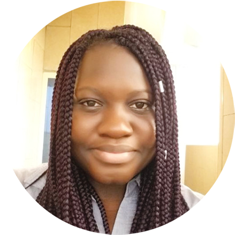

<!-- TODO(a11y): 1 localized body image(s) have empty alt text -->

<figure class="">

</figure>

## Interview with Yemissi Kifouly

**Twitter:** [@YemiKifouly](https://twitter.com/yemikifouly)  |  **Slack:** [@Yemi](https://app.slack.com/client/T6963A864/DJVE00WV8/user_profile/UG81TV4GG)

---

**Where are you based?**

> “Cotonou, Benin (in West Africa)”

**What do you do?**

> “I study. I originally studied Electrical Engineering but have fallen in love with Machine Learning and Artificial Intelligence last year. I am currently doing AI-related Udacity Nanodegrees and planning to go back to school next year to do a more formal degree.”

**What are your specialties?**

> “Python development, tutoring and mentoring”

**How and when did you originally come across OpenMined?**

> “I originally heard about OpenMined in January 2019 after reading Andrew Trask’s book: Grokking Deep Learning. I joined the Slack workspace then but didn’t really contribute because I was still very new to Deep Learning and didn’t feel I had much to offer.”

**What was the first thing you started working on within OpenMined?**

> “My first official contribution to OpenMined was through my current role as a mentor.”

**And what are you working on now?**

> “Right now, in the OpenMined community I act as a mentor. I guide new members of the community to get them to contribute while working towards reaching their own goals. And I love every minute of it.”

**What would you say to someone who wants to start contributing?**

> “Find your niche. There are a lot of ways to contribute to OpenMined. It is not all coding. So, learn about all the Dev Teams and all the Community Teams and pick something that works for you. But do not be intimidated. Everyone in the community is happy to help and we were all beginners once.”
