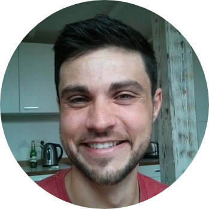

<!-- TODO(a11y): 1 localized body image(s) have empty alt text -->

<!-- TODO(content): NO ppma_author — assigned openmined placeholder -->

<figure class="">

</figure>

## ************Interview with************ Madhava Jay

LinkedIN: [madhavajay](https://www.linkedin.com/in/madhavajay/)  |  Github: [@madhavajay](http://github.com/madhavajay)  |  Twitter: [@madhavajay](https://twitter.com/madhavajay)

********Where are you based?********

> “Brisbane, Australia”

********What do you do?********

> “Currently, I am working full time on Syft, but I am a lifelong learner so i’m always studying in my spare time.”

********What are your specialties?********

> “I have been writing code professionally since 2003 and the world of available technologies to write code for has exploded in that time. One particular soft skill I have developed over the years is being comfortable as a novice while learning a new topic. This has been crucial in preventing me from giving up during the steep learning curves of any new domain.
> 
> Recently I have been largely focused on Python package development with some dabbling in Rust for cross platform FFI code which runs inside Python or Native Mobile. Over the last few years I have worked on lots of MLOps and DevOps engineering to build data and training pipelines in the cloud or on-prem inference engines, mostly with Python, Docker and Ansible.
> 
> However, prior to that I spent a lot of time with Native Mobile development on iOS and Android, using Swift and Kotlin, and going back many years prior, I worked with data driven web applications and JS front ends. Ultimately, if it can run code or collect data I’m interested in coding on it!”

********How and when did you originally come across OpenMined?********

> “According to Slack I joined on December 3rd 2019, but I had been following Andrew Trask on Twitter and via his Grokking Deep Learning book and some blog posts back in 2016.”

********What was the first thing you started working on within OpenMined?********

> “I remember the very first thing was to try to get some kind of Audio data transfer between mobiles for possible COVID contact tracing right when COVID hit. Shortly after I joined the Stanford COVID Watch team and then in parallel the OpenMined DP team were porting Google’s C++ DP library to different platforms and I put my hand up to work on the Swift / iOS version.”

********And what are you working on now?********

> “I am currently working in the Syft Core team developing the latest version of Syft and Duet, our newest addition to the OpenMined family. We just released 0.3.0 at PyTorch Developer Day 2020.
> 
> You can [watch PyTorch Dev Day here](https://www.youtube.com/watch?v=jaPVoObpdO0&feature=youtu.be&t=16536&ab_channel=PyTorch).
> 
> Learn more about our [AI Privacy course](https://courses.openmined.org/) here.
> 
> Going forwards we have a lot of exciting features on the roadmap for 2021.”

********What would you say to someone who wants to start contributing?********

> “There are so many ideas, businesses and projects out there, but you will be hard pressed to find a community like OpenMined which lies at the center of a venn diagram of so many exciting and world changing technologies in the AI space. **[Come join us](https://placements.openmined.org/)!** No contribution is too small. The journey to a million downloads begins with a single commit.”

****Please recommend one interesting book, podcast or resource to the OpenMined community.****

> “I will recommend two because many people may already know it, but the [Lex Fridman podcast](https://lexfridman.com/podcast/) (formerly known as the AI Podcast) is just unbeatable in terms of fascinating ideas and inspiring guests discussing topics from AI to Neuroscience to Philosophy.
> 
> If you know that podcast but you still don’t listen to it regularly, stop reading this blog post right now and go start listening to any episode and get yourself hooked. Incidentally, I would love to hear Lex interview Trask some time.
> 
> For those who are still reading, the second recommendation would be to read a great Sci-Fi book. A classic favourite of mine is [Neuromancer by William Gibson](https://en.wikipedia.org/wiki/Neuromancer) (A dual winner of Hugo and Nebula awards), but there are far too many equally good ones to list here. We have a huge selection of amazing books, podcasts and video tutorials these days to learn anything and everything 24/7, multiple times over, but it’s critical that we allow our minds to explore and think in a way that only imagination and fiction can provide. Plus we should all read more.”
