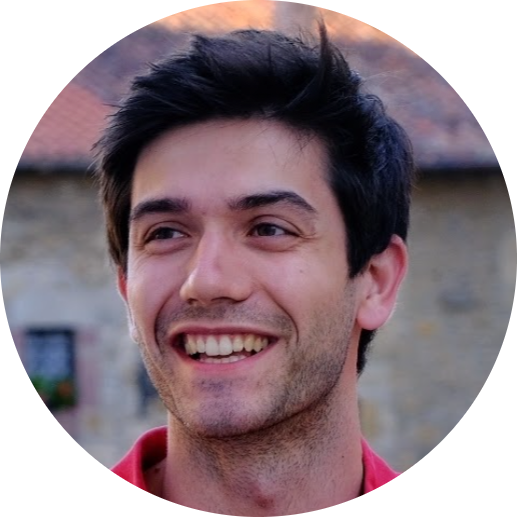
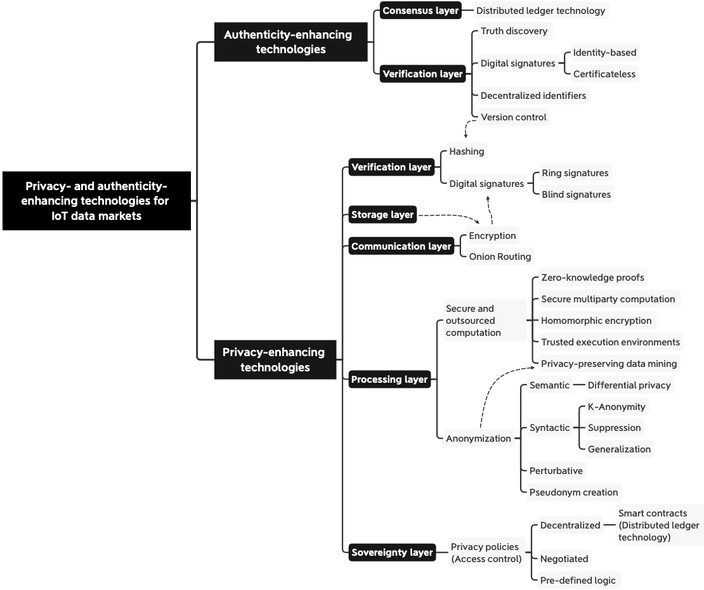

<!-- TODO(a11y): 2 localized body image(s) have empty alt text -->

<figure class="">

</figure>

## ************Interview with************ Gonzalo Munilla Garrido

LinkedIN:[@gonzalo-munilla](https://www.linkedin.com/in/gonzalo-munilla/)  |  Github:[@gonzalo-munillag](https://github.com/gonzalo-munillag)  |  Twitter:[@g\_munilla](https://twitter.com/g_munilla)

********Where are you based?********

> “Munich, Germany”

********What do you do?********

> “I am a Ph.D. student affiliated with the Technical University of Munich (TUM) and funded by The BMW Group. Specifically, I am researching privacy-enhancing technologies with a particular focus on differential privacy.”

********What are your specialties?********

> “My programming language of choice is Python, but I also had my deal of work with Solidity some time ago (for Ethereum smart contracts). I have also experimented a bit with app development using docker, the serverless application framework, and AWS.”

********How and when did you originally come across OpenMined?********

> “I came across OpenMined through a course called “Our Privacy Opportunity.” The people organizing it and the support was great!”

********What was the first thing you started working on within OpenMined?********

> “At OpenMined I focused on writing differential privacy code tutorials; you may find them in this [link](https://blog.openmined.org/author/gonzalo/). My favorite tutorial is based on a paper from Jaewoo Lee et al., which I implemented from scratch; it is called “[Differential Identifiability](https://blog.openmined.org/differential-identifiability/)”—looking forward to what is next!”

********And what are you working on now?********

> “”At the moment, I just released two preprints: “[Do I Get the Privacy I Need? Benchmarking Utility in Differential Privacy Libraries](https://arxiv.org/abs/2109.10789) ” and [“Revealing the Landscape of Privacy-Enhancing Technologies in the Context of Data Markets for the IoT: A Systematic Literature Review”](https://arxiv.org/abs/2107.11905). The former publication compares the most accessible differential privacy open-source libraries and guides practitioners to choose the most suitable library. In the latter, you can find a systematic literature review about the privacy-enhancing technologies that enable and the challenges facing IoT data markets.”
> 
> Small teaser:

<figure class="">

</figure>

> My following publications will consist of a benchmark of differential privacy libraries such as SmartNoise or Google-DP. Additionally, in the medium term, I will work on combining zero-knowledge proofs with differential privacy. If you are interested in these publications, feel free to contact me – I will make sure you get them right away :)”

********What would you say to someone who wants to start contributing?********

> “OpenMined has a very strong community and lots to do. If you are a developer, clone OpenMined’s repos and start looking for things to fix. If you are a writer, start your own blog about privacy and approach the blog leads in Linkedin, likewise if you are a researcher – that is what I did.”

****Please recommend one interesting book, podcast or resource to the OpenMined community.****

> “One book that I had particular fun reading was “Neuromancer” by James Warhola. It is awe-inspiring; while “Neuromancer” was published in 1984, it already dealt with AI, introduced the concept of the “Matrix” in fiction, and (the reason why I mention this book) showcased “privacy rooms.” He depicts a cyberpunk-style world where we are so connected to the internet that there is a business model to offer completely offline rooms. While it is an excellent book to toy with ideas, they better stay in fiction. At OpenMined, we strive to make our future not as bleak as Warhola’s depiction.”
