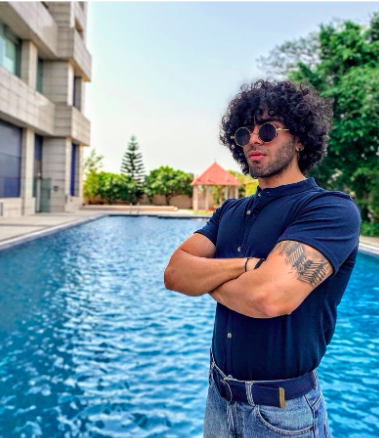

<!-- TODO(a11y): 1 localized body image(s) have empty alt text -->

<figure class="">

</figure>

## Interview with Mrinal Walia

Github: @[abhiwalia15](https://github.com/abhiwalia15)

**Where are you based?**

> Windsor, Ontario, Canada

**What do you do (i.e. studying, working, etc.)?**

> I   am   a   graduate   student   at   the   University   of   Windsor,   pursuing   my   Master’s   in   Applied Computing Artificial Intelligence Stream. Right now I am working part-time with OpenMined as a Technical writer under the Google Season of Docs 22. I am a passionate Data Scientist and a Freelance   Technical   Writer.   I   am   doing   my   research   on   Differentially   Private   Data   Release Methods to advance the aspects of Privacy Enhancing Technologies and balancing data privacy and usability in the social media world.

**What are your specialties (i.e. Python development, Javascript development, community organization, etc.)?**

> I love optimizing machine learning models and developing computer vision software in Python, Java, and R. I love the science behind the data and making valuable predictions and visualizations out of it. I also share my thoughts and knowledge with others by writing articles on Data Science, Machine Learning, Cybersecurity, Quant AI, and more. I also run my health and fitness weekly blog channel on Medium.

**How and when did you originally come across OpenMined?**

> I came across OpenMined when I first saw Andrew’s guest lecture video on Privacy Preserving AI on Lex Fridman’s YouTube channel. I had just started my master’s then and was exploring more about my interest in Data Privacy and PETs. Since that day, I have wanted to work for OpenMined and contribute to any form possible.

> What was the first thing you started working on within OpenMined?  
> I had experience working as a technical writer. When I saw some open issues related to documentation on PySyft’s GitHub page, I quickly jumped on it as it was a critical bug. I still remember the first PR I made, and I was pleased that day because I knew I was working for my passion and love in the field. Currently, I am working as a technical writer with OpenMined under the Google Season of Docs 22 competition.

**And what are you working on now?**

> Currently, I am working on the new set of tutorials for different personas of the Syft library in collaboration with the docs team and data science team. It has been a fantastic experience and a lot to learn and implement. The tutorials are coming out well, and I am getting positive feedback from team members. I look forward to contributing more to the documentation of the Syft library.

> Before this, I helped the team to design and curate new Readme for the Syft library which is now published on the PySyft repository. It was a great responsibility as a lot of people will be depending upon the Readme to getting started with syft and I am glad I got this opportunity to contribute to it.

**What would you say to someone who wants to start contributing?**

> From first-time contributors to seasonal open-source contributors, it is easier than it looks from the outside. You can contribute in any way, from finding a minor bug to suggesting some cool ideas you have. It is just the first step you must take; rest, you will fall in love with the open-source culture, team, work, and the effort you put in.

**Please   recommend   one   interesting   book,   podcast   or   resource   to   the   OpenMined community.**

> I would really recommend “Joe Rogan’s Podcast.” In his podcast, he brings all the great minds from every domain, asks  them questions, and shares their experiences. Guests  come in many shapes and colors, from scientists and researchers to entrepreneurs and celebrities. Watching his podcasts has exposed me to various ideas and ways of thinking in life and in my professional career.

**Other social media links:**

_LinkedIn: [Mrinal (Singh) Walia](https://www.linkedin.com/in/mrinal-walia-b0981b158/)_

_  
[My articles on Open-source tools, resources, and projects on Medium](https://medium.com/@waliamrinal/list/opensource-blogs-b68cf331d37d)_
