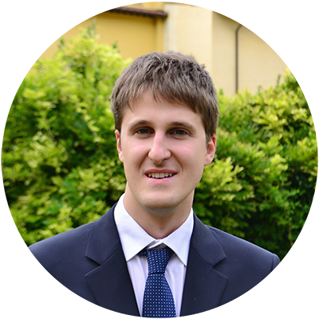

<!-- TODO(a11y): 1 localized body image(s) have empty alt text -->

<figure class="">

</figure>

## Interview with Daniele Gadler

**Twitter:** [@DanieleGadler](https://twitter.com/DanieleGadler)  |  **Slack:** [@DanyEle](https://app.slack.com/client/T6963A864/DP2KJKA4B/user_profile/UHK1ABG59)  |  **Github:** [@DanyEle](https://github.com/DanyEle)

---

**Where are you based?**

> “I’m currently based in Trento, Italy.”

**What do you do?**

> “I just graduated from the Master’s in Computer Science and Networking from the Scuola Superiore Sant’Anna and University of Pisa.

> Very recently I also started working at SIAG – Südtiroler Informatik AG, an in-house government IT company from the Province of Bolzano/Bozen.  My role at this company is Business Intelligence Expert – Data Scientist, where I apply Machine Learning techniques to the digitalization process of the local public administration.”

**What are your specialties?**

> “My specialties are Data Science and Machine Learning mainly with the Python and R programming languages. Whenever possible, I also like contributing to research in computer science: lately I’ve been mainly focusing on research in the field of privacy-preserving machine learning and recurrent neural network quantization, as well as their applicability to the IoT world.”

**How and when did you originally come across OpenMined?**

> “I first found out about OpenMined and the PySyft framework in March 2019, as my Master’s Thesis co-supervisor Dr. Fabrizio Silvestri from Facebook suggested PySyft as a framework for federated learning. At that time, I was looking for an easy-to-use framework that would allow me to carry out distributed neural network training on several distributed devices, without needing me to re-write the whole run-time system from the ground up.

> In fact, as part of my Master’s Thesis under the supervision of Dr. Nicola Tonellotto from the National Research Council of Italy, I aimed at applying quantization techniques at the client and server level in order to reduce the amount of data being transmitted in the federated learning process. PySyft came in extremely handy for this purpose, as it allowed me to combine an existing Alternating Quantization technique from the literature with federated learning.

> Over the last few months, I implemented and fixed many different features I needed in PySyft for my idea to be shaped, and introduced support for Long-Short Term Memory Models, Gated Recurrent Units and Recurrent Neural Networks in PySyft. Furthermore, I fixed quite a number of issues I encountered in the implementation process, such as the backpropagation and gradient clipping procedures for Recurrent Neural Networks.

> Eventually, after several months of work and bug fixing, my approach “Federated Quantization” was finally working, and following a complete experimental evaluation of this approach, I managed to obtain up to 8.70x data reduction in federated learning, while still maintaining a high model accuracy.

> All this hard work surely paid off, as it was rewarded by a graduation grade of 110 cum laude for my Master’s in Computer Science and Networking.

> A lot of members of the OpenMined community also were very helpful in the process of implementing the features I required for my Master’s Thesis, so I’m extremely grateful to all the nice people of the OpenMined community for supporting me throughout the process.

> Another core principle about PySyft is its open-source policy: any bugs fixed or new features implemented will actually benefit all other users of the framework, so some effort by you today may relieve a lot of effort from someone else’s shoulders tomorrow.”

**What was the first thing you started working on within OpenMined?**

> “As a preliminary step for my Master’s Thesis, I was trying to see if PySyft could indeed be used to train a Recurrent Neural Network in a federated manner over resource-constrained devices, such as Raspberry PIs. My first contribution to OpenMined was a fix to PySyft for running federated Recurrent Neural Network training using PySyft on Raspberry PIs.

> Based on that contribution, I also wrote a [Tutorial](https://blog.openmined.org/federated-learning-of-a-rnn-on-raspberry-pis/), which inspired many other members of the OpenMined community to expand upon the topic of federated RNN training as part of the PyTorch Robotics group from the Secure and Private AI Scholarship Challenge by [Facebook AI](https://ai.facebook.com/) and [Udacity](https://www.udacity.com/) . At this [link](https://github.com/shashigharti/federated-learning-on-raspberry-pi), you may find a full list of projects that were created based on the tutorial I wrote in May 2019.”

**And what are you working on now?**

> “Currently, I’m looking into the possibility of adding GPU support to PySyft, so that distributed computations could benefit from the sheer power of GPUs, which are much more fit for data-intensive computations, such as neural network training, than CPUs.”

**What would you say to someone who wants to start contributing?**

> “To start off, the tutorials are the perfect entry point for any new user. If you require a new feature that is currently missing in PySyft for a particular project of yours, just start working on it and do not be afraid to open a Pull Request with a novel contribution or a bug fix, no matter how good your code or fix is: you are going to find plenty of people that will review your code and will help you in case you’re stuck or cannot figure out how a certain part of the codebase works.

> As a final note, I would like to mention that PySyft, with its thriving and supportive community,  is a very good entry point in the field of machine learning and especially federated learning. Since these fields are undergoing an explosive growth rate, PySyft represents an extremely good chance to acquire experience and skills that are very much looked after by tech companies wanting to apply machine learning and federated learning to their business. For example, the work I did on PySyft as part of my Master’s thesis was a key factor that made me land my current job as a data scientist.”
