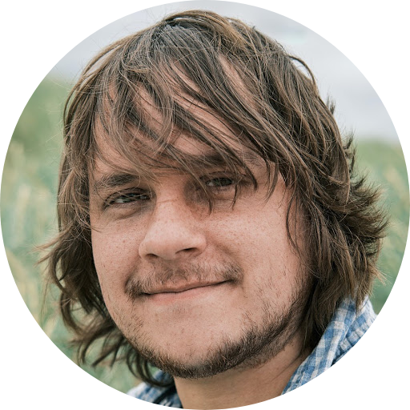

<!-- TODO(a11y): 1 localized body image(s) have empty alt text -->

<!-- TODO(content): NO ppma_author — assigned openmined placeholder -->

<figure class="">

</figure>

## ************Interview with************ Chris Briggs

Website: [confusedmatrix](https://confusedmatrix.com/) |  Github: [@confusedmatrix](https://github.com/confusedmatrix) |  Twitter: [@confusedmatrix](https://twitter.com/confusedmatrix)

********Where are you based?********

> “Staffordshire, UK”

********What do you do?********

> “3rd year PhD student at Keele University. My project is on Federated Learning for Smart Energy Applications. If you’re interested in reading my work, feel free to check out my [research page](https://www.scm.keele.ac.uk/staff/c_briggs/).”

********What are your specialties?********

> “My background is in software engineering, specifically in web development so I’m proficient with most standard JavaScript front-end web stacks as well as databases, backends based on Python, PHP, NodeJS and Go, as well as DevOps involving Linux and Docker. More recently my skills have developed significantly in areas of machine learning, deep learning and data science more generally.”

********How and when did you originally come across OpenMined?********

> “When I first started my PhD I was initially looking at a different topic (streaming data analysis). However once I’d switched to exploring federated learning and data analysis on private data, OpenMined’s excellent work would have been difficult to miss!”

********What was the first thing you started working on within OpenMined?********

> “I was a bit of a lurker in the Slack group for over a year; answering the odd question from new members here and there about federated learning. I saw a post from Andrew Trask that he was interested in putting on an OpenMined conference and as I’d previously been involved in planning a conference elsewhere, I nominated myself to help out. And so it came to be that I ended up leading the organisation of the [OpenMined Privacy Conference 2020](https://pricon.openmined.org) – the result of which I’m extremely proud of.”

********And what are you working on now?********

> “Well, the conference was a LOT of work, so I’m enjoying getting back into my PhD research. However the conference has allowed me to form some great connections with other OM researchers which looks likely to bear fruit in terms of a joint submission to a workshop at NeurIPS 2020. Beyond that, I’d like to remain useful in the OpenMined community in any way I can going forward.”

********What would you say to someone who wants to start contributing?********

> “Don’t be a lurker in Slack like I was. Stick your head out and say “Hi, how can I help out?”. OpenMined is the most welcoming open-source community you can hope to be a part of.”

****Please recommend one interesting book, podcast or resource to the OpenMined community.****

> “Just one? OK, how about [The Age of Surveillance Capitalism](https://www.amazon.com/Age-Surveillance-Capitalism-Future-Frontier/dp/1610395697) by Shoshana Zuboff – an excellent exposition of how tech companies are systematically gathering and using personal data at great cost to our privacy and perceived liberties. It’s a loooooong read, but worth it ?.”
