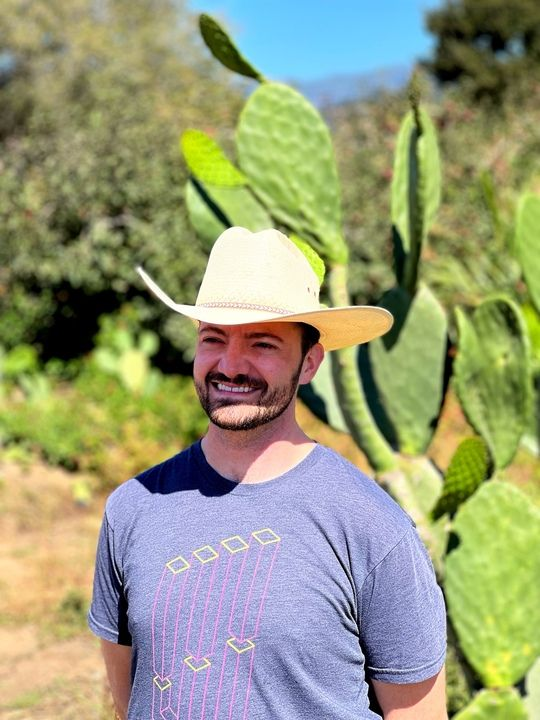

<!-- TODO(a11y): 1 localized body image(s) have empty alt text -->

<figure class="">

</figure>

## Interview with Curtis Mitchell

Github:  [@curt-mitch](https://github.com/curt-mitch)

**Where are you based?**

> San Francisco, California USA

**What do you do (i.e. studying, working, etc.)?**

> I work as a software engineer for NASA at the Ames Research Center. I’m within the aeronautics division where I’m currently working on a software platform that researchers are using to test ideas for a federated air traffic network, which is part of NASA’s [Air Traffic Management eXploration (ATM-X) program](https://www.nasa.gov/aeroresearch/programs/aosp/atm-x). The overall goal is to find the safest and most efficient ways for new types of aircraft, such as commercial drones, to be incorporated into the existing air traffic control system.

**What are your specialties (i.e. Python development, Javascript development, community organization, etc.)?**

> I  primarily   develop   machine   learning   and   full-stack  web   applications  in Python, JavaScript, and TypeScript. I also frequently mentor junior software engineers and advise people interested in careers in software and data science.

**How and when did you originally come across OpenMined?**

> I originally learned about OpenMined when I was studying machine learning in 2020 and I attended OpenMined’s online Privacy Conference. I was really impressed by the conference presentations and the welcoming and supportive culture of the OM community.

**What was the first thing you started working on within OpenMined?**

> When I started the “Our Privacy Opportunity” course a few months after the Privacy Conference, I noticed a small button in the course web application that wasn’t working properly. I opened a pull-request to fix the issue, after which one of the OpenMined leaders asked if I would be interested in contributing more and I immediately said “yes”! I worked for a few months with Thiago making other updates to the course web app until I started working full-time at NASA and had much less time for open source work.

**And what are you working on now?**

> Fortunately right about the time I was looking to resume working with OpenMined again, the Padawan program began and I was accepted into the first round. Since completing the program I have been working with Ishan on the differential privacy features in Syft, focused on adding new differentially private-tensor operations.

**What would you say to someone who wants to start contributing?**

> I would start by joining the OpenMined Slack group and introducing yourself. There are people within OpenMined who can direct you to the proper groups to talk to in order to start helping with something based on your interests and skill sets. I like to think that the world of technology is big enough for anyone at any level to contribute, and I believe this is especially true in open source communities.

**Please recommend one interesting book, podcast or resource to the OpenMined community.**

> [Command Line Heroes](https://www.redhat.com/en/command-line-heroes)  is a podcast I’ve really enjoyed. Each season covers different topics for developers and those interested in technology. For example, season 1 covers the creation and history of open source software, and the recent season 9 discusses malware. Each episode is about 30 minutes, and the host and producers do a great job of showing the human side of software development.

**Other social media links:**

_Twitter: [@Curt\_Mitch](https://twitter.com/Curt_Mitch)_

[Personal website](https://curt-mitch.com/)
