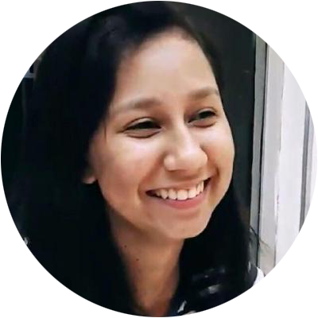

<!-- TODO(a11y): 1 localized body image(s) have empty alt text -->

<figure class="">

</figure>

## Interview with Marianne Monteiro

**Twitter:** [@hereismari](https://twitter.com/hereismari)  |  **Slack:** [@Marianne Monteiro](https://app.slack.com/client/T6963A864/DN20TB682/user_profile/UEBBZG468)  |  **Github:** [**@**mari-linhares](https://github.com/mari-linhares)

---

**Where are you based?**

> “Brazil, Campina Grande.”

**What do you do?**

> “I’ve recently received a bachelor degree in Computer Science at the Federal University of Campina Grande.”

**What are your specialties?**

> “I have experience with Python development, TensorFlow and teaching. I didn’t know Pytorch before starting to contribute to PySyft.”

**How and when did you originally come across OpenMined?**

> “I got to know OpenMined and PySyft at Twitter, [Andrew](https://twitter.com/iamtrask) tweeted about new PySyft tutorials at the time. I never had heard about a lot of the concepts of private deep/machine learning and I thought the idea and possible applications very interesting and highly impactful.”

**What was the first thing you started working on within OpenMined?**

> “I’ve started by following the [tutorials](https://github.com/OpenMined/PySyft/tree/dev/examples/tutorials). During the process, I started making PRs for fixing some typos, doing some small improvements on the tutorials and fixing good start issues. With these contributions, I could learn how to configure a developer environment and how the revision process works for PySyft. After this, I worked mostly on supporting [Plans](https://github.com/OpenMined/PySyft/blob/dev/examples/tutorials/Part%2008%20-%20Introduction%20to%20Plans.ipynb) and implementing [TrainConfig](https://github.com/OpenMined/PySyft/tree/dev/examples/tutorials/advanced/Federated%20Learning%20with%20TrainConfig).”

**And what are you working on now?**

> “I’m currently more involved with the PyGrid project, a Peer-to-peer Platform for Secure, Privacy-preserving, Decentralized Data Science. I’ve recently helped to [support hosting and querying models (encrypted or not) at the platform](https://github.com/OpenMined/PyGrid/tree/dev/examples/Serving%20and%20Querying%20models%20on%20Grid).”

**What would you say to someone who wants to start contributing?**

> “I would say to start by following the tutorials and examples: [PySyft](https://github.com/OpenMined/PySyft/tree/dev/examples/tutorials),  [PyGrid](https://github.com/OpenMined/PyGrid/tree/dev/examples/). These will give you an overview of how the frameworks work and the possible use cases. After following the tutorials, you’ll be familiar with the main concepts and how they work on a high level. Then I would search for easy fixes or low hanging fruit issues that could be done. A great place to start is adding documentation or unit tests. These are always helpful adds and you’ll be more familiar with the codebase after this. Finally, search for a feature or issue that seems interesting to you, this could be an already proposed issue or something that you think could be an interesting feature. A bit of final advice would be: don’t worry about not knowing some concepts, focus on what seems valuable to you and what you want to learn instead.”
