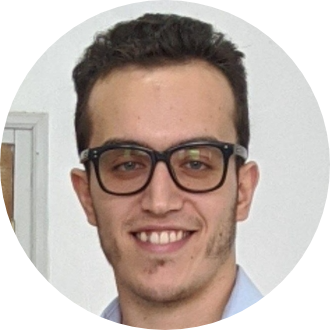

<!-- TODO(a11y): 1 localized body image(s) have empty alt text -->

<figure class="">

</figure>

## ************Interview with********** Ayoub Benaissa**

Github: [@youben11](https://github.com/youben11/)  |  Twitter: [@y0ouben11](https://twitter.com/y0uben11)

********Where are you based?********

> “Algiers, Algeria”

********What do you do?********

> “I recently graduated from a master degree in computer science and will be joining Zama as a crypto engineer, to work around homomorphic encryption technologies.”

********What are your specialties?********

> “I have been mostly focused around cyber-security, machine learning and devops during my time at university, but I have spent more than a year now working with Python/C++ to implement privacy-preserving technologies (mainly homomorphic encryption) in machine learning.”

********How and when did you originally come across OpenMined?********

> “During the Secure and Private AI Challenge by Facebook and Udacity. We were using tools that were developed by the OpenMined community during the challenge, and it was definitely a good first impression.”

********What was the first thing you started working on within OpenMined?********

> “When I was doing the course, some people were struggling to get their machine running PySyft with all its dependencies, so I built a Docker image with all the necessary tools to work on the course. I shared it on Twitter and LinkedIn with the friends I’ve been doing the challenge with, then Trask invited me to merge that into the PySyft library, and that was my first PR into an OpenMined repo.”

********And what are you working on now?********

> “From my first contribution, I have worn many hats at OpenMined, but now I mainly lead the homomorphic encryption team, by working closely with talented people to manage the [TenSEAL library](https://github.com/OpenMined/TenSEAL), and implement use cases (mostly in machine learning) that require encrypted computation.”

********What would you say to someone who wants to start contributing?********

> “I would address this to the people that are struggling to get started, because the rest already know how to do it 🙂 And I want to share a short story of mine, from a few years back when I started being fascinated by open-source, and wanted to contribute to one of the most known OS projects, Linux. It wasn’t easy to learn about the code base, how everything works, but more importantly, how and what to work on. The acceptance rate of your contribution is even close to 0 as a beginner, and that’s understandable considering the scale of the Linux project. However, OpenMined was totally different. It helps people get in, mentor them, assign them to projects. To be short, it’s really welcoming new contributors. All you need to know is where you are heading and what do you want to do with the OpenMined community. People here are working on impactful projects, and they will let you know how you can help, just bring your tools, let them know how you intend to use them, and what for.”

****Please recommend one interesting book, podcast or resource to the OpenMined community.****

> “Microsoft organized the Private AI Bootcamp in December 2019, and all the recordings are available [here](https://www.youtube.com/playlist?list=PLD7HFcN7LXRef-eTSGt_XOUJLZNoDINUn).
> 
> There are different talks and tutorials mainly focused on homomorphic encryption technologies.”
