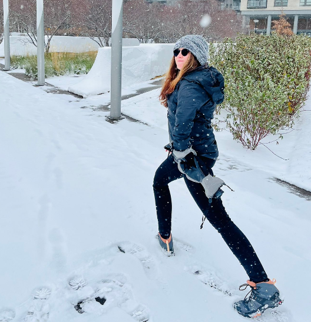

<!-- TODO(a11y): 1 localized body image(s) have empty alt text -->

<figure class="">

</figure>

## Interview with Theresa Thoraldson

Github: [@tthoraldson](https://github.com/tthoraldson)

**Where are you based?**

> Minneapolis, MN, USA

**What do you do (i.e. studying, working, etc.)?**

> I’m a Senior Software Engineer at Rhythm Systems and a Computer Science student at the University of London.

**What are your specialties (i.e. Python development, Javascript development, community organization, etc.)?**

> I’m versed in a variety of programming languages from Rust to Java. Here at OpenMined I’m mainly using Python working on PySyft.

**How and when did you originally come across OpenMined?**

> I found a [talk that Andrew Trask gave at MIT](https://www.youtube.com/watch?v=4zrU54VIK6k) which was my first introduction to OpenMined. I eventually ended up taking the Our Privacy Opportunity course, and going through the Padawan Program.

**What was the first thing you started working on within OpenMined?**

> I worked on implementing Action Objects and History Hashes within PySyft! At the time both of these features felt way above my skill level, but thankfully I had an amazing mentor to walk me through the process.

**And what are you working on now?**

> Aside from my main job, I’m working on the Core Engineering Team implementing new features within PySyft. I consistently get to work with talented engineers releasing new features, iterating on existing features and fixing bugs!

**What would you say to someone who wants to start contributing?**

> Apply to the Padawan Program! Or, if you’re ready to dive right in, say hello in the OpenMined Slack so people can help lead you in the right direction to start contributing!

**Please recommend one interesting book, podcast or resource to the OpenMined community.**

> I really enjoy [Machine Learning Street Talk](https://www.youtube.com/@MachineLearningStreetTalk). There’s a large library of interviews and debates with lots of heavy hitters in the Machine Learning space.
