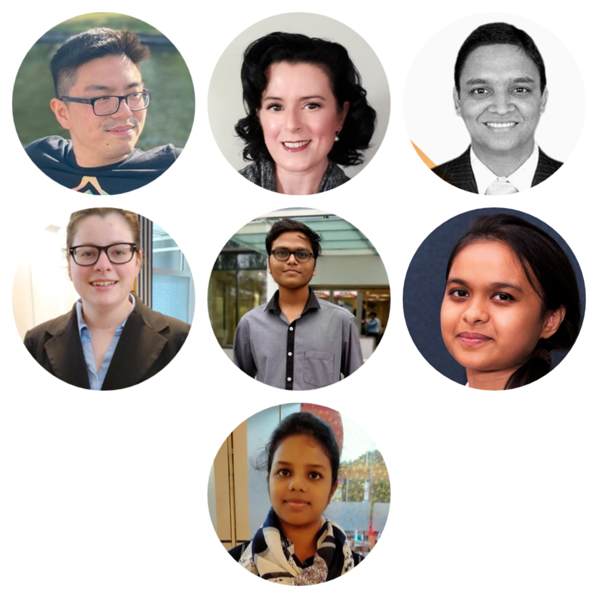
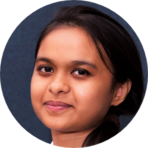
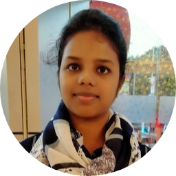
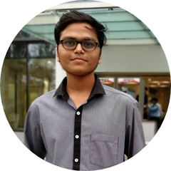
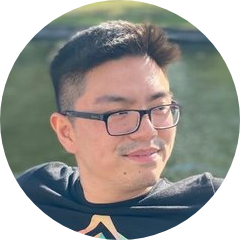
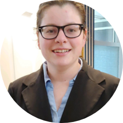
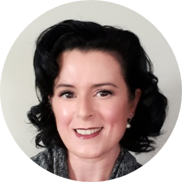

<!-- TODO(a11y): 8 localized body image(s) have empty alt text -->

## ****Beta Bootcamp’s Tech Team****

This month we’re highlighting seven contributors who worked together on [Beta Bootcamp’s](https://blog.openmined.org/announcing-the-first-openmined-boot-camp/) tech team. ‌

<figure class="">

</figure>

## Interview with Zarreen Reza

LinkedIN: [@ZarreenReza](https://www.linkedin.com/in/zarreennreza/)   |   Github: [@znreza](https://github.com/znreza)   |   Twitter: [@zarreenreza](https://twitter.com/zarreennreza/)

<figure class="">

</figure>

****************Where are you based?****************

> __“Montreal, Canada”__

****************What are your specialties?****************

> __“I am specialized in Machine Learning research and development. Currently I am working as a Data Scientist. For development, I highly rely on Python, Spark and occasionally Scala. I also write blogs to share my knowledge and whatever I consider worth sharing.”__

****************What was the first thing you started working on within OpenMined?****************

> __“I joined OpenMined in January 2020 by following a tweet from Andrew Trask. I think the first team I was in was the Writing Team.”__

****************And what are you working on now?****************

> __“Right now I am working full-time as a Data Scientist in Thales Canada. Besides, I am also working on some pet projects. In OpenMined, I am part of multiple teams including the Writing Team, Tech Learning Team, and mostly right now I am busy with a research project with the DP research team. I also made my hands dirty on development by pushing a few Good First Issues to the PySyft repository.”__

****Tell us about Beta Bootcamp’s Tech Team************?****************

> __“The Beta Bootcamp Team was assembled sometimes in the beginning of July, 2020. People from all over the world with a variety of skills and background gathered under one roof with a common goal of educating a bunch of talented developers and eventually facilitating their way to become core contributors to the OpenMined community. Interestingly, the bootcamp ended up being a great learning experience for us, the educators too! Those 4 weeks were extremely rewarding for each one of us on different levels. Someone presented for the first time in her life as a speaker, whereas someone as shy as myself hosted her very first session. We were able to take up such challenges only because we had a great team to watch our back. I can’t stress enough on how much motivating and supporting the team were to each other. I would highly encourage others to take part in such community activities inside OpenMined, because they will not only enrich your technical knowledge and boost your confidence, but also help you grow as a benevolent human being.”__

********Please recommend one interesting book, podcast or resource to the OpenMined community.********

> __“****The Book of Why: The New Science of Cause and Effect**** by Judea Pearl and Dana Mackenzie__

> __This book focuses on how the current AI models lack the causal reasoning ability and why it is something crucial to have in order to achieve AGI. Whether you are overwhelmed by the ongoing AI hype or scared of an upcoming AI apocalypse, this book will provide you a whole new perspective and necessary reality-check.__

> __If you are into podcasts, I would highly recommend checking out Naval Ravikant podcasts, especially the one on The Knowledge Project channel and one with Joe Rogan. His podcasts cover a wide range of topics from science, technology, past, future and life.”__

## **Interview with Shaistha Fathima**

LinkedIN: [@ShaisthaFathima](https://www.linkedin.com/in/shaisthafathima/)   |   Github: [@shaistha24](https://github.com/shaistha24)   |   Twitter: [@shaistha24](https://twitter.com/shaistha24%20)

<figure class="">

</figure>

****************Where are you based?****************

> __“_India_“__

****************What are your specialties?****************

> __“__Web development (HTML, CSS, Bootstrap, JS, angular, Flask), Programming – C, Java, Python, C++. I like to write in my spare time ([https://medium.com/@shaistha24](https://medium.com/@shaistha24)). My current interests are Privacy Preserving Machine Learning – mainly Federated learning and differential privacy; computer vision, adversary attack vectors and protection.__“__

****************What was the first thing you started working on within OpenMined?****************

> __“__I joined the OpenMined community sometime around late April this year. It can be very overwhelming for someone new to the Open source, but thanks to the warm and welcoming community I joined the Mentorship program, which helped me understand things better.  I later joined the Writing Team. My first contribution was to update  PyDP Readme.__“__

****************And what are you working on now?****************

> __“__Here at OpenMined, currently working as part of Privacy Conference (#PriCon2020) Organizing Team as one of the organizers and a coordinator. Hope it turns out to be a huge success!(\*fingers cross\* ) Apart from that, I have been digging deeper in differential privacy and federated learning concepts for the FL\_DP Research project I am part of. You may check my Differential Privacy Basics Blog series here ([https://medium.com/@shaistha24](https://medium.com/@shaistha24) ). Helping set up the quality standard for OpenMined Projects.(work in progress)  Also, working on a Pet project related to CartoonGan – converting images to cartoon or anime or webtoon styled images. You may soon see me in our October’s Paper Session (working on it!). Few more here and there.
> 
> In the coming days, I plan to become more involved with the OpenMined Projects. Let’s see how things work out! (\*fingers cross\* )__“__

****Tell us about Beta Bootcamp’s Tech Team************?****************

> __“__Being part of Beta Bootcamp Tech Team both as a speaker and a Teaching assistant, was one of the best experiences I have had ever since joining the OpenMined Community. Everyone was very supportive in their own ways, for example giving suggestions and helping improve the presentation slides, and being very encouraging – especially our team lead support system – Maddie, Helena and Yemi. A special thanks to Maddie, Helena and Nahua for helping me practice and improve before my session.__“__

********Please recommend one interesting book, podcast or resource to the OpenMined community.********

> “Lex Fridman’s podcasts on YouTube ([https://www.youtube.com/user/lexfridman/videos](https://www.youtube.com/user/lexfridman/videos)), I found it interesting and informative. Not necessarily for OpenMined community but maybe Veritasium ([https://www.youtube.com/channel/UCHnyfMqiRRG1u-2MsSQLbXA](https://www.youtube.com/channel/UCHnyfMqiRRG1u-2MsSQLbXA)) , freeCodeCamp.org ([https://www.youtube.com/channel/UC8butISFwT-Wl7EV0hUK0BQ](https://www.youtube.com/channel/UC8butISFwT-Wl7EV0hUK0BQ)) , Nahamsec ([https://www.youtube.com/c/Nahamsec/videos](https://www.youtube.com/c/Nahamsec/videos))  (YouTube channel). Other than that, I usually like to Search based on my interests and needs. Don’t have any favorites.__“__

## Interview with Nilansh Rajput

Github: [@Nilanshrajput](https://github.com/Nilanshrajput)  |  Twitter: [@nilanshrajput](https://twitter.com/nilanshrajput)  |  LinkedIN: [@nilanshrajput](https://www.linkedin.com/in/nilanshrajput/)

<figure class="">

</figure>

********************************Where are you based?********************************

> ___“___I am currently in Jaipur, India___“___

********************************What are your specialties?********************************

> ___“___Most of my work is for Deep Learning Projects in NLP, Computer Vision, Federated Learning, Multi-model AI and recently started with research projects related to Differential Privacy and NLP. I like to explore new models and play around them for newer applications , and from past few months mostly doing Python Development in the NLP team.___“___

********************************What was the first thing you started working on within OpenMined?********************************

> ___“___My first contribution was in February 2020 and it was for [#SyferText](https://github.com/OpenMined/SyferText) which is a Privacy preserving NLP framework. Since it was a major contribution so after this I was invited to join the NLP team at OpenMined and ever since I have been contributing for SyferText and also in other major OM libraries.___“___

********************************And what are you working on now?********************************

> ___“___Currently I am working as core dev member and Release Manager for NLP team working for the release of SyferText 0.1.0 which is our first major release and contains very cool features, and currently contributing in multiple projects at OpenMined, and recently started a project for studying computation cost for transformer models in Federated and Split NN scenarios.___“___

********Tell us about Beta Bootcamp’s Tech Team************************?********************************

> ___“___Tech Team or “Techies” as we call it, is working on creating all the technical material for bootcamp including creating Notebooks, hosting webinars, Projects demos, and guiding bootcampers for any queries they might be facing. It’s an amazing team we all put joint effort in creating slides, quizzes, assignments for the bootcamp, it’s been an amazing experience working in the Tech Team and leading webinars.___“___

****************Please recommend one interesting book, podcast or resource to the OpenMined community.****************

> “I really like listening to Lex Fridman’s podcast. It covers the most interesting and unique perspectives of amazing people in Interview. And I would really recommend [Alfredo Canziani](https://twitter.com/alfcnz) Deep Learning course it contains the most engaging and interactive lectures with very cool animations and it covers most topics very thoroughly along with Pytorch code for each.___“___

## Interview with Nahua Kang

Github: [@nahaukang](https://github.com/nahuakang)   |   Twitter: [@nahaukang](https://twitter.com/nahuakang)

<figure class="">

</figure>

********************************Where are you based?********************************

> ___“___Berlin, Germany___“___

********************************What are your specialties?********************************

> ___“___Python, writing, editing, teaching (webinar sessions)___“___

********************************What was the first thing you started working on within OpenMined?********************************

> ___“___PySyft back when I first joined OpenMined in October, 2017; the first thing I worked on with OpenMined upon rejoining was editing blog posts for the Writing Team.___“___

********************************And what are you working on now?********************************

> ___“___Documentation works for Syft.JS and PyGrid teams, editor on the Writing Team as well as participating in the new Recommendation Systems team.___“___

********Tell us about Beta Bootcamp’s Tech Team************************?********************************

> ___“___This team is filled with a group of hardworking and caring enthusiasts and professionals who are eager to empower others to become part of the OpenMined community.___“___

****************Please recommend one interesting book, podcast or resource to the OpenMined community.****************

> “George Owell’s Nineteen Eighty-Four (I’m reading it for the third time). Or any piece of classical literature. Coming from the humanities, I believe that every developer could benefit from reading literature. It helps us to experience different forms of emotions and makes us more sensible and empathetic, which ultimately helps us become better teammates and team leads.___“___

## Interview with Madison Estabrook

Github: [@madisonestabrook](https://github.com/madisonestabrook)

<figure class="">

</figure>

********************************Where are you based?********************************

> ___“___Florida, USA___“___

********************************What are your specialties?********************************

> ___“___Python (for data science and AI) and SQL (for Data Science and Database Administration)___“___

********************************What was the first thing you started working on within OpenMined?********************************

> ___“___Creating an example notebook to expand the tutorial’s dataset to be a non-toy dataset. This notebook presented a Privacy-Preserving Machine Learning approach to imbalanced classification (with PyTorch and PySyft).___“___

********************************And what are you working on now?********************************

> ___“___I am a member of the Beta Bootcamp Tech Team, where I presented my example notebook to campers. I am working on improving my notebook and am actively thinking of new notebook ideas.___“___

********Tell us about Beta Bootcamp’s Tech Team************************?********************************

> ___“___The Beta Bootcamp Tech Team is a lot of fun. I remember some of its members from my AI journey, such as the Facebook Secure and Private AI Scholarship. The Team helps make Privacy-Preserving Machine Learning more accessible.___“___

****************Please recommend one interesting book, podcast or resource to the OpenMined community.****************

> “Visual Studio Code. It has support for many different languages, including Python. It only supports IPYNB notebooks, it also allows you to create a IPYNB notebook from a .py file.___“___

## Interview with Laura Ayre

LinkedIN: [@ayrelaura](https://www.linkedin.com/in/ayrelaura/)   |   Github: [@Metrix1010](https://github.com/Metrix1010%20%20%20)   |   Twitter: [@ayrelaura](https://twitter.com/ayrelaura)

<figure class="">

</figure>

********************************Where are you based?********************************

> ___“___Alberta Canada___“___

********************************What are your specialties?********************************

> ___“___I would say holistic decision making, mentoring and supporting others, and I  focus on setting priorities to get the highest value stuff done.___“___

********************************What was the first thing you started working on within OpenMined?********************************

> ___“___Joined a study group in OpenMined, and then  joined the Mentorship team.___“___

********************************And what are you working on now?********************************

> ___“___I recently joined the Partnerships Team in support of PriCon and beyond. I am the  Technical Mentorship Team Lead. I also enjoy editing/writing articles for the OpenMined blog.___“___

********Tell us about Beta Bootcamp’s Tech Team************************?********************************

> ___“___Brave, talented group of learners who know how to share what they have learned and do it very well. They are all really nice too!___“___

****************Please recommend one interesting book, podcast or resource to the OpenMined community.****************

> “80,000 hours podcast___“___

## Interview with Gunjan Narulkar

Github: [@narulkargunjan](https://github.com/narulkargunjan%20)   |   Twitter: [@gunjan\_narulkar](https://twitter.com/gunjan_narulkar)

<figure class="">

</figure>

********************************Where are you based?********************************

> ___“___Bangalore, India___“___

********************************What are your specialties?********************************

> ___“___Python, Learning and mentorship___“___

********************************What was the first thing you started working on within OpenMined?********************************

> ___“___As a TA in boot camp with Maddie and team.___“___

********************************And what are you working on now?********************************

> ___“___With Recommendation Systems research team, working on understanding current developments in the field___“___

********Tell us about Beta Bootcamp’s Tech Team************************?********************************

> ___“___It is the best bunch of creative and caring and knowledgeable folks you can have supporting your learning!___“___

****************Please recommend one interesting book, podcast or resource to the OpenMined community.****************

> “OpenMined blogs!!”
