<!-- TODO(content): 3 unrecoverable figure(s) removed — dead Google-Docs/social paste artifacts (404 on live for years, no archive). Recreate if valuable. -->
<!-- TODO(a11y): 24 localized body image(s) have empty alt text -->

**Congratulations to all of our R2Q4 Padawan Program Graduates!**

We are thrilled to recognize our Graduates of OpenMined’s Padawan Program. Each has participated in a rigorous and intensive nine weeks of mentorship, learning and contributing to PySyft and Open Source. This graduating cohort consists of 19 talented participants with unique backgrounds, and they represent 13 countries across the globe ?.

OpenMined is a Not-for-profit organization that currently works on encrypted computation in the context of deep learning to provide free user-friendly Privacy Enhancing Technology (PET) tools to the world. OpenMined is determined and committed to fostering the development of the talent pipeline in the PETs space.

The Padawan program has brought together individuals from various fields whose interests and vision are aligned towards the development and deployment of cutting edge technology in the field of PETs. Participants had the chance to contribute to OpenMined’s open source repositories through code, time, and technical challenges.

With increasing requests from partner organizations for talented resources with a good grasp of our PySyft tech stack, they are equipped with knowledge and experience for the deployment of PET solutions within value aligned organizations, government agencies and academic institutions.

<figure class="">

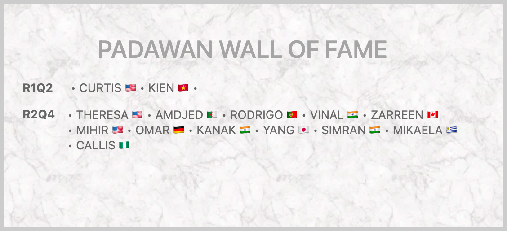

</figure>

## R2Q4 Graduates

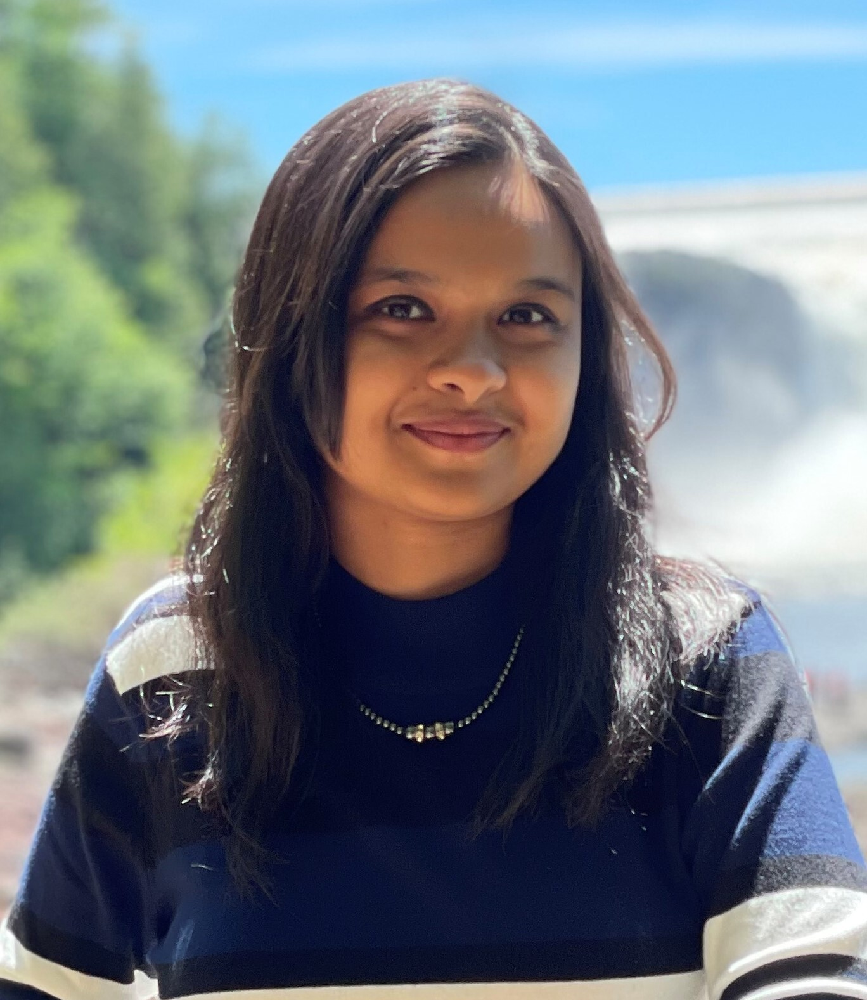

**Zarreen Reza  CANADA**

[Github](http://github.com/znreza)   [LinkedIn](https://www.linkedin.com/in/zarreennreza/)   [Twitter](https://twitter.com/ZarreenNReza)   [Website](http://ai-diary-by-znreza.com/)

**Can sync within North America (Asia too)**

I am an AI Research Scientist, and I also work with multiple open-source groups including OpenMined and Women Who Code. I’ve been a part of the OpenMined Community since the start of the pandemic.

At the start of the Padawan program, I was having a hard time running the Padawan notebooks in my Apple Silicon Macbook. Curtis and I spent time debugging the issues and eventually were able to make everything run smoothly. That was a really fun and satisfying moment to get there.

Currently, I am working on a machine learning project using Differential Privacy for customer segmentation.  I learned so many new things about Differential Privacy, SMPC and got some cool ideas in the process. Now I would like to put them into action to build novel solutions. I am also open to collaborating with other privacy wizards. It’ll be exciting!

After the Padawan Program, I would like to contribute to PySyft as a core member. In 5 years, I envision myself as a researcher in a prominent AI lab doing cutting-edge research and development on AI and PETs focusing on healthcare, reducing societal inequity, and data autonomy. Besides work, I love participating in hackathons, writing blogs, and public speaking. I like to start my day with 10 minutes of Yoga and a cup of hot chocolate.

<figure class="">

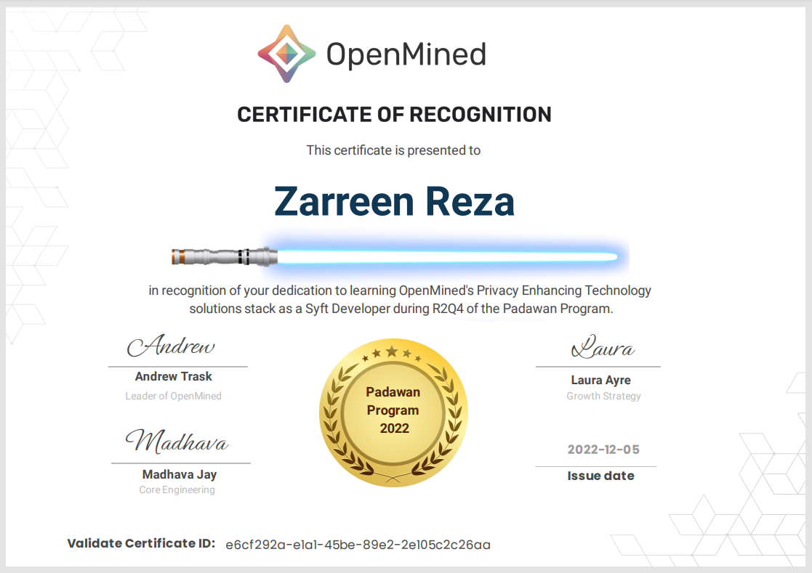

</figure>

---

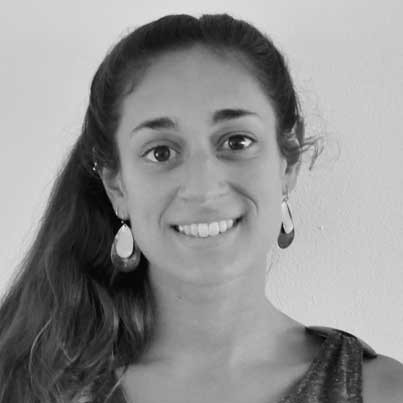

**Mikaela Pisani URUGUAY**

[GitHub](https://github.com/mikaelapisani)  [LinkedIn](https://www.linkedin.com/in/mikaela-pisani-leal/)  

**Can sync within South America (North America too)**

I am the Head of Data Science team at Rootstrap and Co-Managing Director of Girls in Tech Uruguay, a non-profit organization that encourages girls, teens and women into tech. In addition, I work at ORT University within the AI Research team and as a tutor. At our department we are investigating the execution of machine learning models with privacy using PATE and we are trying to implement an architecture for it. Plus, I am part of an interdisciplinary team called ANT, which seeks to integrate Art, Neuroscience and Technology.

<figure class="">

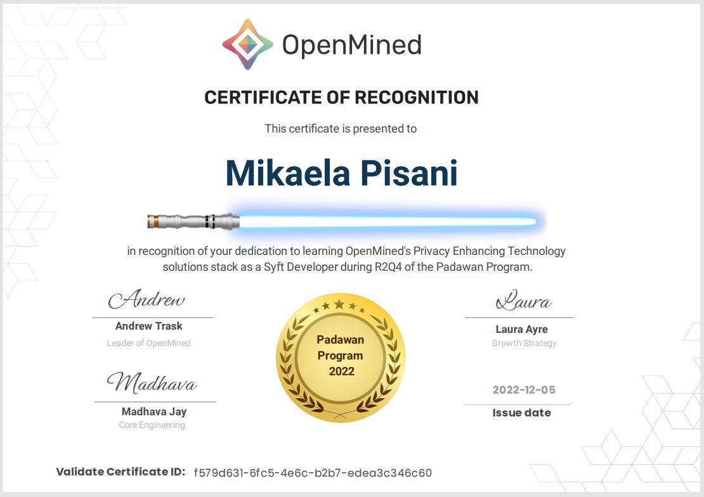

</figure>

---

**Theresa Thoraldson  USA**  

[GitHub](https://github.com/tthoraldson)  [LinkedIn](https://www.linkedin.com/in/theresathoraldson/)  [Twitter](https://twitter.com/tthoraldson)  [Website](http://www.theresa.ai/)

**Can sync within North America**

I’m a Software Engineer/Machine Learning Engineer located in Minneapolis, MN. I’m really interested in using my techie skills to make the world a better place for all. I had my mind blown multiple times going through the Padawan notebooks, especially when learning about Differential Privacy. I’m thankful to have had a mentor that could walk me through a lot of amazing concepts that were covered!

I hope to continue contributing here at OpenMined, and also work on some personal projects. I love skiing, reading, and spending time with my cats.

<figure class="">

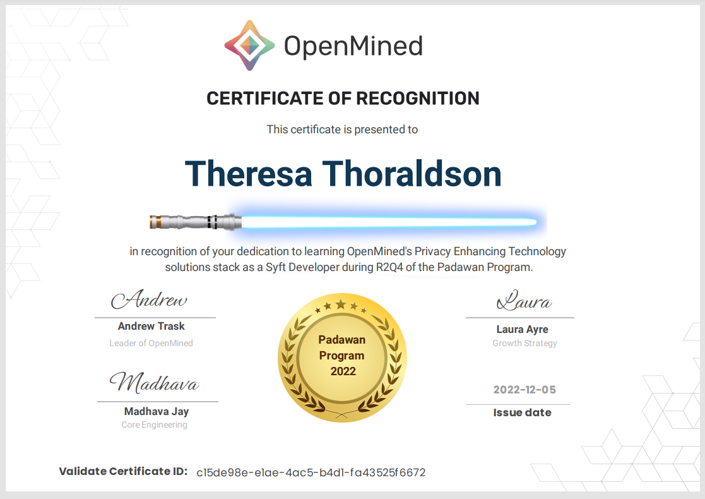

</figure>

---

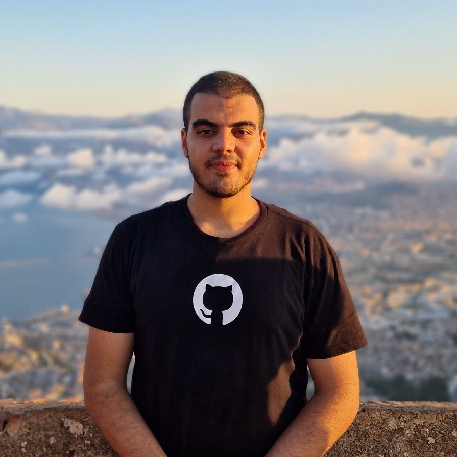

**Amdjed Bensalah ALGERIA**  

[GitHub](https://github.com/amdjedbens)  [LinkedIn](https://www.linkedin.com/in/amdj3dax)  [Twitter](https://twitter.com/amdjedbensalah)  [Facebook](https://www.facebook.com/amdj3d)

**Can sync within Africa & Europe (South America too)**

Since knowledge gives freedom, I’m standing between two lands, AI & cybersec and exploring ways to apply some concepts from cybersec in order to preserve data & keep it secure. Since 2019, I’ve been taking part in a capture the flag (CTF) competition, which has helped me learn about several branches of computer science. The competition revolves around problem-solving and frequently demands a variety of skills that aren’t specialized in any one area.

I’m finishing up my MSc in Computer Systems engineering, while I’m skipping school sometimes to play Kaggle competitions & CTFs. I’m super thrilled about the future of Privacy preserving and the role OpenMined is playing and contributing to improve the privacy of data & the techniques to preserve it. I’m currently seeking opportunities for a ML/DL engineering position with some privacy-preserving included.

My first Padawan interview made a great first impression on me. After that, I thoroughly enjoyed every meeting with my mentor and the discussions we had about the notions of privacy preservation. I thoroughly enjoyed every moment of surprise and when I learned how OpenMined projects were created.

<figure class="">

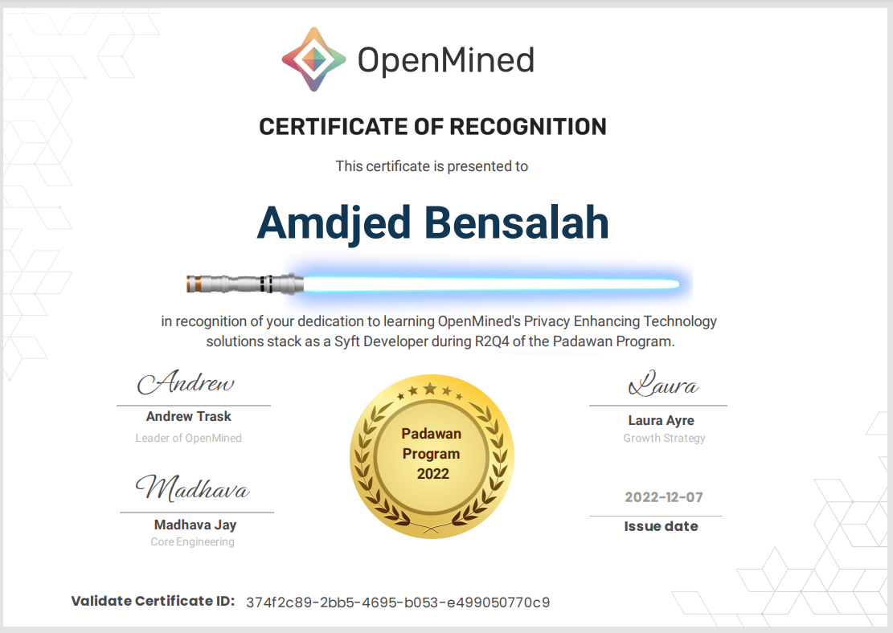

</figure>

---

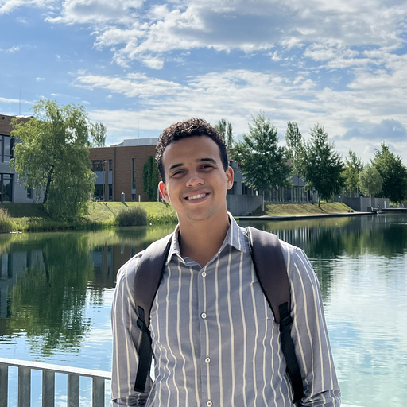

**Omar Elsobky EGYPT**

[GitHub](https://github.com/OSobky)

**Can sync within Africa & Europe (Asia too)**

I am Omar Elsobky, a MLOps Engineer and a masters student. The ML world really makes me curious and I am even more curious about ML solutions. That’s why I love MLOps and the fact that we can make the ML solution life cycle much easier and faster. Recently I have been working on pipelining different tasks in different areas.

My future plans include finishing my studies, working hard, developing my ideas, and last but not least opening my own company.

My most memorable moment was the first session with Stephen which showed me how passionate Stephen is about OpenMined and HAGrid.

<figure class="">

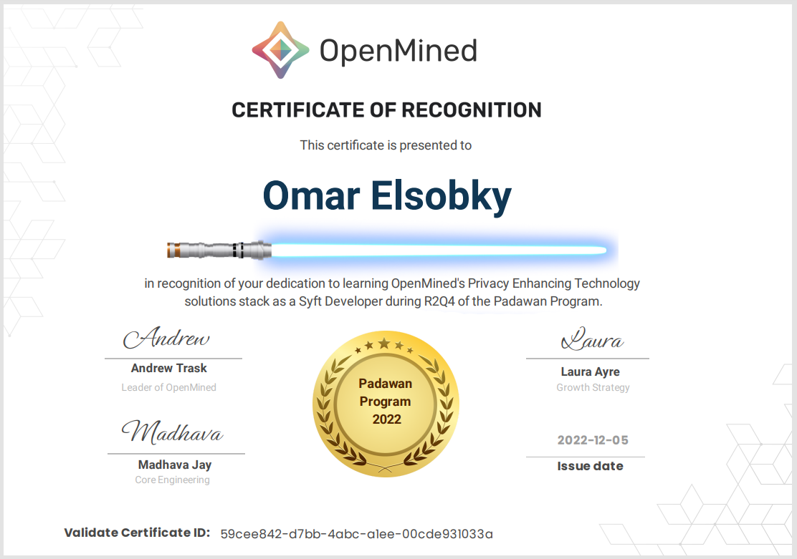

</figure>

---

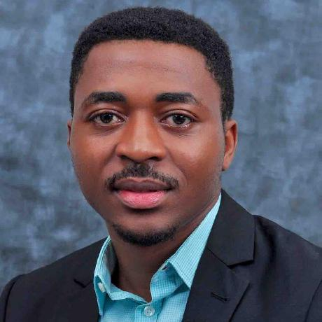

**Callis Ezenwaka  NIGERIA**

[GitHub](https://github.com/callezenwaka)  [LinkedIn](https://www.linkedin.com/in/callezenwaka)  [Twitter](https://twitter.com/callezenwaka)

**Can sync within Africa & Europe**

I have a technical background in Engineering and have spent the last 6+ years delivering enterprise cloud applications (SaaS) in fast-paced, complex environments. I’ve had the privilege of working in a fortune 500 and start-up companies which availed me the opportunity to understand the dynamics of both business environments. I focus on, and timely deliver what returns the greatest benefits for the least costs.

I am looking forward to contributing research on algorithms fairness, data privacy along with the ethical and societal impacts of AI. I am certain that the program has given me a head start on PETs and its use-cases. I plan to pursue a master’s degree in this area with a focus on understanding of the capabilities of current and future digital technologies and their relation to wider society. I am going to spend part of my free time contributing technical articles on PETs and ethical challenges that arise from applications of AI, data, and algorithms.

The program offered me a myriad of exciting moments but contributing code and debugging issues with my mentor stood out for me. It also led to my current project and could be my first major contribution to an open-source project. Adding to the fact, the accessibility of the core team to support on any issue arising during the program.

<figure class="">

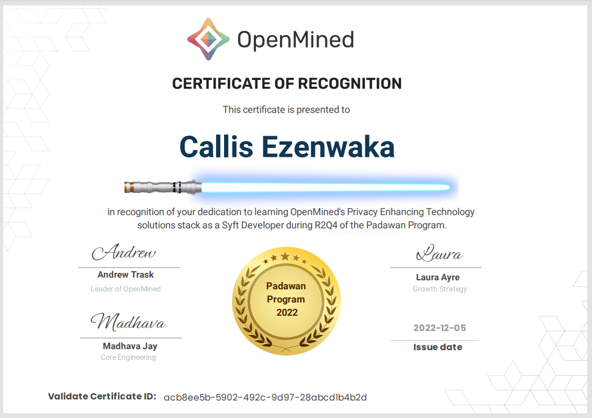

</figure>

---

**Yang Yuqiao JAPAN**  

[GitHub](https://github.com/faustyang)

**Can sync within Asia (Pacific too)**

Currently, I am working on research in federated learning. I am very curious about differential privacy. I am thinking of projects that offer a quick and convincing privacy protection in federated learning that can be applied in a real application.

<figure class="">

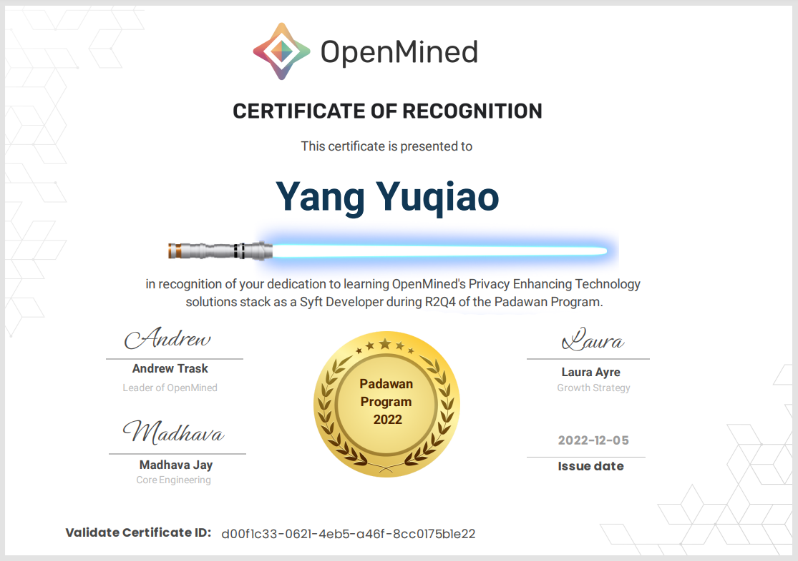

</figure>

---

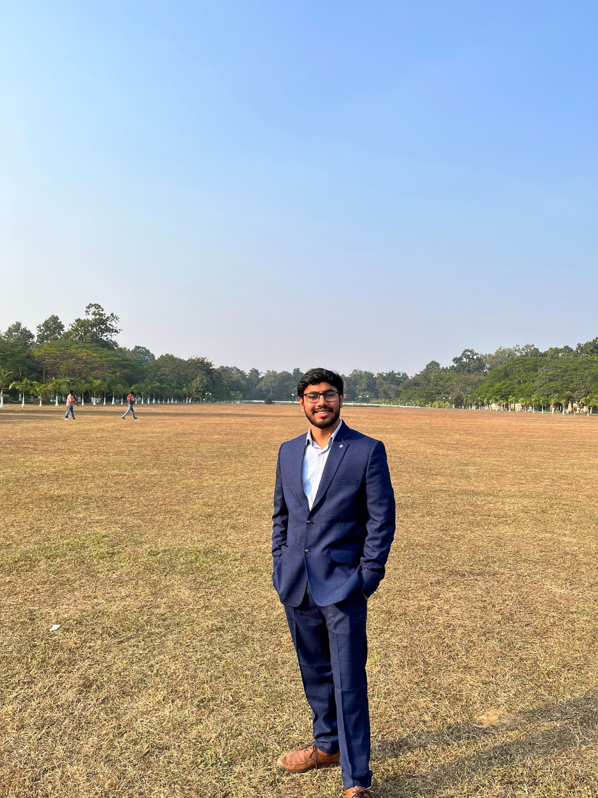

**Kanak Raj INDIA**  

[GitHub](https://github.com/kanak8278)  [LinkedIn](https://www.linkedin.com/in/kanak-raj-a8278i/)  [Instagram](https://www.instagram.com/kanak3447/)

**Can sync within Asia (Africa & Europe too)**

I am interested in Deep Learning applications and I have previously worked on improving UNet-based instance segmentation models. Currently, I am working on Persona based Chat Models and Model Optimization.

My ideas around PETs include applications in Healthcare and Recommender Systems. Healthcare is already taking significant steps with integrating Privacy into workflows, but I would like to see the same with Recommendation Systems. YT for example, is focused on increasing the total time spent which suggests repetitive content. We need to make it more organic and in a sense, more relevant to a person using personal details such as: orientation, job, hobbies, health, etc. As this is sensitive information, I see PETs and OpenMined playing a substantial role here.

I have three more semesters before Graduation and am looking for a research internship in May-July. I want to work on some ongoing projects at OpenMined.

I enjoyed the interaction call with others. I got to know others’ stories, how they entered the field and the work environment at OpenMined. Also, Shubham, my mentor, showed a lot of patience and guided me well during the installation and setup. I am grateful for that.

<figure class="">

</figure>

---

**Rodrigo Simões PORTUGAL**  

[GitHub](https://github.com/rAlexandre00)  [LinkedIn](https://www.linkedin.com/in/rdrslv/)

**Can sync within Africa & Europe**

My journey on the Padawan Program was great. From the moment I was interviewed by [Stephen](https://openmined.slack.com/team/U01LNCACY03) I knew OpenMined had amazing and talented people. I have to say that even though I had worked with Privacy-enhancing technologies before, this path was quite challenging for me. The thing is… I love challenges and learning, which made this journey incredible. It was really inspiring to learn from someone ([Teo Milea](https://openmined.slack.com/team/U014JUS65CK)) equally fascinated with PETs as I am. I feel like I have understood not only what technologies like Differential Privacy and Secure Multiparty Computation are, but also how they can hugely contribute to society.

I am currently increasingly interested in Malware Analysis. I would like to build some automation tools to do it. I am going to finish my Master’s Thesis about Federated Learning resilient to network attacks, and then I am heading to one of Cisco’s cybersecurity divisions.

My most memorable moment was when I learned about Differential Privacy. I thought I had an idea of how it worked but hearing it from Teo made me realize that I know nothing about it, and it was awesome to absorb so much knowledge.

<figure class="">

</figure>

---

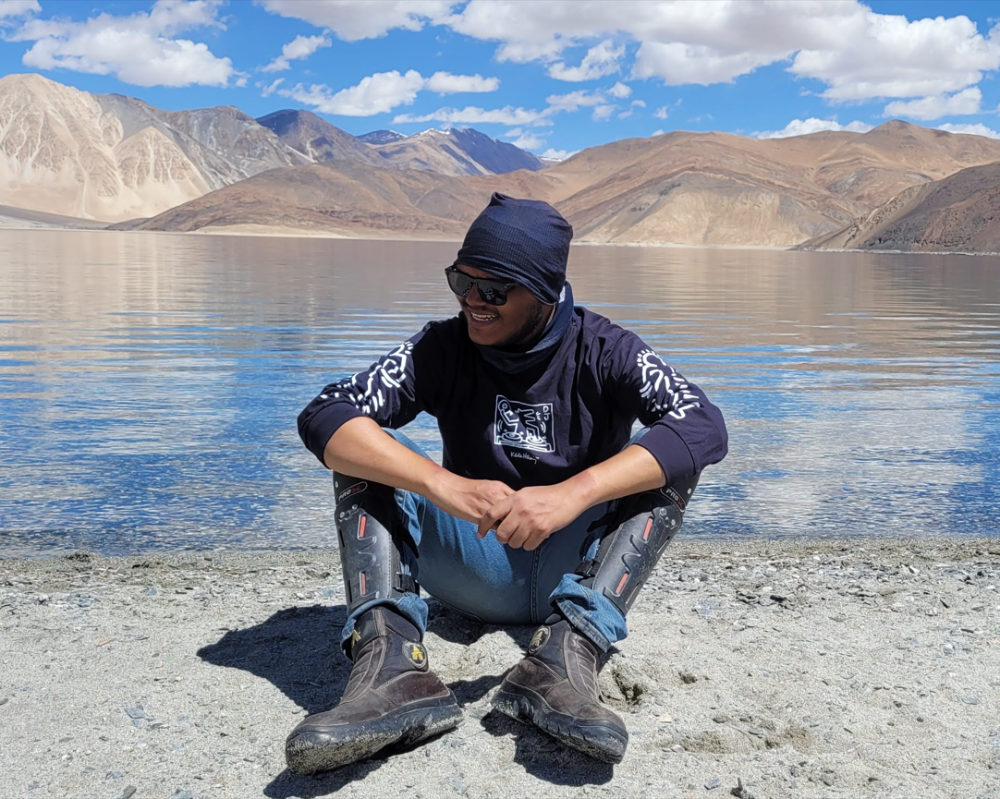

**Nilansh Rajput INDIA**

[GitHub](https://github.com/Nilanshrajput)  [Twitter](https://twitter.com/nilanshrajput)

**Can sync with Asia (Africa & Europe too)**

Currently I am working as a Data scientist in a Fintech company, and my major interest is in language, and multi-model research involving video data with text. I like playing and learning the ukulele in my free time and occasionally biking!

Really love the effort put into creating the material. I think I can say these are some of the best educational materials present for someone interested in the field of Privacy preserving technology. Kudos to the team.

<figure class="">

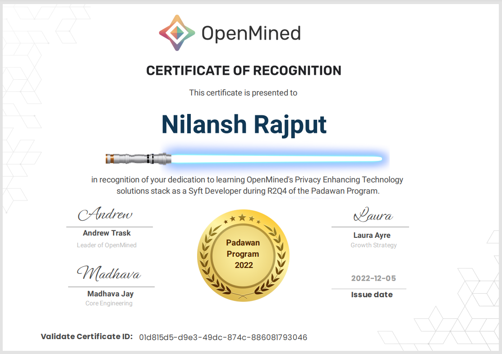

</figure>

---

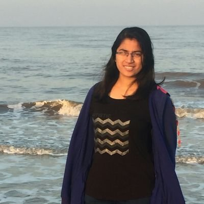

**Simran Bawkar INDIA**

[GitHub](https://github.com/sim017)  [Twitter](https://twitter.com/BawkarSimran)

**Can sync within Asia (Africa & Europe too)**

I am currently working as a software developer and I joined the Padawan cohort this year. I am currently working on data science problems and was looking to see how differential privacy worked. This program helped me to understand what system OpenMined uses. Now I am working on an issue that was mentioned in the repository.

I am going to continue to find interesting projects and work on them. I am also going to start my masters soon. My most memorable experience was to solve a crypto quest.

<figure class="">

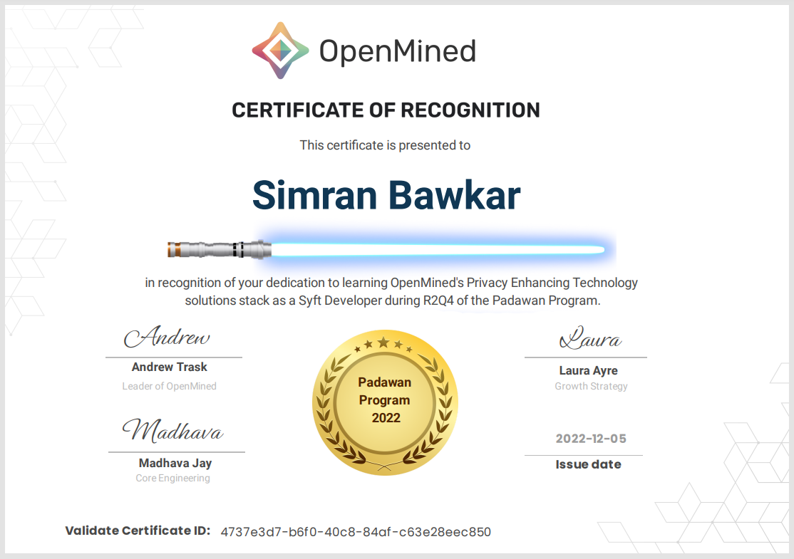

</figure>

---

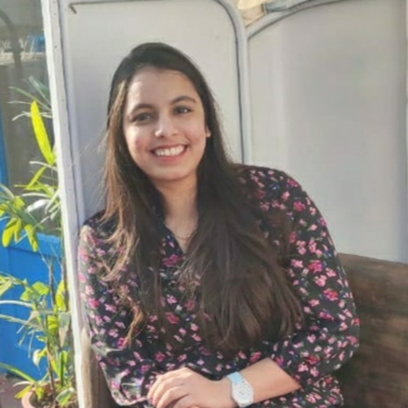

**Vinal Bang INDIA**

[GitHub](https://github.com/vinalb-oblivious)   [LinkedIn](https://www.linkedin.com/in/vinal-bang-87496013a/)

**Can sync within Asia**

I am a Senior Software Engineer at Oblivious, where we work on enhancing privacy tech; currently working on integrating Oblivious Tech with Syft. I am currently pursuing my Masters in Computer Science.

The Padawan program gave great insights into the working of Syft, which helped me a lot with the integration. I am grateful to Rasswanth for his continued support throughout the program and, even after it, for helping me out whenever I got stuck.

The most fun I had was working with the puzzles that Madhava set up in the notebooks. I am looking forward to working more with OpenMined in future.

<figure class="">

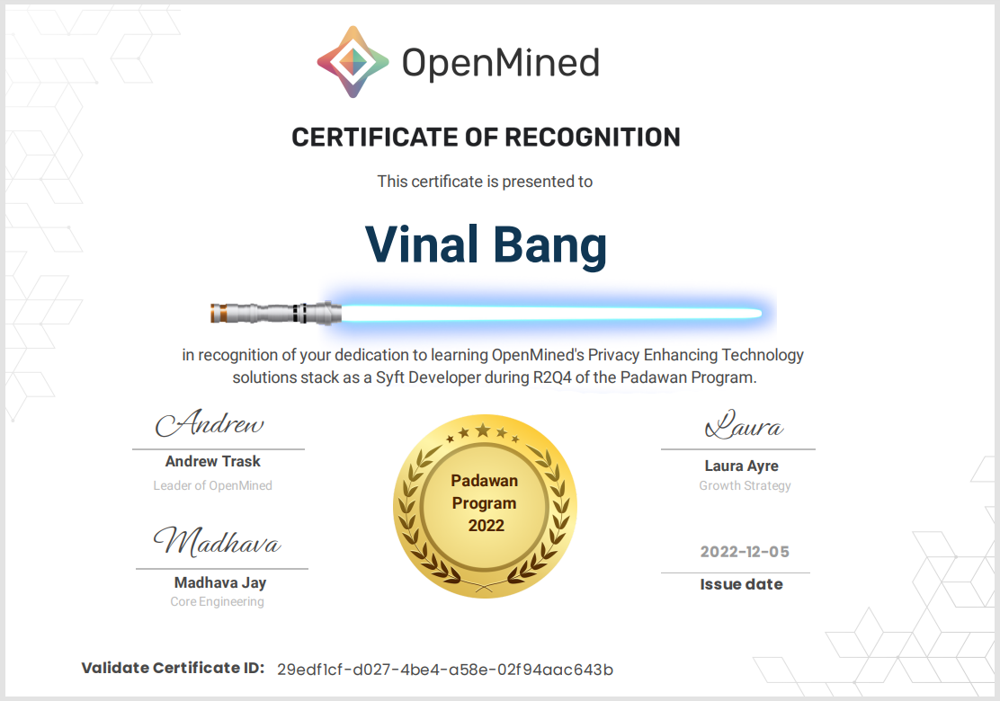

</figure>

---

**Mihir Parulekar USA**

[GitHub](https://github.com/mihirdcoder)   [LinkedIn](https://www.linkedin.com/in/mihir-parulekar/)   [Twitter](https://twitter.com/mihir19297)

**Can sync within North America (Pacific too)**

I have done my MS in Computer Science with a specialization in data science from Stony Brook University, NY. I worked as a data engineer at a Chicago-based precision medicine startup called Tempus. I got exposed to privacy concerns, HIPAA rules, data safe harboring process, etc, during my work. Right now, I am working at Microsoft.

I used PySyft two years back and was amazed at what it has evolved into now. I think the Padawan program is where the entry barrier to the community is lowered, and core contributors go out of their way to educate new community members.

<figure class="">

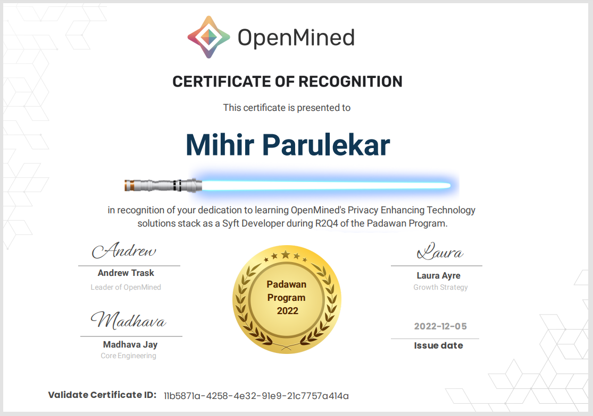

</figure>

If you are interested in building Privacy Enhancing Technology software tools, share in our vision & mission, then [consider applying](https://docs.google.com/forms/d/e/1FAIpQLSdBgcz4Sj9ow0vhWsfKP2WMlLAynHB8caPr3eTBp9m6JeeLSA/viewform?usp=sf_link) for a future round.  We review applications on an ongoing basis.
