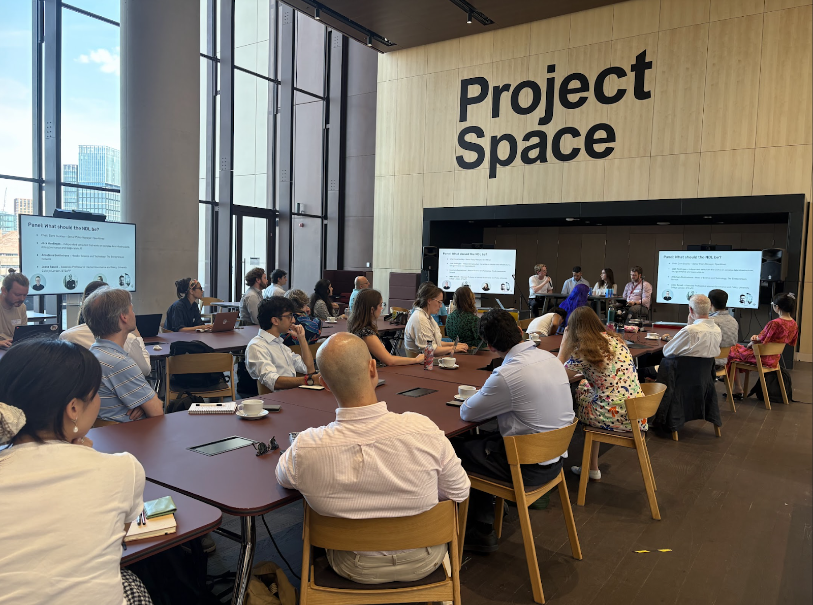
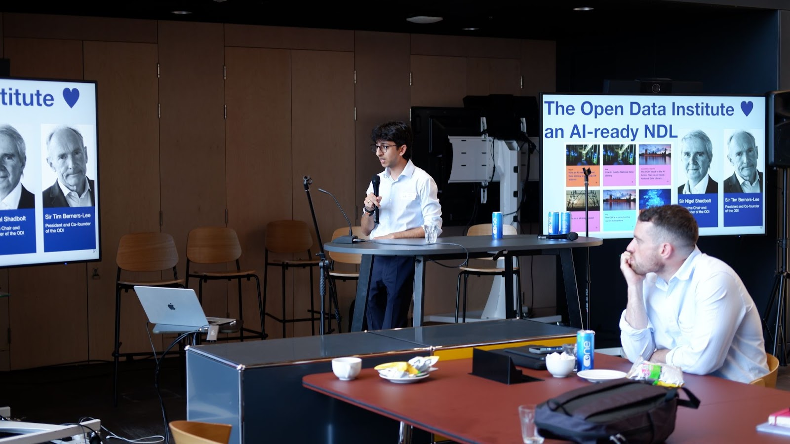
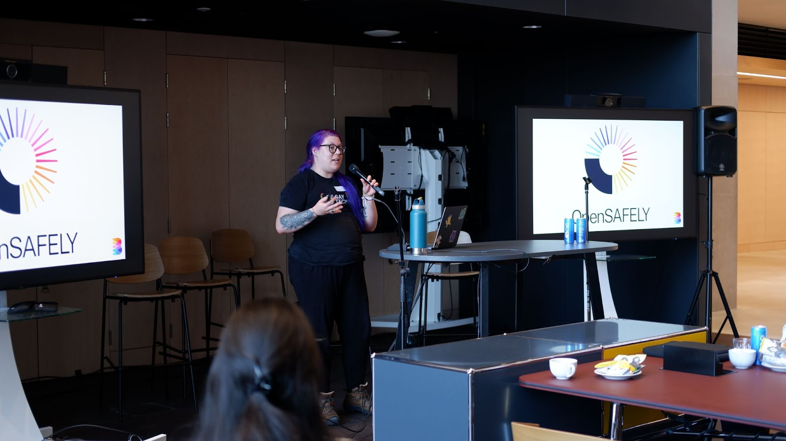
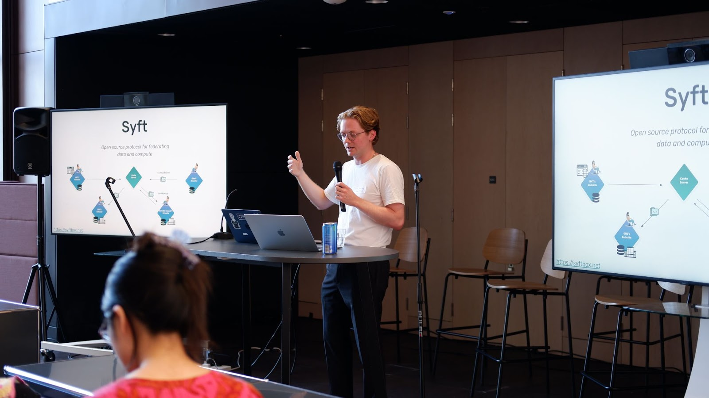
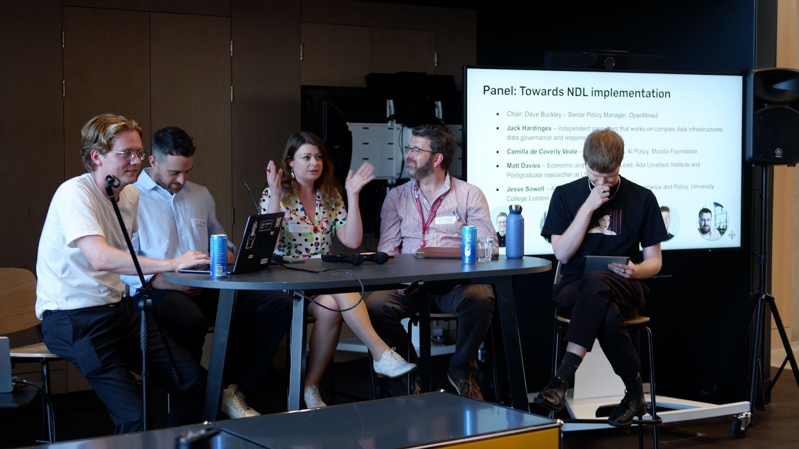

<!-- TODO(a11y): 5 localized body image(s) have empty alt text -->

The UK sits on a goldmine of data that could revolutionise research, innovation, and public services. From the NHS’s uniquely detailed health records to rich administrative datasets across government departments and local authorities – this wealth of information remains largely untapped due to privacy, security, compliance, and coordination barriers. With [£100 million in funding recently announced](https://assets.publishing.service.gov.uk/media/68595e56db8e139f95652dc6/industrial_strategy_policy_paper.pdf), the UK’s flagship National Data Library (NDL) initiative represents an enormous opportunity to transform how this data is accessed and utilised for research and innovation, positioning the UK to realise the Prime Minister’s ambition of becoming [“one of the great AI superpowers”](https://www.gov.uk/government/speeches/pm-speech-on-ai-opportunities-action-plan-13-january-2025).

On 10th July, OpenMined and the [Digital Technologies Policy Laboratory](https://www.ucl.ac.uk/engineering/steapp/research/digital-technologies-policy-laboratory) at University College London’s Department of Science, Technology, Engineering and Public Policy ([UCL STEaPP](https://www.ucl.ac.uk/engineering/steapp)) brought together policymakers, technologists, and academics to explore concrete approaches to realising the ambition of the NDL.

Hosted at UCL’s East campus in the Queen Elizabeth Olympic Park as part of [London Data Week](https://londondataweek.org/), the event took on a practical and participatory focus featuring demos of innovative data solutions including OpenMined’s [SyftBox](http://syftbox.net), expert panel discussions, and audience lightning talks. 

## Setting the stage: what should the National Data Library be?

The day opened with OpenMined’s Dave Buckley providing a plotted history of the many articles, blogs, and papers related to the NDL that have been published since it was originally announced in the Labour Party’s [2024 election manifesto](https://labour.org.uk/change/). Given the many diverse perspectives on the NDL, what exactly should it be? This question was explored in the day’s opening panel, featuring Jack Hardinges (independent consultant), Anastasia Bektimirova (The Entrepreneurs Network), and Jesse Sowell (UCL STEaPP), with Dave serving as moderator.

<figure class="wp-block-image has-custom-border is-style-default">

</figure>

Panellists highlighted several concrete features that the NDL should prioritise: streamlining access to minimise the wait times for data access; implementing a structured access approach where low-risk datasets can potentially be made fully open, and sensitive datasets can be leveraged in a tiered, privacy-preserving manner; developing mature ways to conduct data joins across different parts of the UK’s data infrastructure, especially in situations where sensitive identifiers need to be leveraged for data linking.

The panel also highlighted that as a distributed data infrastructure, scaling the NDL will face a collective action problem – significant value will only be derived from the NDL when data can be leveraged and combined across a number of different government departments, local authorities, and other public sector agencies, but any individual agency may lack incentives to participate given the upfront cost and effort involved. The panel considered whether overcoming this collective action problem requires top-down mandates from central government, or whether ground-up, participatory efforts across departments could enable meaningful progress.

A key point emphasised throughout the panel was the need to move quickly and operate in an agile way, whilst at the same time ensuring the foundations of the NDL are designed to be adaptable to changing requirements over time. Panellists advocated for an initial approach based around running experiments to evaluate the suitability, adaptability, and potential failure modes of different technical and governance components.

Following the panel, Anastasia presented findings from the [Data Wishlist](https://www.data-wishlist.fyi/) project – an ongoing survey of prospective users of the NDL in academia and industry. From 42 submissions received to date, the survey has approximately 130 data access and linkage requests, and has provided empirical evidence of the main barriers faced by researchers and innovators trying to leverage public sector data. The intent of this survey is to influence the design of the NDL, and you can contribute by submitting your ideas [here](https://docs.google.com/forms/d/e/1FAIpQLSe6zdKvht9b8ovWMpow5wDlfv2HgJudshL5GL0B0npL9eQ4mA/viewform). 

## From vision to reality: practical talks and demonstrations

The afternoon session featured a trio of talks and demonstrations that presented novel approaches to the potential design and implementation of the NDL.

<figure class="wp-block-image has-custom-border is-style-default">

</figure>

Neil Majithia from the Open Data Institute explored the framing of an “AI-Ready” NDL – an infrastructure that can provide factual, real-life open data points for AI models to utilise in answers to user queries. Neil presented research findings from experiments run against frontier LLMs that found that whilst government websites serve as important data sources for AI, structured datasets on platforms such as [data.gov.uk](http://data.gov.uk) are essentially invisible to AI systems. An AI-ready NDL could address this problem.

<figure class="wp-block-image has-custom-border">

</figure>

Eli Holderness from the Bennett Institute for Applied Data Science showcased OpenSAFELY, a platform that has been leveraged to facilitate secure research access to sensitive NHS data. OpenSAFELY promotes privacy and transparency by design, with data never moving outside the secure environment in which it is situated, and a requirement for researcher’s code to be fully open and transparent. The success of OpenSAFELY demonstrates that privacy and utility aren’t mutually exclusive – such approaches could be of enormous value for unlocking the value of sensitive datasets as part of a National Data Library.

<figure class="wp-block-image has-custom-border">

</figure>

Finally, Dave Buckley from OpenMined ran a demonstration of [SyftBox](http://syftbox.net) – an open-source decentralised network for privacy-first AI and data science. A number of features that will be critical for a federated NDL were showcased, including: unified metadata to facilitate seamless search, discovery, and cataloging of data assets; the ability to set fine-grained, role-based, and tiered permissions at the dataset level; and the capability to develop apps that can run across multiple secure “datasites” in the network. Additionally, a hands-on demo was run to show how SyftBox integrates with secure enclaves to enable privacy-preserving data joins across different organisations. The current inability to join datasets across different departments and agencies had been highlighted as a major challenge in the morning’s sessions – this demo showed how secure enclaves may provide a robust solution to this problem, facilitating analysis of linked datasets whilst ensuring identifiers remain private.

To run the enclave demo yourself and experiment with SyftBox, you can follow [this guide →](https://bit.ly/46RRYST)

## A path forward

The closing panel was again moderated by Dave and featured Jesse and Jack, alongside Camilla de Coverly Veale (Mozilla Foundation), and Matt Davies (Ada Lovelace Institute).

<figure class="wp-block-image has-custom-border">

</figure>

Panellists offered their reflections on the demos and presentations given throughout the day, and discussed some of the challenges that are likely to be faced as the UK government seeks to deliver the NDL. The panel emphasised that delivering an effective NDL at scale will require a significant amount of political will over a sustained period of time. Whilst getting the design of the NDL’s technical and governance mechanisms is vital, this will likely not provide sufficient incentives for departments to participate in the NDL without concrete directives and dedicated funding from the centre of government. Panellists welcomed the £100 million announced for the NDL in the UK’s Modern Industrial Strategy, but argued that it may need to be bolstered and ringfenced in order for the NDL to fully achieve its ambitions.

A final key reflection was that the afternoon’s demos had reinforced the argument made in the opening panel that the government should take an experiment-led approach to designing the NDL. Technologies exist that, in principle, can solve critical data access challenges – Government should run experiments with these technologies to properly evaluate the value they could provide to the NDL. The barrier for doing so may be particularly low for the open-source technologies that were showcased, including SyftBox and OpenSAFELY, where the software is open-access and free to use. The panel encouraged technologists in Government to begin testing these technologies out for themselves.

As we wrapped up the day, there was a palpable sense of both opportunity and urgency. The NDL could be transformative for UK research, public services, and AI development. But it could also become another well-intentioned public sector data initiative that fails to deliver on its ambition. This event emphasised that a practical, experiment-led approach could help to avoid such pitfalls. 

At OpenMined, we’re committed to contributing our expertise to help ensure the NDL solves longstanding challenges faced by data owners and practitioners, and ultimately acts as a national asset that serves the public interest. We’re eager to engage and collaborate with technologists, data owners, and policymakers in government who are working on data access initiatives such as the NDL, as well as technology providers and civil society organisations interested in these topics – to connect with us email [dave@openmined.org](mailto:dave@openmined.org).

—

A special thanks to UCL STEaPP for co-hosting this event, and to all our speakers and participants who made it such a rich discussion.
