<!-- TODO(a11y): 14 localized body image(s) have empty alt text -->

**Congratulations to all of our R4Q2 Padawan Program Graduates!**

We are thrilled to recognize our Graduates of OpenMined’s Padawan Program. Each has participated in a rigorous and intensive six weeks of mentorship, learning and contributing to PySyft and Open Source. This graduating cohort consists of 9 talented participants with unique backgrounds, and they represent 7 countries across the globe ?.

OpenMined is a Not-for-profit organization that currently works on encrypted computation in the context of deep learning to provide free user-friendly Privacy Enhancing Technology (PET) tools to the world. OpenMined is determined and committed to fostering the development of the talent pipeline in the PETs space.

The Padawan program has brought together individuals from various fields whose interests and vision are aligned towards the development and deployment of cutting edge technology in the field of PETs. Participants had the chance to contribute to OpenMined’s open source repositories through code, time, and technical challenges.

With increasing requests from partner organizations for talented resources with a good grasp of our PySyft tech stack, these graduates are equipped with knowledge and experience for the deployment of PET solutions within value aligned organizations, government agencies and academic institutions.

## **R4Q2 Graduates**

<figure class="">

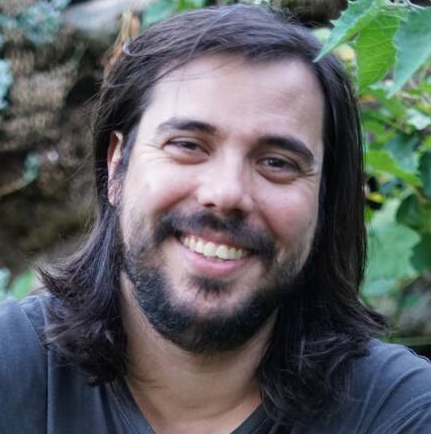

</figure>

**Alejandro Sánchez Medina   SPAIN**

[LinkedIn](https://www.linkedin.com/in/alejandrosanchezmedina/)   [GitHub](https://github.com/alejandrosame)   [Website](https://alejandrosame.srht.site/)

****Can sync within** Europe & Africa (Americas **too)****

I have been lately working in declarative package management problems, exploring my artistic expression through live coding for multimedia and learning category theory, among other interests.

I’m always on the look for exchanges, conferences, events, etc. that are stimulating and aim at improving our collective knowledge and well-being. I’m open to collaborating as an independent contributor and I’m interested in research topics.

I have seen the innards of the codebase with a deeper explanation of the reasons that led to its state has been very rewarding. On a more personal level, the interview process was a very enjoyable experience.

<figure class="">

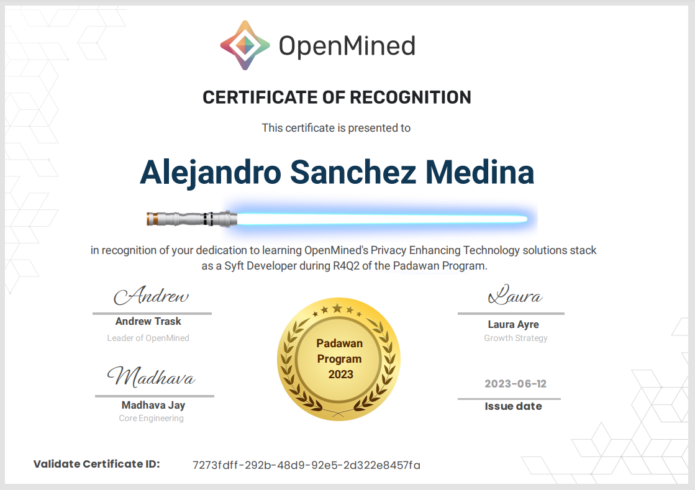

</figure>

---

<figure class="">

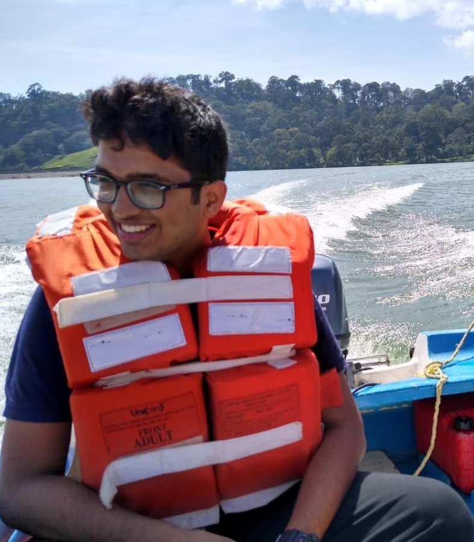

</figure>

**Vishnu Dasu USA**

[GitHub](https://github.com/vdasu)    [Google Scholar](https://scholar.google.com/citations?user=vI64X6EAAAAJ&hl=en)    [Twitter](https://twitter.com/DasuVishnu)

****Can sync within** Americas (Europe & Africa too)**

I’m a graduate student studying computer science and engineering at Penn State! My research interests are found at the intersection of security, privacy, and machine learning. Currently, I am working on mitigating unfairness in machine learning, identifying bugs in deep learning libraries, and developing attacks to break user privacy in federated learning settings. In my free time, I enjoy powerlifting, rock climbing, and playing the guitar!

After my masters, I hope to pursue a PhD in computer science with a focus on trustworthy machine learning.

Overall, I had a good experience during the Padawan program. I had a research background about differential privacy and homomorphic encryption. It was really interesting to learn more about the engineering behind combining such techniques to make the viable in real-world settings.

<figure class="">

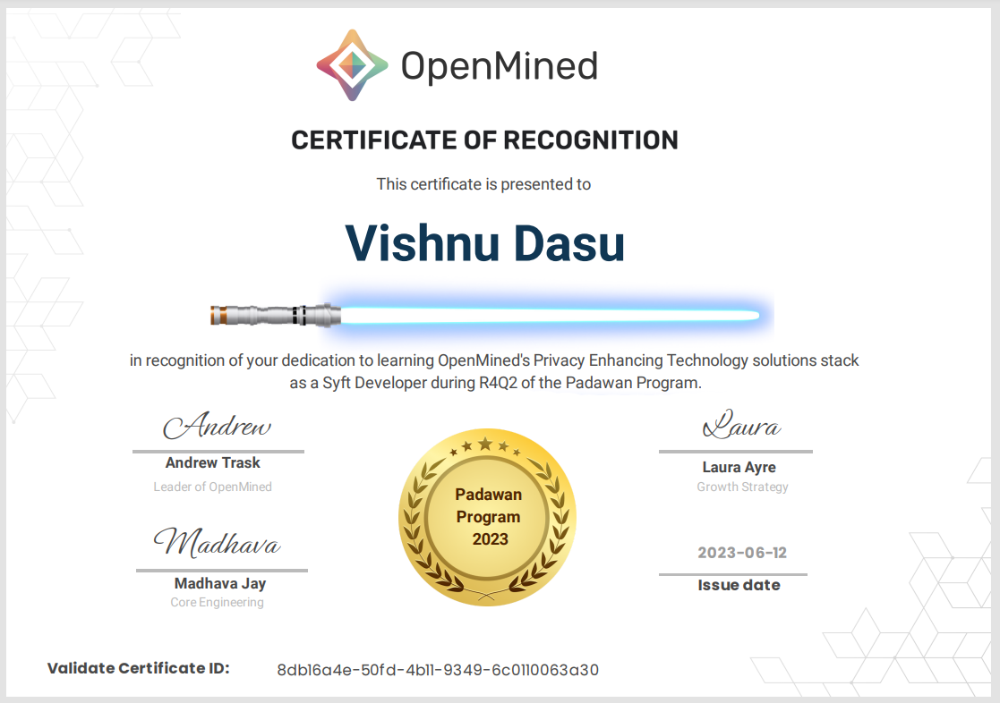

</figure>

---

<figure class="">

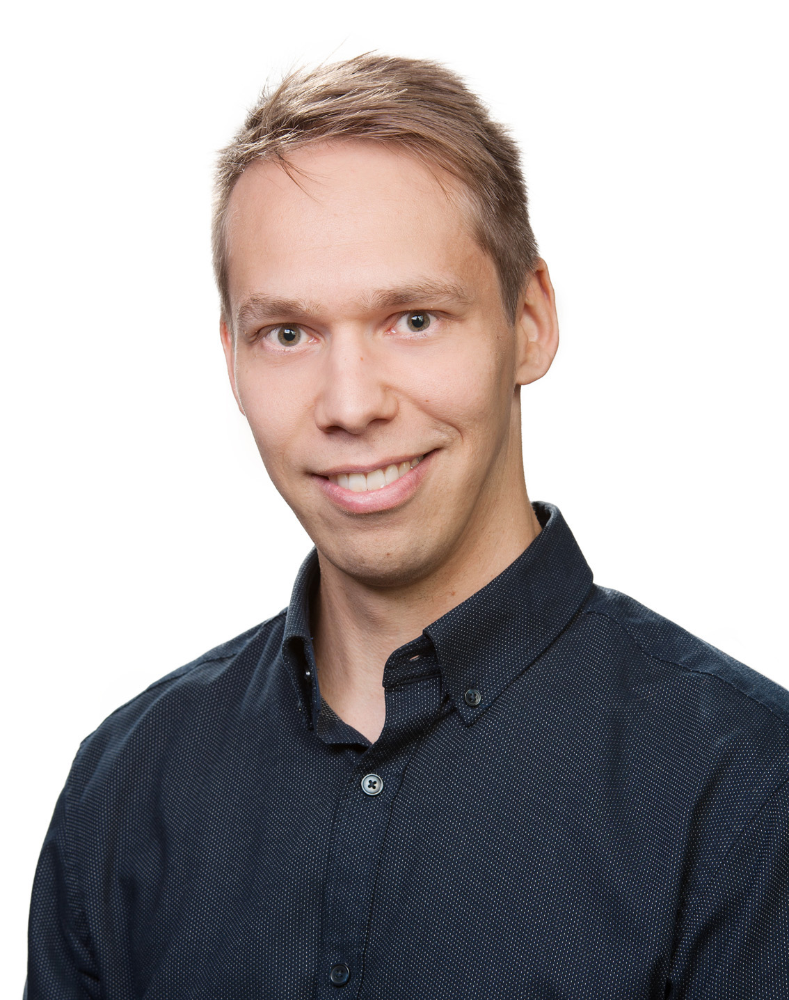

</figure>

**Antti Kalliokoski   FINLAND**

[LinkedIn](https://fi.linkedin.com/in/akalliokoski)  [GitHub](https://github.com/akalliokoski)

****Can sync within** Europe & Africa **(**Americas **too)****

I’m a seasoned software engineer and aspiring privacy & ML engineer from Tampere, Finland. I have spent most of my career in healthcare, IoT and safety-critical systems in general, and I’m currently working in the cybersecurity sector. In addition to my work on the Padawan program, I have been serving as an open-source contributor within OpenMined’s PySyft development team for a couple of months. This experience has been incredibly fun and highly educational!

I definitely hope to be able to continue working on PySyft in the long term, and I aim to learn all the nuts and bolts across the entire stack. I strongly believe that these skills will be critical in leveraging PETs, especially in the context of Finland’s ongoing social and healthcare reform, to improve data use and protection.

During the Padawan program, I was really drawn in by the engaging (and fun) study materials and conversations with my mentor Teo and other OpenMined members. Sharing thoughts about privacy and importance of the work on PETs with others has been genuinely wonderful and extremely motivating.

<figure class="">

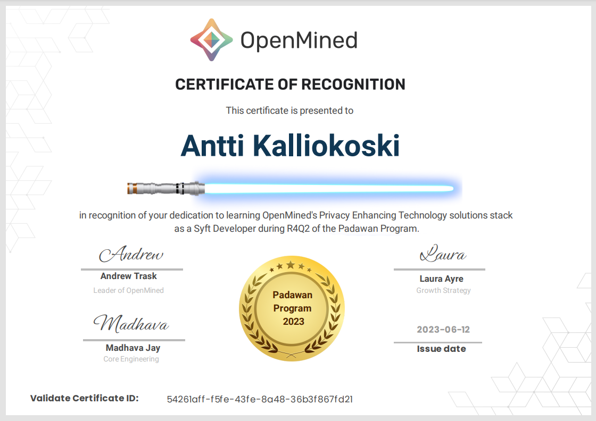

</figure>

---

<figure class="">

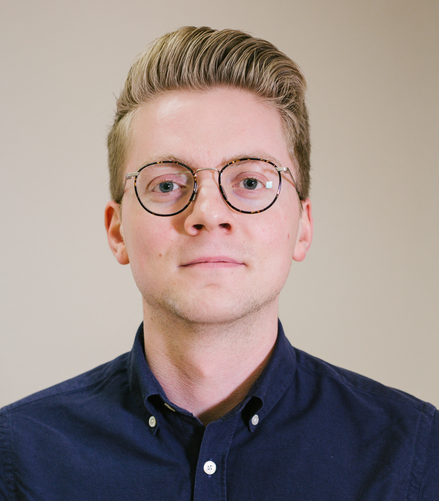

</figure>

**David Buckley   UK**

[LinkedIn](https://www.linkedin.com/in/davidbuckley3/)   [GitHub](https://github.com/dbckz)

****Can sync within** Europe & Africa **(**Americas **too)****

I work in tech policy, where I’ve been involved in running several initiatives around privacy tech and data governance. In a previous life I worked as a software engineer, and I really enjoy bridging the gap between technical and policy audiences.

I am still doing tech policy! But with a fresh perspective having got my hands dirty with PySyft 🙂

<figure class="">

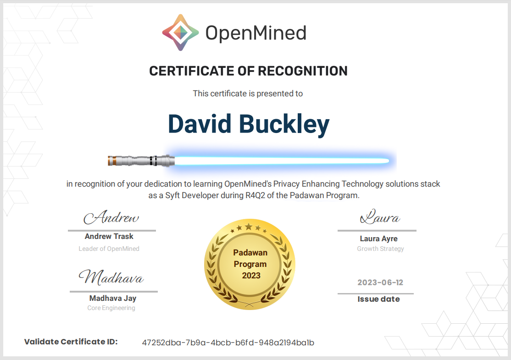

</figure>

---

<figure class="">

</figure>

**Ivoline Ngong   USA**

[LinkedIn](https://www.linkedin.com/in/ivolinengong/)     [GitHub](https://github.com/ivyclare)    [Twitter](https://twitter.com/IvolineNgong)

****Can sync within** Americas (Europe & Africa **too)****

Ivy is a 2nd-year Ph.D. student in Computer Science at the University of Vermont and a research scientist at OpenMined. Her research interests broadly revolve around all aspects of machine learning; theory, algorithms, and applications. Currently, she focuses on privacy-preserving machine learning including differential privacy, federated learning, and secure multiparty computation.

I am currently working on completing my PhD 🙂

I really enjoyed working with my mentor Teo and deep-diving into the weeds of PySyft’s code.

<figure class="">

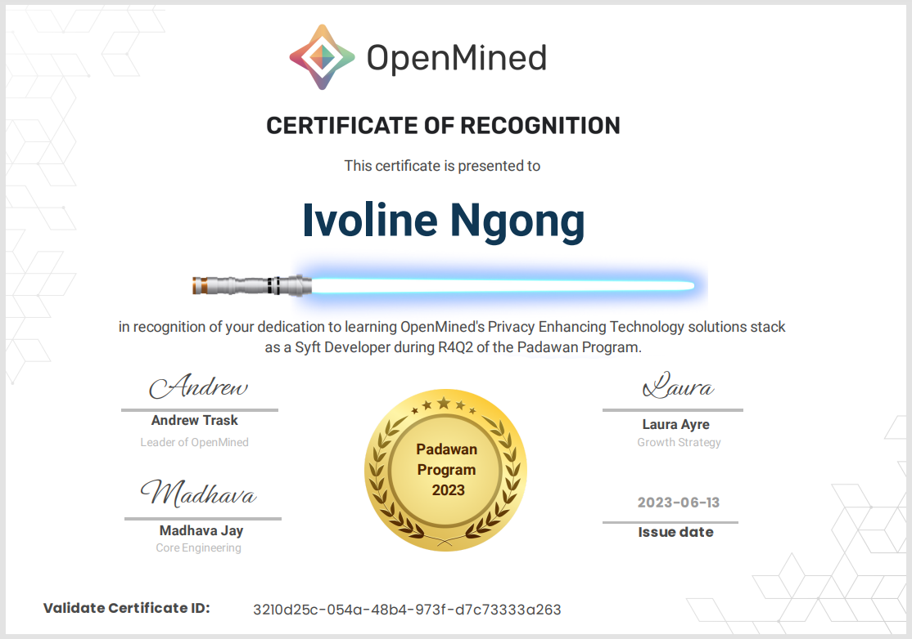

</figure>

---

**Neelaksh Singh   INDIA**

[GitHub](https://github.com/Neelaksh-Singh)

****Can sync within** Asia **(**Europe & Africa **too)****

<figure class="">

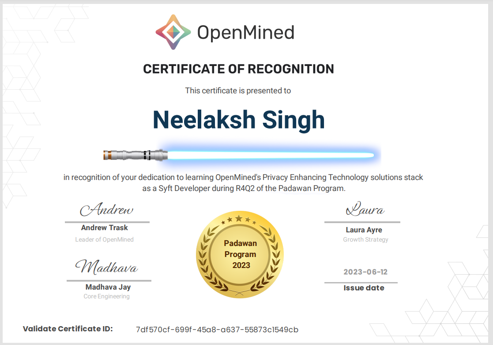

</figure>

---

**Tristan Guerand   SINGAPORE**

[GitHub](https://github.com/tguerand)

****Can sync within** Asia **(**Europe & Africa **too)****

<figure class="">

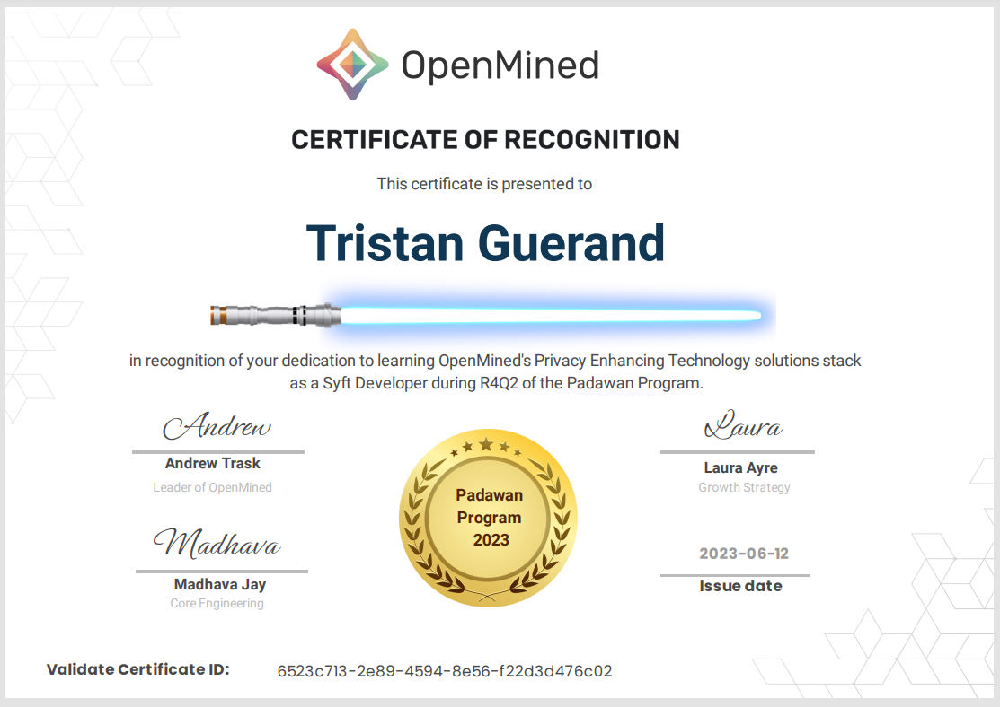

</figure>

---

**Param Mirani   INDIA**

[GitHub](https://github.com/Param-29)

****Can sync within** Asia **(**Americas **too)****

<figure class="">

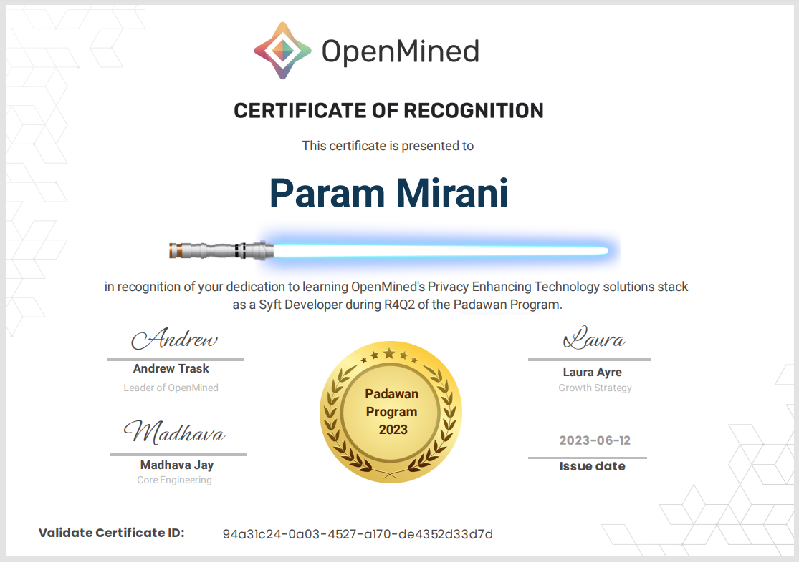

</figure>

---

**Madhav Khosla   INDIA**

[GitHub](https://github.com/madhavkhoslaa?tab=overview&from=2023-05-01&to=2023-05-31)

****Can sync within** Asia **(**Europe & Africa **too)****

<figure class="">

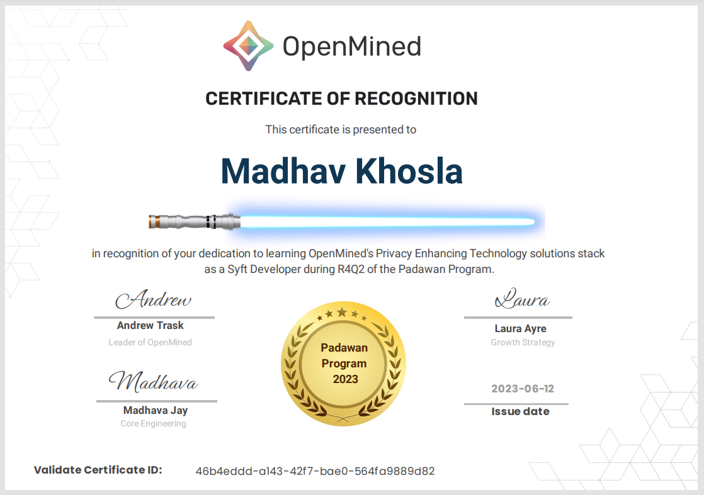

</figure>

---

If you are interested in building Privacy Enhancing Technology software tools, share in our vision & mission, then [consider applying](https://docs.google.com/forms/d/e/1FAIpQLSdBgcz4Sj9ow0vhWsfKP2WMlLAynHB8caPr3eTBp9m6JeeLSA/viewform?usp=sf_link) for a future round.  We review applications on an ongoing basis.
