<!-- TODO(a11y): 14 localized body image(s) have empty alt text -->

**Congratulations to all of our R5Q3 Padawan Program Graduates!**

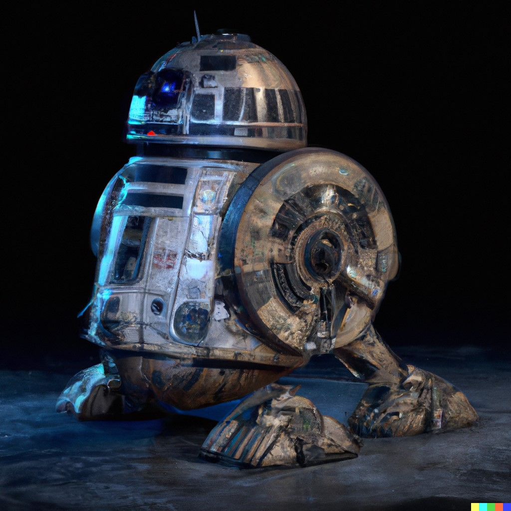

We are thrilled to recognize our Graduates of OpenMined’s Padawan Program. Each has participated in a rigorous and intensive six weeks of mentorship, learning and contributing to PySyft and Open Source. This graduating cohort consists of 9 talented participants with unique backgrounds, and they represent 7 countries across the globe ?.

OpenMined is a Not-for-profit organization that currently works on encrypted computation in the context of deep learning to provide free user-friendly Privacy Enhancing Technology (PET) tools to the world. OpenMined is determined and committed to fostering the development of the talent pipeline in the PETs space.

The Padawan program has brought together individuals from various fields whose interests and vision are aligned towards the development and deployment of cutting edge technology in the field of PETs. Participants had the chance to contribute to OpenMined’s open source repositories through code, time, and technical challenges.

With increasing requests from partner organizations for talented resources with a good grasp of our PySyft tech stack, these graduates are equipped with knowledge and experience for the deployment of PET solutions within value aligned organizations, government agencies and academic institutions.

## **R5Q3 Graduates**

<figure class="">

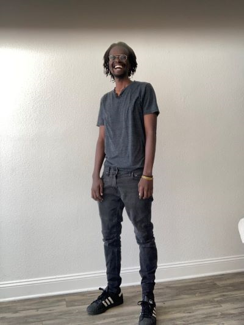

</figure>

**Benon Garuka  USA**

[LinkedIn](https://www.linkedin.com/in/benon/)      [GitHub](https://github.com/benongaruka)

**Can sync within the Americas**

I am currently working as a Senior Software Engineer. I am keenly interested in Data Science/Machine Learning, Privacy and open source; I am working towards being able to regularly and meaningfully contribute to Open Source projects in these fields, particularly with OpenMined.

My most memorable experiences were the office hours. I found these to be fun and engaging as well as very informative.

<figure class="">

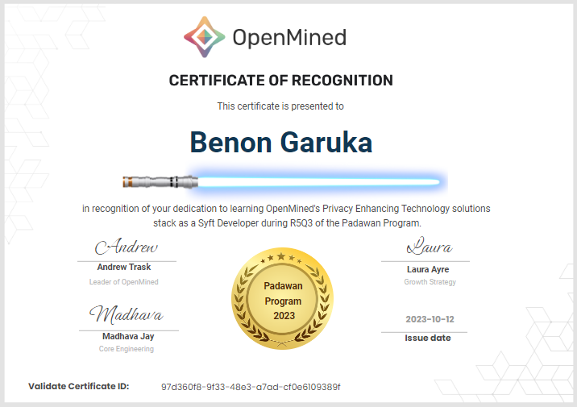

</figure>

---

<figure class="">

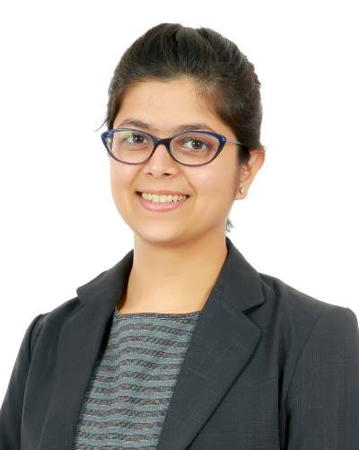

</figure>

**Khushboo Gehi UAE**

[LinkedIn](https://www.linkedin.com/in/khushboo-gehi/)      [GitHub](https://github.com/khushboo-gehi)

**Can sync within Asia (Africa & Europe too)**

I hold an MSc in Data Science and currently serve as a UAE Coding Ambassador. My passion lies in supporting communities, and I’m actively engaged in various community initiatives. Recently, I’ve been focused on personal growth, honing my skills, and preparing for my upcoming PhD studies in FinTech. Additionally, I’m excited to be working on a Web3 startup project.

One area that particularly piques my curiosity is privacy enhancement. I’m intrigued by the potential synergy between blockchain technology and artificial intelligence. Exploring how these two fields can collaborate to create innovative solutions for privacy and security is a key interest of mine.

<figure class="">

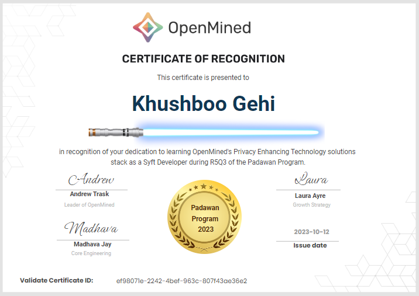

</figure>

---

<figure class="">

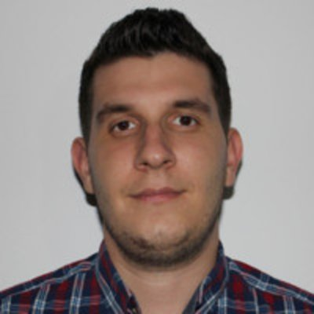

</figure>

**Madalin Mamuleanu ROMANIA**

[LinkedIn](https://www.linkedin.com/in/madalin-mamuleanu)      [GitHub](https://github.com/mamuleanu)      [Twitter](https://twitter.com/mmamuleanu)  

**Can sync within Africa & Europe (Americas too)**

I’m a software engineer with interests in  embedded systems and privacy-preserving ML. I’ve spent around 6 years from my career in working on embedded critical systems and IoT devices.

I really enjoyed the Padawan program, the materials were very interesting and engaging and I’ve had a lot to learn from the program. Also, I’ve had really interesting conversations with OpenMined members.

During the Padawan program I’ve created my first PR to PySyft. I hope I’ll be able to contribute to PySyft in the long term.

<figure class="">

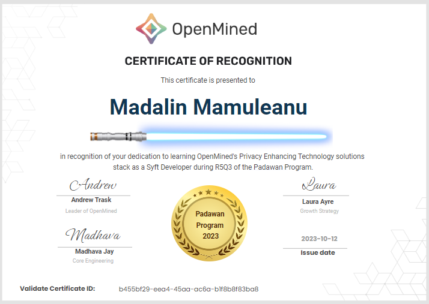

</figure>

---

<figure class="">

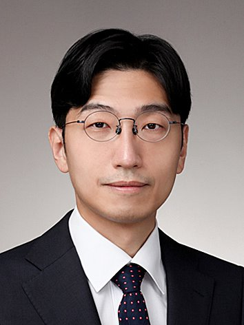

</figure>

**Jungyo Suh     SOUTH KOREA**

[LinkedIn](https://www.linkedin.com/in/jungyo-suh-45b170140/)      [GitHub](https://github.com/JUNGYO)

**Can sync within Asia (Africa & Europe too)**

I am a urologist with a specialization in urological oncology and robotic surgery, currently serving as an assistant professor at Asian Medical Center in Seoul, South Korea.

My research interests lie at the intersection of medical science and other disciplines, such as mathematics, computer science, economics, and information science. I strive to harness these multi-disciplinary insights to tackle and surmount prevailing challenges in the healthcare sector. I investigate feasibility testing of the application of homomorphic encryption and causal machine learning in various clinical situations.

I believe that engaging in active discussions and collaborating with colleagues from diverse backgrounds, yet aligned goals, will be pivotal for future research endeavors. My forthcoming objective is to introduce PET to data scientists in Korea, and to assist those who face challenges accessing OpenMined content due to language barriers.

Meeting fellow Padawans was a thrilling experience. The study materials provided during the Padawan program offered valuable insights into Privacy Enhancing Technology (PET).

<figure class="">

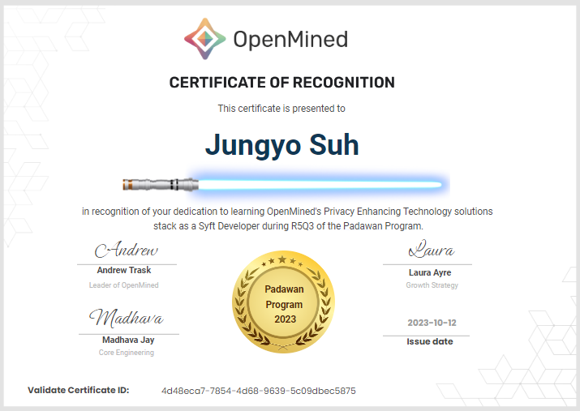

</figure>

---

<figure class="">

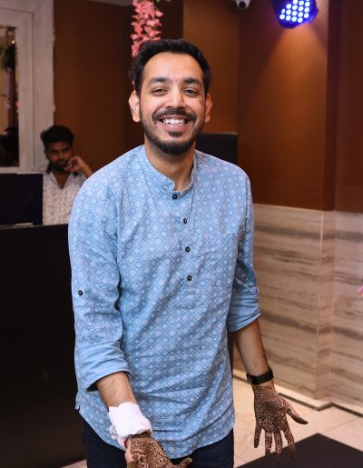

</figure>

**Ashish Singhal INDIA**

[LinkedIn](https://www.linkedin.com/in/aasinghal/)      [GitHub](https://github.com/theGuyWithBlackTie)      [Twitter](https://twitter.com/guywithblacktie)  

**Can sync within Asia (Africa & Europe too)**

I am working at a tech company as Machine Learning Scientist where I work in NLP research focusing on LLMs and Transformers. My research interests includes NLP and Computer Vision. I like reading research papers and writing blogs about NLP/CV topics.

I feel in AI, one is always a student due to a lot of ongoing extensive research and so I always keep looking for different and relevant learning materials and tutorials to try out. Currently, I am trying out different LLMs for different applications with the help of LangChain and knowledge graphs.

The Padawan program has been a good experience for me and it really helped me in understanding the code structure and modules/components. This would really help anyone who wants to start contributing to the codebase. The weekly office hours with the mentors helps in getting our doubts solved easily.

<figure class="">

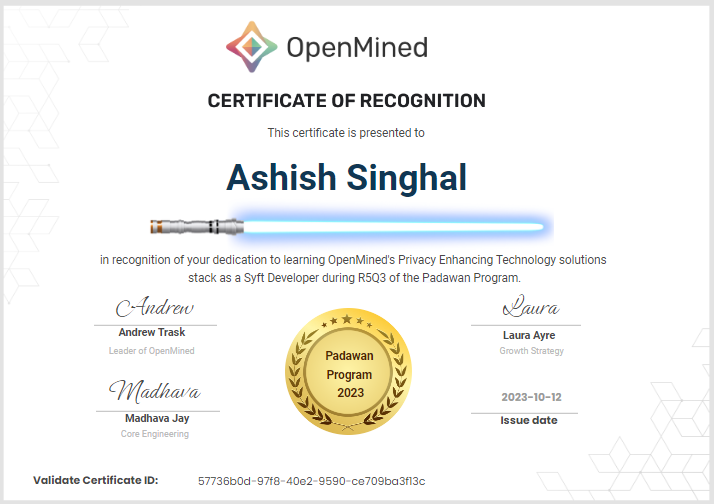

</figure>

---

<figure class="">

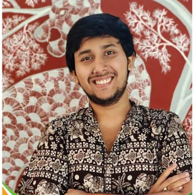

</figure>

**Snehil Sanyal     INDIA**

[LinkedIn](https://www.linkedin.com/in/snehilsanyal/)      [GitHub](https://github.com/snehilsanyal)      [Twitter](https://twitter.com/snehilsanyal)

**Can sync within Asia (Pacific too)**

Hey everyone, I was a PhD scholar working on computer vision till Dec 2023, and in January I shifted to open-source development and other industrial opportunities. From April to July, I worked as an associate data scientist, my work revolved around LLMs and custom use-cases like text2sql, etc. I have experience in CV and NLP and am now exploring the intersection of PETs, federated learning, and LLMs. I am also interested in Ethics and Policy in AI. An interesting project around which I would like to work on data privacy and LLMs, and how we can make mobile apps for customer use-cases.

After attending the program, I aspire to work with my fellow padawans and mentors to educate the future Padawan cohorts via course development and active participation. I am currently learning about I also plan to contribute to OpenMined’s tech stack PySyft, the writing team (blogs and documentation) and the Policy team. I would like to be a part of the organization and be an active member and contributor for the same in different ways possible 😀

The Padawan program was a great experience for me, the tagline “Work on AI’s most exciting frontier No PhD required” really resonated with me as I recently dropped out of my PhD program. The program is a must-attend for those who want to dive into the world of PETs and simultaneously be a part of developing it. I met Rasswanth who was an amazing mentor during the program, who had a great tolerance and patience towards my doubts and queries. He would help me out with issues, he opened up an issue for me although I was not able to solve it I learned how to go about researching the issue and the structure of the repository. Then I included a very small note in one of the notebooks which was my first contribution to the repository. Going along the path, I was given more issues like upgrading a library, bumping versions, and installing missing libraries. The most memorable experience for me was identifying an issue, creating a PR all by myself and finally seeing it approved and merged. That feeling was unparalleled.

I met amazing people along the way, who helped me in learning and growing. I also realized that there are various ways to contribute to an organization, every contribution matters and we should not restrict ourselves and explore as much as possible. I explored different domains and interacted with members like Laura, Shubham, and Lacey on topics like documentation, writing, and Policy in AI. OpenMined is a welcoming community, everyone is fun to work with and I am glad to be a part of it. I plan to be an active member and keep learning and contributing to the community however possible 😀

<figure class="">

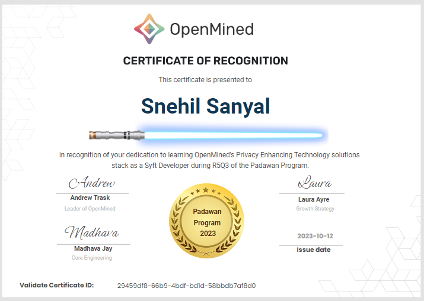

</figure>

---

<figure class="">

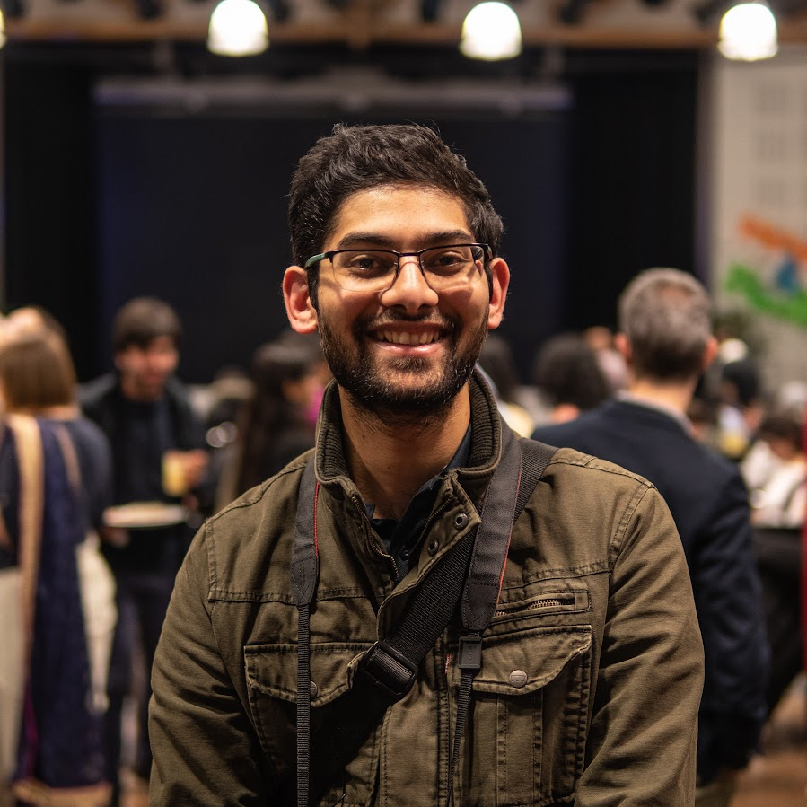

</figure>

**Yash Kasture  GERMANY**

[LinkedIn](https://www.linkedin.com/in/yash-kasture-74061b85?utm_source=share&utm_campaign=share_via&utm_content=profile&utm_medium=ios_app)      [GitHub](https://github.com/yash_1993)

**Can sync within Africa & Europe (Asia too)**

My name is Yash and I’m a Computer Science masters student at Saarland University in Germany. During my studies I focused mostly on computer vision applications of machine learning. Recently I am very intrigued by the rise of Generative AI and it’s potential. I feel like there are a few privacy aspects that also need attention when using such technologies so I am very keen to explore how privacy features can be incorporated into such technologies.

I’m currently finishing up my master and getting married soon :). I submitted 2 PR s to PySyft during the Padawan program and wish to contribute to OpenMined so for a long time.

My first PR on Github was accepted and my mentor Teo was nothing but helpful and motivating. A lot of times we think our questions might be too trivial but the OpenMined community always encourages you to ask questions no matter how small.

<figure class="">

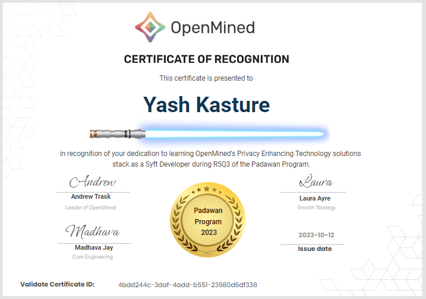

</figure>

---

If you are interested in building Privacy Enhancing Technology software tools, share in our vision & mission, then [consider applying](https://docs.google.com/forms/d/e/1FAIpQLSdBgcz4Sj9ow0vhWsfKP2WMlLAynHB8caPr3eTBp9m6JeeLSA/viewform?usp=sf_link) for a future round.  We review applications on an ongoing basis.
