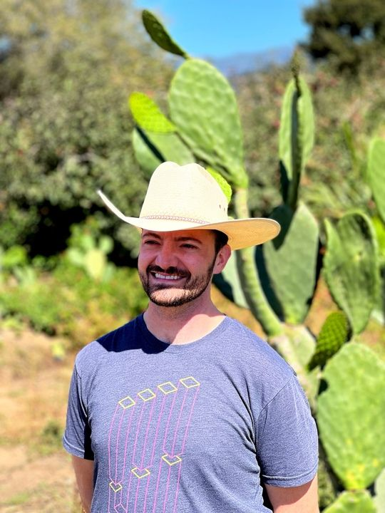
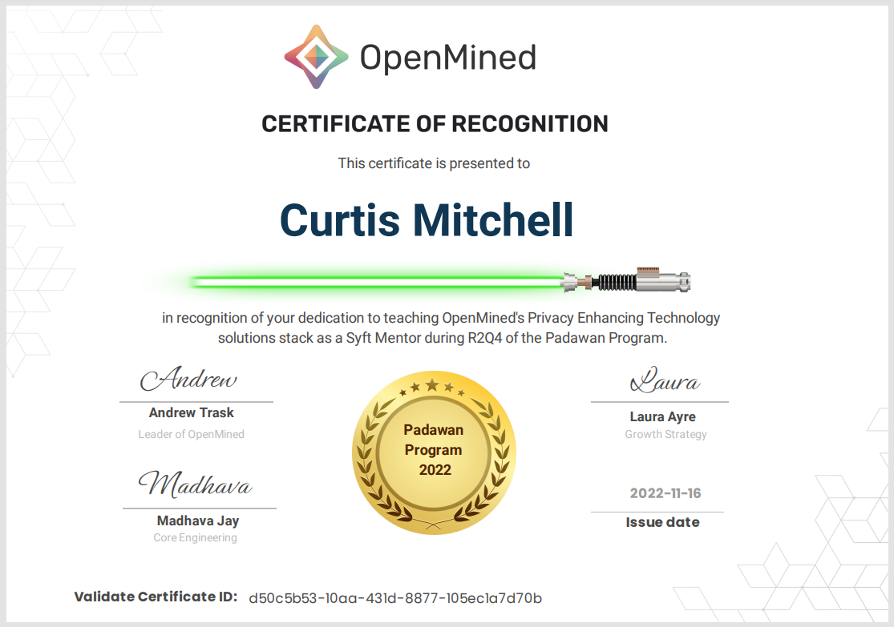
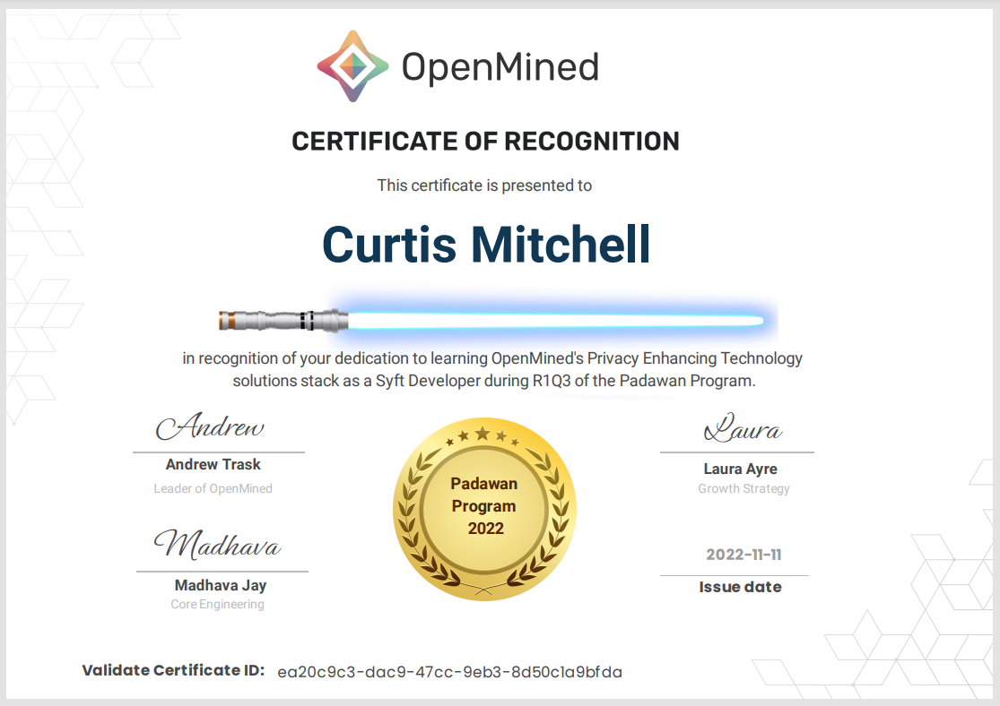
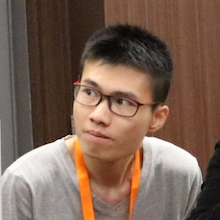
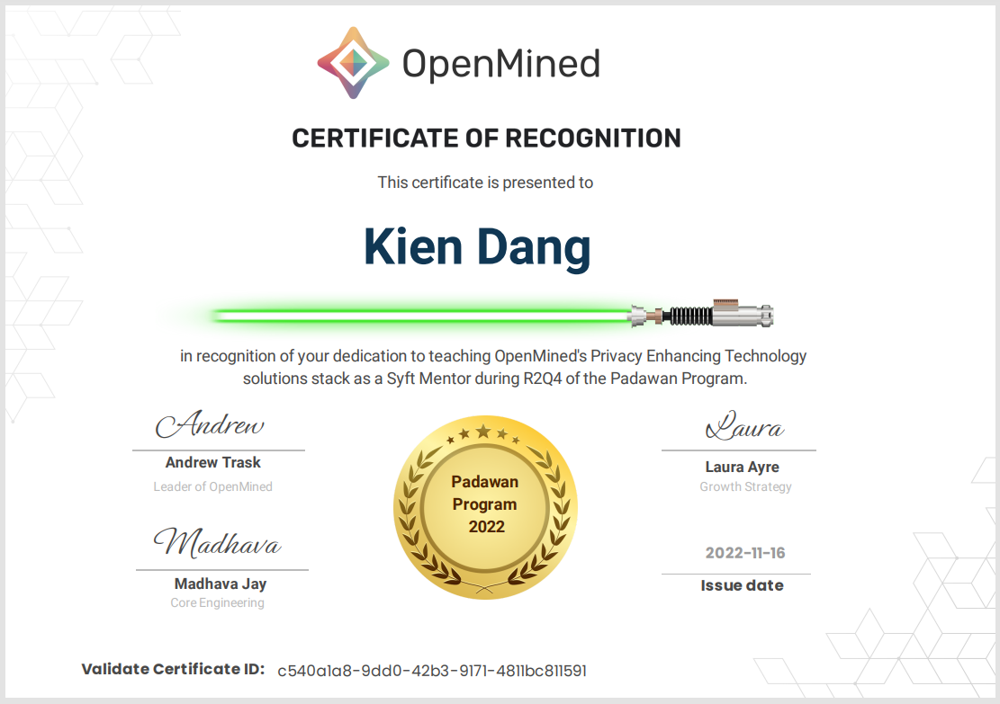
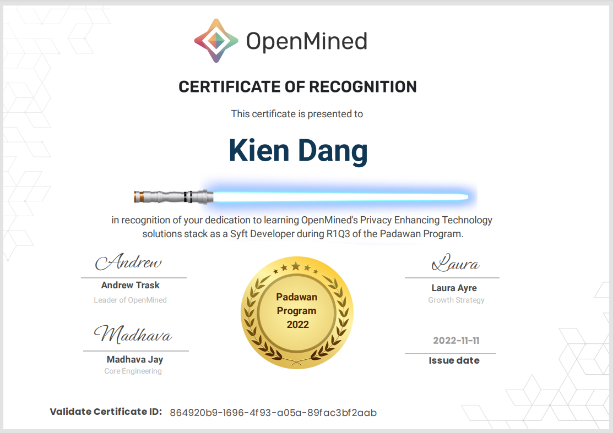
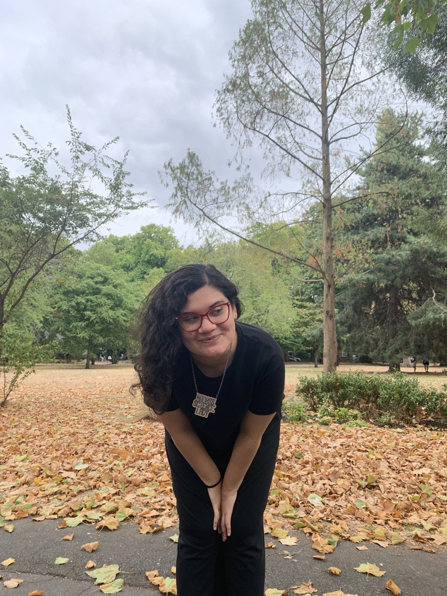
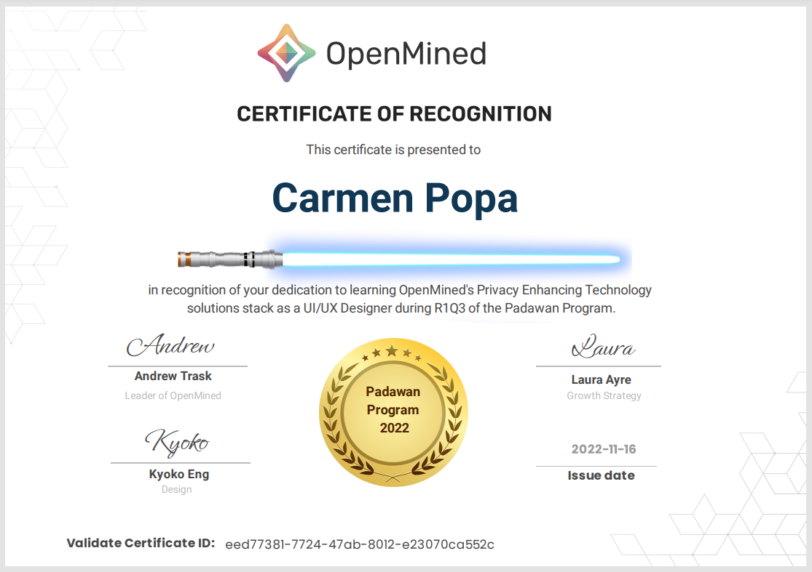

<!-- TODO(a11y): 8 localized body image(s) have empty alt text -->

OpenMined’s Padawan Program continues to grow and support a diverse group of learners. We recognize our Padawan Program Alumni, acknowledge their dedication and skill at fostering an open and supportive learning environment within our community.

## Where are they now?

  

**Curtis Mitchell USA**

[Github](https://github.com/curt-mitch)   [LinkedIn](https://www.linkedin.com/in/curtislmitchell/)   [Twitter](https://twitter.com/Curt_Mitch)   [Website](https://curt-mitch.com/)

**Can sync within North America (Pacific too)**

I grew up in Texas and moved to California when I completed bachelor’s degrees in math and physics. After working as an energy analyst for a few years, I joined a coding bootcamp to work in Silicon Valley. Following several years at a few data and ML related startups, I joined NASA’s Ames Research Center in 2021. I’m currently a full-stack engineer at NASA working on various aeronautics research projects and spreading awareness of PETs and privacy-preserving ML.

At OpenMined, I’ve been focused on mentoring the most recent round of Padawans (shoutout to James and Zarreen!) after having completed the program myself earlier this year. As the program is now wrapping up, I’m returning to working on various differential privacy features in PySyft.

When I was going through the padawan program myself, there were “ah ha” moments when I fully understood a new concept or got some feature in the application to work – those were some highlights for me. Now that I’ve been serving as a mentor for the new group of Padawans, it’s a rewarding experience to see the same moments happen for other people!

As of June 2023,  Curtis has started a new role with the US Census Bureau.

<figure class="">

</figure>

<figure class="">

</figure>

---

  

**Kien Dang SINGAPORE**

[Github](https://github.com/kiendang)   [LinkedIn](https://www.linkedin.com/in/kientrungdang)   [Twitter](https://www.twitter.com/_kien_dang)   [Website](http://kien.ai/)

**Can sync within Asia (Africa & Europe too)**

I am currently a graduate researcher at the National University of Singapore with backgrounds in statistics and software engineering. My main research focus is on machine learning in healthcare which touches on federated learning. Outside of research I often contribute to open source software (OSS) projects in Python, R, Scala. I also enjoy researching computational social science and climate change AI.

I am constantly looking for cool existing projects in OSS or thinking of ideas for new projects. I have a long term goal of being able to spend most of my time contributing to open source as well as social impact organizations while supporting myself financially. Let’s see how that goes!

One of the Padawan sessions touched on the topic of cryptography. My Padawan and I discussed this topic for a while but then went on a tangent and just talked about math and computing in general, exchanging book and article recommendations along the way which we both really enjoyed. In another session with another Padawan we were looking into how Differential Privacy is implemented in Syft. He brought up a lot of interesting questions and hypotheses about how this works so we ended up coding a bunch of small experiments to test them out which was a lot of fun!

<figure class="">

</figure>

<figure class="">

</figure>

  

**Carmen Popa USA**

[Github](https://github.com/Poppy22)   [LinkedIn](https://www.linkedin.com/in/carmengpopa/)

**Can sync within Africa & Europe (North America too)**

I am a pretty active and energetic person, always juggling multiple things at the same time (not always good, I know :D). I study computer science, I am mostly interested in algorithms and theory, and recently in AI fairness and privacy-preserving ML (which would be the direction I would follow, should I continue with a PhD). I like being involved in educational activities (for 6 years, I was involved in NGOs in my home country, Romania, organizing and being a trainer in STEM-related workshops that reached over 300 students). I can’t see myself not contributing to the communities where I belong, hence I am always on the lookout to start an initiative, to find a need/problem and to try to address it. Recently, I was working on taking a break (after what some people would call “overworking myself”), and establishing some healthy routines for me, such as working out and reading more books (the reading one is going great!).

I am starting my master thesis in January, and then I will graduate (hopefully :D). I have not decided yet where I am headed, could be a PhD, could be a full-time job as a software engineer, but I know I want to continue being involved in OpenMined and, in general, I want to learn and experience a whole bunch of new things.

I enjoyed getting to assist Kyoko and asking her a million questions! Also, getting to help another volunteer with some design materials, and overall seeing how united and proactive the whole community is :O

<figure class="">

</figure>

If you are interested in building Privacy Enhancing Technology software tools, share in our vision & mission, then [consider applying](https://docs.google.com/forms/d/e/1FAIpQLSdBgcz4Sj9ow0vhWsfKP2WMlLAynHB8caPr3eTBp9m6JeeLSA/viewform?usp=sf_link) for a future round.  We review applications on an ongoing basis.
