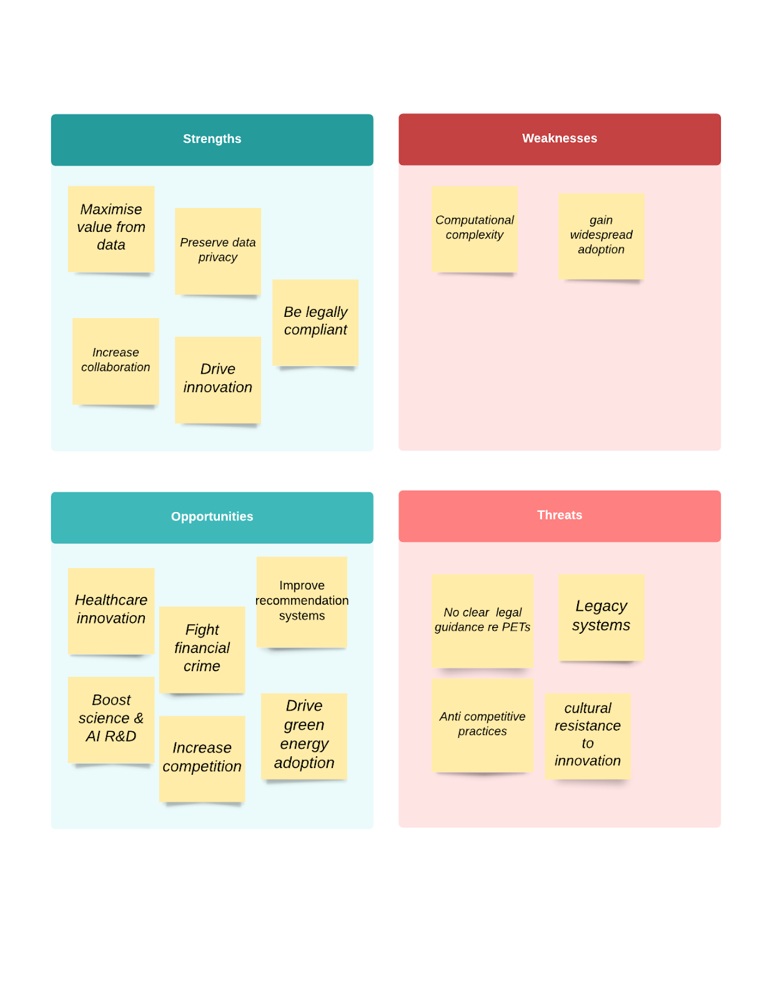

<!-- TODO(a11y): 1 localized body image(s) have empty alt text -->

PETs have a vast number of real-world use cases. Researchers, businesses, regulators, governments, media organisations, startups and consumers can all benefit from this new frontier. Multi-disciplinary collaboration between entrepreneurs, investors, regulators, researchers, technologists, lawyers, academia and consumers is vital to unleashing the full potential of these technologies.

<figure class="">

</figure>

## Drive Scientific R&D and Improve Healthcare for Everyone  

We are producing gigantic amounts of health data. Misusing this type of data could cause real harm. In the health sector, entities that hold medical data are subject to extensive regulatory requirements to keep this data secure and confidential. Therefore access to real world medical data for training and validating medical AI models is slow and expensive.

[Model validation](https://www.healthcareitnews.com/news/fda-leader-talks-evolving-strategy-ai-and-machine-learning-validation) on real world data in real healthcare settings is necessary to ensure algorithm accuracy and gain FDA or European regulatory approvals before medical AI products can be legally launched. On average, model validation can take 16-30 months and can cost US$1-US$2.5m!

Closing the gap between data owners and model developers is critical for healthcare innovation. Techniques such as Federated Learning can solve this problem and are [already deployed](https://blogs.nvidia.com/blog/2021/09/15/federated-learning-nature-medicine/) in healthcare settings with great success to preserve patient privacy and protect from data leakage. PETs can therefore **boost healthcare innovation, speed up the regulatory approval process and reduce costs.**

## **Enable Market Competition** **and Fight Monopolistic Behaviour**  

What if we could easily move data between service providers? (think email, photos, health and fitness apps, online banking, telecoms and energy providers, groceries lists, viewing preferences etc)

What if large companies who sit on large amounts of real world data (often spanning different countries) would allow startups and even competitors to collaborate and build complementary products using their data without divulging confidential data or trade secrets?

Most services and devices that handle masses of data lock you in and are inherently anti-competitive This leads to a massive decentralisation of data and makes it harder for smaller players to compete.

The narrative used by most data controllers today is that the data they hold shouldn’t be shared for privacy and competitive reasons. But ironically, these are also some of the most privacy invasive companies on earth.

The lack of interoperability increases monopolisation. Regulations such as the Consumer Data Right and open banking are intended to encourage data portability and empower consumers but more needs to be done to make this process easy and frictionless for everyone.

## Help Financial Institutions and Regulators Fight Financial Crime  

In financial services, data sharing is fraught with tension. There’s huge value in sharing data between financial institutions, regulators and law enforcement to help fight ever increasing transaction fraud and financial crime and detect systemic risk.

But protecting privacy and confidentiality of customer data is a critical responsibility and key legal obligation of any financial institution.

PETs hold [massive promise for financial institutions](https://a-teaminsight.com/privacy-enhancing-technologies-a-game-changer/?brand=ati), regulators and law enforcement agencies as a means of collaborating on customer data while ensuring its privacy and security. Use cases include measuring the quality of KYC data in a peer group, sharing suspicious activity reports, and bringing together transaction data for Anti-Money Laundering (AML) purposes.

PETs can also **reduce the cost of data, increase control, and provide new insights that could only be available through cross-institutional collaboration.**

## **Help the Environment and Fight Climate Changes**  

What if [smart electricity meters’ data could be aggregated](https://www.aemc.gov.au/news-centre/media-releases/aemc-sets-out-metering-options-smarter-energy-future) across energy providers and used to lower energy prices or drive the adoption of green energy solutions, without exposing valuable personal and commercial data held by energy companies?

The ability to use energy data wisely such as utilising aggregated data from smart energy meters could help reduce energy demand, deliver better pricing, and move to a greener low carbon future.

But smart meters can also reveal very personal data. We need a large-scale collaboration between energy providers for social good. We need systems such as a federated data network or data coalitions to ensure such data is properly protected and only used for society’s benefit.

## **Rethink Feedback Mechanisms**  

Most online feedback mechanisms today are broken. We don’t always know how good or bad something really is. This broken feedback loop blocks a huge amount of valuable data from flowing to consumers and citizens.

[Trust in online reviews](https://www.nytimes.com/2018/06/13/smarter-living/trust-negative-product-reviews.html) is low. [Fake online reviews](https://www.weforum.org/agenda/2021/08/fake-online-reviews-are-a-152-billion-problem-heres-how-to-silence-them/) are ubiquitous and companies that can remove negative online reviews are rife. But what if we could access real and verifiable consumer feedback about products and services we care about (such as employers, schools, hospitals, surgeons, or aged care homes) without compromising the reviewer’s privacy?

What if [whistleblowers’ privacy could be better protected](https://www.natlawreview.com/article/federal-law-should-protect-data-privacy-whistleblowers) helping expose corruption, non-compliance and unsafe corporate practices?

What if we could help to [rebuild public trust in democracy](https://news.microsoft.com/on-the-issues/2020/04/13/what-is-homomorphic-encryption-and-how-can-it-help-in-elections/) by creating a greater sense of connection between the electorate and the results of the elections in which they take part without publicly revealing people’s individual votes?

PETs could help create better verifiable feedback flows that enable the sharing of trustworthy data without compromising privacy.

## **Reimagine Advertising and Market Incentives**  

What if we could develop healthier incentives for today’s digital platforms? The attention economy is currently fuelling key metrics on social media apps (even when they could be [toxic for users’ mental health](https://www.wsj.com/articles/facebook-knows-instagram-is-toxic-for-teen-girls-company-documents-show-11631620739)) because current business models rely on selling ads.

But that’s the case even on ad free platforms who optimize for engagement because that’s what we can measure and analyse to indicate KPIs are being met. But what if users’ wellbeing became a better (and more ethical) way to measure success?

What if, instead of [competing with sleep](https://www.fastcompany.com/40491939/netflix-ceo-reed-hastings-sleep-is-our-competition), Netflix’s content recommendations could draw on health and lifestyle data and be optimized to improve your wellbeing without exposing your sensitive data. For example, content recommendations helped us unwind, sleep better or improve our quality of life or mental health, rather than crudely optimise to keep us awake or stay longer on an app?

## **Conclusion**  

Today’s information flows are broken and there’s no question that fixing information flows could  benefit us all. This will undoubtedly require a multi-disciplinary effort across sectors and continents to resolve.

There’s already huge consumer demand for better digital solutions and more trustworthy brands. First, we need to increase awareness of these problems and establish a shared vision of what a privacy preserving world might look like. Then, we should make it easy to build and adopt the technology solutions that solve these problems, and align them with the various interests and incentives in each sector.

Looking ahead, there are huge opportunities to explore. Healthcare providers could build more data driven systems to improve patient diagnosis, care and outcomes. Financial institutions and regulators could better fight financial crime and protect their customers’ data. Our digital experiences across apps, devices and platforms could become better for us and more meaningful.

We could address big societal problems like climate change, attacks on democracy and disinformation. Consumers could be more empowered when it comes to the products and services they purchase. Let us solve privacy.
