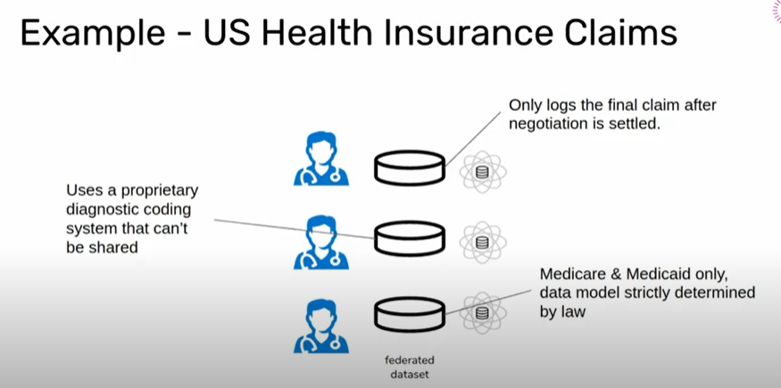

<!-- TODO(a11y): 1 localized body image(s) have empty alt text -->

This is a summary of the [talk](https://www.youtube.com/watch?v=oQ5qmE00FNk) by Jason Mancuso at the OpenMined Privacy Conference 2020.

## What is Collaborative learning?

**Multiple data owners holding data samples work together to train a model and solve a machine learning problem collaboratively** while preserving some healthy mutual distrust is said to be Collaborative learning. Federated learning and Encrypted learning are various forms of Collaborative learning.

## Google’s Internal Federated learning system:

Google makes extensive use of a specific type of federated learning called “Cross-Device Federated learning” in the [Gboard mobile keyboard](https://ai.googleblog.com/2017/04/federated-learning-collaborative.html) to predict and improve the search query suggestion when the users type using the keyboard. Here, Google builds and maintains everything in that particular mobile device starting from the Operating system to the Gboard Applications. By that, they maintain a compatible dataset across all devices to train the model and make the predictions.

## Data Incompatibility problem:

To extrapolate Gboard’s success in other domains, the main bottleneck is **the data needs to be mutually compatible**.

The data from different sources can be captured and stored in multiple different formats leading to incongruous or incompatible datasets. In the process of making it consistent, some data may be lost and even specific features can be dropped.

To understand this better, let us consider the US Health Insurance claims as an example. It processes sensitive data about the patient’s health which is happening outside the hospital. Each Insurance company has its own way of capturing the data and processing the claims. These differences in the data format lead to the creation of different models which will end up being mutually incompatible or inconsistent. This prevents the whole field of healthcare from being Interoperable.

<figure class="">

<figcaption>Credits – <a href="https://www.youtube.com/watch?v=oQ5qmE00FNk">https://www.youtube.com/watch?v=oQ5qmE00FNk</a></figcaption></figure>

## Two Main Obstacles:

There are two main obstacles

**1.****Disparate Representation Problem:******

> _Non-standardized data will almost always present some set of incompatibilities._

**2.Heterogeneity Problem:**

> _Biases introduced by different data processing systems manifest differently in ways that aren’t easily identified._

The first obstacle can be easily solved by establishing standards for collecting the data.  For example in health care, there must be well-defined standards for collecting and transmitting medical records. But In the case of the data generation process where we capture and store the data, there exists a greater probability of introducing bias to the data. These two problems are completely orthogonal to each other. So, establishing the standards doesn’t solve the problem of biased data and it requires greater effort since the dataset is scattered at different locations which magnify the heterogeneity problem.

## How to overcome the obstacles:

As explained above, Disjoint datasets of different modalities and functionalities are the fundamental problem of Collaborated learning. It can be overcome by:

1.  Doing research by **collaborating with the domain experts** who know the data best
2.  Having **end-to-end access to the data pipeline** to identify problems in it and to be able to modify them to create a standard dataset.
3.  Finally, **Local adaption** is essential. It means that **each data owner will receive a copy of the model, fine-tune it based on their environment and deploy it themselves** instead of having a common service outside the organization

## Why is Pragmatic security so hard?

### Tools

We don’t have the necessary tools that reflect the true nature of computations of Collaborative learning.  At present, the protocols needed for the implementation of a project is done only based on our intuition and using the sparse experimental data we have. But a compiler toolchain must be created to predict these things. So, there exists a huge gap between tooling and engineering which makes it difficult to be pragmatic to be a practitioner.

### Security

In research, Security is well defined but in reality, it is a spectrum in the context of collaborative learning. Security is a **set of trust relationships that are established based on the preferences of the participating organizations**. It is arrived at based on the risk appetite of each organization which will differ based on that organization’s situation. So, Security notions defined in the literature is a poor reflection of what is happening in the reality.

## Collaborative learning is stuck in a rut:

Collaborative learning is stuck based on the below reasons.

1.  Pedagogy > Application.  In theory, everything is well defined which is completely opposite to the real-life applications.
2.  Unrealistic, sanitized benchmarks.
3.  Young software ecosystem with not enough tooling
4.  Rigid, academic security models.

## Future directions to pragmatic collaborative learning:

Below are the recommended areas where research must be most focused in future in this field.

1.  Application-first
2.  Wrestles with the hard truths about the data landscape.
3.  Better benchmarks from real use cases.
4.  Built on mature and reliable engineering.
5.  Considers relaxed or alternative security analyses.

## References:

1.  Towards Federated Learning at scale: System Design – [https://arxiv.org/pdf/1902.01046.pdf](https://arxiv.org/pdf/1902.01046.pdf)
2.  [https://arxiv.org/pdf/2002.04758.pdf](https://arxiv.org/pdf/2002.04758.pdf)
