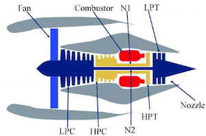
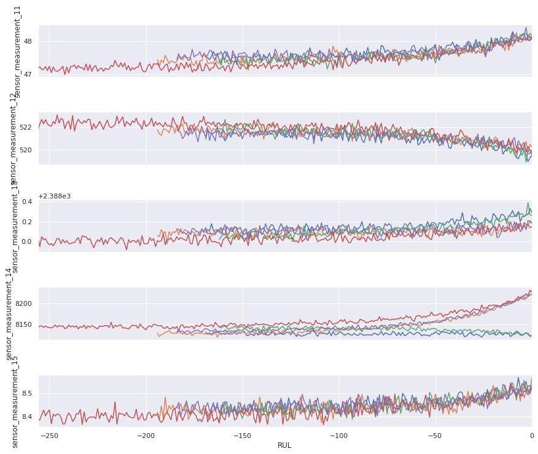
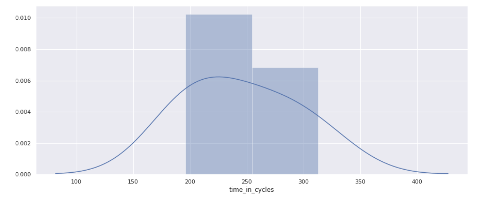
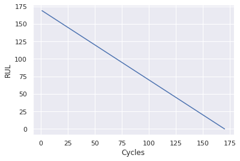
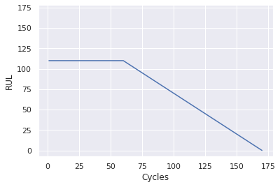
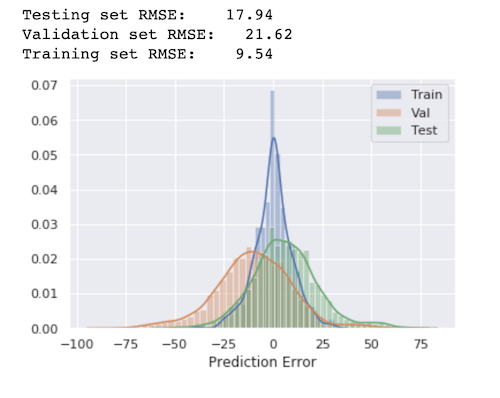
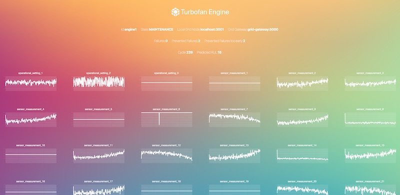
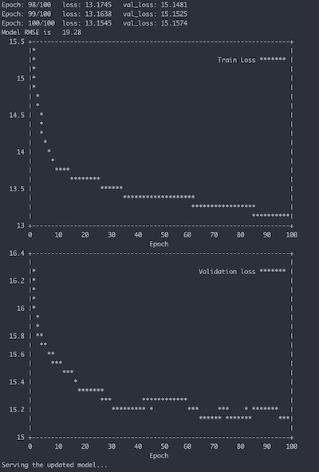

<!-- TODO(a11y): 10 localized body image(s) have empty alt text -->


<figure class="">


</figure>

Is it possible to benefit from the wonders of **machine learning without having direct access to data**? Today, machine learning can be used to accurately predict and prevent engine failure. But how can failure of expensive, important machinery be prevented when access to the sensor data is not allowed?

Machine Learning is becoming increasingly relevant in industry, e.g. for decreasing costs and increasing efficiency in general, or specifically, for predictive maintenance. Predictive maintenance is the practice of determining the condition of equipment in order to estimate when maintenance should be performed — preventing not only catastrophic failures but also unnecessary maintenance, thus saving time and money. But in many cases there is simply not enough data to perform predictions — or, access to the data is not allowed (or not possible). This could be due to data confidentiality compliance / legal reasons — as is often the case in medical use cases — or simply because accessing and transmitting the data is very expensive or complicated due to a bad internet connection or large amount of data.

This article will show the implementation of Federated Learning using [PySyft](https://github.com/OpenMined/PySyft), OpenMined’s open-source library for secure private machine learning, to train a machine learning model on edge devices without centralizing the data. Here, we demonstrate a proof of concept (POC) for preventing machine outages with continuously improving predictions of the remaining lifetime of aircraft gas turbine engines.

You can check out the complete code and run the POC yourself: [https://github.com/matthiaslau/Turbofan-Federated-Learning-POC](https://github.com/matthiaslau/Turbofan-Federated-Learning-POC).

## The Use Case

Let’s assume we are a manufacturer of aircraft gas turbine engines and we sell them. Our engines are really good, I would say the best on the market, but still, there could be failures from time to time. And failures and the following outage are very expensive for our customers, the operating companies. And if we maintain them too early without reason there is also an interruption that costs a lot of money. **In short, maintaining an engine in time could save our customers a lot of money.** In this proof of concept we will predict the remaining useful life (RUL) for the engines and switch them into maintenance a few cycles before we think a failure will happen.

<figure class="">

<video src="/blog/predictive-maintenance-of-turbofan-engines-using-federated-learning/turbofan.mp4" autoplay loop muted playsinline></video>

</figure>

This task is aggravated by the fact that we have **no direct access to the engines’ operating data** as the operating companies consider this data as confidential. Of course we still want to offer the described failure early warning system.

There is some data available from internal turbofan engines that will be used for training an initial machine learning model. All engines on the market will be expanded by a software component reading in the sensor measurements of the engine, predicting the RUL using this model and reacting on a low RUL with performing a maintenance. During a maintenance the remaining lifetime of the engine will be estimated by the maintenance staff to create a data label. Completed data series including this label will then be used to regularly re-train the model to improve prediction quality over time.

## Federated Learning

The main idea of Federated Learning is to train a machine learning model across multiple decentralized edge nodes holding local data, without exposing or transmitting their data.

You can learn more on this topic and the basics of PySyft in this free online course, [Secure and Private AI](https://www.udacity.com/course/secure-and-private-ai--ud185) on Udacity.

## The Data

For the engine emulation the **“Turbofan Engine Degradation Simulation Data Set”** from **NASA** _[\[1\]](#references)_ is used ?.

<figure class="">



<figcaption>Simplified diagram of turbofan engine <em><a href="#references">[2]</a></em></figcaption></figure>

The NASA dataset contains data on engine degradation that was simulated using C-MAPSS (Commercial Modular Aero-Propulsion System Simulation). Four different sets were simulated under different combinations of operational conditions and fault modes. Each set includes operational settings and sensor measurements (temperature, pressure, fan speed, etc.) for several engines and for every cycle of their lifetime. For more information on the data see _[\[2\]](#references)_.

## Project Prerequisites

The engines’ data series are ending with a failure so we cannot use them as is to simulate engines that will continue to run after a maintenance / failure.  To emulate our turbofan engines we combine multiple engine data series from the dataset to one set for each of our engine nodes. These series are then replayed by the engine nodes in sequence.

When there should be a maintenance the engine will be set to maintenance mode but the emulation will continue to figure out the theoretical moment of failure. This replaces the estimation of the maintenance staff and enables us to evaluate the prediction success.

To prepare the data for our POC it needs to be downloaded and split. We will work with the set “FD001” containing 100 engines for training and 100 engines for validation/testing. The train data is split into one subset for initial training (5 engine series) and 5 subsets for each of our engine nodes (19 engines series each). The test data is split into one subset for validation (50 engine series) and one subset for testing (50 engine series).

The `data_preprocessor` script is accomplishing all this for us ([https://github.com/matthiaslau/Turbofan-Federated-Learning-POC/blob/master/data\_preprocessor.py](https://github.com/matthiaslau/Turbofan-Federated-Learning-POC/blob/master/data_preprocessor.py)). Ensure you have all requirements installed when executing this yourself.

```python
python data_preprocessor.py --turbofan_dataset_id=FD001 --engine_percentage_initial=5 --engine_percentage_val=50 --worker_count=5
```

## Data Analysis

Now the project officially begins! ? The first step is to analyze the initial data we have centrally as the manufacturer to learn more about the data itself. As this is not the focus of this article we will keep the analysis short, check out more details in the [data analysis notebook](https://github.com/matthiaslau/Turbofan-Federated-Learning-POC/blob/master/notebooks/data_analysis.ipynb).

After plotting all the sensor data for all engines we can clearly see patterns for some sensors towards a failure, what is great as it means there is a pretty good chance our regression model will work.

<figure class="">



<figcaption>Sensor Data Measurements of all Engines towards Failure</figcaption></figure>

For configuring our POC it is also helpful to know about the amount of cycles the engines run, so let’s plot this as well.

<figure class="">



<figcaption>Amount of Cycles our Engines run for</figcaption></figure>

The engines from our small sample set run about 200 to 300 cycles.

## Initial Model

The next step is to prepare the data for training and to design a model. Then an initial model is trained, evaluated and saved for further usage by our engines.

See the [initial training notebook](https://github.com/matthiaslau/Turbofan-Federated-Learning-POC/blob/master/notebooks/initial_training.ipynb) for the full example.

### Data Preparation

After reading in the data files with the data from the initial engines and the engines for validation and testing, the first thing to do is calculating the RUL for every data row in the training data.

```python
# retrieve the max cycles per engine: RUL
train_rul = pd.DataFrame(train_data.groupby('engine_no')['time_in_cycles'].max()).reset_index()

# merge the RULs into the training data
train_rul.columns = ['engine_no', 'max']
train_data = train_data.merge(train_rul, on=['engine_no'], how='left')

# add the current RUL for every cycle
train_data['RUL'] = train_data['max'] - train_data['time_in_cycles']
train_data.drop('max', axis=1, inplace=True)
```

We then select the columns identified as relevant during the data analysis, mainly dropping empty and constant sensor measurements.

To do the model training the data from an engine is split into rolling windows so it has the dimensions _(total number of rows, time steps per window, feature columns)_.

For an engine this would look like this for window size of 3:

```
[1 2 3 4 5 6] -> [1 2 3], [2 3 4], [3 4 5], [4 5 6]
```

As training labels for each window the calculated RUL of the last value in the windowed sequence is picked.

---

By splitting the data into windows, data samples that are smaller than the window size are dropped. This especially means we can’t predict RUL values for smaller time series of engine data. An alternative would be to pad sequences so that we can use shorter ones — but we are fine with ignoring smaller series as the important part is predicting correctly when the engine is close to a failure and all engines run longer than the window sizes we aim for.

Setting the window size to 80 gives us 570 training samples, 2,987 samples for validation and 2,596 samples for testing. Remember: we want to do federated learning, so it’s ok to have only few data for the initial training and we shouldn’t use more data from validation/test for training as we will need this data later on when we train with much more data.

As mentioned, since the degradation in a system will generally remain negligible until after some period of operation time, the early and higher RUL values are probably unreasonable. We could tackle this by clipping the RUL values. That means we are fine with our model not correctly predicting RUL values above the defined threshold of, let’s say 110.

```python
# clip RUL values
rul_clip_limit = 110

y_train = y_train.clip(max=rul_clip_limit)
y_val = y_val.clip(max=rul_clip_limit)
y_test = y_test.clip(max=rul_clip_limit)
```

This makes the model treat samples with higher RUL values as equal and improves the model stability.

<div style="display:flex"><div style="flex:1; padding-right:5px">



<figcaption>Engine RUL before the Clipping</figcaption></div><div style="flex:1; padding-left:5px">



<figcaption>Engine RUL after the Clipping</figcaption></div></div>

### The Model

When designing models for federated learning it is important to keep in mind that these models will be trained on edge devices and that, depending on the specific federated learning setup, there could be a lot of communication overhead during a training round with multiple devices included. When we deploy the software for our turbofan engines we can’t expect to have access to a lot of resources like GPUs. **Using simple models if possible is always helpful but here it is even more important!**

A vanilla LSTM is an interesting design for this problem but here we will start with a pure dense model for the sake of simplicity:

```python
class TurbofanModel(nn.Module):
    def __init__(self, input_size):
        super().__init__()

        self.fc1 = nn.Linear(input_size, 24)
        self.fc2 = nn.Linear(24, 24)
        self.fc3 = nn.Linear(24, 24)
        self.fc4 = nn.Linear(24, 1)
        
    def forward(self, x):
        x = F.relu(self.fc1(x))
        x = F.relu(self.fc2(x))
        x = F.relu(self.fc3(x))
        x = self.fc4(x)
        # reshape to target size
        x = x[:, -1, :]
        
        return x
```

### Initial Training

We have prepared data, we have a model, now we just perform a regular training and watch the loss decreasing. We end up with a model that doesn’t perform too bad for the low amount of data we used.

<figure class="">



</figure>

## The Grid Ecosystem

Looking at the whole infrastructure we need a setup where we can perform the typical stages of a Federated Learning round:

1.  **Selection**
    
    -   an engine node can register new local data that could be used for federated training
    -   a central _“trainer”_ can lookup available data for federated training
    -   all engines that owns new data usable for training are selected
2.  **Configuration**
    
    -   the current model can be sent to the engine nodes for training
    -   further configuration on how to perform a training can be communicated to the engines
3.  **Training**
    
    -   a central _“trainer”_ can start the training on the engines
    -   the engines train with the local data
4.  **Reporting**
    
    -   the engine nodes can send back the updated model to the _“trainer”_
    -   the _“trainer”_ averages all models to create a new improved global model

Furthermore the model needs to be deployed so the engines could use it for regular predictions.

**PyGrid to the rescue!** This is exactly what [PyGrid](https://github.com/OpenMined/PyGrid) was designed for, a peer-to-peer network of data owners and data scientists who can collectively train AI models using PySyft. This project is currently evolving and improving a lot, so keep an eye on the current documentation.

In this POC we use a strategy where we don’t need to transmit a training configuration to the engine nodes but make use of the pointer strategy of PySyft. That means the trainer component is defining and executing all the training logic and the necessary commands are automatically communicated to the engine nodes by PySyft via pointers. With the progress of PySyft and PyGrid this article will be updated to other completely decoupled strategies.

## A Federated Learning Round

Let’s recap the process of our implementation. When the engines are initiated they will start emulating the sensor data over time and when their lifetime is longer than the window size they will start predicting the RUL using the initial model from the grid. After a failure the whole data series from start to failure will be registered within the grid and when there is enough data available in the grid the trainer will start a new federated training round. The improved model will then be deployed to the grid for directly improving the predictions of the engines and then everything starts over again.

1.  Predict the RUL
2.  Register local Engine Data
3.  Search the Grid for Data
4.  Federated Training
5.  Deploy the Model

### Predict the RUL

Our grid always offers the current base model for the engines to predict the RUL. For this use case the engines should download the model and then locally perform a prediction using the local sensor data. As the model download from the grid is currently being rewritten in PyGrid we use the remote prediction for now:

```python
def predict_rul(data):
    """ Predict the RUL for the given data.

    :param data: The data to predict the RUL for
    :return: The predicted RUL
    """
    # prepare the last data window for inference
    sensor_data_inference = prepare_data_for_prediction(data)

    # predict the current RUL
    my_grid = PublicGridNetwork(
    	hook,
        "http://{}".format(config.grid_gateway_address)
    )

    prediction = None
    try:
        prediction = int(
        	my_grid.run_remote_inference(MODEL_ID, sensor_data_inference)
        )
    except RuntimeError:
        print('Model "{}" does not exist.'.format(MODEL_ID))
        pass

    return prediction
```

### Register local Engine Data

To understand what is happening when an engine registers new data it is helpful to understand how searching the grid for data works. When the grid gateway is searched for data with specific tags the grid asks every registered grid node if it owns data with these tags. So the knowledge about the available data lies on the grid nodes, which in our POC runs on the engines. So the engines send their new data to the local grid node and not to the grid gateway itself.

```python
# tag the data so it can be searched within the grid
tensor_x_train_new = tensor_x_train_new.tag("#X", "#turbofan", "#dataset").describe("The input datapoints to the turbofan dataset.")
tensor_y_train_new = tensor_y_train_new.tag("#Y", "#turbofan", "#dataset").describe("The input labels to the turbofan dataset.")

# send the data to the local grid node
grid_node = NodeClient(hook, address="ws://{}".format('localhost:8001'))
shared_data.append(tensor_x_train_new.send(grid_node))
shared_labels.append(tensor_y_train_new.send(grid_node))
```

### Search the Grid for Data

Now the trainer component can easily ask our grid gateway for the data:

```python
grid = PublicGridNetwork(hook, "http://{}".format(config.grid_gateway_address))
inputs = grid.search("#X", "#turbofan", "#dataset")
labels = grid.search("#Y", "#turbofan", "#dataset")
```

As a result we receive pointers to the data, not the data itself. So without transmitting the data we can now make use of the PySyft magic to use these pointers in the training like we would do with the real data.

### Federated Training

The trainer regularly checks the grid for new data and waits until there is enough of it, then the federated training starts. The training itself still looks familiar but has some nice details enhanced.

```python
def train(model, data, labels, criterion):
    """ Train the model with the given data in a federated way.

    :param model: Model to train
    :param data: Data to use for training
    :param labels: Labels to use for loss calculation
    :param criterion: Criterion to use for loss calculations
    :return: Loss of this epoch
    """
    model.train()

    # determine the total amount of data samples in this epoch
    epoch_total = data_result_size(data)

    running_loss = 0

    for i in range(len(data)):
        # initialize an dedicated optimizer for every worker to prevent errors with adams momentum
        optimizer = optim.Adam(model.parameters())

        for j in range(len(data[i])):
            # check the location of the data and send the model there
            worker = data[i][j].location
            model.send(worker)

            # train one step
            optimizer.zero_grad()
            output = model(data[i][j])

            loss = criterion(output, labels[i][j])
            loss.backward()
            optimizer.step()

            # get the updated model and the loss back from the worker
            model.get()
            loss = loss.get()

            running_loss += loss.item() * data[i][j].shape[0]

    epoch_loss = running_loss / epoch_total

    return epoch_loss
```

**The first thing to mention is that a dedicated optimizer is created for every engine/worker that is trained on.** This is because the Adam optimizer is used and Adam is using Momentum under the hood. As Momentum accumulates the gradients of the past steps and these gradients could exist on another engine, this would fail with a single optimizer. For our use case Adam is still a very good optimizer that is why there is one optimizer per engine. An alternative approach would be to use SGD.

**The second thing you notice is that the model needs to move to the data.** Ok, this is obvious, we want to keep the data on the engine. So in each training step the location of the data is looked up and the model sent there, keeping only a pointer to that model. Then after the optimizer step the updated model and the loss is retrieved back from the engine. And that’s already it, PySyft is taking care of all the communication and command delegation.

### Deploy the Model

The last thing to do is to deploy the new model to the grid so the engines can directly start using it.

```python
def serve_model(model):
    """ Serve the model to the grid.

    :param model: Model to serve
    """
    trace_model = torch.jit.trace(model, torch.rand((1, WINDOW_SIZE, 11)))

    grid = PublicGridNetwork(hook, "http://{}".format(config.grid_gateway_address))

    # note: the current implementation only returns the first node found
    node = grid.query_model_hosts(MODEL_ID)
    if node:
        # the model was already deployed, delete it before serving
        node.delete_model(MODEL_ID)
        node.serve_model(trace_model, model_id=MODEL_ID, allow_remote_inference=True)
    else:
        grid.serve_model(trace_model, id=MODEL_ID, allow_remote_inference=True)
```

The model is serialized using _jit_ and then the grid gateway is asked for the node that is currently hosting the model. So it is not the grid gateway itself hosting our model but one random node of our grid. The model is deleted from this node and the new version deployed.

_The model was now improved with the new data on the engines, re-deployed to the grid and the trainer can continue to wait for enough new data to start the next training round._

## Start the Engines

We learned how it should work, now let’s see this in action! **?**

There is a full setup prepared using docker in the projects `docker-compose.yml`. It contains:

-   a container for **jupyter notebooks**
-   a [PyGrid](https://github.com/OpenMined/PyGrid) **grid gateway**
-   5 **engines**
-   a **federated trainer**

The **engine container** consists of a custom **engine node** and a PyGrid **grid node**. The **engine node** is reading in the sensor data, controlling the engine state and predicting the RUL using the current model in the grid. The **federated trainer** is regularly checking the grid for enough new data and then starting a new federated learning round. After the round is finished the new model is served to the grid to be directly used by the engine nodes.

```bash
docker-compose up -d 
```

The engine nodes expose an interface showing the engines state, stats and sensor values: _localhost:800\[1-5\]_. You can also checkout the interface of the grid nodes: _localhost:300\[1-5\]_.

<figure class="">



<figcaption>Engine Node Interface</figcaption></figure>

Also explore the logs of the federated trainer to see the federated training in action:

```bash
docker logs -f trainer
```

<figure class="">



<figcaption>Test data RMSE, train and validation loss from the trainer logs</figcaption></figure>

## Pimp the Engines

There are a lot of parameters in the `docker-compose.yml` and for serious results you need to adjust some of them. Here are the most important ones explained:

-   **CYCLE\_LENGTH (engine)**: The amount of seconds one single engine cycle will take. Decrease to speed up the engine emulation, increase to give the trainer enough time to finish the federated training.
-   **NEW\_DATA\_THRESHOLD (trainer)**: The federated trainer will wait for this amount of new data before starting a new training round. Increase to prevent training rounds with too few data.
-   **EPOCHS (trainer)**: The number of epochs the federated trainer is using for training.

## Conclusion

**? You’ve made it to the end, congratulations for working through this extensive use case! ?**

You’ve learned about a specific use case for predictive maintenance without direct access to the data. And you have seen how easy federated learning could be applied to a project using PySyft and PyGrid.

And this is just the beginning! The tools mentioned are still in early development and they are evolving fast, so you can expect new features and stability regularly. If you want to continue your journey join the PySyft slack, checkout the current [roadmap](https://github.com/OpenMined/Roadmap/blob/master/web_and_mobile_team/projects/federated_learning.md) and build and share your own use case. **Happy coding!**

## References

_\[1\] A. Saxena and K. Goebel (2008). “Turbofan Engine Degradation Simulation Data Set”, NASA Ames Prognostics Data Repository ([https://ti.arc.nasa.gov/tech/dash/groups/pcoe/prognostic-data-repository/#turbofan](https://ti.arc.nasa.gov/tech/dash/groups/pcoe/prognostic-data-repository/#turbofan)), NASA Ames Research Center, Moffett Field, CA_

_\[2\] Damage Propagation Modeling for Aircraft Engine Run-to-Failure Simulation, [https://data.nasa.gov/dataset/Damage-Propagation-Modeling-for-Aircraft-Engine-Ru/j94x-wgir](https://data.nasa.gov/dataset/Damage-Propagation-Modeling-for-Aircraft-Engine-Ru/j94x-wgir)_

---

If you enjoyed this then you can contribute to OpenMined in a number of ways:

### Partnerships

If you or someone you know may be interested in sponsoring [OpenMined’s codebase development](https://github.com/OpenMined/Roadmap), or implementing a use case such as this one, reach out via email – [partnerships@openmined.org](mailto:andrew@openmined.org).

### Star PySyft on GitHub

The easiest way to help our community is just by starring the repositories! This helps raise awareness of the cool tools we’re building.

-   [Star PySyft](https://github.com/OpenMined/PySyft)

### Try our tutorials on GitHub!

We made really nice tutorials to get a better understanding of Privacy-Preserving Machine Learning and the building blocks we have created to make it easy to do!

-   [Checkout the PySyft tutorials](https://github.com/OpenMined/PySyft/tree/master/examples/tutorials)

### Join our Slack!

The best way to keep up to date on the latest advancements is to join our community!

-   [Join slack.openmined.org](http://slack.openmined.org/)

### Join a Code Project!

The best way to contribute to our community is to become a code contributor! If you want to start “one off” mini-projects, you can go to PySyft GitHub Issues page and search for issues marked `Good First Issue`.

-   [Good First Issue Tickets](https://github.com/OpenMined/PySyft/issues?q=is%3Aopen+is%3Aissue+label%3A%22good+first+issue%22)

### Donate

If you don’t have time to contribute to our codebase, but would still like to lend support, you can also become a Backer on our Open Collective. All donations go toward our web hosting and other community expenses such as hackathons and meetups!

-   [Donate through OpenMined’s Open Collective Page](https://opencollective.com/openmined)
