<!-- TODO(a11y): 25 localized body image(s) have empty alt text -->

**_Update as of November 18, 2021: The version of PySyft mentioned in this post has been deprecated. Any implementations using this older version of PySyft are unlikely to work. Stay tuned for the release of PySyft 0.6.0, a data centric library for use in production targeted for release in early December._**

_This article briefly discusses the key concepts covered in Part 1 of this_ [_lecture_](https://www.youtube.com/watch?v=4zrU54VIK6k) _by Andrew Trask, which is part of the MIT Deep Learning Series on YouTube._

“Is it possible to answer questions using data we cannot see?”

Absolutely. I think that Privacy-Preserving AI is getting more attention and research now than ever before. Privacy-preserving concepts like Secure Federated Learning, are commonly being used to improve machine abilities to perform various tasks, without necessarily giving out any of the data from the data sources that are being used for the same. For instance, have you ever thought how the word prediction on your phone seems to get a lot better with time?

<figure class="">

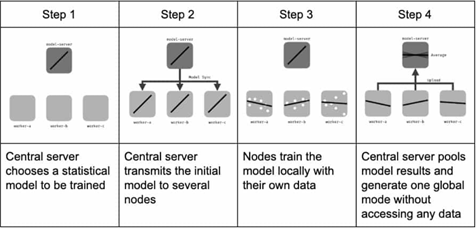

</figure>

Instead of your private data being moved to one place where all the Machine Learning needs to happen, the model now comes to your device, trains on your data and sends the model updates alone (not your data) to a global model that keeps getting better, thanks to all the updates coming from so many millions of devices across the globe (the ones connected to the internet of course). And this new and improved global model can now be downloaded to your phone, to give you an enhanced word prediction experience whilst you text. Techniques like Secure Aggregation and Differential Privacy are used to ensure that the individual’s data is always obscured from the party that is trying to learn from the data.

But even now, a vast majority of the Machine Learning Community still seems to be working on problems with easily available datasets.

<figure class="">

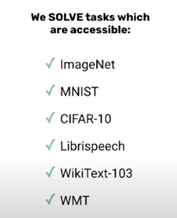

</figure>

Almost every person in the ML community has worked on training a classifier using MNIST, but how many have access to data that deals with more socially relevant issues like Depression, Anxiety, Cancer and Diabetes to name a few? After all, aren’t these the problems that directly affect the health and happiness of the people around us?

The reason why medical data is often off-limits for researchers, is primarily due to privacy concerns. For the past six months, I have been working on the development of an Automated Clinical Report Summarization System for a local hospital. This system is intended to help doctors ease up the task of parsing through multiple reports in print, and help increase the time available for patient-doctor interaction. Being a Deep Learning project that requires a good deal of _anonymized_ patient records for training, I can totally relate when I hear someone talking about the struggles of getting sufficient data to take your model to that maximum of performance you have in mind.

Getting access to private data is hard. And this is exactly where the power of Privacy-Preserving AI needs to be decentralized in the form of a few simple tools that researchers and experts everywhere can use, so that it becomes possible to harness the power of such data to derive meaningful conclusions while ensuring that privacy stays intact.

And this is exactly what the OpenMined community seeks to do, especially through PySyft- which extends major deep learning frameworks like PyTorch with the ability to do privacy-preserving machine learning.

We  now discuss how exactly PySyft makes this possible, through some major tools that let us perform data science and answer questions, based off of data we can’t actually or directly see.

**Tool 1: Remote Execution**

<figure class="">

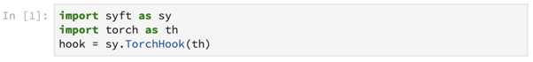

</figure>

In the above lines, we import PyTorch as a deep learning framework _th._ Followed by this, Syft extends PyTorch through _TorchHook_, which basically just iterates through the library and introduces a lot of new functionality.

<figure class="">

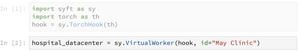

</figure>

A worker is essentially a location within which computation occurs. Here, we use Syft to create a core primitive, the _VirtualWorker- which_ points to a hospital data center. The assumption here is that the virtualized worker lets us run computations inside of the data center, without giving us direct access to the data itself.

<figure class="">

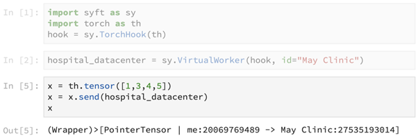

</figure>

We now use the primitive _send()_ to send the tensor \[1,3,4,5\] to the hospital data center. This primitive returns a pointer to the tensor, which is now present at the remote data center.

<figure class="">

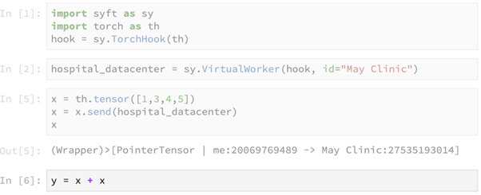

</figure>

This line of code seems to be performing the computation of summing up the tensor _x_ with itself on our local machine, but in reality this computation is performed at the remote machine. This line returns a pointer to the result of the remote computation, as shown below.

<figure class="">

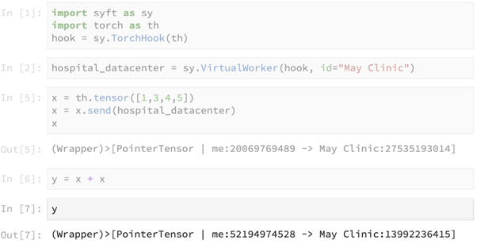

</figure>

<figure class="">

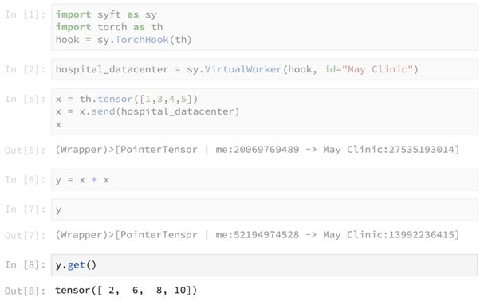

</figure>

The above primitive _get()_ is used to obtain access to the actual result in _y,_ which contains the result of the computation _x + x._

**Pro:** The main advantage of using this tool is that data stays on the remote machine and is not moved elsewhere.

**Con:** How can we do good data science without seeing the data for real?

This brings us to the second tool:

**Tool 2: Search and Example Data**

<figure class="">

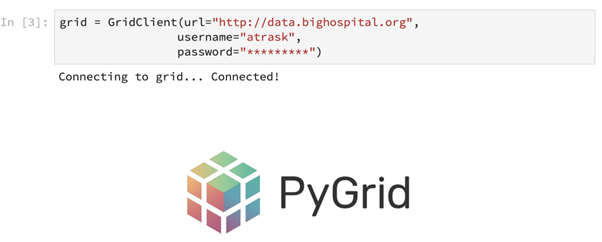

</figure>

While PySyft is a library, PyGrid can be thought of as its platform version. Here, in the above code snippet, we can think of _GridClient_ as an interface to a couple of large databases at the hospital.

<figure class="">

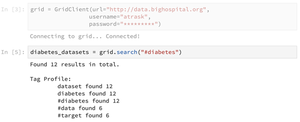

</figure>

Using this _grid_ we now have, we should be able to search for relevant databases. Let’s say we are looking for diabetes-related datasets. Here, the _search()_ primitive has been used to achieve this.

<figure class="">

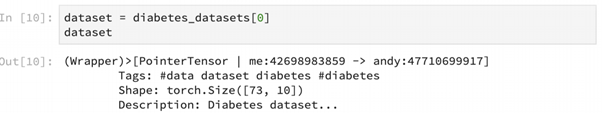

</figure>

Pointers to specific retrieved datasets can be returned as well, as shown above.

<figure class="">

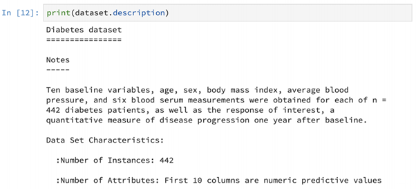

</figure>

We can also print the details of the dataset’s description as shown above. Different kinds of useful information that describe the dataset such as the number of instances, the number of attributes etc. can be retrieved using this feature.

<figure class="">

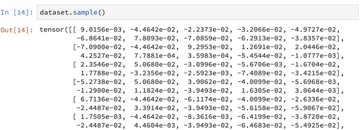

</figure>

Further, we can also print sample data this way. This data can be human-generated, GAN-generated or could even be short, openly accessible snippets of the actual data.

**Pros:** Once again, data stays on the remote machine. The various primitives provided help perform feature engineering and quality evaluation using sample data.

**Cons:** The ._get()_ method described earlier can be used to steal data, as it provides access to actual data with no real security barrier in between request and retrieval.

**Tool 3: Differential Privacy**

In a nutshell, differential privacy allows us to perform statistical analysis on data while offering some guarantees about its privacy protection.

<figure class="">

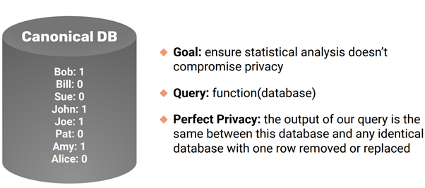

</figure>

Here, we have a canonical DB that has one row per person, and has an associated 0/1 value indicating some attribute/feature/information specific to that person worth protecting, for instance: the presence of a disease, gender etc.

The definition of perfect privacy is defined by the difference between the output of a given query on the original database and the output of the same query after removing/replacing any row of the database. If there was no difference no matter which row was removed/replaced, what we would have is a perfectly privacy-preserving query. The notion of the maximum amount by which the output query can differ when a row of information is removed/replaced is called _sensitivity_in literature.

Let’s say that we have a set of surveyees who are all being asked the same question, ‘Are you a serial killer?’. Consider for the purpose of this example, that we are not asking this question to get them arrested, but to understand the underlying trend of how many people might actually be serial killers (a data science perspective). So this calls for privacy preservation.

In order to enable this, we use a technique called randomized response. We give each surveyee a coin and ask them to toss. We tell them that if it returns heads, they should give us an honest response. Else, if it returns tails, they may do another toss and give their response based upon the result of that second toss. So now, 50% of the time we would have truthful responses from the surveyees, and the other 50% of the time we would have a 50/50 chance of having a truthful response. What has happened here is that we have taken the mean of the distribution and averaged it with the 50/50 nature of a coin toss. If 55% surveyees answer yes, we know that the actual mean of the distribution would be around 60%, as the true value has been averaged with the ‘noise’ offered by the coin toss.

Differential privacy research is concerned with the optimization problem of getting the highest accuracy in queried results, with the least amount of added noise (as too much noise would mean decreasing the accuracy of the results) while still offering the best privacy protection/plausible deniability possible. This trade-off is often the most key consideration in differential privacy.

There are two main kinds of differential privacy, namely:

·        **Local Differential Privacy:** Noise is added locally at the data itself. Querying is done afterward. This offers the best kind of privacy protection, because the actual data is never really revealed.

·        **Global Differential Privacy:** Noise is added globally to the result of the query. This is good in terms of the trade-off discussed earlier, but this requires trust that the database owner will not compromise the results.

This brings us back to the loophole in _.get()_ that could lead to stealing of data.

<figure class="">

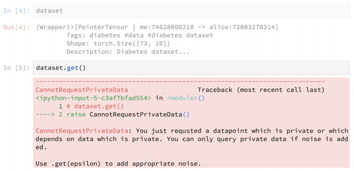

</figure>

But in reality, when we employ _get()_ on  a dataset, we get this huge error. We simply cannot request data without adding noise to it. This invariably helps introduce differential privacy. Here, _epsilon_ helps define a _privacy budget_ that serves as an upper bound on the amount of statistical uniqueness that can come out of this dataset.

This is being done as an alternative to anonymization of datasets, which is very prone to easy breaking with some relatively simple comparisons. In the Netflix Prize Contest, Netflix released a huge database of movies vs. users, where both movies and users were anonymized using numbers instead of the actual data. The matrix contained sparsely populated movie ratings, but very soon people managed to scrape IMDB to recreate the original database. This is exactly why anonymization is often not an effective solution to protecting privacy. The idea of epsilon helps ensure that no single instance of data is statistically unique enough to be linked with another dataset and declassified/revealed.

**Pros:** Data still stays on the remote machine, search and sample lets us feature engineer with toy data and Differential Privacy allows formal, rigorous privacy budgeting.

**Cons:** Sending our model to various data centers for learning puts our model at risk! This is especially if the monetary worth of this model is high. Also, if we were ever to do a join/computation across multiple data owners, this could cause a lot of trust concerns.

This leads to the next tool:

**Tool 4: Secure Multi-Party Computation**

In Secure Multi-Party Computation, multiple people can have shared ownership of a number. In essence, they do not know what each other’s inputs specifically are, but can compute a function together with all of their shares taken together.

To understand with a simple example, let’s say Trask here has a number 5 he owns.

<figure class="">

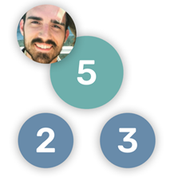

</figure>

So he owns the number 5, which can be split as 2 and 3. Now Trask has two friends, Mary Ann and Bobby to whom he wants to distribute these shares.

<figure class="">

</figure>

Mary Ann now owns 2, and Bobby owns 3. However, the key features of this tool are:

·        **Encryption:** Neither Mary Ann nor Bobby knows that hidden value shared between them is 5.

·        **Shared Governance:** The hidden value 5 can be used only if everyone agrees.

Despite this, _it is still possible to do computations using these shares_. For instance, multiplying each share by two, and summing the results- gives us two times the original hidden value.

<figure class="">

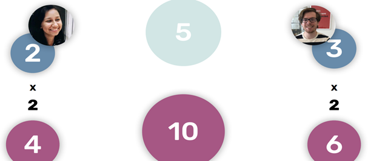

</figure>

Models and datasets are essentially large sets of numbers which we can encrypt. So this means that we can share model/data ownership among multiple parties, while still performing secure yet meaningful computations between them.

In code, this would look like:

<figure class="">

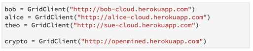

</figure>

Here, _bob, alice_ and _theo_ are the remote shareholders of the data(the parties involved in the secure multi-party computation).

<figure class="">

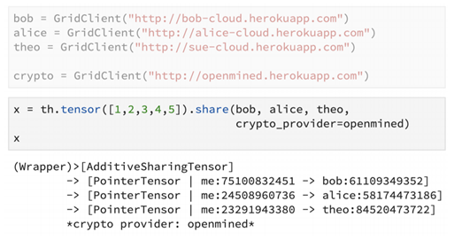

</figure>

In this snippet, the tensor has been shared among _bob, alice_ and _theo_ using the _share()_ primitive. The pointers to the remote shares are returned.

<figure class="">

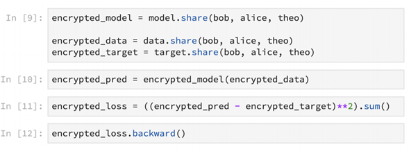

</figure>

This method can also be used to do encrypted machine learning as shown above. Models, data and training can be securely encrypted this way.

Finally, the pros for this tool are:

<figure class="">

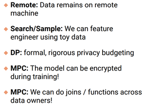

</figure>

Clearly, Secure Multi-Party Computation brings together all the good features of the previously discussed tools.

Together, these tools translate the possibility of performing effective data science without access to actual data, into reality. Armed with these tools, it should be possible for researchers, scientists, engineers and enthusiasts alike to work on problems that really matter, which usually involve analyzing a whole lot of sensitive data- in a secure, privacy-friendly manner.

<figure class="">

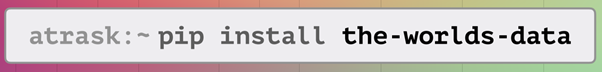

</figure>

_By making the infrastructure for these privacy-preserving tools all the more robust and secure, OpenMined seeks to better secure access to valuable data for a better world._

<figure class="">

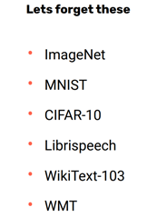

</figure>

<figure class="">

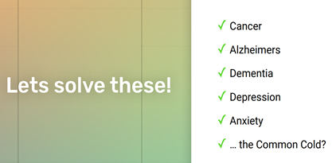

</figure>
