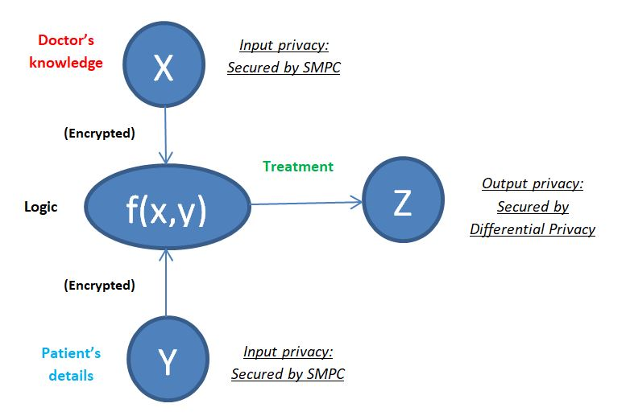

<!-- TODO(a11y): 1 localized body image(s) have empty alt text -->

<!-- TODO(content): NO ppma_author — assigned openmined placeholder -->

_This article briefly discusses the key ideas covered in Part 2 of this_ [_lecture_](https://www.youtube.com/watch?v=4zrU54VIK6k) _by Andrew Trask, which is part of the MIT Deep Learning Series on YouTube._

As humans, our ability to answer questions is limited to the data we have. But what about questions like ‘What causes cancer?’ or ‘What kind of a diet should I follow to prevent disease X?”. Answering these kinds of questions using data we don’t really have, is a key aspect of privacy-preserving AI.

Today, we live in a world where massive amounts of data are constantly being ‘spewed’ everywhere. Like it or not, almost every activity of ours these days, be it online or offline, is likely to become the cause for data generation/collection in some way.

In the human quest of life-long discovery, the power that lies untapped in this vast, complex, heterogeneous ocean of data to answer questions is undeniable. Therefore, ensuring that the proper people can access this unharnessed trove of data, without data getting ‘spewed’ all over, risking access to the wrong hands, such as someone who wants some malicious use of the data, is a significantly important task.

Considering privacy-preserving tools such as Differential Privacy and Secure Multi-Party Computation (discussed in [Part 1](https://blog.openmined.org/privacy-preserving-ai-a-birds-eye-view/) of this blog) as the building blocks, the only thing that stands between us and a better world in terms of data privacy is the usual cycle of adoption, maturation of the technology, and good engineering as is the case with any new concept/invention.

Some broad examples of areas where the positive impacts could be substantial include:

## 1\.    Open Data for Science

Consider the example of IBM Watson acing games of ‘Jeopardy!’ against the best human players.  Or _the Deep Blue vs Gary Kasparov_ chess game, where for the first time a machine was able to beat a reigning world chess champion. The common thread we see here is the amazing momentum that large datasets, or the ability to process them, can give to machine learning tasks. Due to issues like legal risk and commercial viability, thousands of enterprises, think tanks, governments, and other entities across the world have such potentially useful data lying relatively unharnessed within their data warehouses. On the other end, researchers across the scientific spectrum, for instance medical research, are looking for genuine, privacy-preserving access to big data that could help answer many meaningful questions about issues that truly matter such as life-threatening diseases and conditions.

Making these largely unused datasets accessible through privacy-preserving gateways could be a very valuable idea for data science startups to invest in. Connecting the data and the ‘data-seekers’ in this way, through secure interfaces that both protect the data and let the world safely leverage its potential, is a repeatable business model.

## 2\.    Single-use accountability

Consider the example of baggage screening at airports. In order to spot the rare malicious baggage contents, the screening personnel have to be given access to information about **all** the contents of **every** bag that passes the checkpoint. Analyzing this scenario from a privacy perspective, there is a lot of extra information leakage here. The question that needed to be answered with baggage was ‘Does this bag contain any illicit content?’.

Building a machine learning classifier to do this job would have helped here. It would have ensured that the personnel open up only those bags that seemed suspicious to the classifier, instead of someone manually going through the screening results of every bag. Similarly, a dog that can sniff a bag to identify malicious contents without having to manually go through the contents of every bag, is another privacy-preserving solution. These are analogous to the principle of single-use accountability systems, systems that are used to hold people accountable, through usage of data for a single purpose or to answer a single question.

Such systems have two main advantages:

1\.     Accountability systems become more privacy preserving, which helps mitigate any potential dual or multiple use.

2\.     Extremely privacy-sensitive tasks, like email surveillance for law enforcement needs by agencies like investment banks, might now become possible.

## 3\.  End to end encrypted services

Messaging services like WhatsApp, Telegram etc. are end-to-end encrypted. This means that I can send a message to X, which will be encrypted and only X’s phone will be able to decrypt my message, without any interference or access to the service provider. Using the combination of Machine Learning, Differential Privacy and Secure Multi-Party Computation, so many more diverse and complex end-to-end services can be made available, while being privacy-preserving.

For instance, consider a medical consultation scenario where you decide to consult a doctor to get a diagnosis. The determination of what kind of treatment you will need happens to be based on the confluence of two datasets, namely the **doctor’s knowledge base** covering diseases, experience, and treatments and your **personal information** about your symptoms, genetic predisposition, medical history, etc. If we considered the treatment-determining function as _f(x,y)_, this function receives inputs from the doctor’s knowledge base X and the patient’s medically relevant details Y. Using both these data, _f(x,y)_ computes the logic and generates the output _z,_ which is the potential treatment for the condition the patient has. Here, the inputs coming from the doctor and patient can be protected using Secure Multi-Party Computation, so that either of them can use the information they have to compute f(x,y) together without having to reveal to each other the information they each possess. At the output end, if the result _z_ is being sent to the outside world, it can be protected with Differential Privacy; or the result can be reverted to the patient, who alone can decrypt the same. Here, the doctors’ knowledge base X and _f(x,y)_ can both be machine learning models.

<figure class="">

<figcaption>Diagrammatic Representation of an end-to-end encrypted service for medical consultation</figcaption></figure>

This means that a patient can consult a doctor and get a diagnosis without ever having to reveal his symptoms or personal information to anyone, even the doctor.

Note: In Secure MPC, the result of the computation, in this case _z,_ will be encrypted among the same shareholders who supplied the initial input for the computation. They can then decide who they together want to decrypt this result for.
