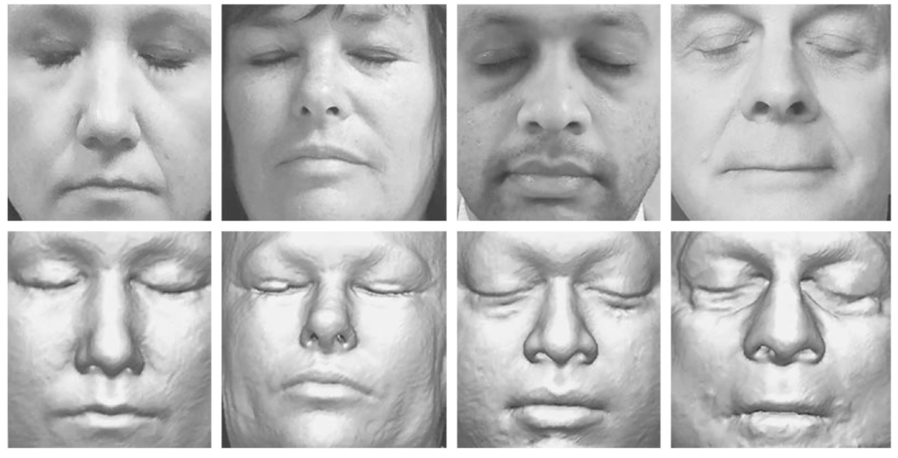
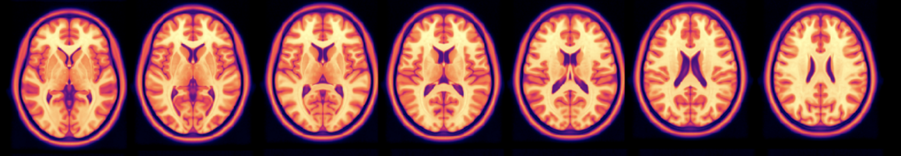
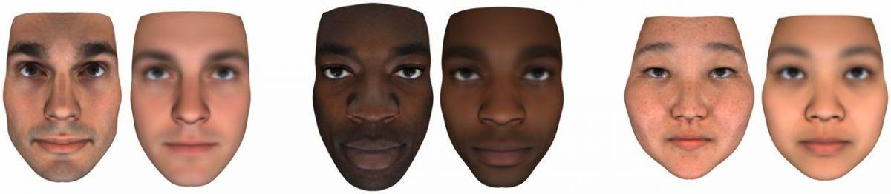

<!-- TODO(a11y): 3 localized body image(s) have empty alt text -->

<!-- TODO(content): NO ppma_author — assigned openmined placeholder -->

Across research institutions, personal devices, and private companies, humankind is gathering a huge amount of information about ourselves at an incredible rate.

This could be an amazing thing: [the open data movement](http://parisinnovationreview.com/articles-en/a-brief-history-of-open-data) has done a great job of explaining the benefits of increased access to data: advancing science, increasing human knowledge, democratizing knowledge.

But we know not all data can be open:

-   Sometimes, important **data privacy protections** that make it difficult to share data across institutions.
-   Sometimes (especially in the private sector), sensitive data is **financially valuable**: every institution you share data with then becomes a competitor.

As a result, a lot of scientific information is often kept safely locked away in data silos – sometimes at the expense of our ability to make scientific progress and collaborate. **The inability to share data also contributes to our issues with reproducibility, accountability and transparency in science.**

---

## Why is data privacy important, and why isn’t deanonymization enough?  

The Open Data movement is excellent for data about bacteria, plants or animals, but **we need to be more careful with human data.**

At the most basic level, some datasets contain your face:

<figure class="">

<figcaption>The brain scans of 84 volunteers were used to create reconstructions of their faces, bottom row, then tested against photographs. A facial recognition program correctly matched 70 subjects. Credit: Mayo Clinic, via the New England Journal of Medicine. Source: <a href="https://www.nytimes.com/2019/10/23/health/brain-scans-personal-identity.html">The New York Times, You Got a Brain Scan at the Hospital. Someday a Computer May Use It to Identify You.</a>‌‌</figcaption></figure>

We often ‘de-face’ scans to provide anonymization, but [**we’re now learning that neural networks can be used to reconstruct the facial features of the removed faces, which de-anonymizes them.**](https://arxiv.org/pdf/1810.06455.pdf)

But even for datasets that don’t contain faces or images, at all, anonymization won’t be a robust solution.

We now know you often can’t really anonymize a dataset.

True anonymization of data is difficult to achieve because data can be combined with other public datasets and deanonymized – if you want to know some infamous examples, search linkage attacks, and the netflix prize deanonymization. Security expert Bruce Schneier says that **‘[about half of the U.S. population is likely identifiable by just gender, date of birth and their city.](https://www.schneier.com/essays/archives/2007/12/why_anonymous_data_s.html)’**

So what if you think you’ve removed gender, age and location from the data?

Well, it’s also becoming unclear what kind of information can be extracted from seemingly bland data. Researchers at Oxford have demonstrated that [**you can predict age and sex from just a structural brain image.**](https://www.biorxiv.org/content/10.1101/2019.12.17.879346v1)

<figure class="">

<figcaption>© <a href="http://nist.mni.mcgill.ca/?p=904">MNI152 atlas</a></figcaption></figure>

You can also be directly **[identified by your heartbeat pattern](https://www.technologyreview.com/2019/06/27/238884/the-pentagon-has-a-laser-that-can-identify-people-from-a-distanceby-their-heartbeat/).**

When it’s more than a structural brain image, well – look at DNA phenotyping, for example: [**your height, weight, body mass index, voice, age, sex and ancestry**](https://www.pnas.org/content/114/38/10166) can be inferred from your genetic profile.

<figure class="">

<figcaption><em><em>Examples of real images on the left and their predicted DNA phenotyping reconstruction on the right <a href="https://www.pnas.org/content/114/38/10166">(Lippert et al., 2017).</a></em></em></figcaption></figure>

If this is all new to you, it might sound paranoid.

**But, once your health data is out there, you can’t get it back.  
**

**You can’t later change it, like you can change a password.  
**

**You can’t cancel it and open a new genetic profile, like you can with your compromised credit card.**

Once it’s shared, this unique identifier can forever be copied and shared to other parties.

We currently don’t really know the full extent to which our DNA profile or health care data can be exploited, but as you can see, we’re just beginning to see the beginnings of nefarious ways it can be used.

---

## The Solution: Data Science Without Access  

**We want to make it possible to learn from data you can’t have access to, without sacrificing privacy.**

We’re building infrastructure for easy remote data science.

**We want to allow you to extract insights, train models, and evaluate results on data — without anyone copying, sending, or sharing that data.**

You get your stats/model/results, the data owner keeps the data.

## What could researchers do – if this was possible and easy?

-   ****Perform larger, aggregate statistical studies****  — [sample size and generalization is an issue in many areas of research](https://link.springer.com/article/10.1007/s11121-015-0585-4)
-   ****Frictionless collaboration between research institutions and departments****
-   ****Use more real-world representative datasets**** — [so models don’t fail when they reach the clinic](https://techcrunch.com/2020/04/27/google-medical-researchers-humbled-when-ai-screening-tool-falls-short-in-real-life-testing/?guccounter=1&guce_referrer=aHR0cHM6Ly93d3cuZ29vZ2xlLmNvbS8&guce_referrer_sig=AQAAAL7D9kIV7CQucEQMlvoRdPMGAq1iHQ8QyONqR8YWe3-ki09Z0lR0RzSb8O44qxwMCf0U7agva4gt2iu2rcsac5Ghgfd7uh5d06y2ScHMTCan9Xg1MfR1IoekPusC_hqzliAkwD7v8Nv8TtA2vIBlZvkpapSZbCZIC1J-8vLrGyXM)
-   ****Use more [diversified datasets](https://www.apa.org/monitor/2010/05/weird) to ensure our research better serves our world’s population**** — current datasets can often feature a disproportionate number of young, university student subjects, which results in training data that is not representative of our patient populations
-   ****Improve academic transparency and accountability**** — not everyone can publish their data alongside their journal article
-   ****More meaningful comparison of results**** — imagine being able to easily test your method on another group’s dataset to fairly compare your results to theirs – this is the standard in machine learning research, but not common in many scientific fields

This would be very powerful — and it will take us time to reach that vision. ****But how do we get started?****

## Our Long Term Vision

Three years from now, we envision a world where any researcher can instantly perform any statistical or machine learning experiment on all relevant data across all relevant institutions, but the infrastructure for doing so automatically restricts any other uses of the underlying information aside from the chosen experiment.

## How do we get there?

This capability would be very powerful — and it will take us time to reach that vision. **Here’s how we’ve started:**

### 1\. Build and maintain the core privacy technology

Our vision requires several key privacy technologies to be integrated into the same statistical software stack such that they can be seamlessly used together including: [**Federated Learning**](https://ai.googleblog.com/2017/04/federated-learning-collaborative.html), [**Differential Privacy**](https://en.wikipedia.org/wiki/Differential_privacy), [**Multi-Party Computation**](https://en.wikipedia.org/wiki/Secure_multi-party_computation) and [**Homomorphic Encryption**](https://en.wikipedia.org/wiki/Homomorphic_encryption). We integrate them in an ecosystem called “Syft”, a set of libraries which seeks to expose this core functionality on all relevant platforms ([cloud](https://github.com/OpenMined/PySyft/), [web](https://github.com/OpenMined/syft.js/), [iOS](https://github.com/OpenMined/SwiftSyft), [Android](https://github.com/OpenMined/KotlinSyft), and [IoT](https://github.com/OpenMined/PySyft/)). These algorithms can be deployed to cloud infrastructure using a software package called [**PyGrid**](https://github.com/OpenMined/PyGrid), which offers important enterprise/cloud scalability features. Notably, core libraries such as [PySyft](https://github.com/OpenMined/PySyft/) embed these algorithms within familiar statistical/machine learning tools so that minimal retraining is required for existing researchers to use them.

### 2\. Allow a researcher and data owner to perform an experiment without sharing the data

However, merely implementing the algorithms in (1) within existing statistics tools is not enough. Our end vision is not a collection of software libraries, it is the end-user ability to instantly train on the world’s scientific data. Thus, the grand vision is a large, decentralized network for the world’s scientific information.

But before we can have massive open networks for data science, we need to be able to let _**just two people**_ – **one with data, and the other with data science expertise** – **do an experiment without revealing the data itself.** We call this [**OpenMined Duet**](https://www.youtube.com/watch?v=DppXfA6C8L8). A Duet call allows a researcher and a data owner to perform **private data science over a Zoom Call.** Peer-to-peer technology allows a data scientist and data owner to connect their Python notebooks while on a shared video call, allowing the researcher to run computations on the data owner’s machine under the watchful eye of the data owner. [**Watch a live demo of Duet here.**](https://www.youtube.com/watch?v=DppXfA6C8L8)

### 3\. Build and maintain a public registry of private datasets

Finally, in order for powerful tools like PySyft and Duet to get used, data scientists need the ability to meet relevant data owners! [**The OpenGrid Registry**](https://opengrid.openmined.org/) **is a website to connect researchers with datasets, so they can schedule a Duet.** A data owner can register their dataset (describing what it contains – but not uploading it anywhere). It’s like craigslist, but for private datasets and models.

## Next Steps:

### 4\. Build compatibility with all major statistical/ data analysis packages

Next, we’re building out integrations with all major open-source statistical packages (R, Numpy, Pandas, Scikit-Learn, _etc_), thus **reaching all major research communities with our private data access solution**. In combination with the OpenGrid data registry, this is capable of supporting privacy-preserving data science/statistics over a Duet + Zoom call for the entire research community – but only for projects which can be accomplished in the length of time appropriate for a Duet + Zoom call, since the data owner must be available to supervise the computations performed.

### 5\. Automatic differential privacy checking & ‘always available’ data

Sometimes, scheduling a call is difficult across time zones. Offline training & evaluation would make this accessible across time zones, on an as-needed basis. Next, we are tackling the problem of making data “always available” via an enterprise system that can host research data privately.

The infrastructure can protect the data automatically, using automated privacy checking and pre-set restrictions. As a result, scientists can have instant access to study remote, private datasets without having to wait for a data owner to be available for a call. **This should rapidly increase the ease of using private data for research.** This work focuses on automatic differential privacy analysis and deployment-specific concerns for the enterprise platform – GPU support, _etc_.

---

## Who is OpenMined.org?

-   Recently declared a [**Digital Public Good by the United Nations**](https://blog.openmined.org/openmined-is-officially-listed-as-a-digital-public-good/), [**OpenMined.org**](http://openmined.org) is a volunteer-heavy open-source community led by Andrew Trask, Senior Research Scientist at DeepMined, PhD Student at the University of Oxford, and member of the United Nations Privacy Task Team. We are fiscally hosted by the [**Open Collective Foundation**](https://opencollective.com/), a 501c3 based in California, USA.
-   [**Our community**](https://github.com/OpenMined/OM-Welcome-Package) includes 9,000+ engineers, researchers, and hackers around the world. We have 25 dedicated development teams, 7 community-lead learning and education teams, and 20 research teams, with 175+ core contributors working week-to-week amongst these teams.
-   OpenMined provides free privacy education courses, including an [**Udacity Secure and Private AI Course**](https://www.udacity.com/course/secure-and-private-ai--ud185) last year (which 12,000+ students enrolled in) and 4 upcoming free courses supported by [**PyTorch**](https://pytorch.org/), [**Oxford University’s Centre for the Governance of AI**](https://www.fhi.ox.ac.uk/govai/), & [**United Nations Global Working Group on Big Data.**](https://unstats.un.org/bigdata/)
