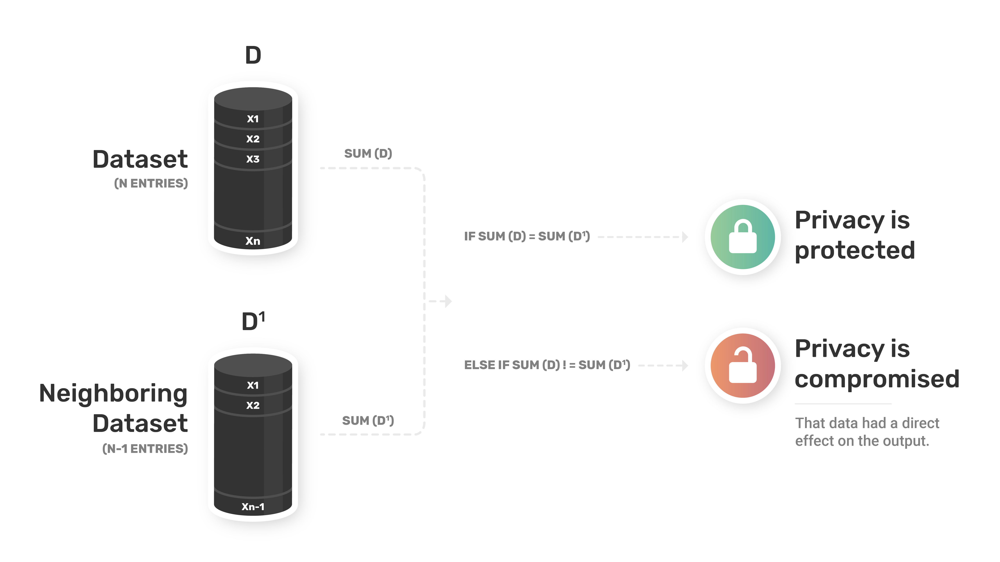
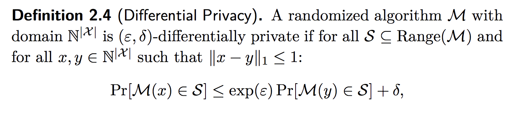
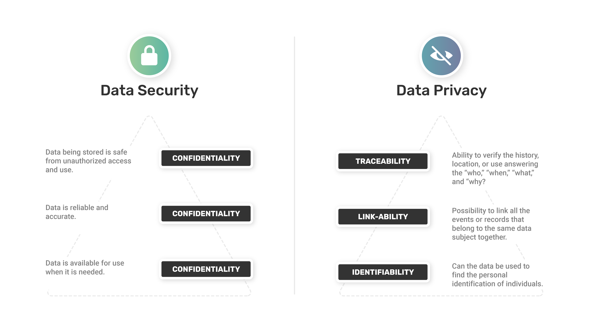

<!-- TODO(a11y): 3 localized body image(s) have empty alt text -->

_**Summary: Sometimes knowing the basics is important! This beginner friendly blog post covers a quick and easy introduction to Differential Privacy Definition. Thank you  [Jacob Merryman](https://twitter.com/jacobmerryman) for the amazing graphic used in this blog post. For more posts like these on Differential Privacy follow [Shaistha Fathima](https://twitter.com/shaistha24) and [OpenMined](https://twitter.com/openminedorg) on Twitter.**_

### What is Privacy?

Everyone has different opinion on what privacy means, but in terms of data, it could be, **_the right to control how information about you is being used, processed, stored, or shared._**

In today’s information realm, an extensive sensitive personal information is being possessed by the daily services we tend to use, such as search engines, mobile services,  on-line  social  activity  and  so  on. The loss of data privacy is imminent since the guarantee of data privacy incorporates controlling access to information, controlling the flow or purpose of information. Thus, the need for Differential Privacy (DP) arises with the hope of a better and robust data privacy.

### What is Differential Privacy?

As per the most accepted DP  definition by _Cynthia Dwork_ in her book [_Algorithmic Foundations of Differential Privacy_](https://www.cis.upenn.edu/~aaroth/Papers/privacybook.pdf)

> _Differential Privacy describes a promise, made by a data holder, or curator, to a data subject (owner), and the promise is like this:_ **“You will not be affected adversely or otherwise, by allowing your data to be used in any study or analysis, no matter what other studies, datasets or information sources are available”.**

It sounds like a well thought definition but maybe more of a fantasy – as _De-anonymization of datasets may happen!_  

This may lead to a question – _**How do we know if the privacy of a person in the dataset is protected or not?**_  For example, a database with:

(1) patients and their cancer status and their other information OR

(2) a coin flip and their (heads or tails) response!

The _key query_ for the DP in such cases would be,” If we remove a person from the database and the query does not change, then that person’s privacy is fully protected”.  To put it simply, _when querying a database, if I remove someone from the database, would the output of the query be any different?_

**_How do we check this?_** By creating a parallel database with one less entry (N-1) compared to the original database entries (N).

Lets take a simple example of coin flips, if the first coin flip is heads say Yes (1) and if its tails then answer as per the second coin flip. So, our database will be made of 0’s and 1’s i.e., a binary dataset. The easiest query that can be thought of with this binary dataset is “Sum Query”. The Sum query will add all the 1’s in the database and give a result.

Assuming, **D** is the original database with N entries and **D’** is the parallel database with N-1 entries. On running the sum query on each of them, if **sum(D) != sum(D’)**, it means the _output query actually is conditioned directly on the information from a lot of people in D database!_ It shows _**non-zero sensitivity**_, as the outputs are different.

> Sensitivity is the maximum amount that a query changes when removing an individual from the database.

<figure class="">

</figure>

Few good reads to understand De-anonymization of datasets are as follows:

-   [Why ‘Anonymous’ Data Sometimes Isn’t](https://www.wired.com/2007/12/why-anonymous-data-sometimes-isnt/)
-   [Robust De-anonymization of Large Datasets(How to Break Anonymity of the Netflix Prize Dataset)](https://arxiv.org/pdf/cs/0610105.pdf)
-   [Robust de-anonymization of large sparse datasets: a decade later](https://www.cs.princeton.edu/~arvindn/publications/de-anonymization-retrospective.pdf)
-   [Provable De-anonymization of Large Datasetswith Sparse Dimensions](https://www.andrew.cmu.edu/user/divyasha/dss-post12.pdf)
-   [De-anonymization attack on geolocated data](https://www.sciencedirect.com/science/article/pii/S0022000014000683)

> **Always Remember –** Differential privacy is **not a property of databases, but a property of queries**.  The intuition behind differential privacy is that we bound how much the output can change if we change the data of a single individual in the database.

## Formal Definition of Differential Privacy

Cynthia Dwork’s Formula:

<figure class="">

</figure>

Where,

**M:** Randomized algorithm i.e `query(db) + noise` or `query(db + noise).`

**S:** All potential output of M that could be predicted.

**x:** Entries in the database. (i.e, N)

**y:** Entries in parallel database (i.e., N-1)

**ε:** The maximum distance between a query on database (x) and the same query on database (y).

**δ:** Probability of information accidentally being leaked.

**_NOTE: This definition is valid for ONE QUERY in the database and not for multiple queries._**

**Key Points to be Noted:**

-   This DP definition does not create DP, instead it is a measure of “How much privacy is afforded by a query?”
-   It gives the comparison between running a query M on database (x) and a parallel database (y) (One entry less than the original database).
-   The measure by which these two probability of random distribution of full database(x) and the parallel database(y) can differ is given by Epsilon (ε) and delta (δ).

## (1) Epsilon (ε)

It is the _maximum distance_ between a query on database (x) and the _same_ query on database (y). That is, its a _**metric of**_ **_privacy loss_** at a differential change in data (i.e., adding or removing 1 entry). Also known as the _**privacy parameter**_ or the _**privacy budget**._

**(i) When ε is small**

(ε,0)-differential privacy asserts that for all pairs of adjacent databases x, y and all outputs M, an adversary cannot distinguish which is the true database on the basis of observing the output. When ε is small, failing to be (ε,0)-differentially private is not necessarily alarming — for example, the mechanism may be (2ε,0)-differentially private.

> _All Small Epsilons(ε) Are Alike, i.e., t_he nature of the privacy guarantees with differing but small epsilons are quite similar.

**(ii) When ε is large**

Failure to be (15,0)-differentially private merely says that there exists neighboring databases and an output M, for which the ratio of probabilities of observing M conditioned on the database being, respectively, x or y, is large.

An output M, might be very unlikely (this is addressed by (ε, δ)-differential privacy); for databases x and y might be terribly contrived and unlikely to occur in the “real world”;  the adversary may not have the right auxiliary information to recognize that a revealing output has occurred; or may not know enough about the database(s) to determine the value of their symmetric difference.

> A smaller ε  will yield better privacy but less accurate response.

> **Small values** of ε require to provide **_very_ similar outputs** when given **similar inputs**, and therefore **provide higher levels of privacy**; **large values** of ε allow **less similarity** in the outputs, and therefore provide **less privacy**.

Simply put, as  ε is the _maximum distance_ between a query on database (x) and the _same_ query on database (y). When not much differential distance is present between the two query i.e., ε is small, and if, the inputs of the queries are very similar then the outputs will be very similar too. Therefore, the adversary may not be able to analyze it and get the right auxiliary information out of it. Thus, providing higher chances or level of privacy when compared to when  ε is a large value.

> Thus, much as a weak cryptosystem may leak anything from only the least significant bit of a message to the complete decryption key, the failure to be (ε,0)- or (ε, δ)-differentially private may range from effectively meaningless privacy breaches to complete revelation of the entire database.

Two types of _ε_ are seen between two differentially private databases,

(i) _Epsilon Zero (ε = 0)_ : The OUTPUT of a query for all parallel databases is the same value as the full (original) database. Often, if sensitivity = 0,then  ε =0 too.

(ii) _Epsilon One (ε = 1)_ : Maximum distance between all the queries would be 1 OR the maximum distance between 2 random distributions M(x) and M(y) is 1.

> It can also be stated that _ε or the privacy budget_ is an _**individuals limit  of  how  much  privacy  they  are  ok  with  leaking.**_  

The concept arises from the issue that even though no single operation being done on data reveals who the subjects might be, _**by combining the data from multiple trials, one might be able to figure out details about an individual**_. As a result, _every person has a “privacy budget”**.**_

Each time an individual is included in a differential privacy calculation, it eats away at their privacy budget (by _ε_ ).  Most calculations in Machine Learning can be done to give a differential privacy guarantee and a utility guarantee.  This means that all these calculations can also be accounted for in the privacy budget.

### Real World Examples

1\.  **Apple and privacy budgets**

A recent issue arose with apple as news came out that they were using differential privacy in order to maintain their users’ privacy.  They were running operations of the app data they were receiving from their devices and made sure to use values that would ensure the privacy budget for the users would not be exceeded. However, they broke the standard by resetting the privacy budget every day.  

Since the privacy budget is a value that is used cumulatively for  life,  this  became a  problem.  Users  were  now  no  longer  guaranteed  privacy  because  no one was keeping track of their overall privacy budgets, they just knew that no single day’s operations would result in a breach of privacy for a user.

2\.  **2020 Census**

The 2020 Census announced that it would be using differential privacy in order to maintain the privacy of the American people.  Specifically, they will do so by releasing all statistics in a deferentially private way.  It has not yet been determined how epsilon and randomization of the data will occur. This is considered a big step forward because previous methods for maintaining privacy were dependent on a bunch of tricks that caused the data to be convoluted.

This decision faces some backlash from the leaders of academic sub fields devoted to interpreting the census.  These people believe that the increased privacy provided by the new methods is not worth the trade-off for accuracy.  A key point to learn from this example is that society needs to make the decision of which point in the privacy-accuracy spectrum we want to beat.

---

## (2) Delta (δ)

It is the _probability of information accidentally being leaked_. If δ= 0, we say that output M is ε-differentially private.

Typically we are _**interested in values of δ that are less than the inverse of any polynomial in the size of the database.**_

(i) _The values of δ on the order of 1/∥x∥1 are **very dangerous**:_ They **permit “preserving privacy”** by publishing the complete records of a small number of database participants — precisely the **“just a few” philosophy**, where only the people considered to have greater privacy concerns are protected.

(ii) When δ is negligible or equal to zero: It is called ε-differential privacy or (ε,0)-differential privacy.

> **Note:** ε is independent of the size of database, where as in case of  _δ, the chances of privacy leak might increase with the size of the database._ Hence, ideally we would want to set δ value to be less than the inverse of the size of database.

**This brings us to question –  (ε,0) or ε -differential privacy VS (ε, δ)-differential privacy?**

> **(ε,0)-differential privacy** ensures that, for every run of the mechanism M(x), the output observed is (almost) equally likely to be observed one very neighboring database, simultaneously.

Whereas,

> **(ε, δ)-differential privacy** says that for every pair of neighboring databases x, y, it is extremely unlikely that, ex post facto the observed value M(x) will be much more or much less likely to be generated when the database is x than when the database is y. It **ensures** that for all adjacent x, y, the **absolute value of the privacy loss will be bounded by ε with probability at least 1−δ.**

**So, what does it mean?**

In case of, **(ε,0)-differential privacy or ε-differential privacy ,** where _δ =0, i.e.,  probability of data leak δ is to be zero._ Thus, a differentially private data set with distance of 1 or less will have very similar output.

Where as, in case of **(ε, δ)-differential privacy,** the chances of data leaks are possible, maybe because of higher sensitivity values or large database size with large rows, etc. Thus, if the value of ε is not small, then there is less likely of the outputs being the same.  

We usually go for ε-differential privacy based mechanisms – like laplace mechanism  – not only because of its simplicity but also, because in real life chances of delta being high, i.e., data leak, is pretty low! (ε, δ)-differential privacy usually works well with large databases where chances of privacy leak is high and might not also have low sensitivity.

## So, What DP ‘does’ promise?

Differential privacy promises to protect individuals from any additional harm that they might face due to their data being in the private database _x_ that they would not have faced had their data not been part of _x_.

By promising a guarantee of ε-differential privacy, a data analyst can promise an individual that his expected future utility **_will not be harmed by more than an exp(ε)≈(1+ε) factor._** Note that this promise holds _independently_ of the individual is utility function ui, and holds _simultaneously_ for multiple individuals who may have completely different utility functions.

## What DP ‘does not’ promise?

-   Differential privacy **does not guarantee** that what one believes to be one’s **secrets will remain secret.** That is, it promises to make the data differentially private and not disclose it BUT not to protect it from attackers! **Ex:** Differential attack is one of the most common form of privacy attack.
-   It  **merely ensures** that one’s participation in a survey **will not in itself be disclosed**, nor will participation lead to disclosure of any specifics that one has contributed to the survey.

**Do not confuse Security with Privacy**, while _Security_ controls _“WHO”_ can access the data, _Privacy_ is more about _“When” and “WHAT”_ can they access .i.e, _**“You can’t have privacy without security, but you can have security without privacy.”**_

<figure class="">

</figure>

_**For example**_, everyone is familiar with the term “Login Authentication and Authorization” right? Here, authentication is about “Who” can access the data and thus, can come under Security, whereas, authorization is all about “What”, “When” and How much of data is accessible to that specific user, thus, can come under Privacy.

---

**Interested in Differential Privacy?**

**Want to start contributing and learn more?**

**How to get involved with DP team at OpenMined?**

-   Join the [OpenMined Slack](https://openmined.slack.com/join/shared_invite/zt-een94bc6-6ErpR~73SFAdNu5~QH7tlg#/)
-   Check out [OpenMined Welcome Package!](https://github.com/OpenMined/OM-Welcome-Package)
-   Join the right channels that interest you
-   Check out – [Roadmap to Differential Privacy for All](https://blog.openmined.org/making-algorithms-private/)
-   Join a [Mentorship Program](https://docs.google.com/forms/d/e/1FAIpQLSe1dZjZVFwJhYe9LxMW6BXnEoJnqOoWIkyyplGQTnASDLCKKA/viewform) if you need some guidance.
-   Check out the [Good First Issues](https://github.com/OpenMined/PyDP/issues?q=is%3Aissue+is%3Aopen+label%3A%22Good+first+issue+%3Amortar_board%3A%22) and jump right in!

Cover Image: Photo by [Ash Edmonds on Unsplash](https://unsplash.com/@badashphotos?utm_source=ghost&utm_medium=referral&utm_campaign=api-credit).
