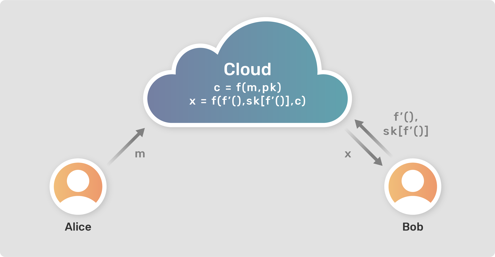

<!-- TODO(a11y): 1 localized body image(s) have empty alt text -->

Encryption is a great way to secure the data and allow only authorized users to access it. And if you are not an authorized user, then you sit with a bunch of gibberish data that means nothing to you. What if there comes a situation wherein you are not allowed to access the data, but you can work on the data? Sounds unusual, but there are instances wherein the user is not concerned with the actual value of the encrypted data, but is interested in getting the output when some operation is performed on the data. In such cases, Functional Encryption comes handy.

## Public Key Encryption(PKE)

We are familiar with the traditional Public Key Encryption(PKE), where we have a set of a public key(PK) and private key or secret key(SK) which we use for encrypting and decrypting a message. So, considering our traditional entities, Alice and Bob (_who for some reason do a lot of cryptographic data exchange_) data can be encrypted using the PK and the other entity can decrypt the data using their SK.

<figure class=""><pre><code class="language-math">	Encryption: c = f(m, pk)
	Decryption: m = f(c, sk)
where, 
	m = message,
	c = cipher text (encrypted message),
	pk = public key,
	sk = secret key</code></pre><figcaption>Mathematical expression for PKE</figcaption></figure>

#### Drawback with PKE

The main drawback with PKE is that the decryption is **“All or Nothing.”** In a sense, if Bob has the secret key(SK), then he can decrypt the entire message, and if not, then he is left with a sequence of encrypted text that is of no use to him.

But as we discussed earlier, what if you want to work with the data without accessing the actual values of it. We shall see how Functional Encryption can be used here.

## Functional Encryption(FE)

**_Functional Encryption(FE) allows one to get the output of the function performed on the data._** Let us consider an example where Alice holds data _a_ = 3, _b_ = 5. Now, Bob wants to know the value of _(a+b)_, but _a_ and _b_ are encrypted. So, Alice provides access to Bob to compute a function on the encrypted variables _a_ and _b_. In this way, Bob would get the result of his function in decrypted form without even accessing the decrypted values of the variables.

<figure class=""><pre><code class="language-math">	Encryption: c = f(m, pk)
    Decryption: x = f(c, f'(), sk[f'()])
where,
	m = message or data
    c = cipher text (encrypted data)
    x = decrypted output of function f'()
    f'() = any function
    pk = public key
    sk[f'()] = secret key for function f'()</code></pre><figcaption>Mathematical expression for FE</figcaption></figure>

The implementation of above mathematical expression of FE is represented in **Figure 1**. Alice and Bob being the two parties involved in the data exchange and the operations are performed on a secure cloud server.

<figure class="">

<figcaption><strong>Figure 1:</strong> Working of Functional Encryption. Alice having the data <em>m</em> which Bob want to perform operation on. Bob passes the function <em>f'()</em> and the secret key for that function <em>sk[f'()]</em>. He receives the output <em>x</em> for the operation of function <em>f'()</em> on the encrypted data <em>c</em>.</figcaption></figure>

## Functional Encryption(FE) VS Fully Homomorphic Encryption(FHE)

While the methodology of FE might be similar to that of Fully Homomorphic Encryption(FHE), it has some differences. If the requirements of Bob are the same(to get the value of _a+b_), in the case of FHE, he would be allowed to compute the addition function on the variables _a_ and _b_. But, the result generated in this case would be an encrypted form. So even if Bob didn’t access the decrypted variables, he would still need the key to decrypt the output which he got from his function. Whereas, in the case of FE, the result would be the actual answer 8(i.e. a=3 + b=5).

<figure class=""><pre><code class="language-math">	Encryption: c = f(m, pk)
    Decryption: x = f(c, f'())
where,
	m = message or data
    c = cipher text (encrypted data)
    x = encrypted output of function f'()
    f'() = any function
    pk = public key</code></pre><figcaption>Mathematical expression for FHE</figcaption></figure>

#### The better one: FE or FHE?

Both methods have their designated use cases. While FHE adds an extra burden of decrypting the final output, it allows the user to select any function to compute on the data. On the other hand, FE provides the user with the decrypted output but may be restricted with the type of function to be used by the owner of the data.

## Use cases for FE

This control over which functions to allow to be computed on the data that to my which user, benefits the owner of the data in multiple cases.

1.  If someone wants to classify their emails as spam or not spam, they may pass their email in the spam filter. But the spam filter gets access to all their email content. To avoid this privacy breach, the user can set up a Functional Encryption system where the function f'() is a user-specified program that generates the output as 1 or 0 depending upon whether the email is spam or not. So, the user can then generate a key for the function f'(), and the spam filter can use this function to output the category of the email without learning anything more about the actual content inside.
2.  If some suspicious activity is observed inside a company, e.g. the presence of malware, scanning the logs would make things more clear about how the malware got into the system. Now, sharing the logs with an external expert may allow them to access the company’s entire network data, even if they are encrypted. In this case, a function can be generated to look at the activities at only TCP port, and the corresponding key can be provided to the expert.

### Sources

The content is inspired by the paper: Boneh, Dan, Amit Sahai, and Brent Waters. “_Functional encryption: a new vision for public-key cryptography._” Communications of the ACM 55.11 (2012): 56-64. (You can find this paper [here](https://irandoc.ac.ir/sites/fa/files/attach/event/boneh2012.pdf))

---

Interested in knowing more about FE? This [talk](https://youtu.be/8EY4nskMCb4) will give you more information about FE, along with its drawbacks and how it can be resolved using Multi-input FE.

You can also know more about the recent advancements in FHE by IBM [here](https://arstechnica.com/gadgets/2020/07/ibm-completes-successful-field-trials-on-fully-homomorphic-encryption/https://arstechnica.com/gadgets/2020/07/ibm-completes-successful-field-trials-on-fully-homomorphic-encryption/https://arstechnica.com/gadgets/2020/07/ibm-completes-successful-field-trials-on-fully-homomorphic-encryption/).

[This](https://blog.openmined.org/what-is-homomorphic-encryption/) is a great blog which explains the working of Homomorphic Encryption.
