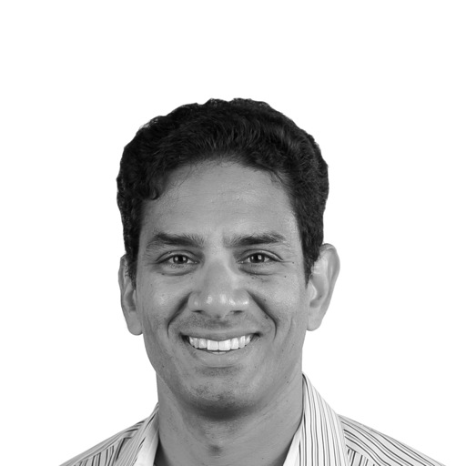
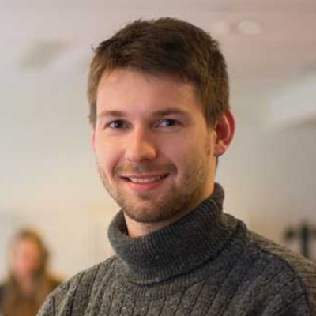
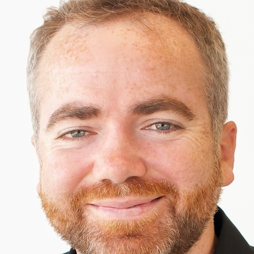

<!-- TODO(a11y): 3 localized body image(s) have empty alt text -->

<!-- TODO(content): NO ppma_author — assigned openmined placeholder -->

OpenMined has built vibrant relationships with numerous startups, who are leveraging privacy AI technologies as a core part of their offering.  In this panel, Sachin Deshpande will moderate the discussion on these symbiotic relationships, and how they are likely to grow in the future. The panel will discuss both the benefits and challenges encountered in the open-source community. Ultimately, building lasting complex systems and infrastructures that can drive the change we want in society requires collaborative team efforts.

<figure class="">

</figure>

Sachin Deshpande is cofounder and Managing Director at Unleash AI Fund.  Sachin is a seasoned investor, operator and multimedia AI expert.  As an investor at Qualcomm Ventures, he led their Series A investment into Zoom and Owlchemy VR (acq. Google in 2017). He then led Facebook’s AI and AR/VR competitive intelligence. At OpenMined, Sachin focuses on tech marketing and big tech partnerships.

<figure class="">

</figure>

Théo Ryffel is the OpenMined Cryptography Team Lead and is a co-founder of [Arkhn](https://arkhn.org/).  At Arkhn, they help hospitals regain sovereignty over their data, to improve patient care and foster research collaborations all around the world. Théo is passionate about Privacy-preserving AI, particularly about the crossroads of machine learning and cryptology. He is currently doing a PhD at ENS exploring this line of research whilst also contributing to the projects to develop secure and private AI at OpenMined.

<figure class="">

</figure>

Michael Geer is Co-Founder of [Humanity](https://humanity.health/) with Peter Ward. Together they have built apps reaching over a billion people. Humanity is an app that enables you to know your rate of aging and slow it down thus staying healthy for longer. Michael also volunteers at OpenMined as a means to utilise data for a meaningful cause in a private and secure manner.

Look forward to their talk at #Pricon2020 the 26th at 8:40 PM (7:40 PM UTC)

during the **Privacy is Profit series!**

**Ticket registration, Full Agenda & Speaker Abstracts** can be found at [**pricon.openmined.org**](https://pricon.openmined.org/)

**The best way to keep up to date on the latest advancements is to join our community at** [**slack.openmined.org**](http://slack.openmined.org/)
