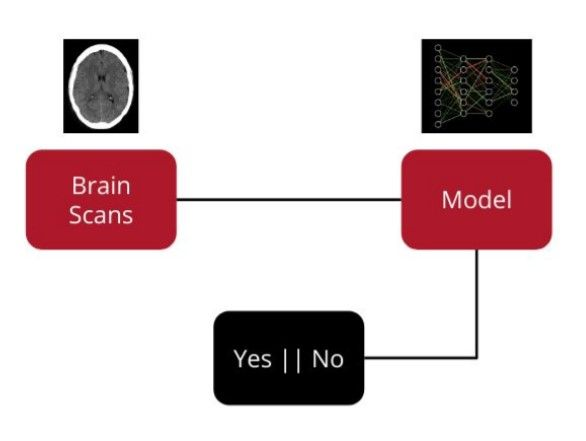
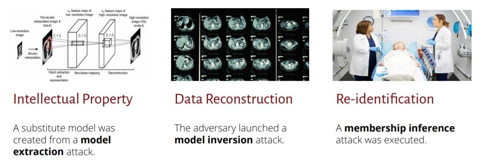
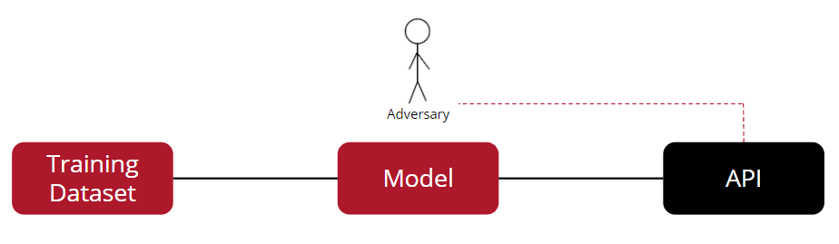
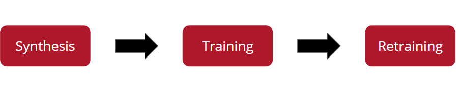
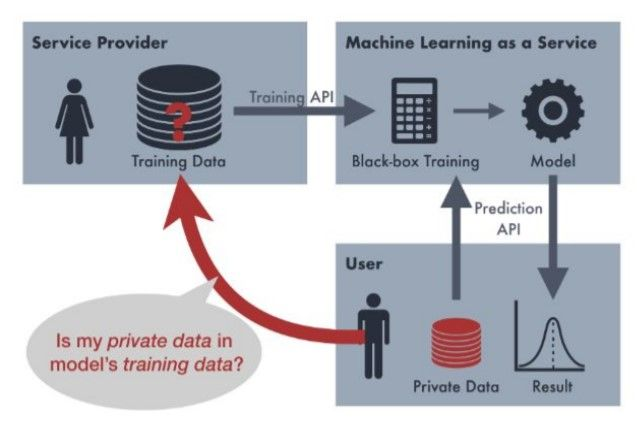
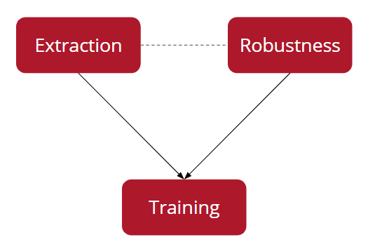

<!-- TODO(a11y): 6 localized body image(s) have empty alt text -->


This is a summary of [Suha S. Hussain’s talk](https://www.youtube.com/watch?v=tm4pcG6Fq_c) at the OpenMined Privacy Conference 2020 on PrivacyRaven – a comprehensive testing framework for simulating privacy attacks.

### Why is privacy a concern?

Today, deep learning systems are widely used in facial recognition, medical diagnosis and a whole wealth of other applications. These systems, however, are also susceptible to privacy attacks that can compromise the confidentiality of data which, particularly in sensitive use cases like medical diagnosis, could be detrimental and unethical.

### Does a restricted setting necessarily ensure privacy?

Consider a medical diagnosis system using a deep learning model to detect brain-bleeds from images of brain scans, as shown in the diagram below. This is a binary classification problem, where the model only outputs either a Yes(1) or No(0).

<figure class="">



<figcaption>Medical diagnosis system to detect brain-bleed (<a href="https://github.com/trailofbits/publications/blob/master/presentations/PrivacyRaven:%20Comprehensive%20Privacy%20Testing%20for%20Deep%20Learning/PrivacyRaven_OpenMined.pdf">Image Credits: Suha S. Hussain</a>)</figcaption></figure>

Given that an adversary has access only to the output labels, doesn’t it seem too restrictive a system for the adversary to learn anything meaningful about the model? Well, before we answer this question, let’s understand what an adversary modeled by PrivacyRaven could learn by launching attacks on such a restrictive system.

### Exploring PrivacyRaven’s capabilities

All attacks that PrivacyRaven launches are **label-only black-box** – which essentially means that an adversary can access only the labels, not the underlying model’s parameters.

<figure class="">



<figcaption>Different privacy attacks that an adversary can launch (<a href="https://github.com/trailofbits/publications/blob/master/presentations/PrivacyRaven:%20Comprehensive%20Privacy%20Testing%20for%20Deep%20Learning/PrivacyRaven_OpenMined.pdf">Image Credits: Suha Hussain</a>)</figcaption></figure>

-   By launching a **model extraction attack**, the adversary can steal the intellectual property by successfully creating a substitute model.
-   By launching a **model inversion attack**, the adversary can reconstruct the images used to train the deep learning images.
-   By launching a **membership inference attack**,  the adversary can re-identify patients within the training data.

### Threat Model

In the threat model used by PrivacyRaven, the adversary only receives labels from an API that queries the deep learning model and does not directly interact with the deep learning model at any point.

<figure class="">



<figcaption>Threat model used by PrivacyRaven (<a href="https://github.com/trailofbits/publications/blob/master/presentations/PrivacyRaven:%20Comprehensive%20Privacy%20Testing%20for%20Deep%20Learning/PrivacyRaven_OpenMined.pdf">Image Credits: Suha S. Hussain</a>)</figcaption></figure>

PrivacyRaven has been optimized for usability, flexibility and efficiency; has been designed for operation under the most restrictive cases and can be of great help in the following:

-   Determining the susceptibility of the model to different privacy attacks.
-   Evaluating privacy preserving machine learning techniques.
-   Developing novel privacy metrics and attacks.
-   Repurposing attacks for data provenance auditing and other use cases.

In the next section, let’s summarize Model Extraction, Model Inversion and Membership Inference attacks that adversaries modelled by PrivacyRaven can launch.

### Model Extraction

Model extraction attacks are aimed at creating a substitute model of the target system and can be of two types: optimizing for **high accuracy** or optimizing for **high fidelity. High accuracy** attacks are usually financially motivated, such as getting monetary benefits by using the extracted model or avoiding paying for the target model in the future. An adversary optimizing for **high fidelity** is motivated to learn more about the target model, and in turn, the model extracted from such attacks can be used to launch additional attacks for membership inference and model inversion.

PrivacyRaven partitions model extraction into multiple phases, namely **Synthesis**, **Training** and **Retraining**.

<figure class="">



<figcaption>Phases in model extraction attack (<a href="https://github.com/trailofbits/publications/blob/master/presentations/PrivacyRaven:%20Comprehensive%20Privacy%20Testing%20for%20Deep%20Learning/PrivacyRaven_OpenMined.pdf">Image Credits: Suha S. Hussain</a>)</figcaption></figure>

-   In the **synthesis** phase, synthetic data is generated by using publicly available data, gathering adversarial examples and related techniques.
-   In the **training** phase, a preliminary substitute model is trained on the synthetic data.
-   In the **retraining** phase, the substitute model is retrained for optimizing the data quality and attack performance.

This modularity of the different phases in model extraction, facilitates experimenting with different strategies for each phase separately.

Here’s a simple example where, after necessary modules have already been imported, a **query** function is created for a PyTorch Lightning model included within the library; the target model is a fully connected neural network trained on the MNIST dataset.The EMNIST dataset is downloaded to seed the attack. In this particular example, the ‘copycat’ synthesizer helps train the **ImageNetTransferLearning** classifier.

```python
model = train_mnist_victim() 

def query_mnist(input_data):     
	return get_target(model, input_data) 
    
emnist_train, emnist_test = get_emnist_data() 
attack = ModelExtractionAttack(query_mnist, 100,              
		 (1, 28, 28, 1), 10,             
         (1, 3, 28, 28), "copycat",              
         ImagenetTransferLearning,              
         1000, emnist_train, emnist_test)
```

The results of model extraction include statistics of the target model and substitute model, details of the synthetic data, accuracy, and fidelity metrics.

### Membership Inference

In sensitive applications such as medical diagnosis systems where the confidentiality of patients’ data is extremely important, if an adversary launching a re-identification attack is successful, wouldn’t it sabotage the trustworthiness of the entire system?

<figure class="">



<figcaption>Privacy concerns in sensitive applications (<a href="https://github.com/trailofbits/publications/blob/master/presentations/PrivacyRaven:%20Comprehensive%20Privacy%20Testing%20for%20Deep%20Learning/PrivacyRaven_OpenMined.pdf">Image Credits: Suha S. Hussain</a>)</figcaption></figure>

Similar to model extraction attacks, membership inference attacks can as well be partitioned into multiple phases in PrivacyRaven. For instance, a model extraction attack is launched to train an attack network to determine if a particular data point is included in the training data, whilst combining it with adversarial robustness calculations. When the adversary succeeds in the membership inference attack, the trustworthiness of the system is indeed sabotaged.

<figure class="">



<figcaption>Phases in membership inference attacks (<a href="https://github.com/trailofbits/publications/blob/master/presentations/PrivacyRaven:%20Comprehensive%20Privacy%20Testing%20for%20Deep%20Learning/PrivacyRaven_OpenMined.pdf">Image Credits: Suha S. Hussain</a>)</figcaption></figure>

****Model Inversion**** is the capability of the adversary to act as an inverse to the target model, aiming at reconstructing the inputs that the target had memorized. This would be incorporated in greater detail in future releases of PrivacyRaven.

### Future directions

The following are some of the features that would soon be included in future releases:

-   New interface for metric visualizations.
-   Automated hyperparameter optimization.
-   Verifiable Differential Privacy.
-   Incorporating attacks that specifically target federated learning and generative models.

### References

\[1\] [GitHub repo of PrivacyRaven](http://github.com/trailofbits/PrivacyRaven)

\[2\] Cover Image of Post: [Photo](https://unsplash.com/photos/HK8IoD-5zpg) by [Stefan Steinbauer](https://unsplash.com/photos/HK8IoD-5zpg) on Unsplash.
