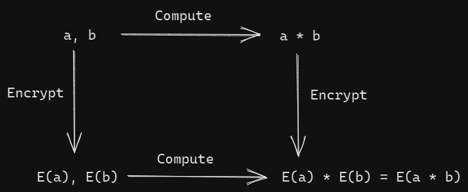

<!-- TODO(a11y): 2 localized body image(s) have empty alt text -->

> Kristin Lauter leads the Cryptography and Privacy Research Group at Microsoft Research. This post is based on her talk at the OpenMined Privacy Conference 2020.

### What is the privacy problem with AI?

Let us begin by looking at a generic Machine Learning (ML) algorithm that takes in **our** data as input and outputs some kind of decision – a classification label, numerical value or a recommendation. The privacy problem stems from the fact that we have to input **our** data to get those nice and valuable predictions. Many AI applications powered by smart agents are hosted on the cloud, and protecting privacy of user data is pivotal to building secure applications. The privacy of data can be protected through **encryption**. However, standard encryption methods do not allow computation on encrypted data. Here’s where Homomorphic Encryption (HE) helps.

> In simple terms, Homomorphic Encryption is a mathematical tool that allows for encryption of data, ensuring privacy while at the same time, allowing computations to be performed on the encrypted data. The result of computation can then be decrypted to get the results.

As shown in the figure below, with Homomorphic Encryption (HE), the order of encryption and computation can be interchanged.

Suppose you have data `a` and `b`. You can perform computation on the data and then encrypt the result, denoted by `E(a*b)`. Alternatively, you could encrypt the data and then perform computation, denoted by `E(a) * E(b)` in the figure below. If the encryption is homomorphic, then these two values, `E(a*b)` and `E(a) * E(b)` decrypt to the same value.

Therefore, we can choose to encrypt private data `a` and `b`, outsource computation, say, to the cloud, and decrypt the obtained result of the computation to view the actual meaningful results.

<figure class="">

<figcaption>Interchanging the order of encryption &amp; computation doesn’t change the decrypted value&nbsp;</figcaption></figure>

### Understanding Homomorphic Encryption intuitively through Homer-morphic Encryption

Let’s try to think of a fictional character and draw a relatable analogy.  
Remember Homer Simpson from ‘The Simpsons’??

The following illustration is aimed at giving an intuitive explanation to what Homomorphic Encryption does.

<figure class="">

<figcaption>Understand Homomorphic Encryption through Homer-morphic Encryption <a href="https://eprint.iacr.org/2021/324.pdf">(Image credits: Kristin E. Lauter)</a></figcaption></figure>

Let us say you need to get a jewel made and you have your gold ready! You’d now like to call your jeweler (Homer Simpson) and get your jewel made, however you’re not very sure if your jeweler is trustworthy. Here’s a suggestion.

You may place your gold in a box, lock it and keep the key with yourself. You may now invite over your jeweler and ask him to work on the gold nuggets through the glove box. Once the jewel is done, you may unlock your box and retrieve your jewel. Isn’t that cool?

Let us try to parse the analogy a bit. Your private **data** is analogous to gold, **outsourcing computations** on encrypted data in a public environment is similar to getting your jeweler to work on the gold through glove box. **Decrypting** the results of computation to view the meaningful results is analogous to opening the box to get your jewel after the jeweler has left. ?

Without delving deep into the math involved, the high-level idea behind homomorphic encryption is as follows. Homomorphic Encryption uses lattice-based encoding. Encryption adds noise to a _secret_ inner product. Decryption subtracts the secret inner product and the noise becomes easy to cancel.

In the next section, let’s see the capabilities of Microsoft SEAL, a library for Homomorphic Encryption.

### Microsoft SEAL (Simple Encrypted Arithmetic Library)

SEAL (Simple Encrypted Arithmetic Library) is Microsoft’s library for Homomorphic Encryption (HE), widely adopted by research teams worldwide. It was first released publicly in 2015, followed by the standardization of HE in November 2018. Microsoft SEAL is available for download and use at [https://www.microsoft.com/en-us/research/project/microsoft-seal/](https://www.microsoft.com/en-us/research/project/microsoft-seal/).

In recent years, availability of hardware accelerators has also enabled several orders of magnitude speedup. Here’s a timeline of how Homomorphic Encryption has been adopted due to advances in research and easier access to compute.

-   Idea: Computation on encrypted data without decrypting it
-   2009: Considered impractical due to substantial overhead involved
-   2011: Breakthrough at Microsoft Research
-   Subsequent years of research: Practical encoding techniques that achieved several orders of speed-up
-   2016: Crypto Nets at ICML 2016 – Neural Net predictions on encrypted data

Now that we’re familiar with how HE has been adopted over the years, the subsequent sections will focus on the possible applications of HE.

### Cloud Compute Scenarios benefitting from HE

The following are some of the cloud computing scenarios that could potentially benefit from Homomorphic Encryption (HE):

-   Private Storage and Computation
-   Private Prediction Services
-   Hosted Private Training
-   Private Set Intersection
-   Secure Collaborative Computation

The markets benefitting from such services include healthcare, pharmaceutical, financial, government, insurance, manufacturing, oil and gas sector, to name a few. A few applications of Private AI across industries are listed below.

-   Finance: Fraud detection, automated claims processing, threat intelligence, and data analytics are some applications.
-   Healthcare: The scope of Private AI in healthcare includes medical diagnosis, medical support systems such as healthcare bots, preventive care and data analytics.
-   Manufacturing: Predictive maintenance and data analytics on potentially sensitive data.

### Azure ML Private Prediction

An image classification model for _encrypted inferencing_ in Azure Container Instance (ACI), built on Microsoft SEAL, was announced at Microsoft Build Conference 2020. The tutorial can be accessed [here](https://github.com/Azure/MachineLearningNotebooks/blob/master/tutorials/image-classification-mnist-data/img-classification-part3-deploy-encrypted.ipynb).

### References

\[1\] [Recording of the PriCon talk](https://www.youtube.com/watch?v=78Ye1a24hyQ).

Cover Image of Post: Photo by [David Sjunnesson](https://unsplash.com/@zervez?utm_source=unsplash&utm_medium=referral&utm_content=creditCopyText) on [Unsplash](https://unsplash.com/s/photos/black-abstract?utm_source=unsplash&utm_medium=referral&utm_content=creditCopyText)
