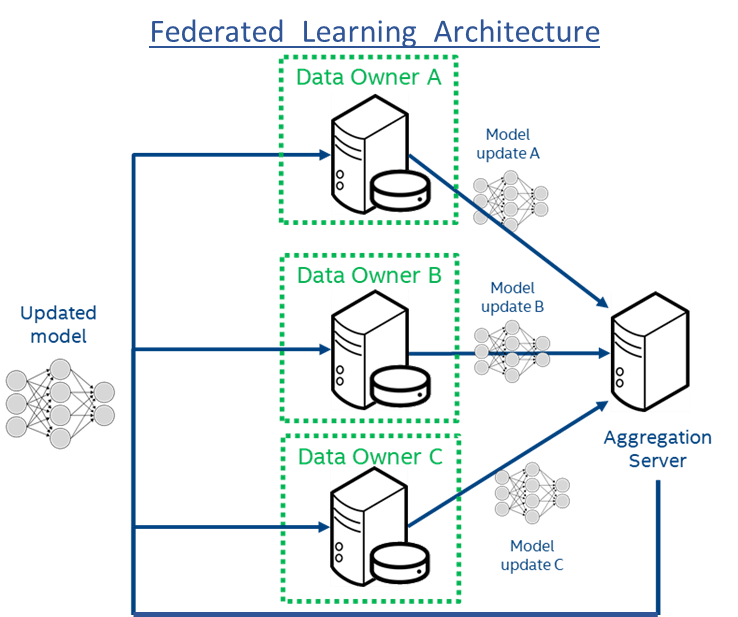
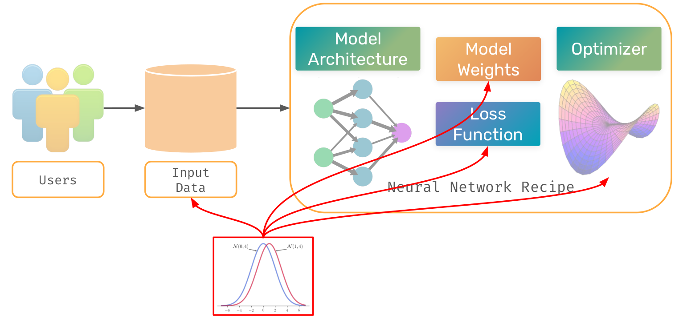
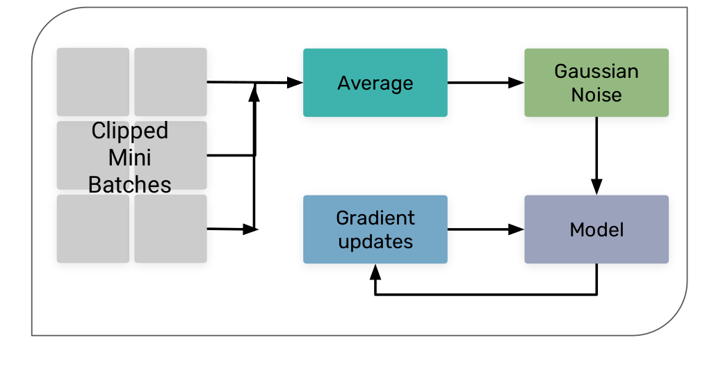
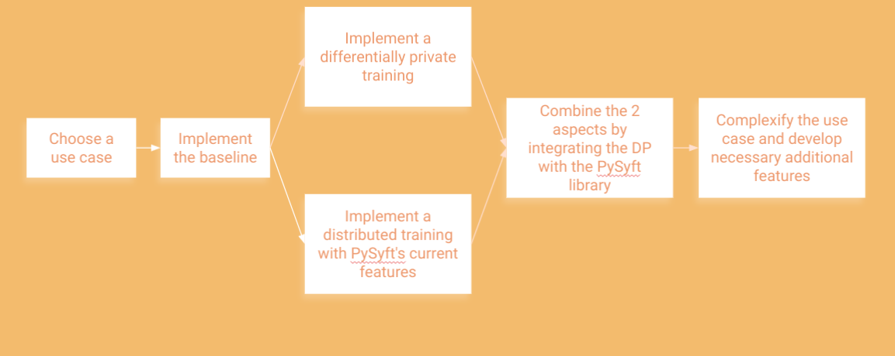
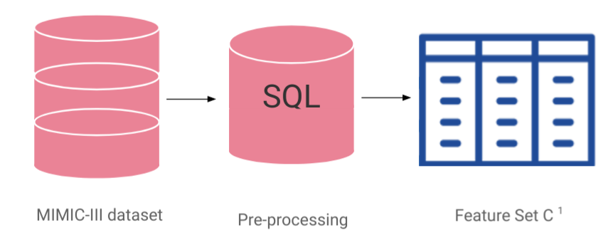
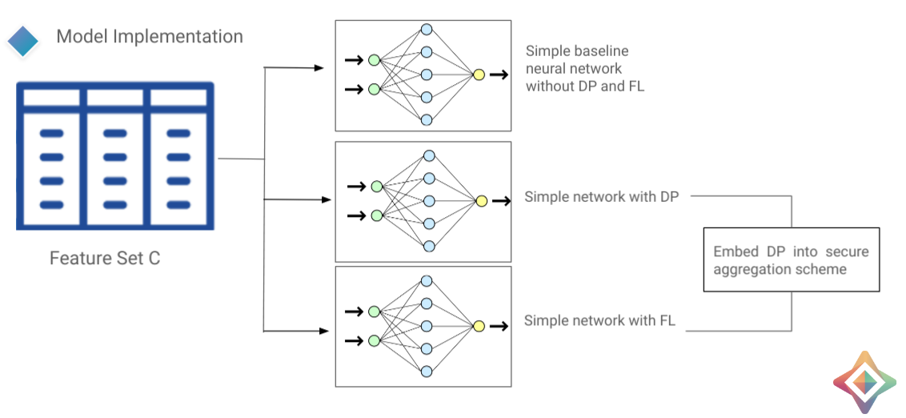

<!-- TODO(a11y): 6 localized body image(s) have empty alt text -->

**Speakers:** Kritika Prakash , Lucile Saulnier, Dmitrii Usynin, Zarreen Naowal Reza

This talk provides an example of  private deep learning using federated learning and differential privacy.

**Usecase and Baseline:**

A hospital wants to predict how many days a patient will stay when they get admitted into the hospital. Now every hospital wants a similar model to predict how many days since it helps them manage resources. The basic proposal would be to get the data from all the hospitals and then use them to build one big model which can do the prediction. But hospitals generally have constraints such as those listed below:

1.  They would want to maintain sovereignty of their data i.e. data should not cross the walls of their premises
2.  They   should  maintain privacy and confidentiality of patients i.e. using the data to learn general trends is allowed but these trends must never point towards individuals or groups.

For the purpose of comparison of the result, a baseline was implemented with the following criteria

-   Medical training data can be requested by anyone
-   The model must be a very simple neural network with no CNN, no LSTM etc.

The dataset which meets this criteria is the MIMIC dataset (). This dataset consists of about 60000 samples of clinical physiological data. The baseline model is based on the paper “Benchmarking deep learning models on large healthcare datasets” \[[https://arxiv.org/abs/1710.08531](https://arxiv.org/abs/1710.08531)\] specifically the fit front wrap model.

**Federated Learning**

**Motivation:** there is a motivation for the distributed learning as data has to stay private, model has to have high utility, institutional anonymity and standardised learning setting etc. But in real cases the utility of the model comes at the cost of user privacy. This project deals with this tradeoff

<figure class="">

<figcaption>Federated learning Architecture</figcaption></figure>

Existing solution is to use a centralized server where the data from all institutions is sent for training and then back to the institution server again. While there are issues of sending data, the main issue is that there is no guarantee of privacy. Federated learning provides solution to this issue. In this learning concept the collaborative model can be trained without sharing the data with with the aggregate server. The aggregate server is used a model aggregator and not as a learning node. The model is trained on local data. So the central model is generated and distributed across all clients. The local model update is then shared with the central server

This is more suitable to the task at hand due to

1.  Only model updates are shared not individual data points
2.  Allows for application of multiple privacy preserving techniques on top of federated learning.

**Differential Privacy**

**Motivation:**

Differential privacy is smart way adding random noise to data to make it accessible to applications while ensuring the privacy of the user at the ease of computation and minimum loss of utility.

How is DP achieved?

Random noise is added sampled from a noise distribution such as gaussian or laplacian. The shape and size is determined by two factors.

-   Privacy budget
-   Query sensitivity

The application at hand is that of deep learning. The main components of deep learning are

-   Model architecture and weights
-   Optimizer on which the loss value is minimized

The goal us to ensure that the network generalizes and does not memorize the data. So, where to add the noise?The noise can be added to the input data, to the model, to the loss function and to the step of optimiser. The algorithm used here is Differentially Private SGD, a variant of SGD.

<figure class="">

<figcaption>Noise addition for Differential privacy in Deep learning workflow</figcaption></figure>

How does DP-SGD work? When we create the mini batches we clip the L2 norm of the mini batch gradients before we average them. After averaging them we add the gaussian noise to protect the privacy of the users. The step taken in the loss landscape would be in the direction that is opposite to the average noisy gradient direction.

<figure class="">

<figcaption>Schematic representation of DP-SGD algorithm</figcaption></figure>

**Implementation with the help of PySyft**

A new tensor is added to the Pysyft library that supports DP-SGD embedded in an FL scheme. Preprocessing steps according to paper mentioned before to obtain feature sets. Three models are implemented

1.  Simple baseline without DP and FL
2.  Simple network with DP
3.  Simple network with just FL

In the final stage embedding Dp mechanism into FL through secure aggregation scheme.

<figure class="">

<figcaption>Workflow for Private deep learning using Federated learning and differential privacy</figcaption></figure>

**Data Preprocessing**

<figure class="">

<figcaption>Data Pre-processing workflow</figcaption></figure>

**Methodology**

<figure class="">

<figcaption>Methodology of Private learning with Federated learning and differential privacy</figcaption></figure>

Complexities added to the network are

1.  Dropout, batchnorm and early stopping from a DP standpoint.
2.  Increase the number of layers to mention the correlation between number of hyperparameters and model performance
3.  Networks with CNN and LSTM
4.  Adding different noise mechanisms
5.  Replace trusted aggregator with a non-trusted one

Thank you for reading.

References:

1 **. Video Link:** [**https://www.youtube.com/watch?v=F46lX5VIoas&t=121m49s**](https://www.youtube.com/watch?v=F46lX5VIoas&t=121m49s)

2\. [https://arxiv.org/abs/1710.08531](https://arxiv.org/abs/1710.08531)

3\. [https://mimic.physionet.org/](https://mimic.physionet.org/)

4\. Image and captions from the author slides
