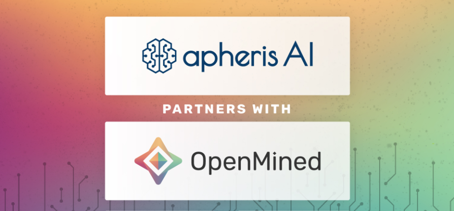
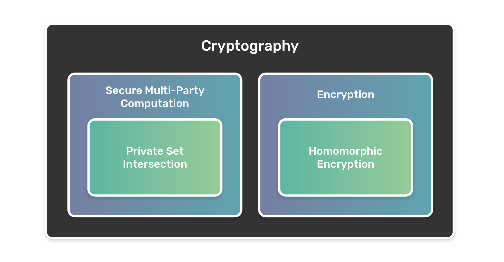
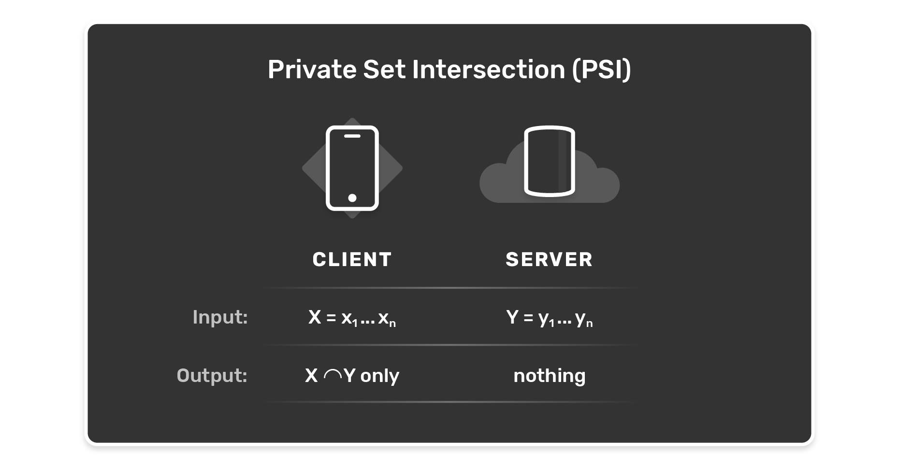

<!-- TODO(a11y): 3 localized body image(s) have empty alt text -->


__****This post is part of our [Privacy-Preserving Data Science, Explained](https://blog.openmined.org/private-machine-learning-explained/) series.****__

_Private set intersection (PSI) is a powerful cryptographic technique which allows two parties to compute the intersection of their data without exposing their raw data to the other party. In other words, PSI allows to test whether the parties share a common datapoint (such as a location, ID, etc)._

<figure class="">



</figure>

In this post, we cover:

-   An explanation of PSI
-   How PSI is useful in COVID-19 crisis technology
-   The technical details: how it is implemented and how it works in a real scenario

## Basic Concepts

If you have no background in cryptography, don’t worry! We will begin with some basics and an introduction to common terms in order to get familiar with the language.

**Cryptography** is best described as a field of study on secret communication. When a party wants to share a message with another party while ensuring mathematically that no third party can receive the true meaning of this message, it is cryptography. This third party is often referred to as an **adversary**. There are many ways that this adversary could try to interfere – or in cryptographic terms, **attack** – the communication transfer. If you want to read more about it, type the term _adversary attacks_ into your favourite search engine.

In order to hide the true meaning of messages, there is another term we need to introduce, one level below cryptography: **encryption**. Something is encrypted when true information is mathematically encoded into something that looks random and therefore does not make sense at all to someone who is not intended to read the true information.

For example, a message in normally readable **plain text** can be mathematically encrypted using a **secret key** and becomes a non-readable **cipher text**. One security goal of encryption is that the resulting cipher text is indistinguishable from random text. A secret message does not necessarily have to be text. It can be any data that should be shared between the two parties only. Of course, there are many algorithms and associated tools to encrypt and decrypt messages.

Before we jump into the purpose of PSI, we will have a deeper look into one specific encryption form, which can be used in constructing a PSI protocol: **homomorphic encryption**.

In general terms, homomorphic encryption is a technique in which computations can be performed on encrypted messages without knowing the plain (non-encrypted) message. Such a computation yields an encrypted result, which when decrypted is the same as if the computation would have been performed on plain text. This makes sense in a scenario where you are, for example, a customer of a cloud provider and want to run some algorithm on locally stored data in the cloud but want to make sure that data (imagine personal data!) is kept private, thus not readable to the cloud provider. Homomorphic encryption is any highly regulated industry’s best friend because it lets you compute results on encrypted data without the hassle of sharing the secret key with any (cloud) service provider. Only those in possession of the secret key, i.e. you, can decrypt the output of such computations.

Keep in mind that homomorphic encryption is only one of many possible encryption techniques and PSI can work with other techniques, too. There exist multiple types such as fully, partially and somewhat homomorphic encryption. The difference lies in the arithmetic operations that are possible, but that goes beyond the scope of this overview. Homomorphic encryption is great for some use cases, though one has to look at the specific requirements if it is the best fit for the case, especially if scalability to sizes of country populations is required.

Another subfield of cryptography worth mentioning is **secure multi-party computation (SMPC)**. SMPC deals with the protection of data of two parties communicating with each other. And now: drum roll, because we have made it to the core and the end of this first section: Private Set Intersection (PSI)!

<figure class="">



</figure>

PSI is a technique that enables two parties, which both have a set of data points, to compare these data sets without giving up on their individual data privacy. It is a privacy-preserving technique that allows for two parties to compute the intersection of their data. The result is a third data set with only those elements, which both parties have in common.

The most common setup you will read upon where PSI is used is a **server-client scenario** in which only the clients will receive the resulting intersection data set of elements shared between the two original data sets. Of course, other variants exist in which PSI is put in practice: those involve setups in which the client learns only the size of the intersection (i.e. the count of elements in the intersection) or where a computation is performed on the intersection by the client. We will look into actual use cases where those setups are relevant after the following paragraph.

Since the server-client scenario is not only common but also simple, we will give you a proper example of the workings in the following figure.

<figure class="">



</figure>

One last concept to finally merge the two concepts of encryption scheme and PSI: both in combination make up a PSI **protocol** which can be seen as the cooking receipt for a specific cryptographic task.

There are many use case settings to consider when you want to design one protocol that is secure and fast enough for the use case. Those involve the size of data server and client own, possible adversary attacks important to prevent and if computations are to be executed with limited resources e.g. on a mobile device. Imagine a giant decision tree which you need to traverse in order to find the perfect receipt for your individual setup. This tree was already traversed by us, so you don’t have to worry about all use case specific considerations for the following section.

Lastly, let’s look at the following list of exemplary use cases where a PSI protocol is useful. Keep in mind the main traits of PSI: two parties, both have interest in not showing their data to each other but need to find/do something with the elements in the intersection:

| 
<div style="width:290px">Use Case</div>

 | Description |
| --- | --- |
| Private Contact Discovery | Finding out as a user (client) who of my private contacts also have a certain communication app (server) |
| DNA testing and pattern matching | The user gets their DNA sequenced and wants to find out about sequences linked to genetic diseases which are stored on a database (server). |
| Remote diagnostics | A medical diagnostic program assigns a status (sick or not sick with a certain disease) to a vectorized patient’s (client) electronic health record. While the client learns about her sickness, the program itself remains secret and the program owner (server) does not learn anything about the client’s data. |
| Private record linkage | Two data owners hold different types of information for the same, say, customer. In order to make data mining possible, both records must be linked together and made available without giving away any other private data stored. |

## The Rise of PSI in this Corona Crisis

The year 2020 marks another year for the PSI technology to shine!

If you follow OpenMined on a regular basis, you must have seen one of many posts regarding privacy-preserving technology and their effort in developing a Covid-19 app to securely implement digital contact tracing.

In our collaboration, apheris AI and OpenMined co-develop code for PSI for any app that implements contact tracing to notify potential contacts of COVID-19 patients.

Together we are developing the core technology and o_pen-source libraries for private set intersection to run on many devices in many contexts_ that will enable any Covid-19 tracking app to preserve privacy on and outside the user’s phone.

You can get more details on the importance of such a Covid-19 app from our whitepaper which we published March 31st. The executive summary of it: epidemiological modelling for spread of disease shows that high-precision self-isolation is the best approach to stop the pandemic and thus to minimize its economic damage. Read more here: [https://www.covid-app.io/](https://www.covid-app.io/)

There are quite a few Covid-19 apps being developed and published right now. They have different functionalities but on a general note, their core workflow is similar. It can be described like this: Every user collects tracing data on their mobile phones. If the local health authorities diagnose a user positive with the coronavirus, the user can (but usually doesn’t have to!) share their data and transfer it to a server. Any other user of the app can now learn if they have potentially been in contact with a positive tested user by asking that server with the updated data.

This workflow contains two privacy issues which need to be considered when data is shared and compared: the diagnosed patient’s privacy and the user’s tracing data.

On the user’s side, PSI allows for a user to check if the tracing data they collected matches the traces of diagnosed patients, whithout revealing their private tracing data to the server. Depending on the type of PSI protocol, the client would then only learn the matching traces itself, or the count of matching traces.

On the diagnosed patient’s side, the situation with the patient that shares data with the server requires another protocol. But it also asks for a fast, secure and anonymous protocol that is not giving away their personal information.

A Covid-19 app is only successful when it is adopted by a sufficient amount of people in a population. There are many things that determine the adoption rate of an app, including culture, platform availability, and the development of the telecommunication infrastructure. However, one thing that drives adoption for sure is privacy and trust. PSI is a big leap towards mass adoption.

## PSI Demonstration

Finally, we are getting to the bottom of this iceberg, we will now discuss individual implementations of PSI.

One way to implement it is evidenced in OpenMined’s [COVID alert app](https://github.com/openmined/covid-alert) which implemented a partial homomorphic encryption scheme, namely the Paillier cryptosystem, where an encrypted value from the client was multiplied by an unencrypted value on the server, yielding an encrypted result which only the client could decrypt. This approach highlights the beauty of homomorphic encryption, though for general PSI other encryption schemes are very viable as well and have advantages in terms of scalability if going to really large datasets, as in the case of populations of countries or continents.

We will now go into detail on the RSA-PSI protocol we implemented in our libraries, and we will focus on the Python version of it. You can find our open source python implementation [here](https://github.com/OpenMined/PyPSI), but we also have a JavaScript version [here](https://github.com/OpenMined/psi.js). All our libraries should be interoperable, which means that you can have a server implemented in Python while the client uses JavaScript.

The RSA-PSI protocol has 3 main phases, the **base**, the **setup** and the **online** phases. We will describe each one of them and give an implementation example using our library. We will assume that the client holds a set of integers Y, and the server holds a set of integers X. If your use case involves other types of elements, then simply encode your elements as integers.

### Base

The base consists of the server generating an RSA private-key and sharing the public-key with the client. The client will generate a random number for each element in his set Y and store their encryption and modular inverse. The client can run this operation asynchronously.

```python
# Note that the package is not yet available to install via pip
# but you can always install it from source
from psi.protocol import rsa

# server will run this and share the public-key with the client
server = rsa.Server(key_size=2048, e=0x10001)
public_key = server.pulic_key

# client will use the public_key
client = rsa.Client(public_key)
random_factors = client.random_factors(len(Y))
```

### Setup

In this phase, the server will sign the element of his set using the private key, then insert them into a bloom filter that he will share with the client.

```python
signed_server_set = [server.sign(x) for x in X]
# must encode integers to bytes
signed_server_set = [str(sss).encode() for sss in signed_server_set]
bf = bloom_filter.build_from(signed_server_set)
```

### Online

The client here blinds the elements of his set using the encryption of the random numbers that he generated in the setup phase, sends them to the server which will sign them and send them back to the client. The client then does the inverse operation of the blinding to finally get the signature of each of his elements. The client will then check the presence of each signature in the bloom filter, and put the associated element into the intersection if a signature matches.

```python
# client run this and send A to the server
A = client.blind_set(Y, random_factors)

# server run this and send B back to the client
B = server.sign_set(A)

# client do the intersection
unblinded_client_set = [client.unblind(b, rf) for b, rf in zip(B, random_factors)]
# must encode integers to bytes
unblinded_client_set = [str(ucs).encode() for ucs in unblinded_client_set]

intersection = []
for y, u in zip(Y, unblinded_client_set):
    if u in bf:
        intersection.append(y)

print(“intersection is {}”.format(intersection))
```

Voilà! The client now holds the intersection! It’s worth noting that the server doesn’t learn the intersection in the RSA-PSI protocol. The client learns all the elements of the intersection, which enables the app to display detailed information where possible contacts with infected users have been found. This enables the user to manually check for false positives by excluding encounters that could not possibly happen, e.g., the app shows that you’ve possibly met an infected person three days ago in the afternoon but you know that you were confining at home at that time.

Besides RSA-PSI, which yields the intersection itself, we also have an implementation of a PSI-cardinality protocol [here](https://github.com/OpenMined/psi-cardinality/), which just gives the size of the intersection, i.e. the count of the elements in the intersection, instead of the intersection itself. This protocol is not based on RSA, but rather on a Diffie-Hellman key exchange.

## Summary

To understand PSI, we started with the basic concepts and terminology of cryptography. One branch of cryptography is encryption which is the mathematical operation to turn a message into an unreadable ciphertext. Homomorphic encryption is a special form of encryption that allows to carry out computations on the ciphertexts without knowing the respective plaintext. SMPC is another branch of cryptography that contains all technology, including PSI, in which two parties compute a result jointly but keep their input data private.

These basic concepts helped to understand how PSI as a technology works in detail. The use case of COVID-19 contact tracing apps was used to explain how we at apheris AI and OpenMined make use of a PSI protocol to enable contact tracing while preserving everyone’s privacy.

PSI allows app users to compare their contact data with those of COVID-19 patients stored on a server without giving up on their privacy. These explanations were followed by a walk-through of our RSA-PSI protocol implementation. You find our open source implementation here for [Python](https://github.com/OpenMined/PyPSI) and for  [Javascript](https://github.com/OpenMined/psi.js). For our PSI-cardinality protocol [here](https://github.com/OpenMined/psi-cardinality/) is an implementation, for which wrapper for all major languages will follow.

If you made it until the end: cool and hope you enjoyed it. Feedback, thoughts, ideas go here: [info@apheris.com](mailto:info@apheris.com). Reach out to us for any privacy-preserving technology question or other inquiry.

<3 apheris AI and OpenMined
