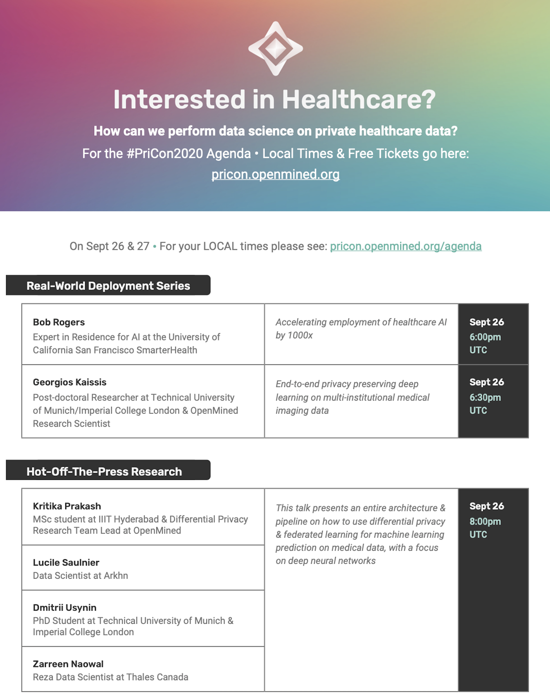
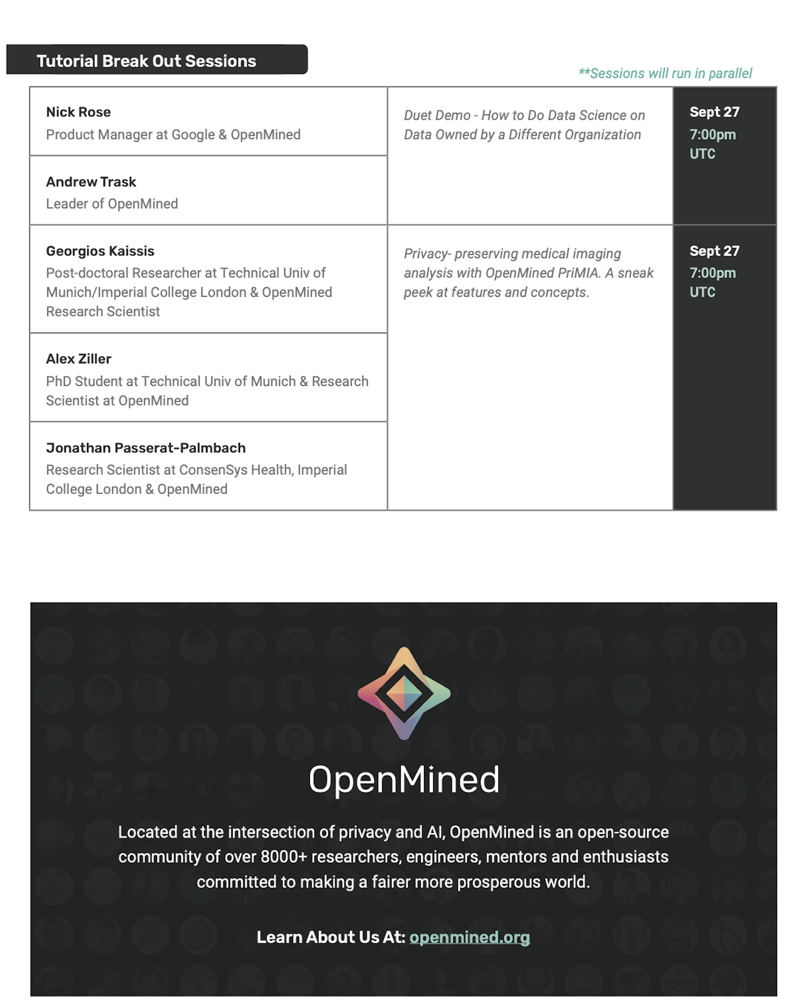

<!-- TODO(a11y): 2 localized body image(s) have empty alt text -->

**On Sept 26 & 27 • For your LOCAL times please see:** [_**agenda**_](https://pricon.openmined.org/agenda) _**link**_

<figure class="">

</figure>

<figure class="">

</figure>

The prevalence of noncommunicable diseases as well as the many challenges intrinsic to the complex dynamics and progression of the majority of disorders requires powerful tools to dismantle such convoluted environments. The fast developments in machine learning have facilitated its fusion with medicine as a means to better diagnose and treat patients.To understand complex disorders and their disease course, vast amounts of data and parameters are necessary. In addition to this, the intrinsic sensitivity of medical data closely ties it to ethical regulations and consent. In an ideal scenario, governance and private frameworks in medical data would be in place to ensure its distribution.

Machine learning can revolutionise contemporary medicine by tapping into patterns that humans are incapable of detecting. Its implementation has been proven across countless domains; oncology, genomics, radiology, cardiology and neurology among others. This plethora of developments could have not been achieved had medical data not been released and openly shared. Medical images contain abundant information about a person’s health, yet they are hard to access and to curate for specific purposes. To do this privately and securely is a challenge, which has restricted the research and collaborations occurring across hospitals and universities, limiting the field from reaching its potential and better informing clinical decisions.

It is clear that to reach the full potential of the field, copious amounts of data need to be accessible in a secured manner. Not only that, the whole pipeline from accessing the data and training the model to its utilization must be secure and abide by the right to privacy laws and ethics that ensure the patient’s anonymity. To this day, the aforementioned remains a barrier and not until there are assurances that data will be privately and securely handled, cooperatively exchanging datasets will not be commonplace.

**The secure and privacy preserving AI field and its techniques offer the possibility to surpass the current limitations preventing medicine from leveraging the rich information packed in medical data.**

There are three main techniques gaining traction in this domain:

**• Privacy preserving AI** refers to techniques that ensure the anonymity of data so it can be employed across platforms without jeopardizing an individual’s privacy. A prime example is **Federated Learning**. Putting to use this tool in a hospital setting, for example, would grant data access or the collation of data across hospitals remotely. Remote access to data thus overcomes the governance and data ownership concerns, expediting access to large datasets to train machine models in clinical settings.

_However, federated machine learning alone is not a strong enough technique to provide a robust secure framework, making it vulnerable to privacy and security attacks._ If, for instance, the aim is to publish the model you developed, federated machine learning needs to be coupled with differential privacy, or other cryptographic techniques, so it can be released in the public domain securely.

**• Differential privacy** helps diminish the amount of information that is traceable back to an individual by manipulating the datasets, without losing statistical reasoning about the information. The procedure can be implemented on the input data, the computation produced or the algorithm, but it carries certain risk of damaging the data by either shuffling or adding noise. Perturbations in medical imaging datasets are less understood, hence requiring further research to estimate the exact effects it has on the model performance. Local differential privacy is when it is applied to the input data, which has great utility in healthcare, given it provides secure handling of information at the source of data. This has broad applications in wearables and smartphones data acquisition for preventable and monitoring medicine purposes.

**• Cryptography** is viewed as the gold standard of secure and private computations, albeit it has several limitations. Encryption is applicable to both data and algorithms, making computations secure at both ends and hard to crack.

-   **Homomorphic encryption** is categorised as partial or full, and it enables the handling of encrypted data as if it weren’t encrypted (instead plain text). Partial homomorphic encryption is capable of performing only certain mathematical operations or only a limited number of operations (like a limited number of successive multiplications), whereas fully homomorphic encryption can perform any mathematical function. An additional shortcoming is the demanding computation power needed.
-   **Multi-party computation** is another technique that offers promising results, since it provides the platform for different groups to simultaneously work on shared data. It computes faster than Homomorphic encryption but requires close communication between the parties involved. Each party can work on the data and share their anonymous input from which to produce an output of interest. This preserves the privacy of the data within the computation.

During **#PriCon2020**, **on Sept 26 & 27,** we will be presenting state-of-the-art techniques in medical image analysis. We will explore the latest privacy preserving AI techniques being developed and how their open accessibility will propel not only the developments necessary to overcome the shortcomings of centralised, private datasets but also to incentivise a different dynamic in which data is shared and manipulated.

**LIVE CHATS  – during #PriCon2020 – Bring your questions!**  
**For Full Agenda & Speaker Sign up Here:** [**https://pricon.openmined.org/**](https://pricon.openmined.org/)

**The best way to keep up to date on the latest advancements is to join our community!** [**Join slack.openmined.org**](http://slack.openmined.org/)
