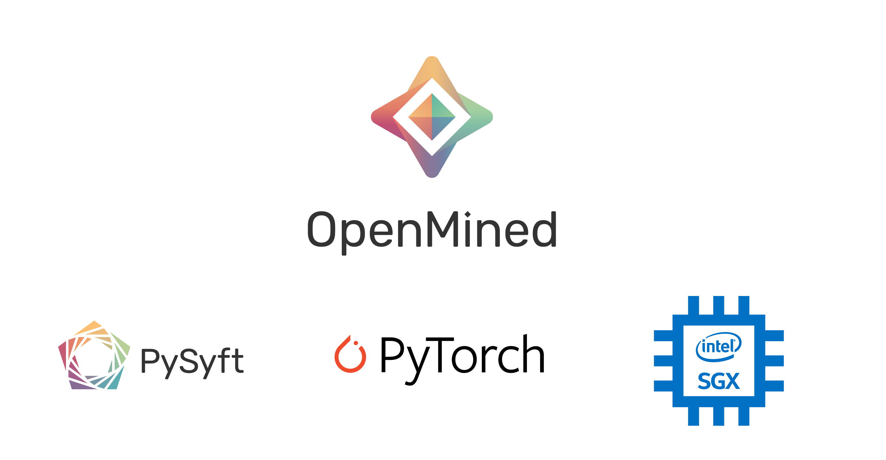
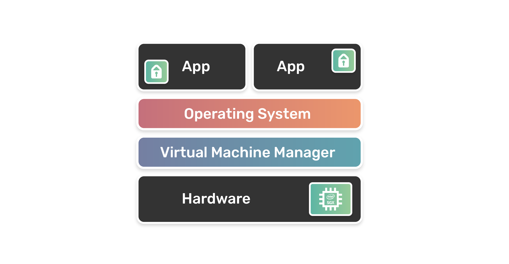
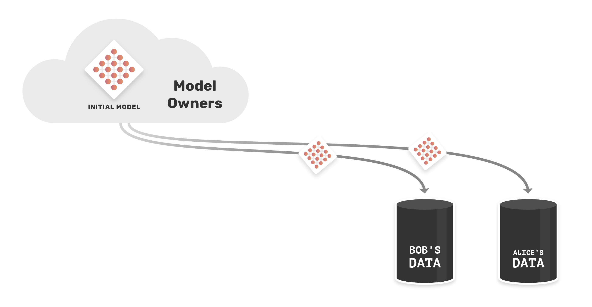
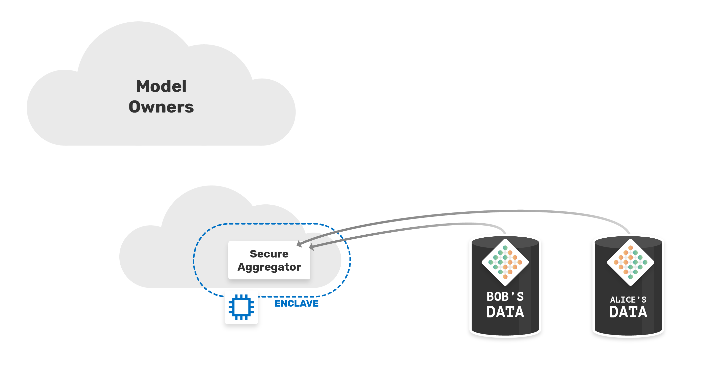
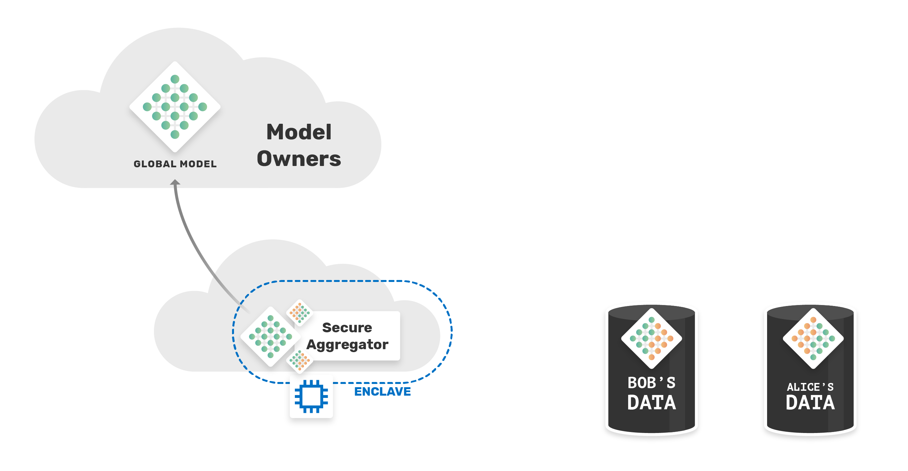
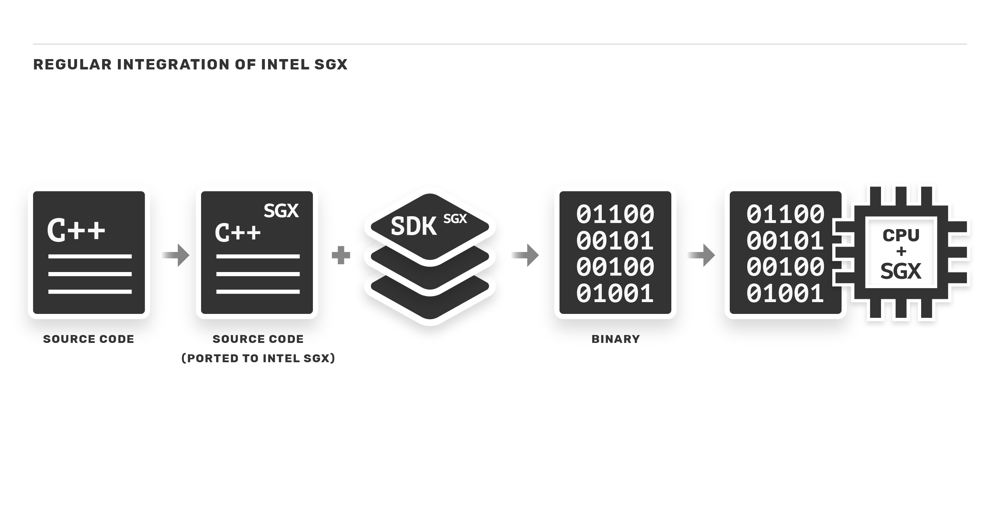
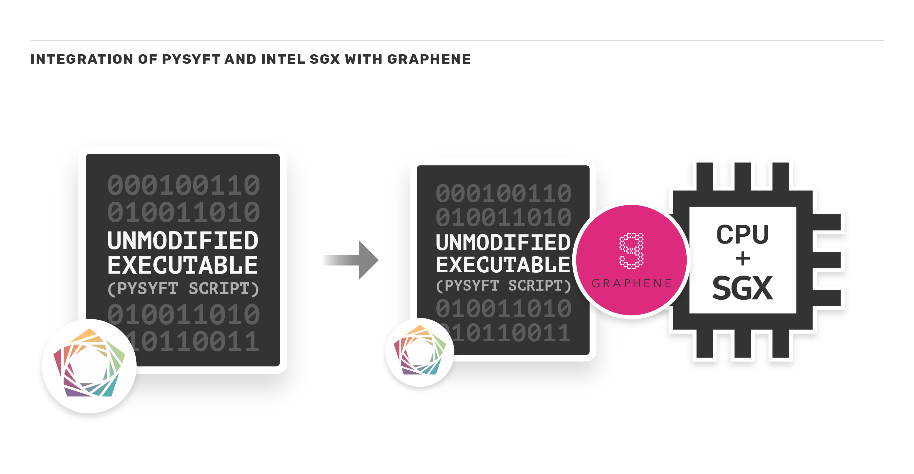

<!-- TODO(a11y): 7 localized body image(s) have empty alt text -->


<figure class="">



</figure>

The world now creates more digital data than we could ever imagine — more than 90% of all existing data has been generated in the last decade. The field of artificial intelligence has tapped into the value in all that data. Deep learning models have made use of ever larger quantities of data to not only provide breakthroughs in various fields, but also deliver relevant applications for many companies.

**Training these models on ever larger datasets poses a critical issue to the infrastructure of several companies.** Considering this, an alternative to the infrastructure problem is cloud computing. This brings many benefits, such as scalability, mobility, reliability, cost savings, etc. **But it also brings us questions about security, privacy, and confidentiality.** Is the infrastructure owner trustworthy? When we talk about sensitive data, how can we guarantee the remote, secure and private execution of our applications? **One of the possible solutions to this big problem is to run the application in a Trusted Execution Environment (TEE)**.

## But what is a TEE?

In a few words, a TEE is an isolated processing environment that runs parallel to the operating system. This provides several security features, such as the isolated execution of a program/application, its integrity and also confidentiality. The data and applications stored in the TEE are protected cryptographically, and the interactions – either between applications or with the user – are securely performed, that is, it not only protects data but also the communications with remote entities and also enables trusted device identity and authentication.

### Intel SGX – The Intel’s TEE solution

**[Intel Software Guard eXtensions](https://software.intel.com/sgx)** (a.k.a. Intel SGX) has become the preferred trusted execution environment for developers who want additional hardware-assisted security for the application layer. By definition, Intel SGX _“is a set of instructions that increases the_ security _of application code and data, giving them more protection from disclosure or modification. Developers can partition sensitive information into **enclaves**, which are areas of execution in memory with more security protection”_.  

<figure class="">



</figure>

Developers are able to partition their application into two parts – **trusted** and **untrusted**. The trusted part is what will be executed within the enclave (secure hardware). The enclave is decrypted on the CPU and only for code and data running within itself. In this way, the content of the enclave cannot be read (except in its encrypted form) by any external process, not even the operating system.

## Our Use Case

OpenMined is working hard to create an accessible ecosystem of tools for private, secure, multi-owner governed AI, making the world more privacy-preserving. Privacy-preserving analysis begins with analysis on data you can’t see. Thus, it begins with the ability to run arbitrary computations on data which is inside a machine to which you don’t have access, otherwise known as remote execution. We extend PyTorch and Tensorflow with this ability to run remotely on an unseen machine. One of the types of remote execution, in our context, is Federated Learning. This allows us to decentralize sensitive data and eliminates the need to store it on a central server.

From this point, we were able to elaborate the following scenario:

Two data owners (**Bob** and **Alice**) – each with a different sensitive datasets – wants to train a single model with their data, but neither can access or view the other’s data, because they are sensitive. Instead of bringing training data to the model (a central server), we need bring the model to the training data.

The model owners send the model to Bob and Alice, and they will train the model with their data.

<figure class="">



</figure>

Before sending the model back to the owners, we need to combine the updated models from Bob and Alice. For that, we need the weights to be aggregated by a trusted **secure worker**. In this way, only the secure worker can see whose weights came from whom. We might be able to tell which parts of the model changed, but we do NOT know which worker (Bob or Alice) made which change, which creates a layer of privacy.

But it also raises questions in terms of security. We would need to trust secure worker. Where would that worker be located, who would own the infrastructure for that worker? How can we guarantee the confidentiality and privacy of the data and make a secure aggregation?

These questions are very similar to the problem raised earlier, and as we could see, using Intel SGX with the aggregator running on secure hardware, we were able to ensure that the infrastructure owner will not be able to access the data sent by Bob and Alice, since the aggregation will be done in the enclave.

<figure class="">



</figure>

Once completed, the global model will be sent back to the model’s owner. Without hurting the privacy of Alice and Bob’s data.

<figure class="">



</figure>

## PySyft + Intel SGX

To make our use case possible, the first step is to integrate **PySyft** (Python library for secure and private Deep Learning) with Intel SGX. Intel provides the SGX SDK to make it easier for developers to integrate their applications with this technology. The kit includes APIs, libraries, documentation, sample source code and tools.

In a regular integration, developers adapt their source code written in C/C++ with the SDK APIs.

<figure class="">



</figure>

In this way, it is possible to designate which parts of the application run in the enclave. However, this adds a limitation in terms of compatibility. Applications would necessarily have to be written in C/C++ to use the SDK. To our delight, technologies have been developed to serve as a compatibility layer with other platforms, such as [Graphene-SGX](http://grapheneproject.io/).

### Graphene-SGX

_“Graphene is a lightweight guest OS, designed to run a single application with minimal host requirements. Graphene can run applications in an isolated environment with benefits comparable to running a complete OS in a virtual machine – including guest customization, ease of porting to different OSes, and process migration.”_

With Intel SGX support, Graphene can secure a critical application in a hardware-encrypted memory region and protect applications from a malicious system stack with minimal porting effort. It runs unmodified applications inside Intel  
SGX supporting dynamically loaded libraries, runtime linking, multi-process abstractions, and file authentication. For additional security, performs cryptographic and semantic checks at untrusted host interface. Developers provide a manifest file to configure the application environment and isolation policies, Graphene automatically does the rest.

With the help of Graphene, integration with Intel SGX is made simple, as follows:

<figure class="">



</figure>

First, we created a manifest file, which defines the isolation environment and policies, as mentioned above. Graphene will use the **PAL** – Platform Adaptation Layer – as a loader to bootstrap applications in the library OS. To start Graphene, PAL will have to be run as an executable, with the name of the program, and the manifest file given from the command line.

### The PySyft Script

Now, let’s see the script that we will use for the experiment. Let’s use an example of trusted aggregation with virtual workers.

We will start by importing what we are going to use, and creating the hook.

```python
import torch
import syft as sy
from torch import nn, optim

hook = sy.TorchHook(torch)
```

We will also create two workers, **Bob** and **Alice**, who will be our data owners, and a third worker, the **Secure Worker**,where the model averaging will be performed.

```python
bob = sy.VirtualWorker(hook, id="bob")
alice = sy.VirtualWorker(hook, id="alice")
secure_worker = sy.VirtualWorker(hook, id="secure_worker")
```

As an example, we will have a Toy Dataset. Part of it belongs to **Alice**, and the other part to **Bob**.

```python
data = torch.tensor([[0,0],[0,1],[1,0],[1,1.]], requires_grad=True)
target = torch.tensor([[0],[0],[1],[1.]], requires_grad=True)

bobs_data = data[0:2].send(bob)
bobs_target = target[0:2].send(bob)

alices_data = data[2:].send(alice)
alices_target = target[2:].send(alice)
```

Now, we initialize the model and send it to Bob and Alice, to be updated.

```python
model = nn.Linear(2,1)

bobs_model = model.copy().send(bob)
alices_model = model.copy().send(alice)

bobs_opt = optim.SGD(params=bobs_model.parameters(),lr=0.1)
alices_opt = optim.SGD(params=alices_model.parameters(),lr=0.1)
```

The next step is our training script.

As is conventional with Federated Learning via Secure Averaging, each data owner first trains their model for several iterations locally before the models are averaged together.

```python
for i in range(10):

    # Train Bob's Model
    bobs_opt.zero_grad()
    bobs_pred = bobs_model(bobs_data)
    bobs_loss = ((bobs_pred - bobs_target)**2).sum()
    bobs_loss.backward()

    bobs_opt.step()
    bobs_loss = bobs_loss.get().data

    # Train Alice's Model
    alices_opt.zero_grad()
    alices_pred = alices_model(alices_data)
    alices_loss = ((alices_pred - alices_target)**2).sum()
    alices_loss.backward()

    alices_opt.step()
    alices_loss = alices_loss.get().data
    
    print("Bob:" + str(bobs_loss) + " Alice:" + str(alices_loss))
```

When each data owner has a partially trained model, it’s time to average them together in a secure way. We need to instruct Bob and Alice to send their updated models to Secure Worker.

```python
alices_model.move(secure_worker)
bobs_model.move(secure_worker)
```

Finally, the last step for this training epoch is to average Bob and Alice’s trained models together and then use this to set the values for our global “model”.

```python
with torch.no_grad():
    model.weight.set_(((alices_model.weight.data + bobs_model.weight.data) / 2).get())
    model.bias.set_(((alices_model.bias.data + bobs_model.bias.data) / 2).get())
```

Finally, our training script looks like this, and now we just need to iterate this multiple times!

```python
for a_iter in range(iterations):
    
    bobs_model = model.copy().send(bob)
    alices_model = model.copy().send(alice)

    bobs_opt = optim.SGD(params=bobs_model.parameters(),lr=0.1)
    alices_opt = optim.SGD(params=alices_model.parameters(),lr=0.1)

    for wi in range(worker_iters):

        # Train Bob's Model
        bobs_opt.zero_grad()
        bobs_pred = bobs_model(bobs_data)
        bobs_loss = ((bobs_pred - bobs_target)**2).sum()
        bobs_loss.backward()

        bobs_opt.step()
        bobs_loss = bobs_loss.get().data

        # Train Alice's Model
        alices_opt.zero_grad()
        alices_pred = alices_model(alices_data)
        alices_loss = ((alices_pred - alices_target)**2).sum()
        alices_loss.backward()

        alices_opt.step()
        alices_loss = alices_loss.get().data
    
    alices_model.move(secure_worker)
    bobs_model.move(secure_worker)
    with torch.no_grad():
        model.weight.set_(((alices_model.weight.data + bobs_model.weight.data) / 2).get())
        model.bias.set_(((alices_model.bias.data + bobs_model.bias.data) / 2).get())
    
    print("Bob:" + str(bobs_loss) + " Alice:" + str(alices_loss))
```

Lastly, we want to make sure that our resulting model learned correctly, so we’ll evaluate it on a test dataset. In this toy problem, we’ll use the original data, but in practice we’ll want to use new data to understand how well the model generalizes to unseen examples.

```python
preds = model(data)
loss = ((preds - target) ** 2).sum()

print(preds)
print(target)
print(loss.data)
```

_This script was based on the PySyft Tutorial [“Part 4: Federated Learning with Model Averaging”](http://https://github.com/OpenMined/PySyft/blob/master/examples/tutorials/Part%2004%20-%20Federated%20Learning%20via%20Trusted%20Aggregator.ipynb)_

### Trusted Execution

With a manifest file and our program, we have already managed to use graphene to safely execute it using Graphene’s PAL loader. We set the flag `SGX=1` and inform as parameters our script, which will be called `pysyftexample.py` and the manifest, called `pysyft.manifest`.

```bash
SGX=1 ./pal_loader ./pysyft.manifest ./pysyftexample.py
```

And as an output, we see:

```txt
Bob:tensor(0.0338) Alice:tensor(0.0005)
Bob:tensor(0.0230) Alice:tensor(0.0001) 
Bob:tensor(0.0161) Alice:tensor(1.9244e-05) 
Bob:tensor(0.0115) Alice:tensor(1.9158e-07) 
Bob:tensor(0.0084) Alice:tensor(1.0417e-05) 
Bob:tensor(0.0062) Alice:tensor(2.2136e-05) 
Bob:tensor(0.0046) Alice:tensor(2.8727e-05) 
Bob:tensor(0.0034) Alice:tensor(3.0386e-05) 
Bob:tensor(0.0026) Alice:tensor(2.8821e-05) 
Bob:tensor(0.0020) Alice:tensor(2.5603e-05) 
tensor([[0.1221],
        [0.0984],
        [0.8764],
        [0.8526]], grad_fn=<AddmmBackward>)
tensor([[0.],
        [0.], 
        [1.],
        [1.]], requires_grad=True)
tensor(0.0616)
```

In this specific example, since it is a single script for demonstrative purposes, the entire simulated federated learning process with secure aggregation took place within the enclave, that is, using Intel SGX. This means that for this case, the execution is _always encrypted_. In a real and concrete example, **Bob** and **Alice** are workers who do not run within the enclave, only the **Secure Worker**, who will do the aggregation. Communication between workers would work over TLS, directly to the enclave, where our aggregator is running.

The files used for this experiment can be found at _[OpenMined/sgx-experiments](https://github.com/OpenMined/sgx-experiments/tree/master/graphene/pysyft)._

## Future Work

The execution of PySyft and PyTorch using Intel SGX opened doors for us. From here, we can work on integrating our projects and solutions.

### Federated Learning

In order to make our use case really possible in real life, we set as next goal the execution of a Grid Node in a Trusted Execution Environment. With that, we could tell the node what to do from outside the enclave and use the node as our secure worker and trusted aggregator in the Federated Learning process using PyGrid. We start from our first point, where we have a script that is always encrypted and we will move towards partitioning the application into parts that must run inside and outside the enclave. From this, we can achieve an improvement in time and performance, after all, the guarantee of confidentiality of execution is expensive, and the more guarantee we offer, the more costly it will be. It is a tradeoff between privacy and performance that must be studied.

### Remote Attestation

Intel provides an advanced feature that allows a hardware entity or a combination of hardware and software to gain a remote provider’s or producer’s trust.

Remote attestation allows a remote provider (also known as a relying party) to have increased confidence that the software is running:

-   Inside an enclave
-   On a fully updated Intel® Software Guard Extension (Intel® SGX) system at the latest security level (also referred to as the trusted computing base \[TCB\] version)

Attestation results provide:

-   The identity of the software being attested
-   Details of an unmeasured state (such as the execution mode)
-   An assessment of possible software tampering

After an enclave successfully attests itself to a replying party, an encrypted communication channel can be established between the two. Secrets such as credentials or other sensitive data can be provisioned directly to the enclave.

The importance of implementing remote attestation is to prove that a claimed enclave is indeed running inside a genuine SGX hardware and not some (adversary controlled) SGX simulator.

---

## Interested?

If you’re interested in this post, you can contribute to OpenMined in a number of ways:

#### Do you have a use case for PySyft + Intel SGX?

If you, your institution, or your company have a use case for PySyft + Intel SGX and would like to learn more, contact the partnerships team: partnerships@openmined.org

#### Star PySyft on GitHub

The easiest way to help our community is just by starring the repositories! This helps raise awareness of the cool tools we’re building.

-   [Star PySyft](https://github.com/OpenMined/PySyft)

#### Join our Slack!

The best way to keep up to date on the latest advancements is to join our community!

-   [Join slack.openmined.org](http://slack.openmined.org/)

#### Donate

If you don’t have time to contribute to our codebase, but would still like to lend support, you can also become a Backer on our Open Collective. All donations go toward our web hosting and other community expenses such as hackathons and meetups!

-   [Donate through OpenMined’s Open Collective Page](https://opencollective.com/openmined)

---

### Useful Links

-   PySyft Repo – [https://github.com/OpenMined/PySyft](https://github.com/OpenMined/PySyft)
-   PyTorch Website – [http://pytorch.org/](http://pytorch.org/)
-   Intel SGX Website – [https://software.intel.com/sgx](https://software.intel.com/sgx)
-   Intel SGX Explained (Paper) – [https://eprint.iacr.org/2016/086.pdf](https://eprint.iacr.org/2016/086.pdf)
-   Graphene Website – [https://grapheneproject.io/](https://grapheneproject.io/)
-   Graphene Project on GitHub – [https://github.com/oscarlab/graphene](https://github.com/oscarlab/graphene)
-   Our SGX Experiments Repo – [https://github.com/OpenMined/sgx-experiments](https://github.com/OpenMined/sgx-experiments)

---
