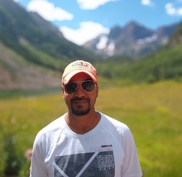
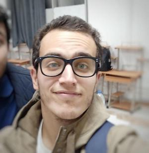
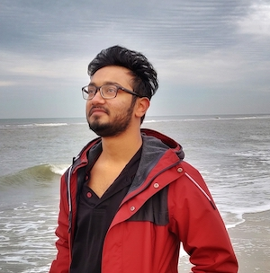
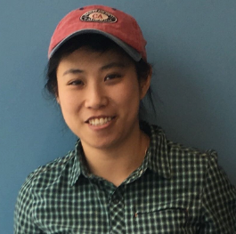
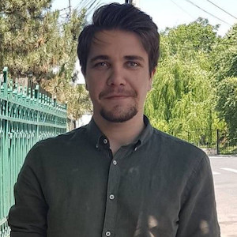
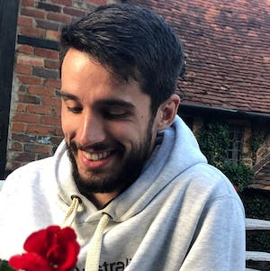
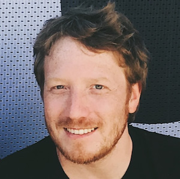
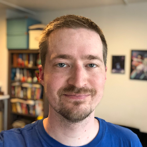

<!-- TODO(a11y): 18 localized body image(s) have empty alt text -->

<figure class="">

</figure>

We’re very excited to announce the recipients of the latest [round of open-source software development grants](https://blog.openmined.org/announcing-the-openmined-pytorch-development-challenges/) in the OpenMined community, generously sponsored by the PyTorch team! Congratulations to **Ajay Singh, Ayoub Benaissa, Varun Khare, Maddie Shang, Mark Jiminez, George-Cristian Muraru, Karl Higley,** **Mike Nolan** and **Vova Manannikov!**

**Thank you to everyone who applied** – we had a huge number of fantastic applicants! You made selecting the final recipients a very tough decision. We hope you’ll apply again in the future, and keep in mind that you are still welcome to get involved with the codebases and projects.

**Interested in receiving a grant in the future?** We are strongly biased toward awarding development grants to individuals who are already contributing to the codebase. The best way to receive one of our grants in the future is to join these great folks in development today!

If you or someone you know may be **interested in sponsoring a grant** like this one, please don’t hesitate to reach out via email – [partnerships@openmined.org](mailto:andrew@openmined.org).

**If you’re interested in getting involved** contact [**@Théo Ryffel**](https://openmined.slack.com/team/UA2LD4PHS) about the [CrypTen](https://github.com/facebookresearch/CrypTen) project, and [**@cereallarceny**](https://openmined.slack.com/team/U6966R9BJ) about the [federated learning project](https://blog.openmined.org/announcing-the-pytorch-openmined-federated-learning-fellowships/).

---

## OpenMined-PyTorch Fellows working on Crypten Integration

The [CrypTen Integration fellowships](https://blog.openmined.org/openmined-pytorch-fellowship-crypten-project/) will focus on integrating the new [CrypTen](https://github.com/facebookresearch/CrypTen) library in PySyft to offer a new backend for highly efficient encrypted computations using secure multi-party computation (SMPC). CrypTen has been released with PyTorch 1.3. It focuses on making encrypted server-to-server SMPC computations as fast as possible. Upon the completion of this project, Crypten will offer PySyft users new ways to run encrypted computation between cloud servers using state-of-the-art crypto protocols.

This project is lead by [****Theo Ryffel****](https://github.com/LaRiffle), the Crypto Team Lead for OpenMined. You may contact Theo with any further questions related to the project on the OpenMined Slack channel (****@Theo Ryffel****).

<figure class="">

<figcaption><strong>OpenMined-PyTorch Grant recipients: George-Cristian Muraru, Ayoub Benaissa, Ajay Singh</strong></figcaption></figure>

### George-Cristian Muraru

I am George-Cristian Muraru, from Bucharest, Romania. Currently I am a student at Politehnica University of Bucharest, pursuing a Master’s Degree in Artificial Intelligence. I finished my Bachelor’s Degree in Computer Science and Engineering at the same university.How I heard about PySyft? A friend told me about it and after that I started doing the tutorials from the repository and took some easy coding tasks. A complete image about the OpenMined community and what is doing I got from Andrew’s talk given at the PyTorch conference. His vision regarding data and privacy and how those two should combine to have “Secure AI” got me more interested in the project.

**Email:** [murarugeorgec@gmail.com](mailto:murarugeorgec@gmail.com)

**Twitter:** [@georgemuraru](https://twitter.com/georgemuraru)

**Facebook:** georgecmuraru

### Ayoub Benaissa

Ayoub Benaissa is pursuing his master degree in computer science, working on the use of homomorphic encryption in deep learning.

**Twitter:** [@y0uben11](https://twitter.com/y0uben11)  
**Github:** [@youben11/](https://github.com/youben11/)  
**LinkedIn:** [Ayoub Benaissa](https://linkedin.com/in/ayoub-benaissa/)

### Ajay Singh

I, Ajay Singh, currently pursuing a Master’s Degree at the University of Texas at Dallas in the field of Computer Science with the focus on Intelligent Systems. I’m fascinated with new technologies and always excited to learn about Machine learning and related technologies.  
I have more than 3 years of Software Developer experience being an Ex-Lucid, Ex-Cyware Labs and Ex-Snapdeal employee.

**Twitter:**  [@ajnovice](https://twitter.com/ajnovice)  
**LinkedIn:** [Ajay Singh](https://www.linkedin.com/in/ajnovice/)

**Congratulations George, Ayoub and Ajay!**

---

## OpenMined-PyTorch Fellows working on Federated Learning

These fellowships will focus on developing “worker libraries”, allowing PySyft code to be executed in other environments like a mobile phone or web browser.

This project is lead by ****[Patrick Cason](https://github.com/cereallarceny)****, the Javascript Team Lead for OpenMined. You may contact Patrick with any further questions related to the project on our OpenMined Slack channel (****@cereallarceny****).

<figure class="">

<figcaption><strong>OpenMined-PyTorch Grant recipients: Varun Khare, Maddie Shang, Mark Jiminez, Karl Higley, Mike Nolan, and Vova Manannikov.</strong></figcaption></figure>

### Karl Higley

Karl is a Brooklyn-based machine learning engineer and software developer. He most recently worked on music recommender systems at Spotify, contributing to personalized experiences including Discover Weekly and the app’s home screen recommendations. His interests include consecure, contextual, and privacy-preserving recommender systems, approximate nearest-neighbor search algorithms, and mobile reverse engineering. He’s currently working to transition the PySyft protocol to Protobuf for improved cross-language and cross-platform communication.

### Vova Manannikov

Software engineer based in St Petersburg, Russia. Got specialist degree in computer engineering in 2006, working professionally since 2004 developing for desktop, web, and cloud. Worked in educational, telecom, and video processing fields. Love learning new stuff, which sometimes results in contributing to open-source projects, like OpenMined.

### Varun Khare

I am an AI enthusiast trying to decipher the principles behind cognition while ensuring the privacy and safety of the people. I graduated in computer science from IIT Kanpur and since then have been working as a visiting scholar at MPI Brain Research Institute, Frankfurt. My predilection also lies in Augmented Reality and Human Computer Interaction.

### Mark Jimenez

Mark has worked as an iOS applications developer for the past 6 years, successfully launching projects like social network and messaging apps. Having seen the tech landscape shift away from mobile, he’s been grinding day-in and day-out learning data engineering and machine learning. For the next chapter in his life, he wants to dedicate his skills to something that can make a difference.

### Maddie Shang

Maddie Shang is the global lead of Data Science and Machine Learning at Women Who Code. She is also an Applied AI Researcher and ML Engineer working in industry. She is currently focused on deep probabilistic models and deep learning in the domain of NLP and knowledge representation learning. When not working towards interactive and reasoning machines, she is focused on solving diversity and inclusion in tech / entrepreneurship, advising startups and goes on adventures in the wilderness and pilots airplanes. Prior to turning her focus on ML, she studied Mathematics at University of Waterloo, completed CFA Level III, taught herself programming and worked in tech as a VC, Founder and Blockchain engineer.

### Mike Nolan

Mike Nolan a software engineer and open source community strategy & AI ethics/transparency consultant working with the UNICEF Innovation Fund to assist in developing sustainable open source community strategies as well as providing guidance on AI ethics & transparency strategies. With work experience stemming from tech companies such as Mozilla and GIPHY to large humanitarian organizations such as the International Rescue Committee and UNICEF, he seeks to blend the best of fast-paced technology development with the policy and rights driven world of humanitarianism.

**Congratulations Varun, Maddie, Mark, Karl, Mike, and Vova!**

---

A final note: ****anyone may apply for an OpenMined fellowship****, however, we will show a strong preference to existing contributors. If you would like to better your chances of receiving a grant, we suggest you pick an issue labeled “good first issue” on the following code repositories (and of course, [Join the Slack](https://blog.openmined.org/p/594b0cc1-76b1-4371-aea1-bf0f77217dc0/slack.openmined.org)):

-   [Syft.js](https://github.com/OpenMined/syft.js/issues) – __the Syft worker for the web (written in Javascript)__
-   [Grid.js](https://github.com/OpenMined/grid.js/issues) – __a WebSocket/HTTPS server connecting PySyft to Syft.js__
-   [PyGrid](https://github.com/OpenMined/PyGrid/issues) – __the main Grid library for hosting PySyft in a cloud environment__
-   [PySyft](https://github.com/OpenMined/PySyft/issues) – _the main Syft library for federated and privacy-preserving machine learning_
-   [KotlinSyft](https://github.com/OpenMined/KotlinSyft) – _the Syft library for Android_
-   [SwiftSyft](https://github.com/OpenMined/SwiftSyft) – _the Syft library for iOS_
-   [SyferText](https://github.com/OpenMined/SyferText) – _a privacy-preserving NLP library based on PySyft_
