<!-- TODO(a11y): 15 localized body image(s) have empty alt text -->

****Congratulations to all of our R**3**Q**1 **Padawan Program Graduates!****‌

We are thrilled to recognize our Graduates of OpenMined’s Padawan Program. Each has participated in a rigorous and intensive 6 weeks of mentorship, learning and contributing to PySyft and Open Source. This graduating cohort consists of 7 talented participants with unique backgrounds, and they represent 7 countries around the globe ?.

OpenMined is a Not-for-profit organization that currently works on encrypted computation in the context of deep learning to provide free user-friendly Privacy Enhancing Technology (PET) tools to the world. OpenMined is determined and committed to fostering the development of the talent pipeline in the PETs space.

The Padawan program has brought together individuals from various fields whose interests and vision are aligned towards the development and deployment of cutting edge technology in the field of PETs. Participants had the chance to contribute to OpenMined’s open source repositories through code, time, and technical challenges.

With increasing requests from partner organizations for talented resources with a good grasp of our PySyft tech stack, they are equipped with knowledge and experience for the deployment of PET solutions within value aligned organizations, government agencies and academic institutions.

<figure class="">

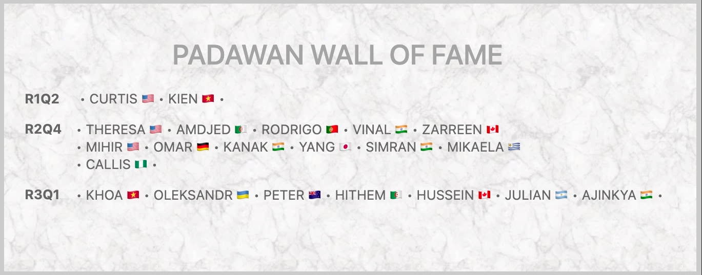

</figure>

## R3Q1 Graduates‌

‌

<figure class="">

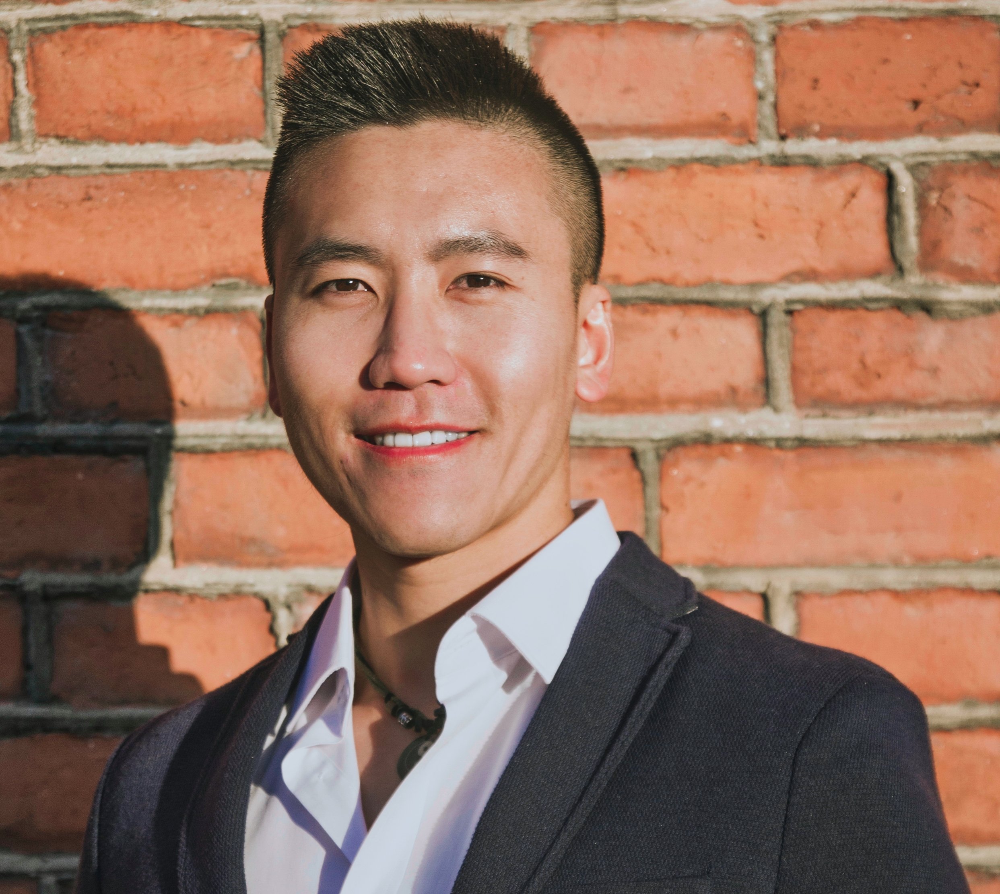

</figure>

**Khoa Nguyen  FINLAND**

[Github](http://github.com/khoaguin)   [LinkedIn](https://www.linkedin.com/in/khoa-duy-nguyen/)  

****Can sync within** Asia **(A**frica & Europe **too)****

Currently I am working as a part-time, fully remote researcher at the Network and Information Security Group at Tampere University, Finland. At the moment, I and my colleagues are trying to build a protocol for privacy-preserving machine learning using hybrid homomorphic encryption, which I have had a lot of fun working on.

Apart from my research, I am working on improving my web development skill to become better at building ML-powered applications. I used to hate web development, especially the front-end side with HTML, CSS as I thought they were a waste of time, and I hated JavaScript as it has some weird things which really annoyed me. However, nowadays I enjoy learning to build websites and seeing the changes to code occur visually in front of my eyes. Currently I am learning the FastAPI and Svelte stack and would love to become a regular contributor to PySyft as it uses the same stack.

I have had a lot of fun experiences during the Padawan program, especially the office sessions with Shubham and Stephen. I love Stephen’s positive energy and Shubham’s problem solving skill, he’s like a wizard. I also had a lot of troubles during the week 5 (Hagrid) which leads to very lengthy but interesting discussions with Andrew and Madhava, but at the end I was able to get it done. Now looking back it was also a memorable experience and I learned a lot by struggling through the problems.

<figure class="">

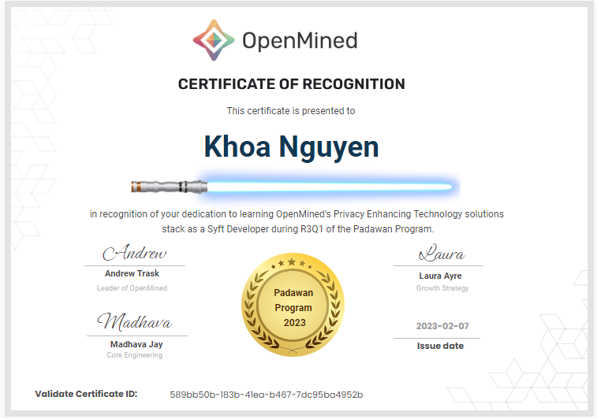

</figure>

---

‌‌

<figure class="">

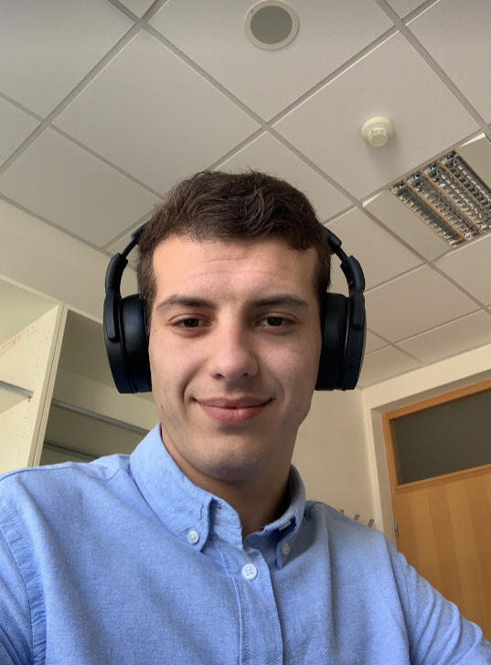

</figure>

**Oleksandr Lytvyn CANADA**

[GitHub](https://github.com/letv3)  [LinkedIn](https://www.linkedin.com/in/oleksandr-lytvyn/)

****Can sync within** North **America (**Africa & Europe **too)****

I am working in the Computer Science field and privacy preserving data science is one of my core interests. The use case on the medical data science is indeed promising, hence it could be applicable in the financial industry as well.  I am also interested in the SMPC and its optimization, so I will probably move in that direction within my research.

Currently, the second semester of my PhD is in progress and I still have to finish several mandatory subjects.

Most memorable for me was how fast and direct communication was in the dagobah slack channel, which was awesome! I wish all courses had the same student-friendly approach.

<figure class="">

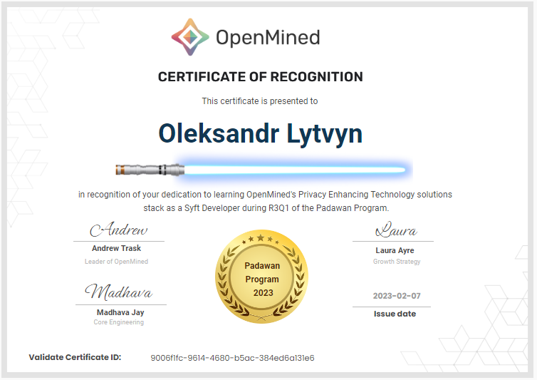

</figure>

---

<figure class="">

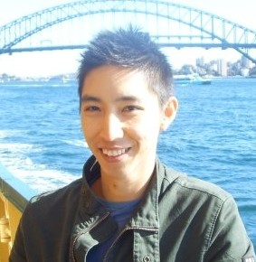

</figure>

**Peter Chung   AUSTRALIA**

[GitHub](https://github.com/PeterChung241)  [LinkedIn](https://www.linkedin.com/in/peterchung241/)

****Can sync within** Pacific **(**North America **too)****

I am an undergraduate student studying computer science at the University of New England Australia and majoring in software development and data science. I have not yet decided how I want to specialize in programming as I have enjoyed everything I have been exposed to so far. When I’m coding, I love listening to electronic music to get into the zone.

So far I have been focusing on completing my studies. I hope to be able to gain some real world experience with software engineering by contributing to OpenMined while learning more about privacy-enhancing technologies.

During week 3 of the Padawan program, I was excited to discover how Syft prevented data mutation and theft.

<figure class="">

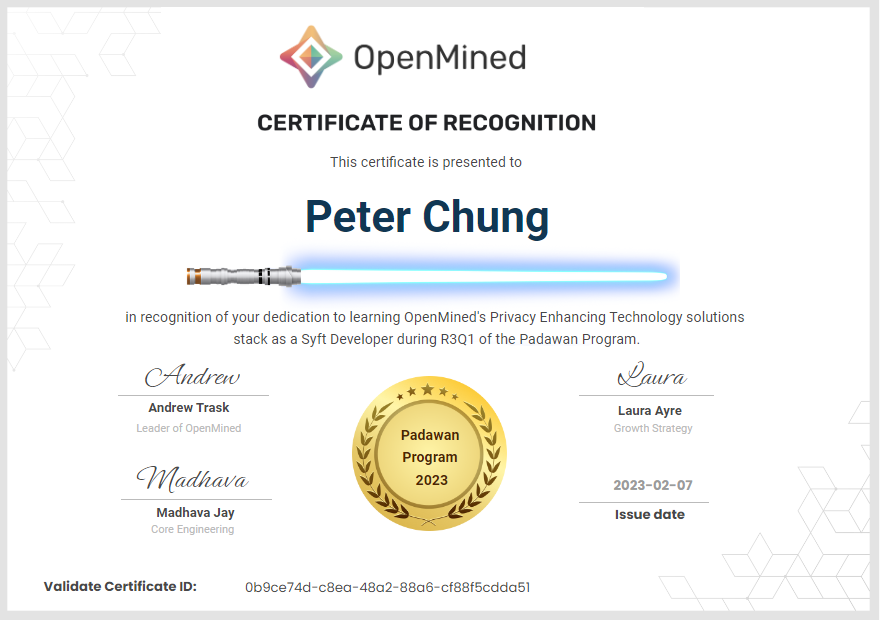

</figure>

---

‌‌

<figure class="">

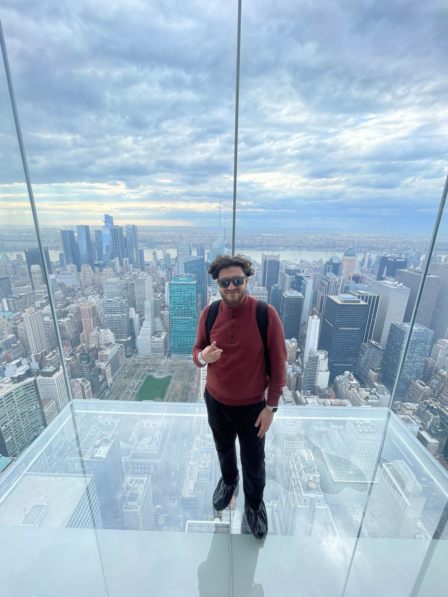

</figure>

**Hussein Lezzaik CANADA**

[GitHub](https://github.com/HusseinLezzaik)  [LinkedIn](https://www.linkedin.com/in/husseinlezzaik/)  [Twitter](https://twitter.com/HusseinLezzaik)

****Can sync within North America** (Pacific too)**

I’m a software engineer with a background in machine learning and robotics. I’ve been involved in AI for a while starting with GANs in 2019 to augment human singers, and now heavily invested in large language models for coding assistance. I’m currently working on a side project OnboardGPT, think ChatGPT but for enterprise codebase assistance. There’s a huge potential to improve the software engineering cycle, and I’m passionate about working on projects where we can outsource boring cognitive tasks to AGIs.

I’m currently building optimization software for the travel industry at IBS Software. It’s still unclear to me what my next adventure will be, but I’ve been feeling FOMO quite hard with the amazing technologies that are being built around Generative AI. There are some exciting generative AI projects that I’m working on (still in stealth), but only time will tell! As they say: “I can either watch it happen or take part of it”.

Everyone at OpenMined is unique in their own way, it was very rewarding to network and collaborate with people of diverse backgrounds from neuroscience to cyber security all across the globe. I’ve built meaningful relationships with amazing people, and it’s as valuable as all the AI privacy knowledge that I’ve learned during the Padawan program!

<figure class="">

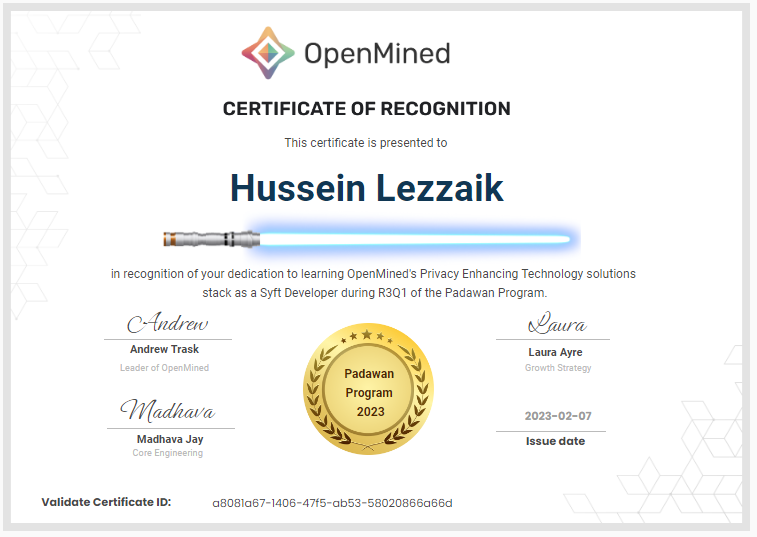

</figure>

‌

---

<figure class="">

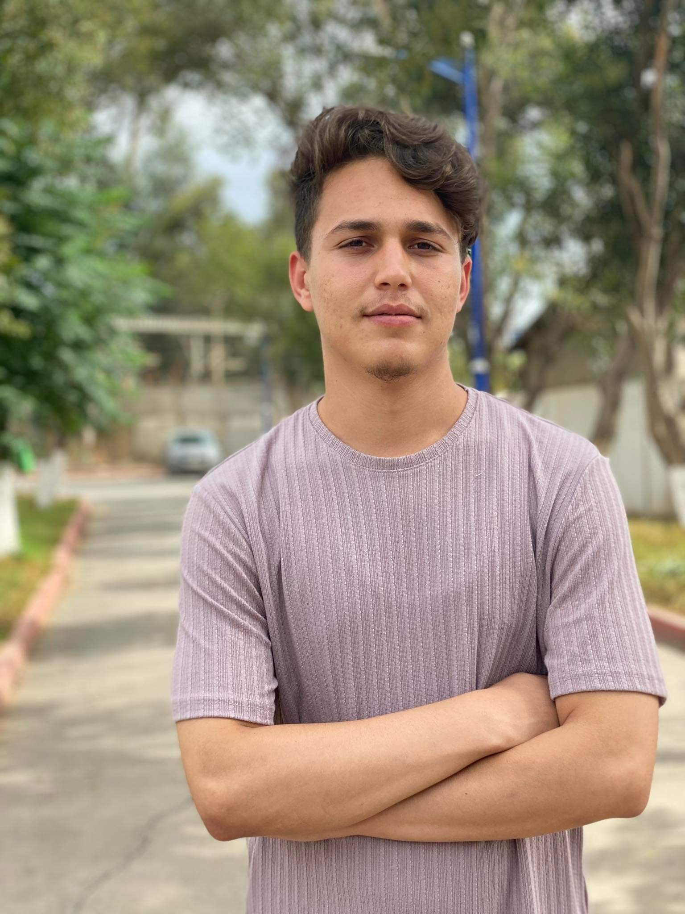

</figure>

**Hithem Lamri  **ALGERIA****

[GitHub](https://github.com/HaithemLamri)  [LinkedIn](https://www.linkedin.com/in/hithem-lamri-a421b21a2/)  [Twitter](https://twitter.com/haithem_lamri)

****Can sync within Africa & Europe (**Nort**h America too)****

I am a final-year computer science student at the Higher National School of Computer Science-ESI ex INI, Algiers, Algeria, a CTF player, and a privacy-preserving machine learning enthusiast. I am currently pursuing my final study project,  under the supervision of Dr. Martin Vallières, at the MEDomics laboratory of the university Of Sherbrooke, in Canada.  Where I am working on federated learning and differential privacy in the healthcare domain, my mission is to build  a new software, by combining Flower which is a model-centric federated learning framework, with Pysyft and Pygrid which are data-centric frameworks, and the Opacus framework to perform a differentially private training mode. By the end, we will make a proof-of-concept with eICU public database and publish a scientific paper about this work.

I’m planning to graduate, and contributing to some PPML open-source frameworks.

<figure class="">

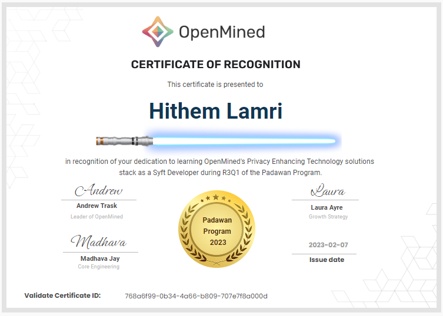

</figure>

---

‌

<figure class="">

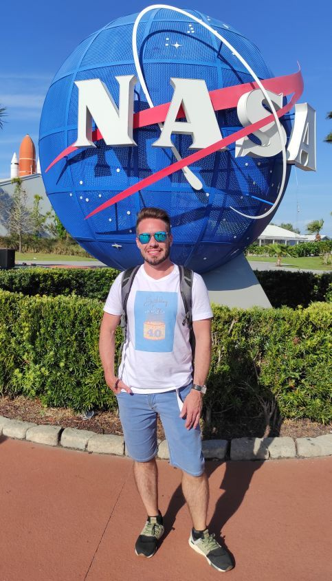

</figure>

**Julian Cardonnet ARGENTINA**

[GitHub](https://github.com/jcardonnet) [LinkedIn](https://www.linkedin.com/in/jcardonnet)

****Can sync within** North America **(**Africa & Europe **too)****

I’ve been a software engineer for over 15 years. For the past decade I’ve specialized in developing data-intensive systems. My primary focus has been on machine learning and data engineering, with a specific emphasis on natural language processing and tabular data but I also dabbled in computer vision and speech recognition. As a lifelong learner, I spend at least a couple of hours every day reading technical books, research papers or taking online courses to expand my knowledge and keep my skills up to date. In particular, during the past few months I’ve been actively exploring Data-Centric AI and ML Ops  to sharpen my abilities in these areas.

I am actively seeking my next opportunity in data science, ideally at a small interdisciplinary engineering team where I can expand my skill set and apply the knowledge and expertise I have acquired over the years to tackle challenging problems.

I really enjoyed the opportunity to discuss the technical details of PySyft  and PyGrid with Ishan and Ionesio during office hours. Their knowledge (and patience with my endless questions) fueled my enthusiasm to continue my journey in PET and explore ways to contribute to the project.

<figure class="">

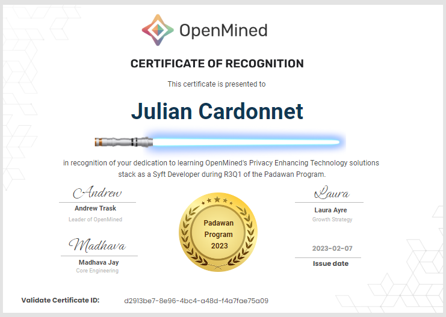

</figure>

---

<figure class="">

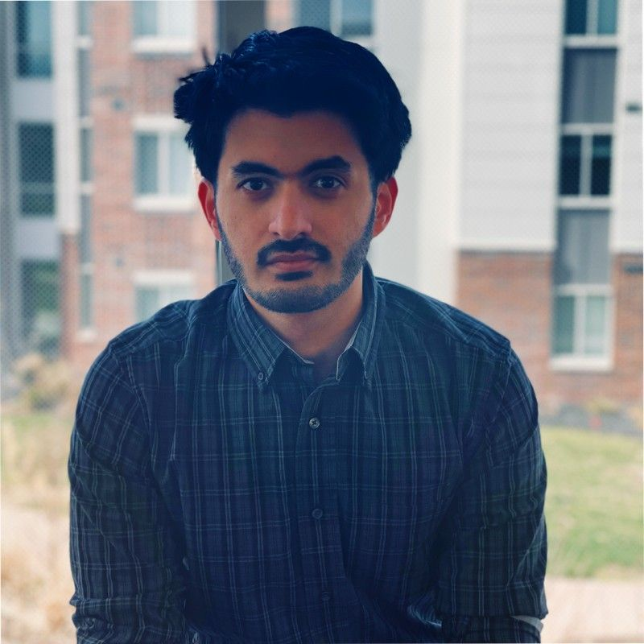

</figure>

**Ajinkya Mulay  USA**

[GitHub](https://github.com/thehimalayanleo)  [LinkedIn](https://www.linkedin.com/in/ajinkyamulay/)  [Website](https://www.ajinkyamulay.com)  [Twitter](https://twitter.com/ajinkya_mulay_)

****Can sync within** North America **(**Pacific **too)****

I am Ajinkya K Mulay, a fifth-year Ph.D. student at Purdue University where I study privacy-preserving Machine Learning. My Ph.D. thesis focuses on combining local differential privacy and Federated Learning to achieve state-of-the-art performance for popular machine learning algorithms. A few other topics that I am interested in include Computational Social Science and Wireless Communications.

In my Ph.D., I explore the convergence of differentially private algorithms under finite samples while maintaining strong performance guarantees. I am also interested in real-world deployments of differential privacy that are strongly performant for vision and language tasks. In computational social sciences, I am developing a general method agnostic to the underlying model, data, and hypothesis that can identify the ideal sample size for experimental studies (such as the impact of alcohol on humans).

I will finish my Ph.D. in Privacy Preserving Machine Learning from Purdue University in December 2023. Post my Ph.D. I will focus on research roles prioritizing private machine learning, optimization, and computational social sciences.

Being able to directly work with real-world privacy deployment technology was really cool! The engineering behind handling privacy in distributed datasets and across machines can be tricky, but learning about PySyft makes it quite a lot easier.

<figure class="">

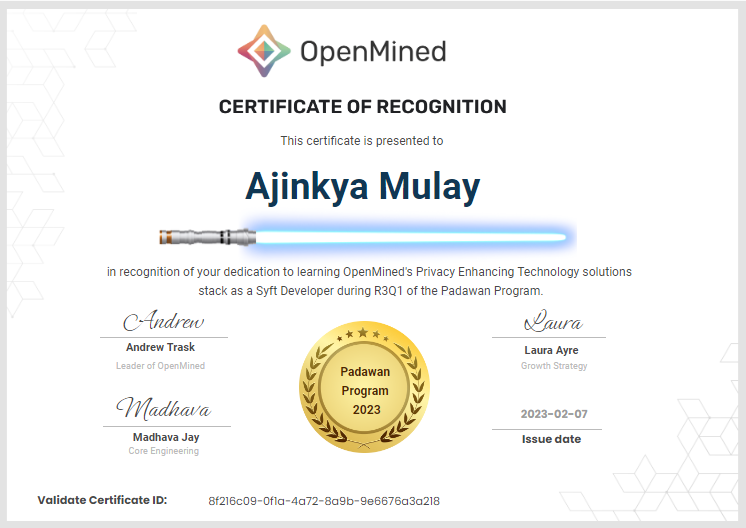

</figure>

---

If you are interested in building Privacy Enhancing Technology software tools, share in our vision & mission, then [consider applying](https://docs.google.com/forms/d/e/1FAIpQLSdBgcz4Sj9ow0vhWsfKP2WMlLAynHB8caPr3eTBp9m6JeeLSA/viewform?usp=sf_link) for a future round.  We review applications on an ongoing basis.
