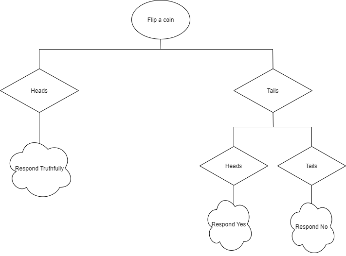

<!-- TODO(a11y): 3 localized body image(s) have empty alt text -->

<!-- TODO(content): giphy embed (verify) -->

“P_rivacy is obtained by the process, there are no “good” or “bad” responses”\[3\]_

<figure class="">

<figcaption><a href="https://www.wikiwand.com/en/Trivium" data-href="https://www.wikiwand.com/en/Trivium" class="markup--anchor markup--figure-anchor" rel="noopener" target="_blank">Allegory of Grammar and Logic/Dialectic. Perugia, fontana&nbsp;magiore.</a></figcaption></figure>

In the digital age, privacy-preserving data analysis has become one of the most widely discussed topics across multiple disciplines. With the increase in data that includes sensitive details of individuals in the digital environment, there is a need for a mathematically strong privacy guarantee/assurance. Let’s suppose that we need to make an analysis on the dataset which includes individual information. If we mention a statistical database that includes sensitive data, then we should hear about the “query release problem”. Remember the Netflix Prize dataset \[1\] which was very successful to improve the existing recommendation system. Since the ad hoc anonymization was not successful enough, Narayanan & Shmatikov were able to re-identify individuals in the dataset \[2\]. So, in a “query release problem”, there are queries that need to be implemented in a private manner by protecting sensitive data?. Differential privacy was born as a result of such a need. This blog post addresses one of the key notations of differential privacy: Randomised Response.

### 🚀Let’s build the bridge with Privacy

An early example of privacy by a randomized process is the randomized response which is developed in the social sciences to collect statistical information about disgraceful or unlawful behavior\[3\]. The concept is somewhat similar to [plausible deniability](https://www.wikiwand.com/en/Plausible_deniability). Randomized response is an approach that allows respondents to answer sensitive matters by providing confidentiality. The magic in this case is that the question is answered by chance: maybe truthfully, yes? no?…regardless of the truth… It was first proposed by S. L. Warner [\[4\]](https://www.wikiwand.com/en/Randomized_response#citenote1) and studied by B. G. Greenberg by modifying\[5\].

<figure class="">

<video src="/blog/randomized-response-in-privacy/giphy.mp4" autoplay loop muted playsinline></video>

</figure>

Let’s explain it in a classical way. Ask a specific question to someone and request that they flip a coin before answering.So, the rule is : if the coin comes up tails, the answer will be “yes”; but if it comes up heads it will be answered truthfully(or vice versa). Only the respondent will know whether his answer reflects the truth or not. The important thing here is to assume that people who get heads will answer truthfully.

The same approach is captured by having property P in Privacy. The participants are asked whether they have P property or not. The algorithm path is shown in Figure 1. It clearly seems that “plausible deniability” protects each record in the database. It is because we have no clue why the response of the query is “Yes” or “No”. It might be “Yes” just for that it is the right response or it might be “Yes” according to a random coin flip.

<figure class="">

<figcaption>Figure 1</figcaption></figure>

So how can we apply it practically in a privacy problem? I would like to give an example from [Andrew Trask’s Secure and Private AI](https://www.udacity.com/course/secure-and-private-ai--ud185) course. Let’s see how we can implement differential privacy using randomized response 💡

As we have emphasized at the beginning, the randomized response is one of the essential concepts of differential privacy. But, how come? Why do we need it? Let’s elaborate on it🤿

When we talk about Differential Privacy, we mention two subtitles: Local Differential Privacy and Global Differential Privacy. This means that we can implement DP at two different levels. Here, we will talk about the randomized response while we describe the local differential privacy.

As the name suggests, Local Differential Privacy guarantees privacy at the local level since noise is added to each individual’s data before sending them to a statistical database. The most critical point is the amount of noise to add. It is because DP requires a kind of randomness by adding  noise to the query. At this point, we will talk about the randomized response. As we have touched upon above, it is an approach used in social sciences. It provides randomness to protect each individual with plausible deniability. So what is the intuitive approach behind it? Assume you pose a question to a group of people, the answer to which reveals a hint about a type of taboo behaviour. If you follow the algorithm seen in Figure 1, you will see that people might say “_yes_” for the sake of the random coin flip. This demonstrates how it introduces randomness.

To implement a randomized response to a database, we will simply use a binary random generator representing “flip coin”. According to Figure 1; If the first coin is “heads”, the entry database will remain as it is. However, if the first coin is “tails”, then, we will decide according to the second flip coin**.** That is the plausible deniability! Let’s perform a mean query on the original database and modified (noise augmented) database. Let’s see how the results will come out.

Firstly, we will create a database and parallel databases. Here, the following question may come to mind: Why should I create a parallel database? The answer is totally about the definition of differential privacy. Differential Privacy focuses on whether the output of the query changes if the one record is removed from the database.

<figure class=""><pre><code class="language-Python">def get_parallel_db(db,remove_index):
	return torch.cat((db[0:remove_index],db[remove_index+1:]))

num_entries=5000

def get_parallel_dbs(db):
	parallel_dbs = list()
    for i in range(len(db)):
    	pdb=get_parallel_db(db,i)
        parallel_dbs.append(pdb)
    return parallel_dbs
    
 def create_db_and_parallels(num_entries):
    db=torch.rand(num_entries) &gt; 0.5
    pdbs=get_parallel_dbs(db)
    return db,pdbs
</code></pre><figcaption>generates random database</figcaption></figure>

Suppose that we run a mean query. To see differences clearly, we will run the query on the original database and the noised database(we will call it an augmented database as well).

In our case, we want to add noise to the data itself which is namely local differentially. Noise adding corresponds to replacing some of the values in the database with random ones. This is what the randomized response does.

According to the scenario, we need to flip two coins for the randomized response approach. When you run _first\_coin\_flip,_ you will see that you have the coin flip for each value in the original database.

<figure class=""><pre><code class="language-python">first_coin_flip= (torch.rand(len(db))&gt;0.5).float()</code></pre><figcaption>flipping the first coin</figcaption></figure>

At this point; the first coin flip will provide us with a decision for the second coin flip. Let’s say “_1_” corresponds to heads, while “_0_” corresponds to tails.

<figure class=""><pre><code class="language-python">second_coin_flip= (torch.rand(len(db))&gt;0.5).float()</code></pre><figcaption>flipping the second coin</figcaption></figure>

So if the first coin flip is one, we will use the value from the original database. In another way, this means the honest answer. To achieve this, we will run a kind of masking operation.

<figure class=""><pre><code class="language-python">db.float()*first_coin_flip</code></pre><figcaption>honest_answer</figcaption></figure>

Because of the plausible deniability, sometimes we will need to lie in a random way. Remember that If the coin is tails, you will flip the second coin. So, _zeros_ in the first coin flip require the second coin flip.

<figure class=""><pre><code class="language-python">(1-first_coin_flip)*second_coin_flip.float()</code></pre><figcaption>dishonest_answer</figcaption></figure>

We have one step left to obtain our differentially private database. All of this process helps us to create a noisy database which we will call it as an augmented database later.

At this point, it might be helpful to explain the intuition of the augmented\_database formulation. While we obtain our differentially private databases, we also do something meaningful in terms of statistics. Suppose that having P property corresponds to engaging in an illegal behavior\[1\]. It means that, because of the plausible deniability, even a “yes” answer is not accusatory. It comes from randomization with a probability at least 1/4. Let’s say p is the true fraction of participants having property P, in that case, the expected number of “yes” answers is (1/4)(1-p)+(3/4)p \[3\].

<figure class=""><pre><code class="language-python">augmented_database=db.float()*first_coin_flip+(1-first_coin_flip)*second_coin_flip.float()</code></pre><figcaption>augmented_database</figcaption></figure>

Before obtaining differentially private results, we need to compute and deskew the output. As you remember, half of our values come from the _first\_coin\_flip_ which is truly one. And half of our values come from _second\_coin\_flip_ which is skewed output. The noise causes a shift in the result which is not desired. So we need to deskew the result by removing the skewed result. Finally, this will give a differentially private result.

<figure class=""><pre><code class="language-python">dp_result = torch.mean(augmented_database.float())*2-0.5
</code></pre><figcaption>deskewed result</figcaption></figure>

To wrap up, we are about to finalize the first blog post of the Differential Privacy Series. In this blog post, we talked about the randomized response which is a key concept of differential privacy. Also, we practiced a randomized response on a toy dataset.

?**You can also find the notebook of this blog post [here](https://colab.research.google.com/drive/12yaA7UIgsDMgd5MHKKKo-MdAPBptGbyA?usp=sharing).**

### Acknowledgements

?Thank you very much to Divya Dixit and Abinav Ravi for their review

## References

\[1\]Gaboardi, M., Arias, E. J. G., Hsu, J., Roth, A., Wu, Z. S. (2014). Dual query: Practical private query release for high dimensional data. In E. P. Xing, T. Jebara (Eds.) Proceedings of the 31st international conference on machine learning, proceedings of machine learning research, vol. 32, pp. 1170–1178. PMLR, Bejing, China.

\[2\]Narayanan, A. and Shmatikov, V. Robust de-anonymization of large sparse datasets. In IEEE Symposium on Security and Privacy (S&P), Oakland, California, pp. 111–125, 2008.

_\[3\] Dwork,C., Roth, A(2014). “The Algorithmic Foundations of Differential Privacy”.Foundations and Trends in Theoretical Computer Science Vol. 9, Nos. 3–4 (2014) 211–407. DOI: 10.1561/0400000042_

\[4\] _Warner, S. L. (March 1965). “Randomised response: a survey technique for eliminating evasive answer bias”._ [_Journal of the American Statistical Association_](https://www.wikiwand.com/en/Journal_of_the_American_Statistical_Association)_._ [_Taylor & Francis_](https://www.wikiwand.com/en/Taylor_%26_Francis)_. 60 (309): 63–69._ [_DOI_](https://www.wikiwand.com/en/Doi_%28identifier%29)_:_[_10.1080/01621459.1965.10480775_](https://doi.org/10.1080%2F01621459.1965.10480775)_._ [_JSTOR_](https://www.wikiwand.com/en/JSTOR_%28identifier%29) [_2283137_](https://www.jstor.org/stable/2283137)_._

\[5\] _Greenberg, B. G.; Abul-Ela, Abdel-Latif A.; Simmons, Walt R.; Horvitz, Daniel G. (June 1969). “The Unrelated Question Randomised Response Model: Theoretical Framework”._ [_Journal of the American Statistical Association_](https://www.wikiwand.com/en/Journal_of_the_American_Statistical_Association)_._ [_Taylor & Francis_](https://www.wikiwand.com/en/Taylor_%26_Francis)_._ **_64_** _(326): 520–39._ [_DOI_](https://www.wikiwand.com/en/Doi_%28identifier%29)_:_[_10.2307/2283636_](https://doi.org/10.2307%2F2283636)_._ [_JSTOR_](https://www.wikiwand.com/en/JSTOR_%28identifier%29) [_2283636_](https://www.jstor.org/stable/2283636)_._
