<!-- TODO(a11y): 19 localized body image(s) have empty alt text -->

<!-- TODO(content): gallery (flattened to images — verify); show_gradient_in_listing_areas set (listing-card gradient — needs handling) -->

## Executive Summary

OpenMined was honored to participate in the [AI Action Summit](https://www.elysee.fr/en/sommet-pour-l-action-sur-l-ia) held at the Grand Palais in Paris on February 10-11. The Summit was co-chaired by the governments of France and India and attended by approximately 90 government representatives at the Heads of State, Ministerial, and Administrative levels.

Our work with the [Christchurch Call Initiative on Algorithmic Outcomes (CCIAO)](https://www.christchurchcall.org/christchurch-call-initiative-on-algorithmic-outcomes/) was featured as one of 50 innovative projects selected by the Paris Peace Forum to be showcased at the Summit. Our Executive Director, Andrew Trask, and Head of Policy, Lacey Strahm, represented our project, “[A Technical Solution for Algo-Transparency](https://parispeaceforum.org/projects/a-technical-solution-for-algo-transparency/),” to government and industry leaders, highlighting the global significance of our work in algorithmic transparency and online safety.

<figure class="wp-block-image size-full">

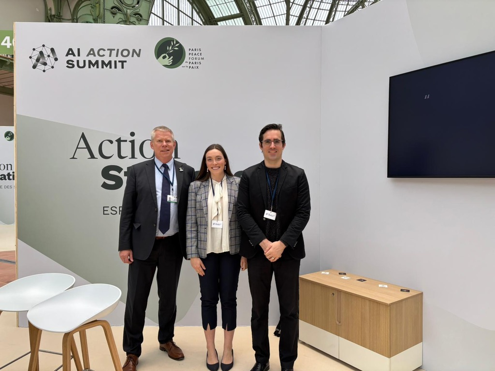

</figure>

<figure class="wp-block-image size-full">

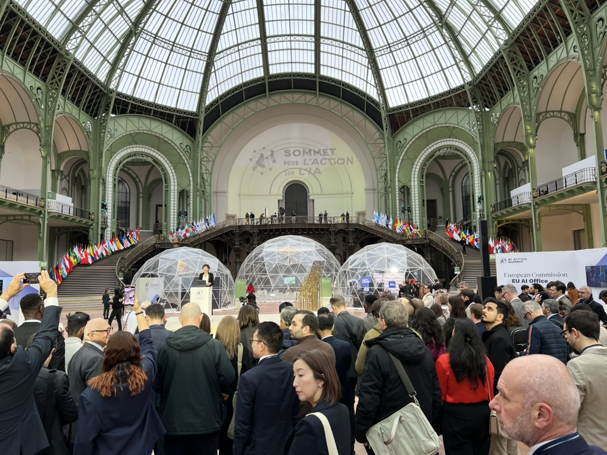

</figure>

Among the notable announcements at the Summit was the launch of [Current AI](https://www.currentai.org/), a new foundation for public interest AI backed by an initial $400 million in funding. The Summit also saw the introduction of [ROOST](https://roost.tools/) (Robust Open Online Safety Tools), a nonprofit consortium dedicated to making online safety tools more open and accessible. We are pleased the [Christchurch Call has partnered](https://www.christchurchcall.org/christchurch-call-partners-with-roost-for-open-source-ai-tools-to-tackle-tvec/) with ROOST to combat terrorist and violent extremist content. Finally, the President of France, Emmanuel Macron, [announced €109 billion](https://www.lemonde.fr/en/economy/article/2025/02/10/ai-with-the-announcement-of-a-109-billion-investment-macron-intends-to-take-on-the-us_6737985_19.html) of private investment into AI infrastructure in France.

In addition to the main Summit itself, OpenMined representatives were able to attend numerous meetups and side events in the days leading up to and following the Summit. It was deeply inspiring to engage with the global AI community and learn about the many exciting and important projects and initiatives around the world to support trustworthy and responsible AI development and adoption. We discuss some of our highlights from the week below.

## Summit Lead-Up Events — Feb. 5th

As an active member of the [AI Alliance](https://thealliance.ai/), we were particularly excited to participate in discussions about the Alliance’s new [Open Trusted Data Initiative (OTDI)](https://thealliance.ai/core-projects/open-trusted-data-initiative). On February 5th, OpenMined’s Dave Buckley attended a [meetup](https://lu.ma/vejv8xcx?tk=rcUp9P) at Meta’s Paris office, where Alliance members presented their vision for the OTDI. The initiative seeks to create publicly available, permissively licensed data with built-in provenance and transparency features. Through discussions with attendees, we explored how licensing, provenance, and attribution could be meaningfully implemented in practice and how tools such as [Syft](https://openmined.org/get-started/) could potentially be leveraged to extend the initiative from fully open data to also include high-value, sensitive, nonpublic data assets.

We were delighted to see OTDI subsequently announced as a flagship initiative of the Current AI foundation. Furthermore, it was encouraging to see an [open letter](https://www.currentai.org/latest-updates/openletter) by industry leaders supporting the establishment of Current AI. In the letter, they emphasize the importance of “ensuring that high-value datasets are accessible in a privacy-preserving and safe way”. This was further underscored later in the week during an AI Alliance dinner, which featured fireside conversations with Yann LeCun and Eric Schmidt, both highlighting the need for trustworthy data and the importance of open-source software to the AI ecosystem. We look forward to collaborating with the community on this initiative moving forward, bringing OpenMined’s deep expertise in privacy-preserving data access and governance to bear.

<figure class="wp-block-image size-full">

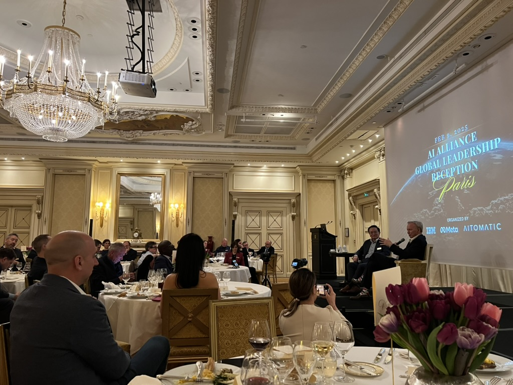

</figure>

<figure class="wp-block-image size-large">

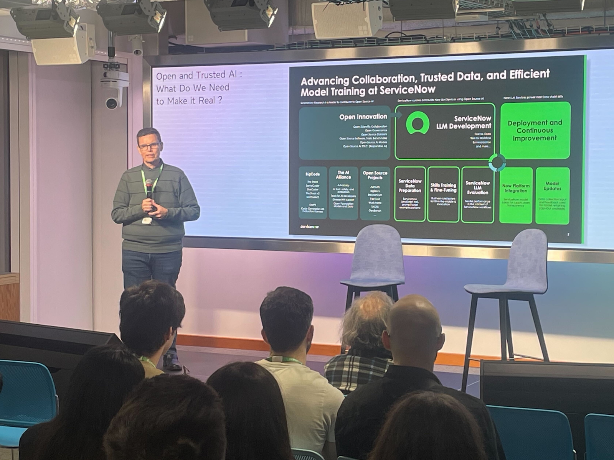

</figure>

## Science Days — Feb. 6th & 7th

The Summit’s Science Days provided valuable opportunities for engaging with the broader AI research community. We were invited to participate in [The Inaugural Conference of the International Association for Safe and Ethical AI](https://www.iaseai.org/conference) at the headquarters of the OECD. We also attended the [AI, Science and Society](https://aiconference.ip-paris.fr/) conference at the Institut Polytechnique de Paris. These events featured a series of world-leading experts in AI development, governance, and policy. Highlights included Yoshua Bengio presenting the first [International AI Safety report](https://assets.publishing.service.gov.uk/media/679a0c48a77d250007d313ee/International_AI_Safety_Report_2025_accessible_f.pdf), and Danielle Allen speaking on the concept of [pluralism in AI](https://youtu.be/jiEiIhOArwI?feature=shared&t=15801).

<figure class="wp-block-image size-full">

</figure>

<figure class="wp-block-image size-large is-resized">

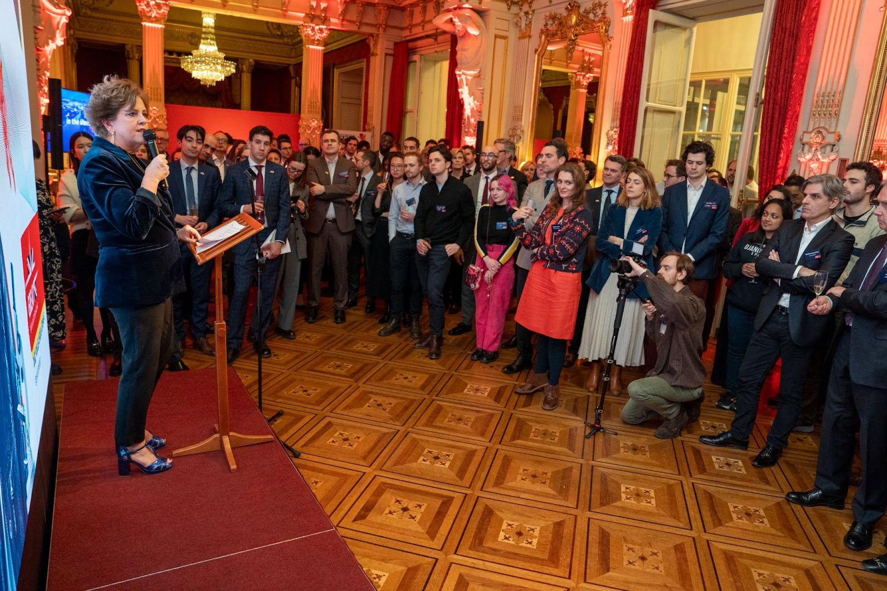

</figure>

A highlight of the week was our participation in the “AI for Growth” reception at the British Embassy, where discussions centred on the potential of AI to be responsibly deployed to foster economic growth and social good in the UK and France. The event featured speakers from Mistral AI, Microsoft, the UK’s Parliamentary Under-Secretary of State for AI and Digital Government, and the British Ambassador to France. We believe that realising these ambitions for growth depends on creating effective data governance infrastructure that can safely unlock the value of high-value datasets for AI, and we greatly value the opportunity this event presented to discuss this with government representatives. We extend our thanks to techUK for inviting us to the reception.

We were also grateful to be invited to an event by the Centre for the Governance of AI exploring the role of third parties in AI safety frameworks. This was another excellent opportunity to engage with leading experts in AI governance, and showcase our work building technical governance infrastructure with [EleutherAI](https://openmined.org/blog/third-party-evaluation-to-identify-risks-in-llms-training-data/), [Anthropic, UK AISI](https://openmined.org/blog/secure-enclaves-for-ai-evaluation/), and the [Christchurch Call](https://openmined.org/blog/new-research-shows-promise-for-safe-secure-private-auditing-of-social-media-algorithms/).

## Cultural Weekend and Pre-Summit Events — Feb. 8th & 9th

The Cultural Weekend offered an array of events and exhibitions taking place across the city. We attended the [Participatory AI Research and Practice Symposium](https://pairs25.notion.site/) at Sciences Po, organised by Connected by Data. This showcased a number of projects exploring participatory and democratic approaches to AI, from data collection, to model training, to post-deployment auditing. The following day, we attended the [AI and Society House](https://www.humane-intelligence.org/ai-society-house-2025), organised by US Science Envoy for AI Rumman Chowdhury’s Humane Intelligence. This event featured a host of excellent panels covering a breadth of topics including AI safety, journalism in the age of AI, and fundraising for public good AI. We were particularly excited to see the public launch of Humane Intelligence’s new platform for model red teaming.

Our Executive Director, Andrew Trask, attended several AI safety and security events, including [AI Safety Connect 2025](https://www.aisafetyconnect.com/) and the [Paris AI Security Forum ‘25](https://aisecurity.forum/paris-ai-security-forum-25), where policymakers, AI Safety researchers, frontier labs, and other relevant stakeholders gathered to discuss solutions for safe and secure AI.

Our Head of Policy, Lacey Strahm, attended the AXA & Stanford HAI Paris AI Action Summit Reception featuring conversations with Stanford University’s Dr. Fei Fei Li and Anne Bouveret, the French President’s special envoy to the Summit.

<figure class="wp-block-image size-full">

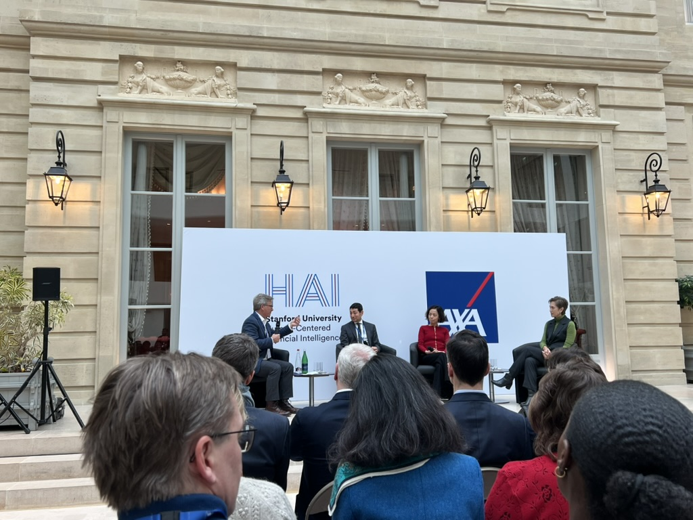

</figure>

<figure class="wp-block-image size-full">

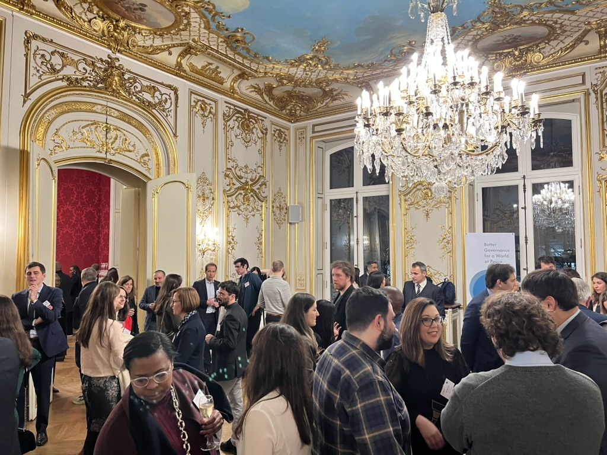

</figure>

## Main Summit and Side Events — Feb. 10th & 11th

Day 1 of the Summit program delivered a rich array of conferences, round tables, and presentations highlighting diverse solutions made possible by AI. The programming kicked off with Stanford University’s Dr. Fei Fei Li delivering a keynote on “Frontier AI, beyond large language models?” followed by a panel tackling one of the most pressing issues of our time: leveraging AI to protect democracies through enhanced cybersecurity, privacy, and information integrity. The panel brought together diverse perspectives from Nighat Dad of the Digital Rights Foundation, Marie-Laure Denis from France’s Privacy Authority, OECD Secretary General Mathias Cormann, Signal’s Meredith Whittaker, and Microsoft President Brad Smith. A particular highlight was the morning session on safe and trustworthy AI development, where Anthropic CEO Dario Amodei shared the stage with renowned AI researcher Yoshua Bengio and RAND Europe’s Sana Zakaria. Their discussion of the collaborative EU Code of practice revealed promising frameworks for responsible AI advancement while acknowledging the challenges ahead. After lunch, the focus shifted to AI’s broader societal impact. Reid Hoffman, Co-Founder of LinkedIn and Inflection AI, engaged in a compelling dialogue with Mozilla Foundation’s Nabiha Syed about competition and investment in AI for the public interest. Their conversation challenged conventional thinking about how we might align commercial interests with societal good. The conference concluded powerfully with a forward-looking panel featuring Huggingface CEO Clément Delangue, McGovern Foundation President Vilas Dhar, and Data & Society Executive Director Janet Haven, moderated by Martin Tisné, exploring pathways toward public interest AI that are both resilient and open. Throughout the day, one theme became increasingly clear: the future of AI depends not just on technological breakthroughs but on thoughtful collaboration across sectors to ensure these powerful tools benefit humanity broadly. 

<figure class="wp-block-gallery has-nested-images columns-default is-cropped wp-block-gallery-2 is-layout-flex wp-block-gallery-is-layout-flex"><figure class="wp-block-image size-large">

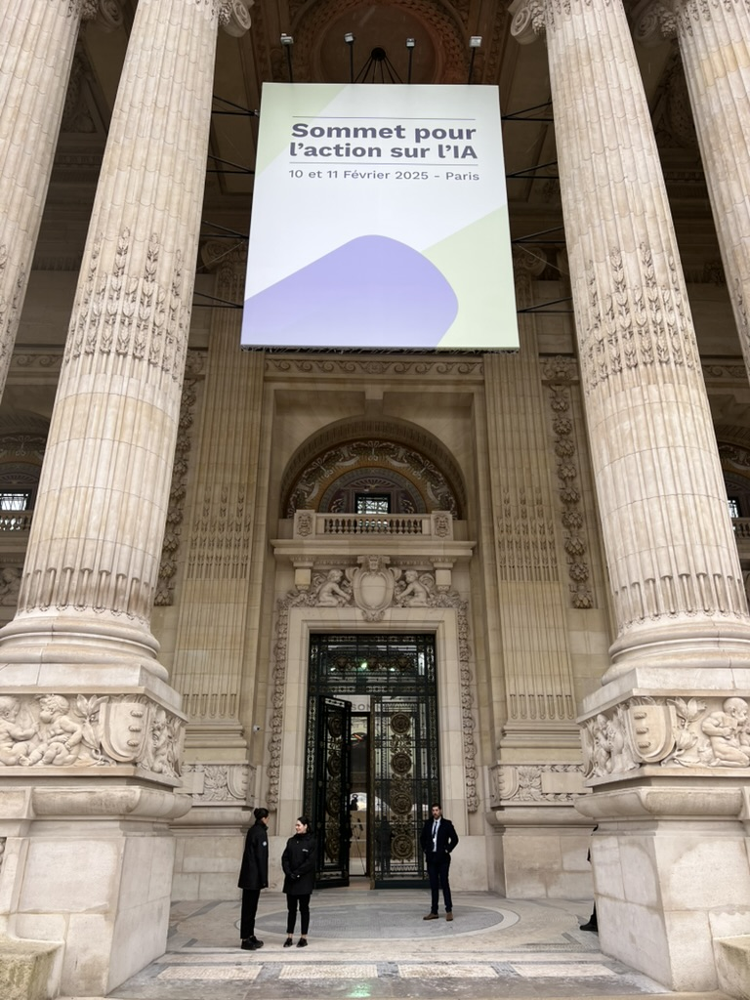

</figure><figure class="wp-block-image size-full">

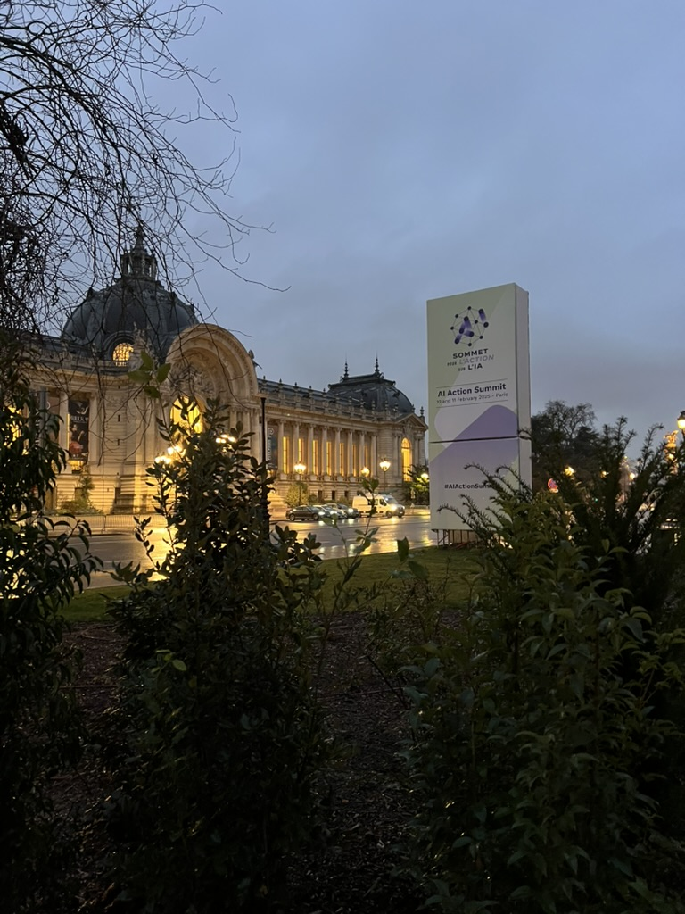

</figure><figure class="wp-block-image size-full">

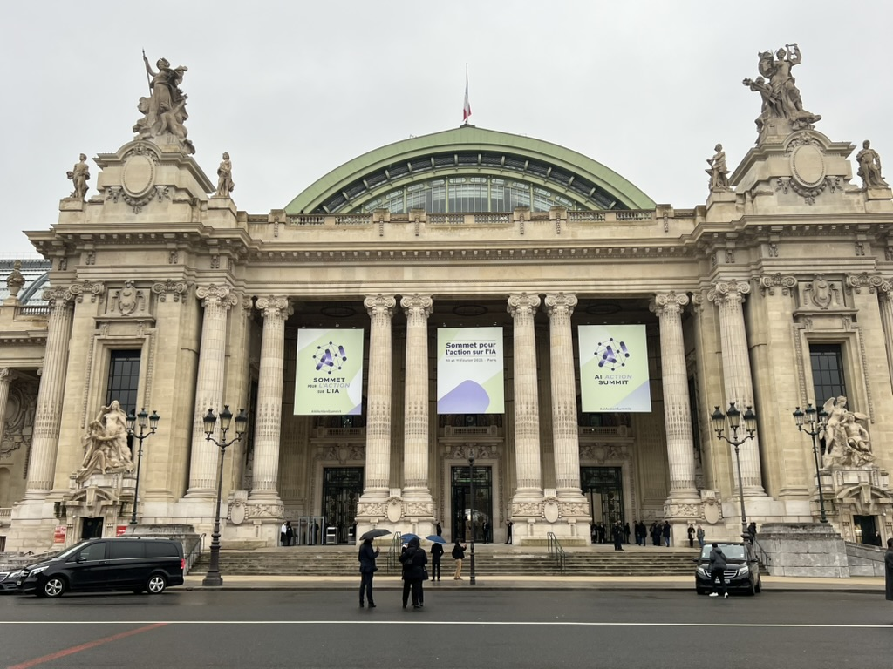

</figure></figure>

<figure class="wp-block-image size-large is-resized">

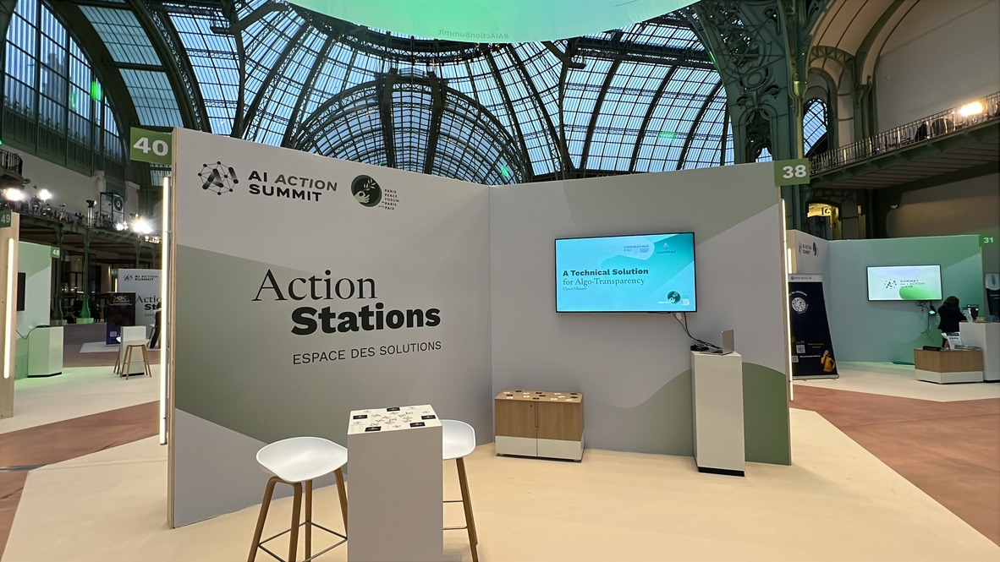

</figure>

In addition to the main Summit programming, we attended a number of side events around the city. Firstly, Senior Policy Manager, Dave Buckley, participated in a roundtable discussion organised by the Datasphere Initiative entitled [“Advancing global AI governance: Exploring adaptive frameworks and the role of sandboxes”](https://www.thedatasphere.org/wp-content/uploads/2025/02/France-AI-Summit-Event-ICC-and-Datasphere-10022025.pdf) where he spoke to OpenMined’s work facilitating meaningful AI governance in practice through the deployment of our technical governance infrastructure. This discussion included representatives from Microsoft, the Alan Turing Institute, Singapore’s IMDA, Japan’s Ministry of International Affairs, and the OECD, amongst others.

<figure class="wp-block-image size-large">

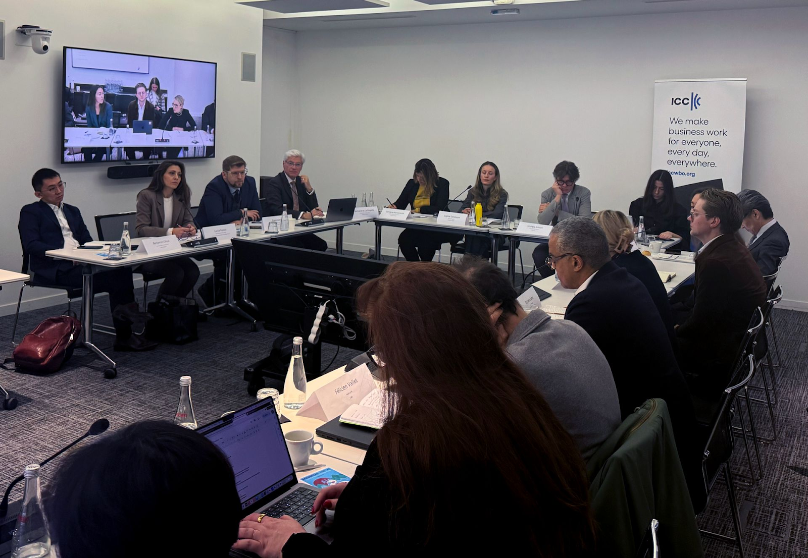

</figure>

<figure class="wp-block-image size-full is-resized">

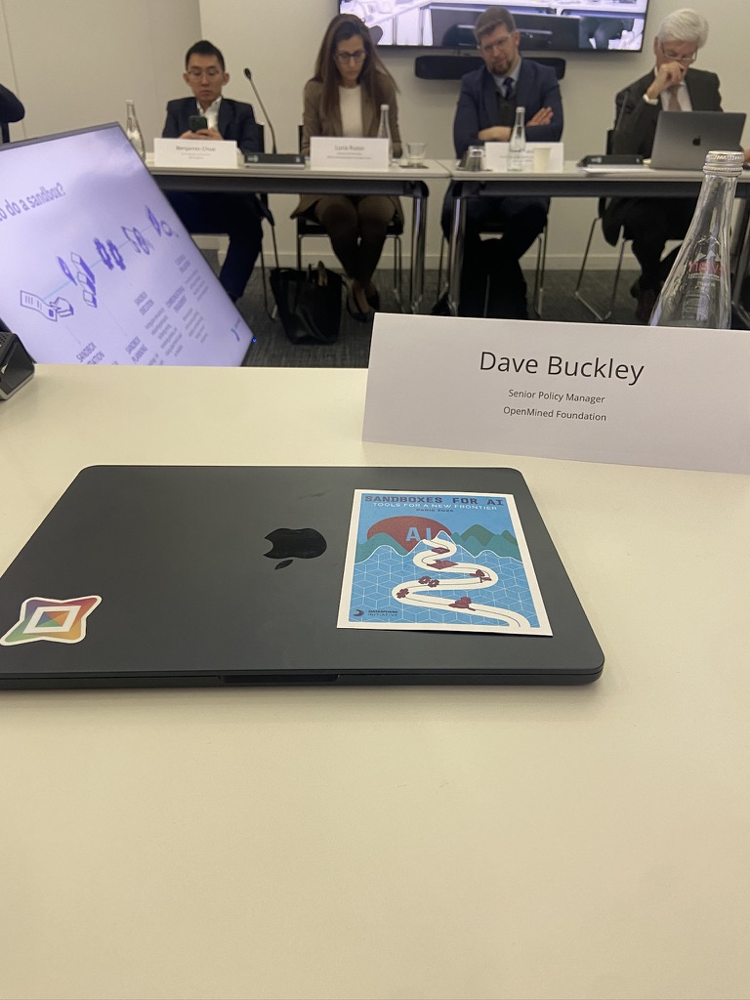

</figure>

Dave also attended several [_“AI in the City”_](https://www.ai-inthecity.ens.psl.eu/en/) events at the École Normale Supérieure. One of these events was a public discussion organized by the Frontier Model Forum on [Securing the Future of AI: Harmonizing Frameworks and Approaches](https://www.ai-inthecity.ens.psl.eu/en/programme/67989ac286629481610c4f33). The discussion included experts from OpenAI, Meta, Anthropic, Microsoft, METR, and SaferAI to discuss global standardization efforts for AI safety and security. Another event [convened leading public AI infrastructure builders](https://www.ai-inthecity.ens.psl.eu/en/programme/67892dde5474c438e5a4c5b0) from Sweden, Finland, Spain, Switzerland, Germany, and France to amplify early progress and align on the crucial next steps needed to support the development of public AI infrastructure. The event was convened by the [Public AI network](https://publicai.network/), a collaboration between Chatham House, Stichting Internet Archive, Aspen Digital, AI Objectives Institute, Public Knowledge, Metagov, and Open Future to bring about public AI.

<figure class="wp-block-gallery has-nested-images columns-3 is-cropped wp-block-gallery-3 is-layout-flex wp-block-gallery-is-layout-flex"><figure class="wp-block-image size-large">

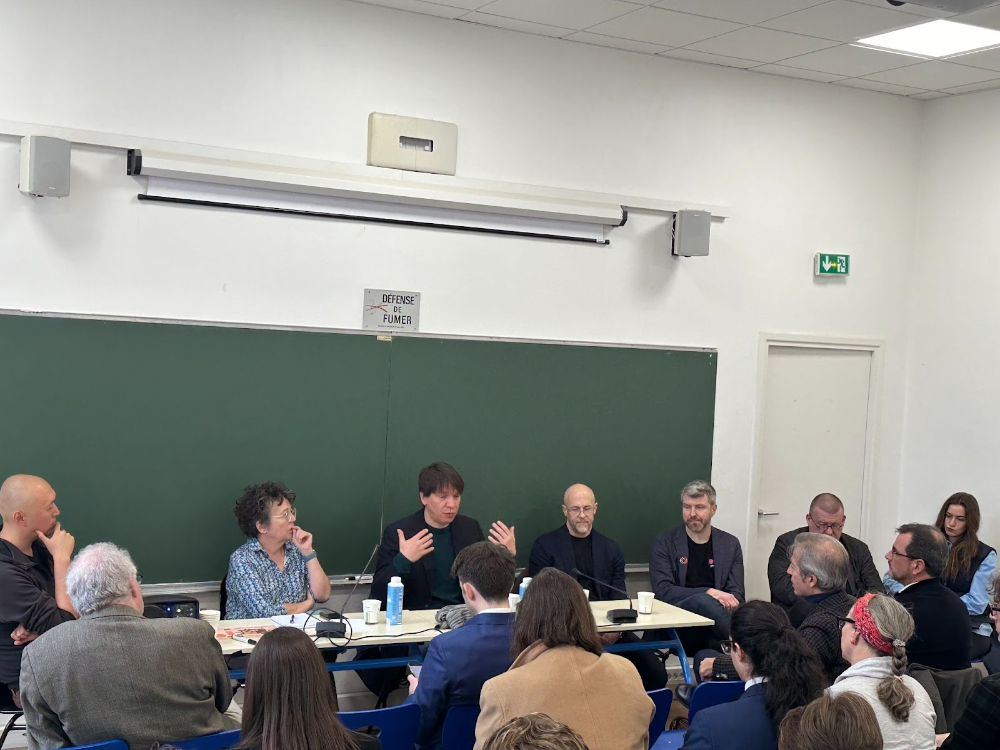

</figure><figure class="wp-block-image size-large">

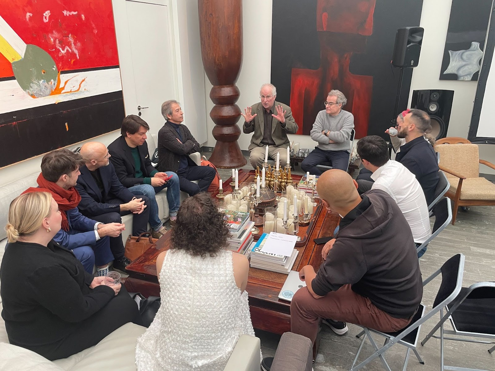

</figure><figure class="wp-block-image size-large">

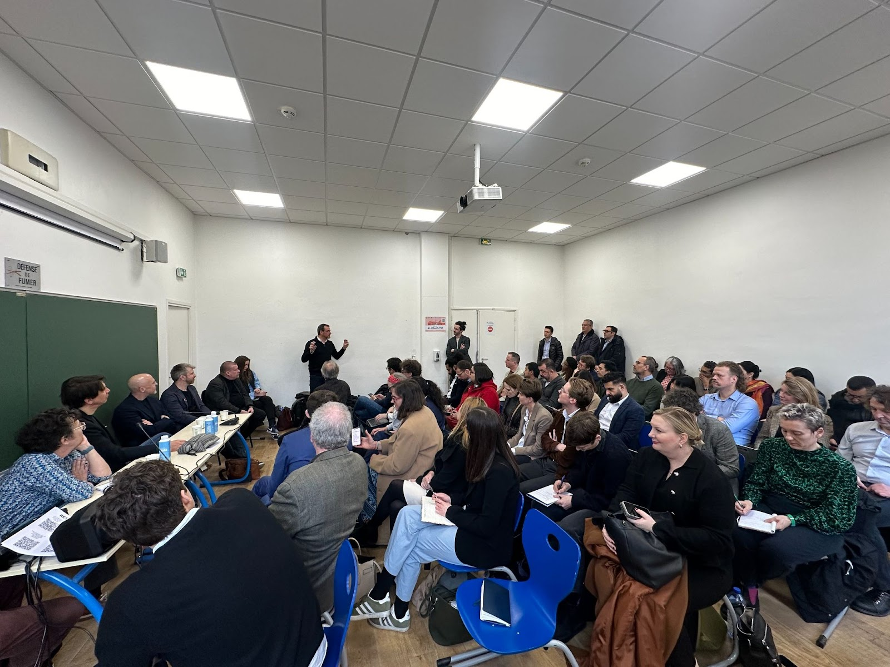

</figure><figure class="wp-block-image size-large">

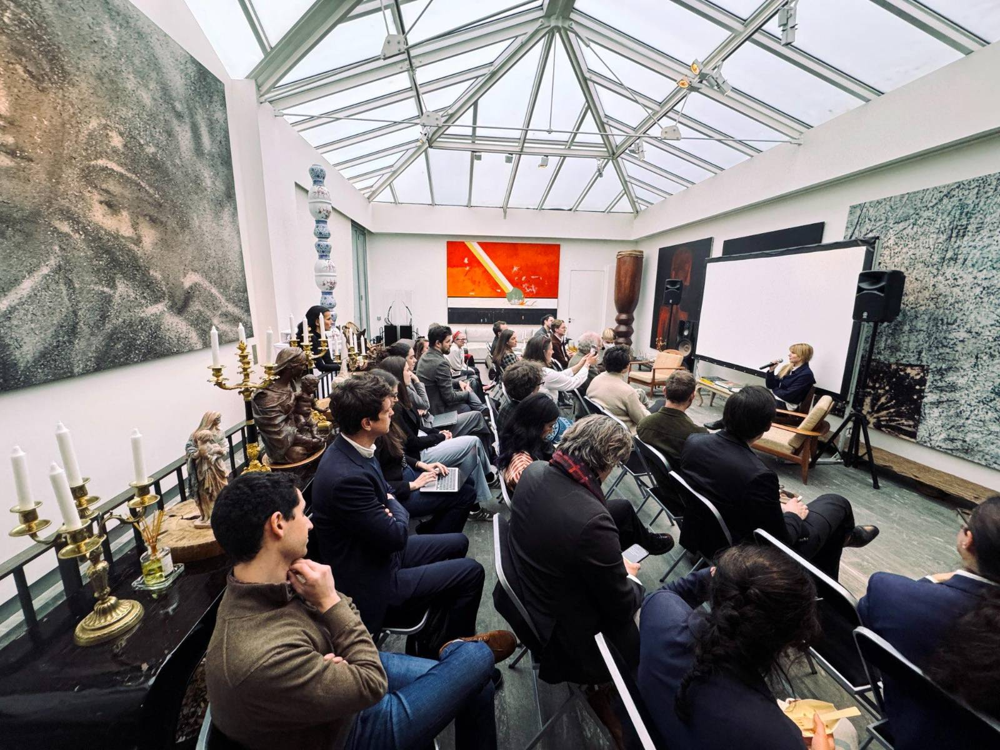

</figure><figure class="wp-block-image size-full">

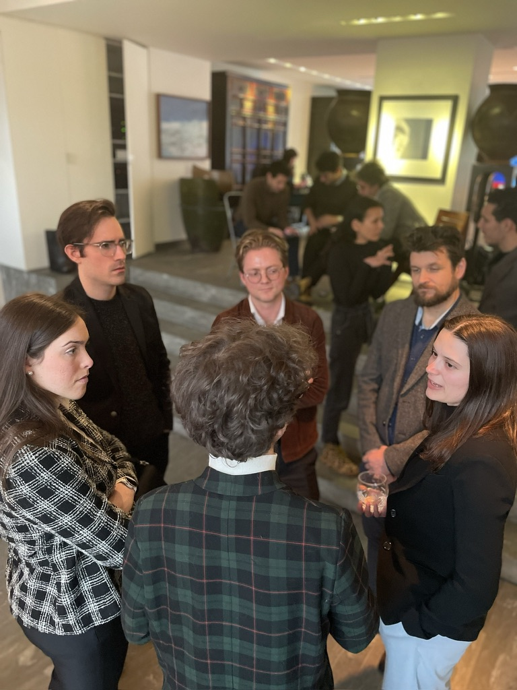

</figure></figure>

The week concluded with a quick hop across the Channel to participate in a panel discussion on open-source and public good AI at the [AI Fringe](https://aifringe.org/), hosted at the British Library in London, alongside representatives from Mozilla and Demos. This final engagement was perhaps fitting given the Summit’s focus on fostering public interest AI initiatives.

<figure class="wp-block-image is-resized">

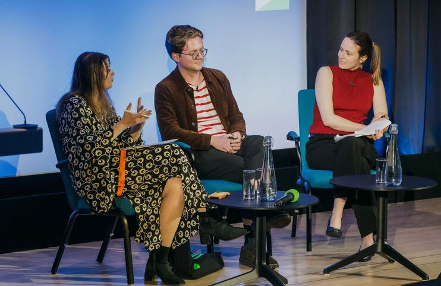

</figure>

As we reflect on an extraordinary week, we’re energized by the global commitment to responsible AI development and deployment. The conversations, collaborations, and initiatives launched during the Summit demonstrate that the AI community is actively working to ensure this transformative technology benefits society. OpenMined is excited to continue collaborating with the community to further responsible development and deployment of AI systems around the world and we look forward to taking concrete action alongside many of our colleagues towards this future.
