<!-- TODO(content): gallery (flattened to images — verify); show_gradient_in_listing_areas set (listing-card gradient — needs handling) -->

## Executive Summary

OpenMined was honoured to participate in the [India AI Impact Summit](https://impact.indiaai.gov.in/) held across venues in New Delhi from February 16–20, 2026. The Summit was the fourth in the series, following [Bletchley](https://www.bletchleypark.org.uk/bletchley-park-makes-history-again-as-host-of-the-worlds-first-ai-safety-summit/), [Seoul](https://aiseoulsummit.kr/aiss/), and [Paris](https://openmined.org/blog/reflections-on-the-2025-ai-action-summit/), and the first to be held in the Global South. Where Bletchley Park in 2023 hosted 100 leaders behind closed doors, New Delhi welcomed over 150,000 registered participants across a programme structured around the three _Sutras_ of People, Planet, and Progress and seven _Chakras_, including Safe and Trusted AI, Science, and Democratised AI Resources. Notably, the Summit continued the series’ evolution away from the “safety” and “risk” framing of Bletchley and Seoul, through Paris’s broadening of the agenda toward “action,” and now toward “impact.” The progression signals a global appetite to move AI governance conversations beyond abstract debates and toward practical deployments that enable equitable participation.

Against this backdrop, OpenMined ran two events during Summit week under the Science Chakra. Our headline session was [_Genomics, AI, and the Future of Health: Data Visitation to Empower the Global South_](https://www.youtube.com/live/BJ4LK9Knemk), co-organised with [Human Genome Project II](https://www.nature.com/articles/s41422-024-01026-y), which investigated what is needed to realise global precision medicine that enables countries to collaborate on AI-driven genomics. It featured live demonstrations of [BioVault](http://biovault.net), our open-source technology for healthcare research that sends algorithms securely to data rather than centralising it. A panel of leading international researchers provided reflections on conducting cross-border genomic analysis with this approach. This event was followed by a policy workshop at the [India International Centre](https://iicdelhi.in/), bringing together researchers, lawmakers, policy professionals, and technologists to advance work on data visitation for genomics and health.

<figure class="wp-block-image size-large">

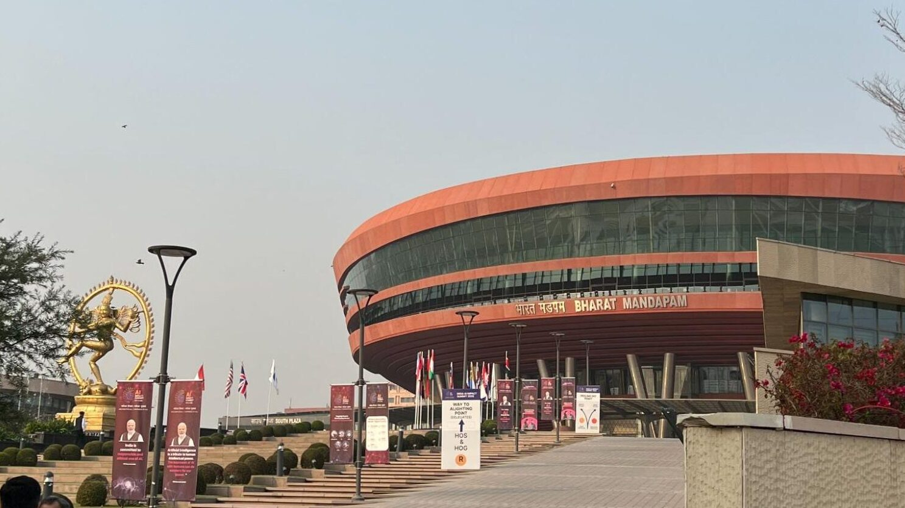

</figure>

<figure class="wp-block-image size-large">

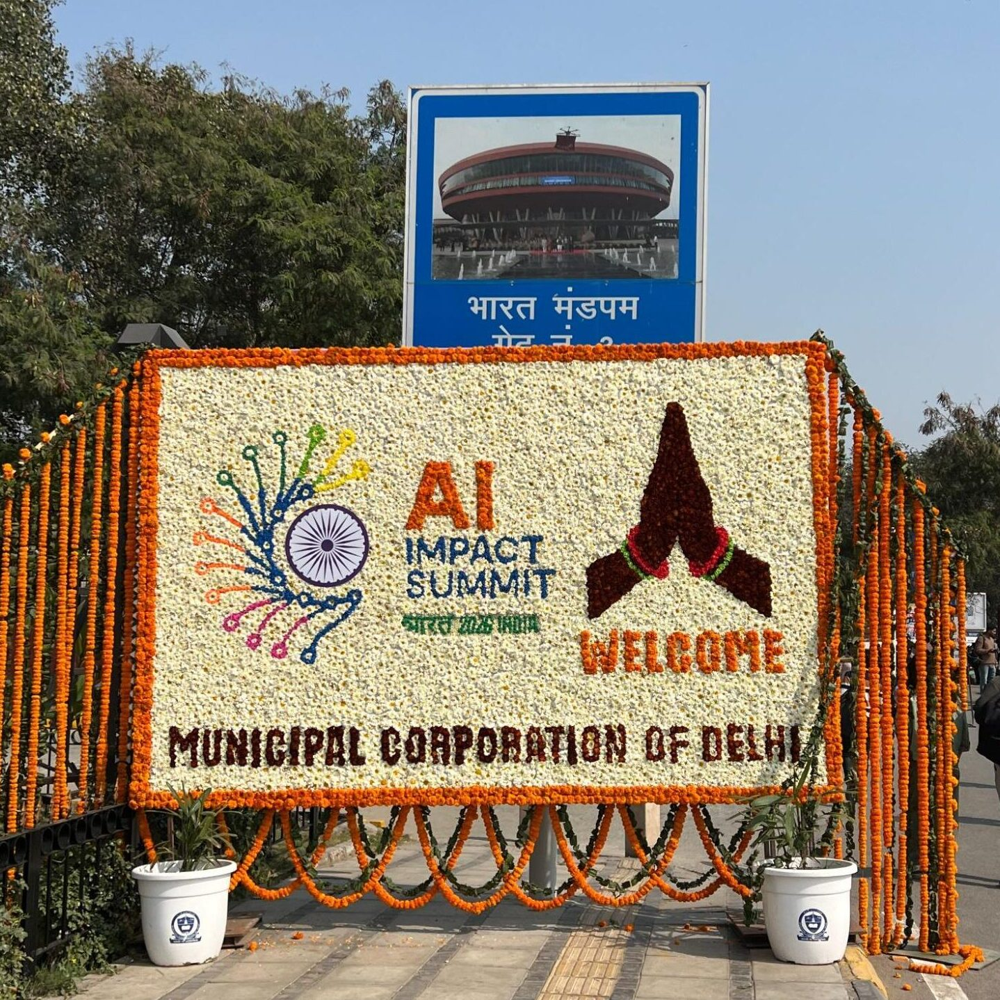

</figure>

## Data Sovereignty and Open Science: A False Choice?

If there was one theme that cut through almost every conversation at the Summit, it was sovereignty. From [Prime Minister Modi’s inauguration speech](https://www.youtube.com/watch?v=DMkkJF-PsQI) to civil society forums and AI safety events, the question of who builds, deploys, and controls access to data, models, and compute infrastructure was top of mind. OpenMined’s contributions focused particularly on _data sovereignty_ – how communities, institutions, and nations can responsibly generate datasets, and steward their use in AI systems. During the inauguration ceremony, French President Emmanuel Macron [emphasised the geopolitical importance of data sovereignty](https://youtu.be/jUR0dexeAZc?si=EKsTPh2EtFrgZZrQ&t=702), arguing that no country should serve as a space where others simply download their models and extract their citizens’ data.

But sovereignty, as several speakers noted throughout the week, does not mean isolationism. The tension between protecting national assets and enabling the kind of open, cross-border collaboration that drives scientific progress was a recurring theme. Countries in the Global South are understandably wary of the extractive dynamics that have characterised previous waves of technological development. At the same time, isolating data within national or institutional boundaries risks cutting off the very communities that stand to benefit most from collaborative research, particularly on global issues such as genomics, climate science, and public health.

Communities are seemingly faced with an intractable dilemma: open your data and risk exploitation, or close it and risk being excluded from shaping the AI systems that affect you. **_OpenMined believes this is a false choice_**, based on legacy approaches to data sharing and machine learning. A new approach, built upon federated, privacy-preserving data networks, can allow organisations to practice _conditional openness_. Data does not have to be either fully open or fully closed; it can be utilised for specific, approved purposes, with privacy preserved and access and usage policies enforced through technology. This approach enables institutions and communities to retain sovereign control over their data, whilst actively participating in collaborative, open, and global research.

These themes also found expression in the formal policy discourse surrounding the Summit. A working paper prepared by the Expert Engagement Group on [A New Deal For Data](https://d19ob9sqegt2wc.cloudfront.net/stage/uploads/New_Deal_For_Data_ae917d6a83.pdf), proposed a Sovereign Data Exchange Framework built around a core principle it termed “Visit, Don’t Move.” Under this model, AI companies would train their models within secure, locally controlled enclaves, streaming model weights in, training on sovereign data, and streaming updates back so that raw data never leaves national jurisdiction. The paper also argued for a broader shift in data governance philosophy away from process-based regulations rooted in data scarcity, and toward outcome-oriented accountability frameworks that enable data use while punishing actual harms.

The “Visit, Don’t Move” paradigm described in the paper is the data visitation approach we demonstrated with [BioVault](https://biovault.net/) at the Summit, and its emergence in a formal policy document signals that this concept has moved beyond technical proof-of-concept into the mainstream of international data governance thinking. As we work to expand BioVault deployments to new institutions and jurisdictions, it is encouraging to see the policy scaffolding beginning to take shape alongside the technology.

## BioVault and Genomics Session — Feb. 16th

<figure class="wp-block-gallery has-nested-images columns-2 is-cropped wp-block-gallery-1 is-layout-flex wp-block-gallery-is-layout-flex"><figure class="wp-block-image size-large">

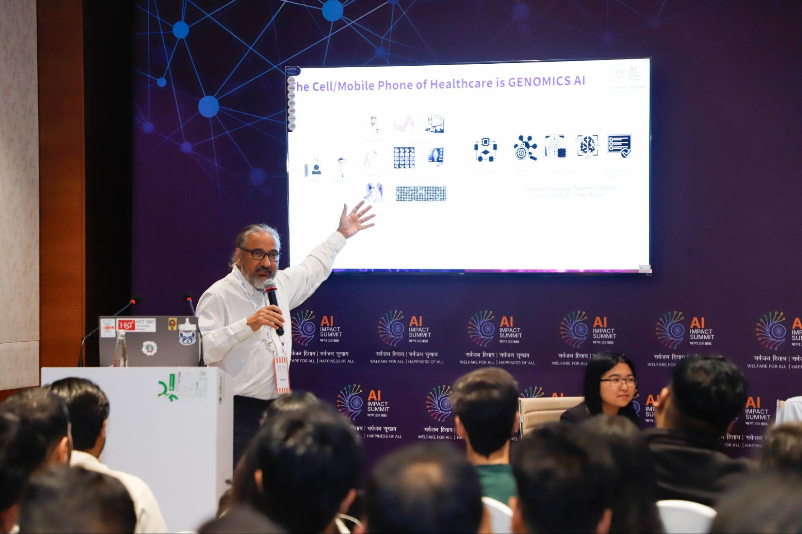

</figure><figure class="wp-block-image size-large">

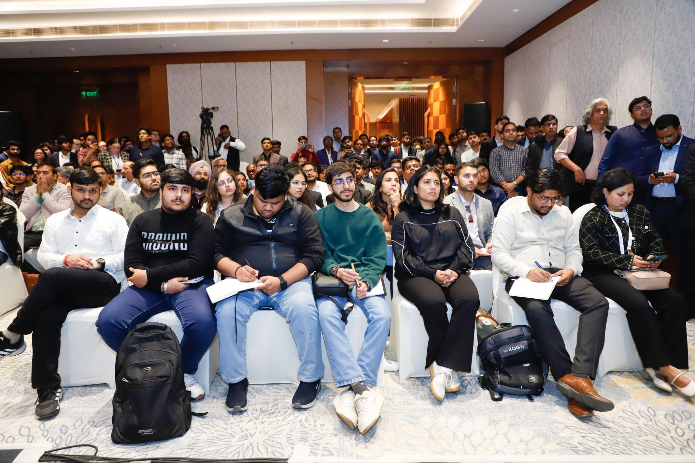

</figure><figure class="wp-block-image size-large">

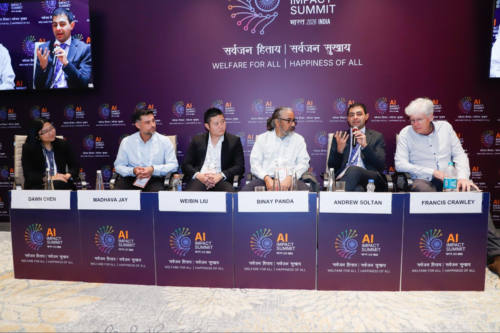

</figure><figure class="wp-block-image size-large">

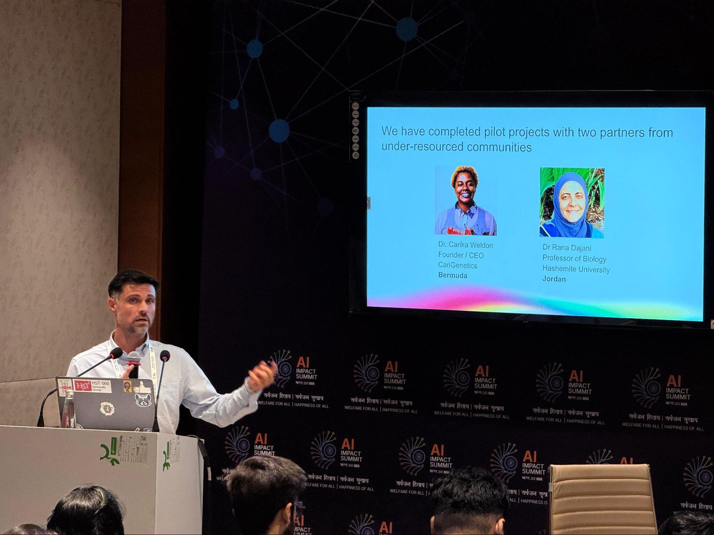

</figure></figure>

Our flagship session, [_Genomics, AI, and the Future of Health: Data Visitation to Empower the Global South_](https://www.youtube.com/live/BJ4LK9Knemk) took place in a packed-out events room at the Bharat Mandapam. Chaired by [Dawn Chen](https://churchlab.hms.harvard.edu/church-lab-member/dawn-chen), OpenMined collaborator and PhD candidate in biomedical sciences at Harvard University, the session brought together researchers, clinicians, and technologists to demonstrate how privacy-preserving, federated infrastructure can transform healthcare research in underserved communities.

[Binay Panda](https://www.binaypandalab.org/), Professor of Biotechnology at Jawaharlal Nehru University, set the scene powerfully: 85% of the world’s population lives in the Global South, yet these populations remain chronically underrepresented in the genomic datasets that increasingly drive healthcare innovation. Without deliberate intervention, AI-driven precision medicine risks becoming a technology that widens rather than narrows global health inequities.

OpenMined’s [Madhava Jay](https://x.com/madhavajay) then demonstrated [BioVault](https://biovault.net/), showcasing two recent cross-border analyses performed with Professor Rana Dajani in Jordan and Dr. Carika Weldon in the Caribbean. This was a powerful demonstration of data visitation being a technical reality and being leveraged to do meaningful research on sensitive data. To coincide with the event, the BioVault team published a [preprint on bioRxiv](https://www.biorxiv.org/content/10.64898/2026.02.12.705603v1) describing the methodology and results of the two analyses, and detailing the technical infrastructure underpinning BioVault.

Following Madhava’s presentation, Dr. [Andrew Soltan](https://www.phc.ox.ac.uk/team/andrew-soltan) from the University of Oxford presented complementary work on privacy-preserving models deployed within the UK’s National Health Service (NHS) during COVID-19, using Raspberry Pi devices that could be plugged in and run with minimal setup, a compelling model for scalable, low-cost deployment of privacy-preserving AI in resource-constrained settings.

[Francis Crawley](https://knowledge4policy.ec.europa.eu/profile/francis-p-crawley-1745_en), Chair of CODATA’s International Data Policy Committee, provided important context from the Research Data Alliance’s (RDA) AI and Data Visitation Working Group, situating BioVault within a broader international effort to develop governance frameworks for responsible cross-border data access. He outlined how data visitation aligns with emerging policy thinking around digital sovereignty and research ethics, and how the RDA’s work is building the institutional scaffolding needed to make these approaches interoperable across jurisdictions.

Finally, [Weibin Liu](https://www.nature.com/articles/s41422-024-01026-y), co-organiser of Human Genome Project II (HGP2), closed the session by reminding the audience that the original Human Genome Project succeeded because it was treated as a public good, but that 23 years on, the promise of genomics benefiting all of humanity remains unfulfilled. HGP2, he argued, exists to change that, and the data visitation infrastructure demonstrated in the session is a critical part of making it real.

## Policy Workshop — Feb. 17th

<figure class="wp-block-image size-large">

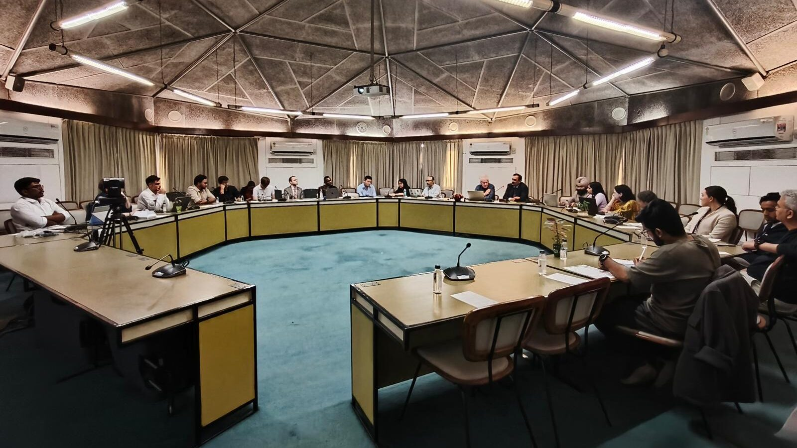

</figure>

Building on the momentum of the Summit session, a smaller group convened the following morning at the India International Centre for a policy workshop on data visitation for genomics and health. We would like to extend our thanks to the IIC for hosting what proved to be a rich and substantive discussion.

The workshop brought together researchers, clinicians, policymakers, legal scholars, and technologists from several countries and institutions to explore how the data visitation approach demonstrated in the BioVault session could be translated into practical policy frameworks. Discussions were wide-ranging, covering the intersection of data governance, clinical need, and infrastructure in diverse national and regional contexts.

We came away with a shared sense that data visitation offers a credible and flexible model for enabling cross-border health research while respecting sovereignty, and that the hard work of turning this into deployment frameworks is only just beginning. Follow-up efforts are underway, and we look forward to continuing this work with partners in the months ahead.

## Summit Side Events

#### Multistakeholder Approaches to Participation in AI Governance (MAP-AI)

<figure class="wp-block-image size-large">

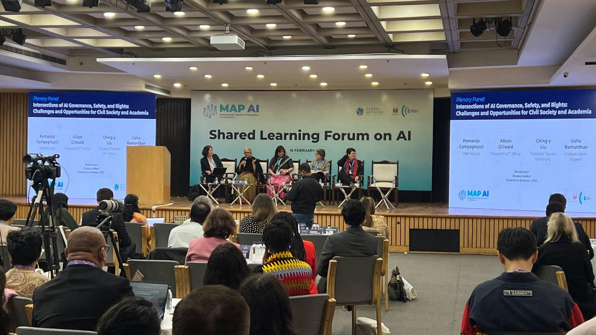

</figure>

OpenMined attended events organised under the [Multistakeholder Approaches to Participation in AI Governance](https://globalnetworkinitiative.org/enabling-multistakeholder-approaches-to-ai-governance/) (MAP-AI) project, a collaboration between the [Centre for Communication Governance](https://ccgdelhi.org/) (CCG) at the National Law University Delhi and the [Global Network Initiative](https://globalnetworkinitiative.org/) (GNI). Recognising that the series of global AI summits has often lacked meaningful civil society and Global South participation, MAP-AI brought over 400 diverse stakeholders from governments, industry, standards organisations, multilateral institutions, academia, and civil society to discuss global AI governance, safe and trusted AI, and enabling AI ecosystems. In their [post-Summit reflections](https://globalnetworkinitiative.org/from-delhi-to-geneva-reflections-recommendations/), CCG and GNI noted the Summit’s progress in expanding the circle of participants, but stressed that governance processes should be informed by the voices and experiences of those most impacted by AI’s development and diffusion. For OpenMined, the MAP-AI events reinforced that inclusive governance cannot be achieved through declarations alone. It requires infrastructure that gives communities genuine agency over how their data is used and how they participate in AI systems.

#### Open Source AI & the Plurality Imperative

<figure class="wp-block-image size-large">

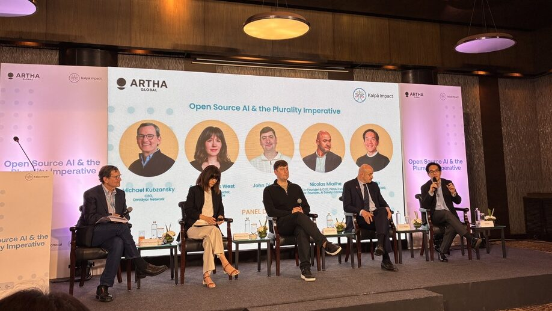

</figure>

OpenMined attended _Open Source AI & the Plurality Imperative_, an event organised by Artha Global and Kalpa Impact. This closed-door event centred around a discussion between the AI Now Institute’s Sarah Myers West, Mozilla’s John Dickerson, Prism Eval’s Nico Miailhe, and Sakana AI’s Ren Ito. Speakers emphasised a need to move beyond simplistic definitions of open data and open weights, and instead consider how we can realise a more _pluralistic_ AI ecosystem, where all AI components – including training data, model checkpoints, governance policies, model weights, and model usage data – can contribute to a vibrant “AI Commons”. Achieving this does not require mandating that all such components are made fully open, but rather that we build tools and design governance frameworks that provide structured access and operationalise conditional openness.

This framing aligns closely with the reflections shared by [Creative Commons](https://creativecommons.org/2026/03/04/ais-infrastructure-era/) after the Summit, which argued that openness in AI must extend beyond model weights to encompass data, infrastructure, tooling, and standards, and that openness and guardrails are not opposites but complementary. The challenge is building the governance infrastructure that makes it sustainable and trustworthy. This is a space where OpenMined’s technology has a clear role to play, and we look forward to collaborating with partners across the ecosystem to turn these shared ambitions into working infrastructure.

#### British High Commission Reception

<figure class="wp-block-image size-large">

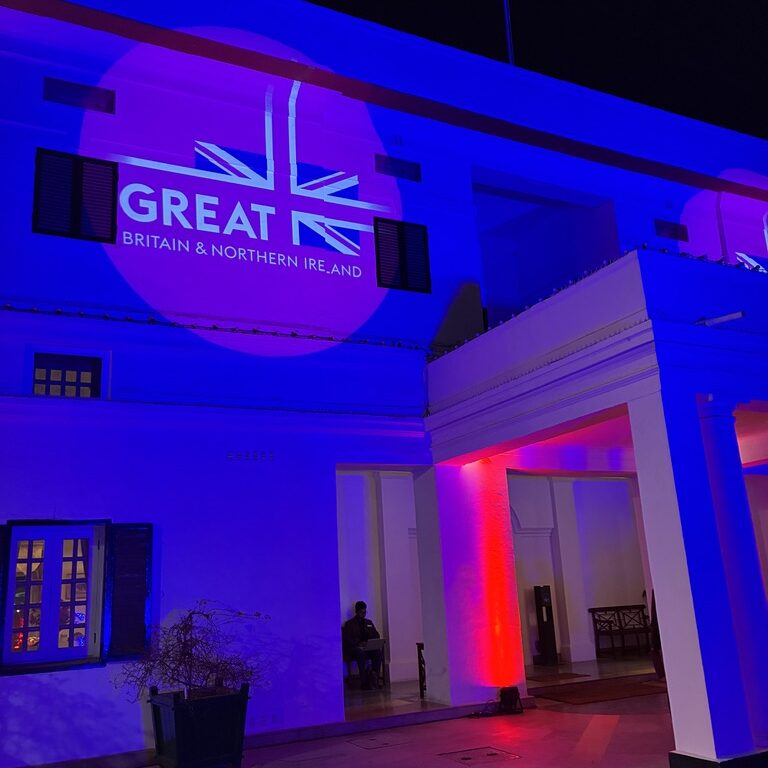

</figure>

The UK’s presence at the Summit was anchored by [_Shaping Tomorrow_](https://www.gov.uk/government/news/uk-showcase-demonstrates-ai-leadership-and-partnership-with-india), a reception at the British High Commissioner’s Residence hosted by High Commissioner Lindy Cameron and attended by over a thousand guests, including OpenMined’s UK Policy Lead Dave Buckley. The evening featured a conversation between Deputy Prime Minister David Lammy and former Prime Minister Rishi Sunak on the international governance of AI, alongside AI innovator pitches, interactive installations, and performances by artists using AI to tell new stories. AI Minister Kanishka Narayan addressed the gathering and launched [OpenUK’s documentary](https://www.youtube.com/watch?v=UGuD1Lwjjxk) spotlighting UK open-source technology talent. As an open-source community founded in the UK, OpenMined is heartened to see the UK government’s growing recognition that open-source infrastructure is not merely a technical option, but a strategic priority.

## Formal Outcomes

The Summit produced a number of formal outcomes, including the [India AI Impact Summit Declaration](https://www.mea.gov.in/bilateral-documents.htm?dtl/40809), which was endorsed by nearly 100 countries and international organisations, and the [New Delhi Frontier AI Commitments](https://www.pib.gov.in/PressReleasePage.aspx?PRID=2230201&reg=3&lang=1), which was supported by roughly a dozen leading frontier model developers. The Declaration affirmed that AI’s benefits must be equitably shared across humanity, with a focus on democratising access, expanding AI’s role in healthcare and education, and ensuring ethical safeguards and transparency while also respecting national sovereignty. It also noted the _Charter for the Democratic Diffusion of AI_ as a voluntary, non-binding framework to promote access to foundational AI resources, support locally relevant innovation, and strengthen resilient AI ecosystems, while respecting national laws. The Frontier AI Commitments, meanwhile, were organised around two pillars. First, a transparency commitment under which participating companies agreed to publish anonymised, aggregated insights into real-world AI usage to support evidence-based policymaking on jobs, skills, and economic transformation. Second, an inclusion commitment to strengthen the testing and evaluation of AI systems across underrepresented languages and cultural contexts, particularly in the Global South. The Declaration’s emphasis on equitable access and data sovereignty, and the Commitments’ focus on transparency and privacy-preserving data insights, align closely with the infrastructure OpenMined is building to enable countries and communities to participate in AI on their own terms.

## Looking Ahead

As we reflect on an extraordinary week, we are energised by the convergence we saw in New Delhi between the technology OpenMined has been building and the policy frameworks that are now emerging around it. The “Visit, Don’t Move” paradigm articulated in the New Deal For Data working paper, the Declaration’s emphasis on data sovereignty, and the recurring calls across side events for infrastructure that operationalises conditional openness all indicate the international community is ready to move beyond the false choice between openness and protection, and toward practical systems that enable both.

What New Delhi made clear is that the policy appetite now exists, but policy without infrastructure remains aspirational. OpenMined’s role in this next phase is to help close that gap contributing to the governance conversations shaping how data sovereignty is operationalised in practice, demonstrating through real-world deployments that federated, privacy-preserving approaches can work across jurisdictions and institutional contexts, and collaborating with partners across research, policy, and civil society to ensure that the frameworks emerging from these summits are grounded in technology that actually exists. Between now and the next AI Summit in Switzerland, that is where our focus will be. If you want to be a part of what comes next, [please get in touch](https://openmined.org/get-involved/).

---

_OpenMined attended the Summit with a delegation including Lacey Strahm and Dave Buckley from our Policy team and Madhava Jay, Shubham Gupta, Rasswanth S and Tauquir Ahmed from our Engineering team, alongside collaborators Francis Crawley, Weibin Liu, Binay Panda, Andrew Soltan, Dawn Chen, Keelan Jordan and Tivadar Török. We are grateful to MeitY and the India International Centre for their support in organising the events, to our collaborators who brought them to life, and to everyone who attended for their engagement and thoughtful questions._

<figure class="wp-block-image size-large">

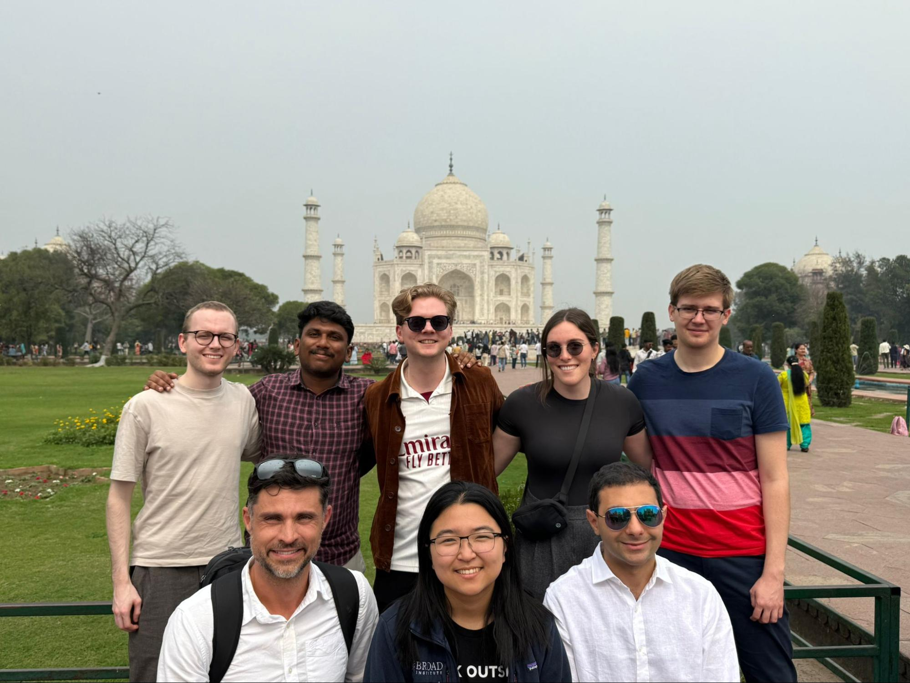

</figure>
