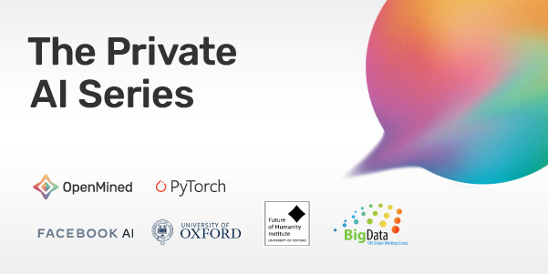

<!-- TODO(a11y): 1 localized body image(s) have empty alt text -->

<figure class="">

</figure>

We’re excited to announce the release of the next course in The Private AI Series, _Foundations of Private Computation_. In this course, you’ll learn how to use privacy-preserving technologies to safely study data owned by others without ever seeing the underlying data yourself.

The course covers privacy technologies such as:

-   Federated Learning
-   Split Neural Networks
-   Cryptography
-   Public Key Infrastructure
-   Homomorphic Encryption
-   Secure Multi-Party Computations
-   Private Set Intersection
-   Zero-Knowledge Proofs
-   Differential Privacy
-   Secure Enclaves

Each lesson teaches the theory behind these technologies and provides hands-on practice using tools like [PySyft, Duet](https://github.com/OpenMined/PySyft), and [PyDP](https://github.com/OpenMined/PyDP). Through the course, you’ll gain the skills to use these privacy technologies in your own projects. This course is technical, you’ll need to be comfortable with Python and experience with Numpy and/or PyTorch will be helpful.

The lessons are developed and taught by OpenMined community members. Many of the instructors developed the tools you’ll be using such as [TenSEAL](https://github.com/OpenMined/TenSEAL) for homomorphic encryption and PyDP for differential privacy. You’ll also learn from experts in the field such as Ramesh Raskar from the MIT Media Lab, the inventor of Split Neural Networks, and Pascal Paillier, inventor of the Paillier cryptosystem for homomorphic encryption.

If you ever need help during the course, our mentors are available to support you through the [course discussion board](https://github.com/OpenMined/courses/discussions). OpenMined also has a [thriving community](https://slack.openmined.org) of developers, students, and many others who are happy to help you.

The first lesson will be released on **Tuesday,** **March 16th at 5 PM GMT**. Each week after, we’ll release one or two new lessons, finalizing with a project at the end of April. In the course project, you’ll use your new skills to analyze data on a remote machine while protecting the privacy of the data owner.

If you’ve registered for The Private AI Series already, you won’t need to do anything. You’ll have access to the course when the lessons are released. If you haven’t registered yet, now is the perfect time! Sign up at [courses.openmined.org](https://courses.openmined.org/) today.
