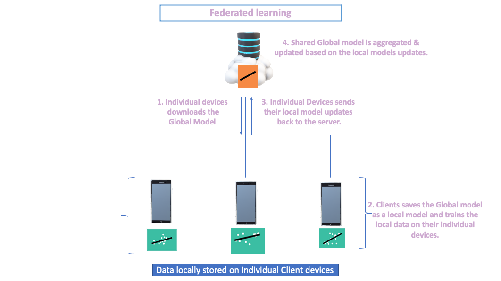
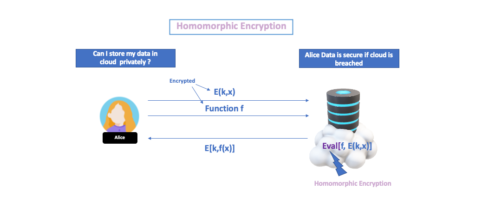
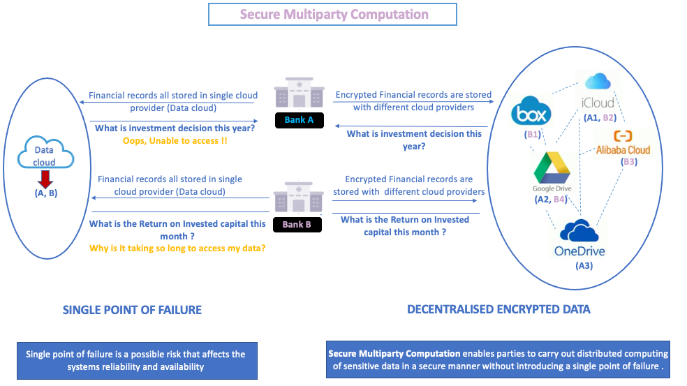
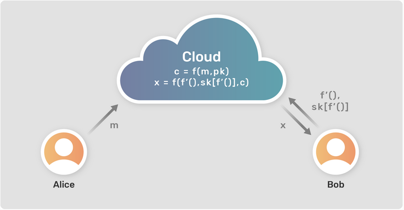
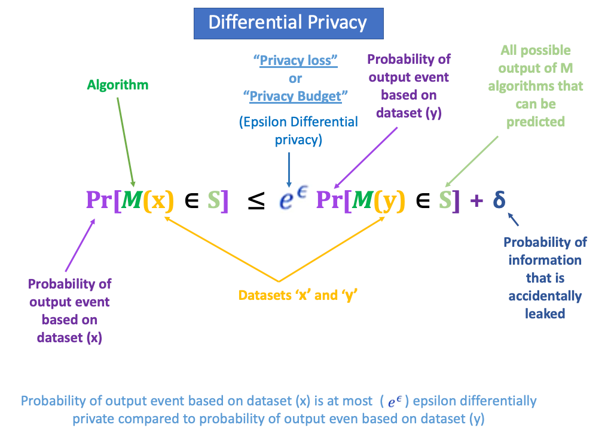

<!-- TODO(a11y): 5 localized body image(s) have empty alt text -->

<!-- TODO(content): shortcode(s) present (verify) -->

## Privacy Challenges in BigData

> **The Internet has radically increased the scale of information accessible to society and decreased friction. Still, it can only do it for data that individuals & organisations are happy to share, that is not competitive or valuable.**

Today’s applications of AI for Big Data still face two significant challenges in answering the world’s most pressing questions. Some of the questions include: How to cure cancer? How to solve climate change? How to prevent money laundering? Etc. The first challenge is that data exists in the form of isolated or decentralised islands and is difficult to access. The second challenge is to address how to strengthen data privacy and security.

Current data owners of **decentralised data infrastructure** have strong reasons to avoid releasing them for scientific study, as such data is **commercially valuable or privacy-sensitive.** An act of an individual data scientist or a small institution accessing the data to yield valuable insights is an enormous challenge. Distributed data in these isolated islands can answer questions within an institution, hospital, financial organisations, etc., who have the copyright to their data.

Imagine if we could create a **hypothetical centralised data centre** to address the challenge while providing access to data scientists as one of the solutions. Doing so can incur complexity and fears in case of data loss, privacy leakage, or a competitive ban. **Technical issues** like high latency, data caps, consuming colossal battery life and bandwidth issues could become another major challenge. A group of people is needed to manage such a vast infrastructure, and such groups are far more powerful in future as they will own and control all the data. Even if we bring in strong regulations and policies to prevent such a centralised authority from creating an accidental or intentional privacy leakage, it still may lead to **sophisticated complications in maintaining such policies.**

The “current decentralised infrastructures” or the creation of a “hypothetical centralised massive database” only challenge and limit our ability to answer important questions because we cannot access existing data with increasing complexities.

**Privacy-enhancing technologies (PET) seek to mitigate these tensions by enforcing one’s ability to perform data analysis privately and securely while the data remains decentralised (Data doesn’t leave the device).**

> **At OpenMined, We believe that the future of data science is “Remote Data Science” which would allow us to access a thousand times more data than we currently do and solve the world’s most pressing issues through the leverage of Privacy-Enhancing Technologies.  
> **

## Why Remote Data Science?

OpenMined introduces **“Remote Data Science”** as it believes it is the future of private data science. It uses privacy-preserving enhancing technologies(PET) to perform data science on remotely available datasets whilst keeping the datasets private in the end-to-end Infrastructure that automatically prevents privacy leakage.

Remote Data Science enables **three privacy guarantees** for the data scientist and the data owner:  

**1\. Prevent a data scientist from copying the data by bringing the algorithm to the data on the device using a “Federated Learning”**, thereby ensuring that data never leaves the device.

Federated learning is a framework used to train a shared global model on decentralised data on devices that clients own.

  

**Figure-1**

Figure-1 explains the simplest form of Federated learning framework in bringing the algorithm to the locally stored data, preventing the necessity to copy data every time it needs to be analysed.

The clients are the data owners who could either be individual device owners or Organizational silos( For example, Data centres in Individual hospitals, Institutions or even Consortiums, .etc.). The Central server’s role is to orchestrate sending the shared global model & aggregating updates based on new updates of the model parameters from the clients.

The clients connected to a central server download the shared global model with model parameters. For Example, If you’re running a Linear regression model, intercept & slope would be the parameters. The model is saved as a local model to train their data independently. Clients will send the local model updates with updated model parameters aggregated in the central server. The process of receiving the model weights, training the data and sending the updated weights continues till the expected model accuracy is achieved.

**2\. Preventing a privacy leakage by storing the data in an encrypted form while ensuring the computation performed on encrypted data using:  
****_“Homomorphic encryption”, “secure multi-party computation”, and “functional encryption”._**

**_2.1) Homomorphic encryption_** ensures that computation is performed on  
       encrypted data.

  

**Figure-2** \[Credit: A Decade of fully homomorphic encryption, by Craig Gentry\]

Figure 2 illustrates that Alice wants to use cloud computing, and she wants her data to be stored privately in the cloud. The data is encrypted using the private key, _“Encrypted data: E\[data(x), private key(k)\]”,_ and stored in the server. When she wants to execute a query on the encrypted data using the _“Query:function(f)”_ (Note that the function can also be encrypted), query is evaluated on the server using homomorphic encryption _“Evaluation: Eval\[f(x), E(k,x)\]”_ with an algorithm that produces a ciphertext. The ciphertext _“Reply: E\[private key(k), f(x)\]”_ is decrypted using the private key by Alice.

**_2.2)Secure Multiparty Computation_** enables parties to carry out distributed computing of sensitive data securely without introducing a single point of failure.

  

**Figure-3**

Above is an example, where secure multiparty computation(SMPC) is applicable. It explains what happens when Bank A & B stores their data with a single cloud provider instead of keeping it with multiple cloud providers. Storing data with a single cloud provider can lead to a single point of failure; instead, if banks store their data in various cloud storage providers would provide high availability of data.

SMPC protocol also enables an arrangement to perform joint function computing among a set of parties. There is no central party doing all the computing; instead, all parties are involved in shared computing to arrive at the collective quarterly earnings needed to make the investment decision for the year. All they learn is from each other’s output. Bank A performs distributed joint computing on encrypted data stored (A1, A2, A3) with multiple parties using SMPC.

**_2.3) Functional Encryption_**

  

**Figure-4** (Credit: Privacy Teaching Series: What is Functional Encryption?)

Let us understand Functional Encryption with an example. Suppose Alice holds data a = 3, b = 5 and Bob wants to know the value of (a+b), but a and b are encrypted. Assume that Alice provides access to bob to compute the function on the encrypted variables a and b. Bob can access the _result of the function in “Decrypted form”_ without even accessing the decrypted values of the variables.The difference between Fully Homomorphic Encryption(FHE) and Function Encryption(FE) is that the “result” from the Fully Homomorphic Encryption will be in the encrypted form. At the same time, FHE can perform mathematical operations on the encrypted form of ciphertext.  

**3\. Output privacy can be accomplished by preventing statistical computation from memorising data, most notably **_“Differential Privacy”_**.**

Differential privacy describes a ****promise of a privacy guarantee**.** made by the data owner or curator to a data subject that **“You will not be affected adversely or otherwise, by allowing your data to be used in any study or analysis no matter what other studies, datasets or information sources are available”.**

An original database(x) has individual people’s sensitive information in it. If an individual is removed or added to the database, such an updated database is called an Alternative database(y). Differential privacy aims to answer a question by computing a function using an algorithm ‘M’, which does not give out a difference between the original database(x) and the alternative database(y), compromising the individual’s information.

For example, a third-party hospital ‘A’ arranges for health checkups in a company ‘X’, and the results are stored in the company ‘X’ database. The hospital is allowed to perform computations on the database without compromising individuals’ sensitive information. Assume that there is an adversary within or outside the hospital who makes a first query, “Query 1:How many people in total have Cardiovascular disease(CVD)?” and receives a result of 20. The adversary further performs a “Differencing attack” and chooses to unethically access an individual’s information based on the first query, “Q2:How many people have CVD apart from the director?”. Assume that the director of the company ‘X’ is part of the database. In that case, the result of the Q2 is 19 which would compromise the director’s sensitive information revealing that the director is also suffering from CVD.

Differencing attacks lead to participants not trusting to share their data, while the data could have been part of a larger dataset formed with other hospitals to solve CVDs.

Approximately 17.9 million lives are lost each year due to cardiovascular diseases. If privacy leakage issues are solvable, more datasets would be available, increasing the accuracy of detecting or even preventing cardiovascular diseases.

  

**Figure-5** Definition of Differential Privacy

The mathematical definition of differential privacy states that a randomized algorithm “M” gives “?” differential privacy for all pairs of datasets x and y differ in just one row. When is very small almost equal to zero, then “? = 1+?” and it means that both the probabilities of data sets are the same? It also means that when we have zero privacy loss it means that we have zero information about the differences in the datasets and higher levels of privacy.

A privacy budget (epsilon) is a pre-determined epsilon value assigned to the data scientists using which the data owners can control the degree of information accessed by the data scientists.

If all these **_Privacy-Preserving Techniques(PET)_** “Federated learning”, “Secure Multiparty computation”, “Fully Homomorphic encryption” and “Differential privacy” are applied as a combination of integrated techniques could provide **_end-to-end guarantees_** sufficient for general data science over private data **_using Remote Data Science_**.

> **Thank you 🙂 !!**  
> 
> **  
> \* To Mark Rhode(OpenMined Communication Navigation Team Lead) for helping me revise my blog multiple times.  
> \* To Kyoko Eng (OpenMined Product Leader) for helping me re-design the diagrams.  
> \* To Madhava Jay (OpenMined Core Engineering Team Lead) for clarifying the architectural concepts of Remote Data Science.  
> \* To Ionesio Junior (OpenMined AI Researcher) for providing feedback on the “Domain node example” Diagram.  
> \* And, To Abinav Ravi (OpenMined Communication Writing Team Lead and Research Engineer) for reviewing my blog and mentoring me to coordinate with other teams.  
> **

**References:**

[1\. Introduction to Remote Data Science](https://courses.openmined.org/courses/introduction-to-remote-data-science)  
  
[2\. Introduction to Remote Data science | Andrew Trask](https://www.youtube.com/watch?v=sCoDWKTbh3)  
  
[3.Towards General-Purpose Infrastructure for protecting scientific data under study](https://www.google.com/url?q=https://arxiv.org/abs/2110.01315&sa=D&source=docs&ust=1653563826063751&usg=AOvVaw2NcsdRuwzGowPIVrcFQZAI)  
  
[4\. UN list of Global Issues](https://www.un.org/en/global-issues)  
  
[5.Federated learning with TensorFlow Federated (TF World ’19)](https://www.youtube.com/watch?v=m17IgaHaoTI)
