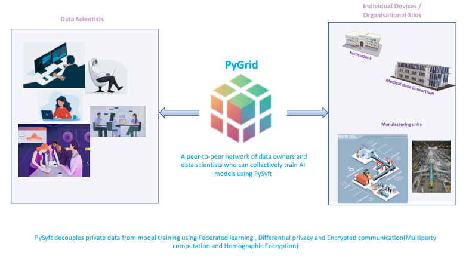
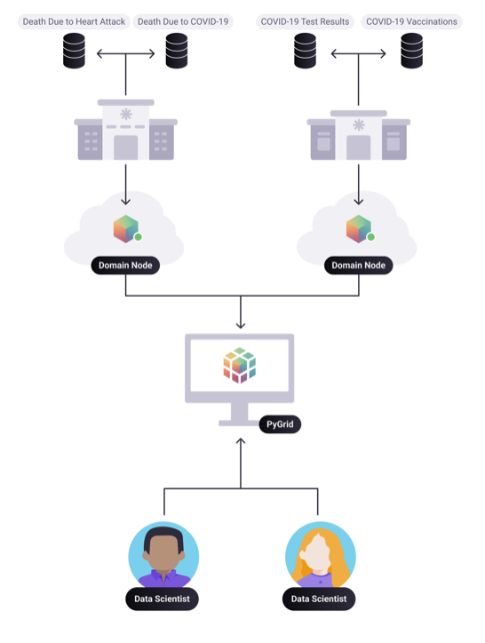

<!-- TODO(a11y): 2 localized body image(s) have empty alt text -->

This post is a continuation of  
[“Remote Data Science  
Part 1: Today’s privacy challenges in BigData”](https://blog.openmined.org/remote-data-science-part-1-todays-privacy-challenges-in-bigdata-2/).  
The previous blog talks about the importance of understanding **_privacy challenges in BigData_** and explains how “Remote Data Science” enables **_three privacy guarantees_** for the data scientist and the data owner.

This blog explains the different components of Remote Data Science. Visualise a single domain in Federated learning(FL) Infrastructure. Understand “Model-centric FL” and “Data-centric FL” while both are deployable in Remote Data Science Architecture.

### Remote Data Science with PyGrid and PySyft

**PyGrid** is a peer-to-peer network of data curators/owners and data scientists who can collectively train AI models using PySyft on decentralised data (Data never leaves the device). PyGrid is also the central server for conducting both model-centric and data-centric federated learning. PyGrid is made of two components:

**Domain:** A single computer system or collection of computer systems could be connected to a single domain node. It is responsible for allowing the data owner to manage the data and act as a gatekeeper to data scientists in performing computing on the private data on the devices.  
For example, The National statistics office (NSO) of different countries wants to share cancer data. Then a domain can be formed for the cancer data for research. Various research disciplines can incorporate additional domains based on research areas such as Trade data, Climate change, etc.

**Network:** Application used to monitor and route instructions to different Pygrid domains.

**PySyft** is OpenMined’s main library and focal point of the privacy ecosystem, which decouples private data from model training using Federated learning, Differential Privacy and Encrypted computation such as Secure multiparty computation and Homomorphic encryption.

**HaGrid(HAppy Grid or Highly Available Grid)** is a command-line tool that speeds up the deployment of PyGrid.

<figure class="">

</figure>

### “Visualising a Domain” in Remote Data Science Infrastructure.  

<figure class="">

<figcaption>Credit : OpenMined Design Team</figcaption></figure>

**Domain node** is responsible for allowing data curator to manage their data. It acts as a gatekeeper for Data Scientists to access the data. The database can be private using homomorphic encryption and provide remote access using a federated learning framework. Each query on the data stored in the database is answered based on differential privacy techniques to avoid privacy leakage. The Above diagram presents data scientists assessing the domains through PyGrid. PyGrid has a user interface to create users, allocate a privacy budget, give permissions to data scientists to compute the data and see if there are any requests from data scientists to be approved. The experimental results are then stored within the data curator’s compute infrastructure.

Observe that in the diagram above, Various disciplines (Left domain – Heart attack and covid) could be researched under a domain or a single type of research (Right domain – Covid) performed in a domain, depending on how an organisation chooses to create domains.

**Network node** is a server that exists outside any data owner’s institution. Multiple domains can be connected to a single network node based on certain requirements being met. The Network nodes will be connected through PyGrid and provide services such as dataset search, project approval across the domains, etc.

### Model/Data-centric FL in Remote Data Science  

> Shifting from Model-Centric to Data-centric: Machine learning has developed by downloading the standard benchmarking datasets and improving the code/model in the last few decades. In many problems, there needs to be a shift in focus from ‘improving code’ to ‘improving the data’ more systematically, as it can be applicable where there is less critical data available or changing data versions (caused by external factors) for analysis.

Remote Data Science can deploy two types of Federated learning(FL): Model-centric FL and Data-centric FL.

**Model-Centric FL** (Software-centric approach) has been the dominant paradigm for AI development for decades, where locally generated and decentralised data in user’s devices or Silo’s(Institutions, Banks, hospitals.. etc.) are used to train the central model situated in the central server, while local models at the user’s end send the updated weights to the shared central model. The main focus is to improvise on creating a _**high-quality central model**_ that trains the decentralised local data.The Model is hosted in PyGrid, while the data remains decentralised.

**Data-Centric FL** ensures keeping code fixed and focusing on creating **_high-quality data_** for a particular problem. It is vital to apply a data-centric approach when there is less data or challenging data versions that need to be improved to create high-quality data.  
  
The below examples explain challenges that cause different data versions:  

1\. Computed Tomography(CT) scan generates images using X-Rays. It is a useful diagnostic tool for detecting bone and joint problems, fractures and tumours, cancer, heart disease, emphysema or liver masses. There is a need for more images to detect injuries or diseases accurately and consistently.  
The challenge arises in detecting an injury or illness persistently from the images under the same medical conditions of the patient. For example:

a) Hospitals deploy new CT scan devices incompatible with existing CT diagnostic tools.  
  
b) New Software updates for the CT scan device may have errors in detecting previously identified injuries incorrectly.

Addressing such challenges could require manual intervention to analyse the injuries or diseases.

2\. Applications that target more dynamic problems, such as blocking illegal content on a social network or fraud detection, may need to be updated hourly or even faster.

This continuous execution model significantly changes the problems that DCAI(Data-centric AI) needs to consider. Instead of selecting a diverse training dataset once, real-world users probably need a tool to create new datasets each day automatically. Instead of defining classes once, users may want algorithms that can handle an evolving taxonomy and use old data for some classes together with newer data for others. The same is true for labelling: DCAI tools should ideally be prepared to handle changes in label data stemming from changes to the annotation UI, the pool of annotators, or the problem definition.

In Data-Centric FL, The Device owners or the Silos have the data they want to protect in PyGrid, where instead of focusing on the model improvement based on massive datasets, Data-centric FL focuses on improving the data (when less data is available) by collaborating similar data made available from multiple sources which in turn enhances the quality of inference.

E.g.,95% of cancer screening results in false positives. It needs more data from various hospitals to improve the accuracy of the results. Such data needs to be collected systematically to ensure better collaboration between the hospitals, which can be enabled using Data-centric FL. Data-centric FL provides a framework, if implemented by various hospitals in this case, that would enable an infrastructure that allows continuous data collection, label requisition and retraining process that may likely be fully automated in future and provide automated alerts when things appear to be going wrong.

> **Fundamental Law of Information Recovery: “Overly accurate” estimates of “too many” aggregate statistics destroy privacy.  
> **

### Thank you!  

**  
\* To Andrew Trask (Leader at OpenMined) for clarifying on my questions about the domain.  
\* To Mark Rhode (OpenMined Communication Navigation Team Lead) for helping me revise my blog multiple times.  
\* To Kyoko Eng (OpenMined Product Leader) for helping me re-design the diagrams.  
\* To Madhava Jay (OpenMined Core Engineering Team Lead) for clarifying the architectural concepts of Remote Data Science.  
\* To Ionesio Junior (OpenMined AI Researcher) for providing feedback on the “Domain node example” Diagram.  
\* And, To Abinav Ravi (OpenMined Communication Writing Team Lead and Research Engineer) for reviewing my blog and mentoring me to coordinate with other teams.  
**

### References:  

1\. [Introduction to Remote Data Science](https://courses.openmined.org/courses/introduction-to-remote-data-science)  
  
2\. [Introduction to Remote Data science | Andrew Trask](https://www.youtube.com/watch?v=sCoDWKTbh3)  
  
3\. [Towards General-Purpose Infrastructure for protecting scientific data under study](https://www.google.com/url?q=https://arxiv.org/abs/2110.01315&sa=D&source=docs&ust=1653563826063751&usg=AOvVaw2NcsdRuwzGowPIVrcFQZAI)  
  
4\. [UN list of Global Issues](https://www.un.org/en/global-issues)  
  
5\. [Federated learning with TensorFlow Federated (TF World ’19)](https://www.youtube.com/watch?v=m17IgaHaoTI)  
  
6\. [“Everyone wants to do the model work, not the data work”: Data Cascades in High-Stakes AI  
](https://storage.googleapis.com/pub-tools-public-publication-data/pdf/0d556e45afc54afeb2eb6b51a9bc1827b9961ff4.pdf)  
  
7\. [Understanding the types of Federated learning.](https://blog.openmined.org/federated-learning-types/)  
  
8\. [What can Data-Centric AI Learn from Data and ML Engineering?](https://arxiv.org/pdf/2112.06439.pdf)  
  
9\. [Turing Lecture: Dr Cynthia Dwork, Privacy-Preserving Data Analysis](https://www.youtube.com/watch?v=vsA4w3itxA0)  
  
10\. [Data-centric AI: Real World Approaches  
](https://www.youtube.com/watch?v=Yqj7Kyjznh4)  
  
11\. [OpenMined – PySyft Github Library  
](https://github.com/OpenMined/PySyft)  
  
12\. [Privacy Series Basics : Definition](https://blog.openmined.org/privacy-series-basics-definition/)
