<!-- TODO(content): 5 unrecoverable figure(s) removed — dead Google-Docs/social paste artifacts (404 on live for years, no archive). Recreate if valuable. -->
<!-- TODO(a11y): 9 localized body image(s) have empty alt text -->


<!-- TODO(content): shortcode(s) present (verify) -->

This post is a continuation of  
[“Remote Data Science  
Part 2: Introduction to PySyft and PyGrid”](https://blog.openmined.org/remote-data-science-part-2-introduction-to-pysyft-and-pygrid/). Previous blog was about introduction to PySyft, PyGrid and HAGrid, Visualizing the domain and about Model/Data-centric FL in “Remote Data Science”

## Deploying a Single Domain Node locally using docker  

Assuming that we have understood “What does a domain mean in “Remote Data Science” infrastructure?. Let’s try to implement a domain.

**1\. Installing pre-requistes.**

a. The **Operating system requirements** has to be as below :

-   MacOS : BigSur(11.5.1)
-   Linux : Ubuntu(20.04.3 – Focal Fossa)
-   Windows : Windows 10

b. Ensure that **“Python 3.9 or higher version”** and **“Pip’s latest version”** is installed. Pip is required to install dependencies. Use this [instructions](https://pip.pypa.io/en/stable/installation/#supported-methods/) as reference for installing pip.

<p style="padding: 10px; border: 2px solid #c0c2c2; margin-left:20%; color:#323232; font-size: 18px; width: 740px">$ pip install –upgrade pip &amp;&amp; pip -V (Linux)<br>$ python -m pip install –upgrade pip (for Windows)</p>

c. Installing and configuring **“Docker”**

-   **Install Docker and Docker Composite V2**, which is needed to orchestrate docker, as explained below:

-   For **Linux**:

-   Install Docker:
    
    <p style="padding: 10px; border: 2px solid #c0c2c2; margin-left:0%; color:#323232; font-size: 18px; width: 620px">$ sudo apt-get upgrade docker &amp; docker run hello-world</p>
    
-   Install Docker Composite V2 as described here.
-   You should see ‘Docker Compose version v2’ when running:
    
    <p style="padding: 10px; border: 2px solid #c0c2c2; margin-left:0%; color:#323232; font-size: 18px; width: 620px">$ docker compose version</p>
    
-   If not, go through the instructions here or if you are using Linux, you can try to do:
    
    <p style="padding: 10px; border: 2px solid #c0c2c2; margin-left:0%; color:#323232; font-size: 18px; width: 620px">$ mkdir -p ~/.docker/cli-plugins<br>$ curl -sSL https://github.com/docker/compose-cli/releases/download/v2.0.0-beta.5/docker-compose-linux-amd64 -o ~/.docker/cli-plugins/docker-compose<br>$ chmod +x ~/.docker/cli-plugins/docker-compose</p>
    
-   Also, make sure you can run without sudo:
    
    <p style="padding: 10px; border: 2px solid #c0c2c2; margin-left:0%; color:#323232; font-size: 18px; width: 620px">$ echo $USER //(should return your username)<br>$ sudo usermod -aG docker $USER</p>
    

-   For **Windows, MacOs:**

-   You can install Desktop Docker as explained here for Windows or here for MacOS.
    -   Go to the Docker menu, click Preferences (Settings on Windows) > Experimental features.
    -   Make sure the Use Docker Compose V2 box is checked.
-   The docker-compose should be enabled by default. If you encounter issues, you can check it by:
-   Ensure at least 8GB of RAM are allocated in the Desktop Docker app:
    -   Go to ‘Preferences’ -> ‘Resources’
    -   Drag the ‘Memory’ dot until it says at least 8.00GB
    -   Click ‘Apply & Restart’

-   Make sure you are using the dev branch of the PySyft repository (branch can be found here)

**2\. Create a virtual environment using python “Virtualenv” or “Conda”. (Use any one of them to create an virtual environment)**

1\. Install [python virtualenv.](https://packaging.python.org/en/latest/guides/installing-using-pip-and-virtual-environments/)

<p style="padding: 10px; border: 2px solid #c0c2c2; margin-left:15%; color:#323232; font-size: 18px; width: 780px">$ mkdir folder_name<br>$ virtualenv -p python3.9 folder_name<br>$ source ./folder_name/bin/activate<br>$ deactivate (To exit out of the conda environment)</p>

2\. Install conda and create an environment. create a folder named “pysyft”.

<p style="padding: 10px; border: 2px solid #c0c2c2; margin-left:15%; color:#323232; font-size: 18px; width: 780px">$ conda create -n <name>python=3.9<br>$ conda activate<name><br>$ deactivate (To exit out of the conda environment)<br></name></name></p>

**3\. Explore locally with the PySyft API.**

1\. Create a folder ‘syft’ and make it a virtual using python virtualenv or conda. For example, creating a python virtualenv folder is as below:

<p style="padding: 10px; border: 2px solid #c0c2c2; margin-left:15%; color:#323232; font-size: 18px; width: 780px">$ mkdir syft<br>$ virtualenv -p python3.9 syft<br>$ source ./syft/bin/activate<br>$ deactivate (To exit out of the conda environment)</p>

2\. Clone PySyft from github and install syft and tox in ‘syft’ folder.

<p style="padding: 10px; border: 2px solid #c0c2c2; margin-left:15%; color:#323232; font-size: 18px; width: 780px">$ git clone https://github.com/OpenMined/PySyft.git<br>$ git checkout dev (Move to the correct branch in the PySyft repository)<br>$ pip install syft==0.6.0 (or latest syft version)<br>$ pip install tox</p>

3\. Install and open Jupyter notebook using tox file to login into a domain.

<p style="padding: 10px; border: 2px solid #c0c2c2; margin-left:15%; color:#323232; font-size: 18px; width: 780px"><strong>Open PySyft folder to access tox.ini file.</strong><br>$ pip install jupyter-notebook<br><br>$ tox -l<br>$ tox -e syft.jupyter</p>

If you encounter issues, you can also install it using Conda:

<p style="padding: 10px; border: 2px solid #c0c2c2; margin-left:15%; color:#323232; font-size: 18px; width: 780px">$ conda install -c conda-forge notebook</p>

**4\. Launch domain using HAGrid command line tool**

Navigate to /PySyft/packages/ from the cloned PySyft folder and launch **a single domain** using HAGrid command line tool. (Note that PyGrid can be accessed using command line tool or user interface)

PySyft provides a programmatic interface to easily manage and work with your node without worrying about the endpoints.

Connecting to the domain node is as easy as running this line of code:

<p style="padding: 10px; border: 2px solid #c0c2c2; margin-left:15%; color:#323232; font-size: 18px; width: 780px">$ pip install hagrid<br>$ hagrid launch domain</p>

Optionally, you can provide here additional args to use a certain repository and branch, as:

<p style="padding: 10px; border: 2px solid #c0c2c2; margin-left:15%; color:#323232; font-size: 18px; width: 780px">$ hagrid launch domain –repo $REPO –branch $BRANCH</p>

First run might take ~5-10 mins to build the PyGrid docker image. Afterwards, you should see something like:

  
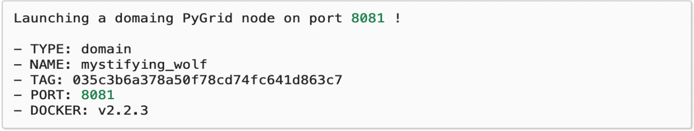

Open **PyGrid** admin UI, go to localhost:port\_number(the port\_number is 8081 by default) and login with your credentials.

Default username and password for logging into PyGrid locally are as follows:

-   username : **info@openmined.org**
-   password : **changethis**

5\. **Explore the Domain!**

Note that there will not be any users or requests as we are exploring the domain for the first time.

<p style="padding: 10px; border: 2px solid #c0c2c2; margin-left:15%; color:#323232; font-size: 18px; width: 780px"># Shows you all the available objects on the Domain Node<br>domain_node.store</p>

\# Shows you all requests currently on the Domain Node  
domain\_node.requests

\# Shows you all the user accounts on the Domain Node  
domain\_node.users

### Detail steps for launching a domain Locally/Cloud is in the links below:  

**Local deployment of a domain for Linux, Windows, MacOS :**

-   [Deploying domain on Linux](https://openmined.github.io/PySyft/install_tutorials/linux.html)
-   [Deploying domain on Windows](https://openmined.github.io/PySyft/install_tutorials/windows.html)
-   [Deploying domain on Mac](https://openmined.github.io/PySyft/install_tutorials/osx_11_5_1.html)

**Cloud Deployment of a domain:**

-   [Local deployment using Vagrant and VirtualBox](https://openmined.github.io/PySyft/deployment/index.html#local-deployment-using-vagrant-and-virtualbox)
-   [Deploying on Kubernetes](https://openmined.github.io/PySyft/deployment/index.html#deploying-on-kubernetes)
-   [Deploy to local dev](https://openmined.github.io/PySyft/deployment/index.html#deploy-to-local-dev)
-   [Deploy to Google Kubernetes Engine (GKE)](https://openmined.github.io/PySyft/deployment/index.html#deploy-to-google-kubernetes-engine-gke)
-   [Deploying to Azure](https://openmined.github.io/PySyft/deployment/index.html#deploying-to-azure)

## Illustration of launching a domain in Remote Data Science  

**The Covid dataset is created by a Data owner and uploaded to the Hagrid. A Data scientist requests only access to the pointers of the tensors to know the number of people tested positive.**

You work at a lab, and some people have been showing symptoms of COVID19. You ask everyone to take a COVID19 test, and collect the results. However, not everyone wants their test results to be known publicly. You want to respect everyone’s privacy, but at the same time you want to know if there’s been a big COVID outbreak at your lab!  
You’ve heard about a brilliant scientist at CalTech named Dr. Sheldon Cooper. He says he can analyze your dataset without ever seeing it, and still tell you how many people in your lab tested positive for COVID19.

Relevant Information:

-   You’re the owner of a COVID19 test result dataset.
-   You’ll be spinning up a domain node and creating an account for a data scientist (Dr. Sheldon Cooper)
-   The dataset you’re giving him is a binary array, such as: \[0, 1, 0, 0, 1, 1, 1, 0, 1, 1, 1\].
-   In this array, each column represents a different individual who works in your lab who was tested for COVID19.
-   A zero implies that they tested negative for it, and a “one” implies they unfortunately tested positively for it.

**Note that as of now we are going to play both the role of a “Data owner” and as a “Data scientist” just to understand how a domain functions with an example!**

**1\. Data owner creates a dataset, converts the dataset into private tensors and creates a login username/password for datascientist.**

Create a Covid Dataset of 10 People with their covid status (0-Negative, 1-Positive)

```python

import numpy as np

raw_data = np.random.choice([0,1],size=(10),p[0.3,0.7]).astype(np.int32)
raw_data = list(enumerate(raw_data))
raw_data
```

> 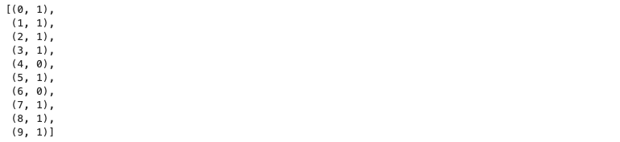

Import syft. Convert the data into tensors using sy.Tensor and make the tensor private. (Such data is called metadata which is created using differential privacy which later can be accessed by the data scientist. Each data scientist is assigned with a differential privacy budget, which reduces as the number of times the meta data is accessed.)

```python
import syft as sy
from syft.core.adp.entity import Entity

dataset = {}

for person_index, test_result in enumerate(raw_data):
    data_owner = Entity(name=f'Patient #{person_index}')
    dataset[person_index] = sy.Tensor(np.ones(1, dtype=np.int32) * test_result).private(min_val=0, max_val=1, entities=data_owner)
```

> 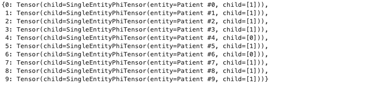

**Create a domain name ‘domain\_node’. Login to the domain on Hagrid using default ID & Password.**

There are two ways to log into your own node, as the Data Owner. The first way is using the PySyft library:

Via PySyft

```python
import syft as sy
import numpy as np
from syft.core.adp.entity import Entity

domain_node = sy.login(email="info@openmined.org", password="changethis", port=8081)
```

> 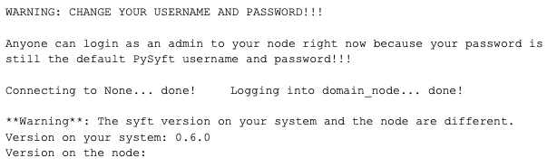

Via PyGrid UI

<figure class="">

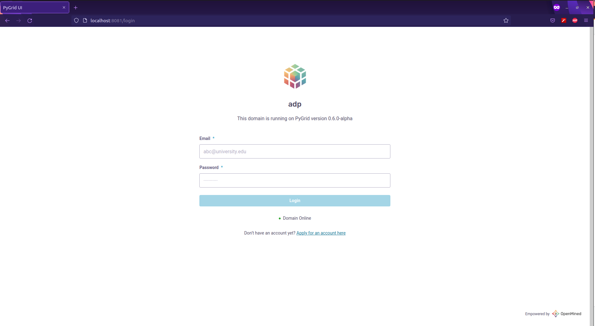

</figure>

**Load the dataset to the domain created on Hagrid.**

```python
domain_node.load_dataset(assets=dataset, name="COVID19 Test Results", description="Positive/Negative COVID19 Test results", metadata="No metadata")
```


**Check if the dataset has been created.**

```python
domain_node.datasets
```

> 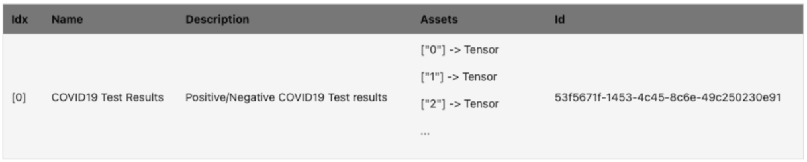

**Check if the user “Sheldon cooper” is created in PyGrid UI**.


Observe above that the “Privacy Budget = 100” initially for data scientist “Sheldon Cooper”.

<figure class="">

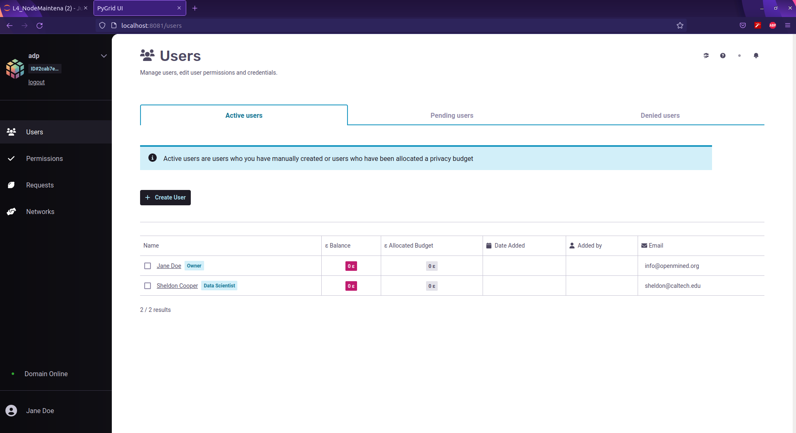

</figure>

**Different roles of users and managing permissions of the users**

<figure class="">

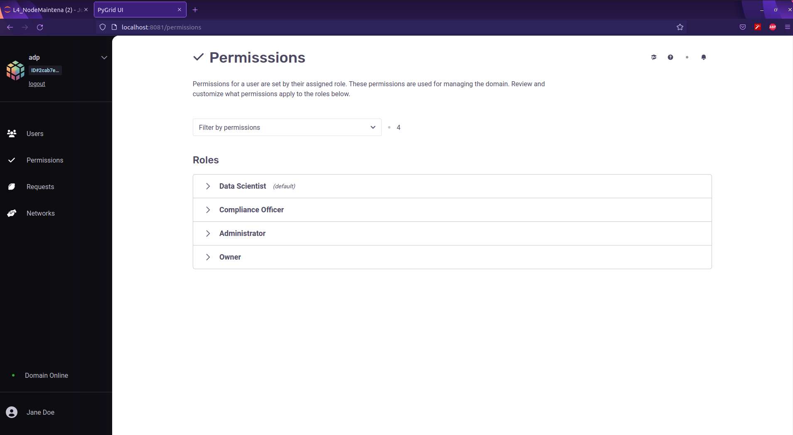

</figure>

**Parameters for each role can be configured as below:**

<figure class="">

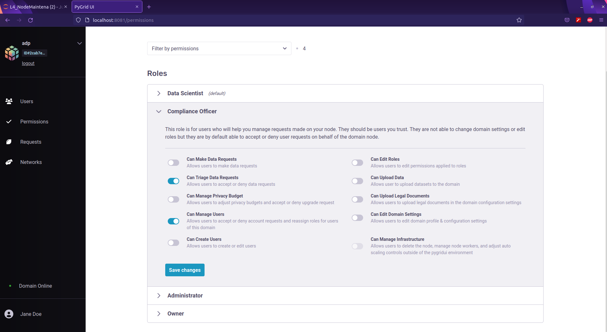

</figure>

**2\. Data Scientist logins with username/password provided by the data owner and calculates the number of covid cases.**

1\. Log into the Domain Node as the Data Scientist.  
Once a user logs into a domain, their session is saved for the next 24 hours. We will explore how a user can access a saved domain session.

```python
import syft as sy

ds_node = sy.login(email="sheldon@caltech.edu", password="bazinga", port=8081)
```

2\. View the available datasets on the Node

```python
ds_node.datasets
```


3\. Accessing specific dataset.

Now, we can see the dataset that we uploaded earlier when we were the Data Owner (Jane Doe)! Now let’s select our dataset:

Now, we can see the dataset that we uploaded earlier when we were the Data Owner (Jane Doe)! Now let’s select our dataset:

```python
# Let's get a pointer to the dataset
dataset = ds_node.datasets[0]
dataset
```


Tensor pointer of the dataset is as below:

```python
print(dataset)
```


4\. Calculate the total number of COVID cases

```python
results = [dataset[f'{i}'] for i in range(10)]

from time import sleep
total_cases = 0

for result in results:
    ptr = result.publish()
    sleep(1)
    total_cases += ptr.get()

print(f'The total number of COVID19 cases are: {total_cases[0]}')
```

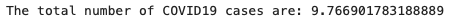

**3\. Data Owner observes the decrease in privacy budget of data scientist “Sheldon Copper”.**

Check the privacy budget spent is 12.45 out of 100 by the data scientist who has accessed the information about “The Total number of Covid19 cases”.

```python
domain_node.users
```

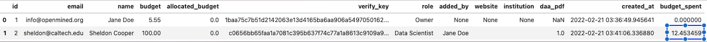

**Finally, How do you stop the Domain node?**

<p style="padding: 10px; border: 2px solid #c0c2c2; margin-left: 5%; color:#323232; font-size: 18px; width: 880px">$ hagrid land domain_node</p>

### Thank you!  

**  
\* To Andrew Trask (Leader at OpenMined) for clarifying on my questions about the domain.  
\* To Mark Rhode (OpenMined Communication Navigation Team Lead) for helping me revise my blog multiple times.  
\* To Kyoko Eng (OpenMined Product Leader) for helping me re-design the diagrams.  
\* To Madhava Jay (OpenMined Core Engineering Team Lead) for clarifying the architectural concepts of Remote Data Science.  
\* To Ionesio Junior (OpenMined AI Researcher) for providing feedback on the “Domain node example” Diagram.  
\* And, To Abinav Ravi (OpenMined Communication Writing Team Lead and Research Engineer) for reviewing my blog and mentoring me to coordinate with other teams.  
**

### References:  

1\. [Introduction to Remote Data Science](https://courses.openmined.org/courses/introduction-to-remote-data-science)  
  
2\. [Introduction to Remote Data science | Andrew Trask](https://www.youtube.com/watch?v=sCoDWKTbh3)  
  
3\. [Towards General-Purpose Infrastructure for protecting scientific data under study](https://www.google.com/url?q=https://arxiv.org/abs/2110.01315&sa=D&source=docs&ust=1653563826063751&usg=AOvVaw2NcsdRuwzGowPIVrcFQZAI)  
  
4\. [UN list of Global Issues](https://www.un.org/en/global-issues)  
  
5\. [Federated learning with TensorFlow Federated (TF World ’19)](https://www.youtube.com/watch?v=m17IgaHaoTI)  
  
6\. [“Everyone wants to do the model work, not the data work”: Data Cascades in High-Stakes AI  
](https://storage.googleapis.com/pub-tools-public-publication-data/pdf/0d556e45afc54afeb2eb6b51a9bc1827b9961ff4.pdf)  
  
7\. [Understanding the types of Federated learning.](https://blog.openmined.org/federated-learning-types/)  
  
8\. [What can Data-Centric AI Learn from Data and ML Engineering?](https://arxiv.org/pdf/2112.06439.pdf)  
  
9\. [Turing Lecture: Dr Cynthia Dwork, Privacy-Preserving Data Analysis](https://www.youtube.com/watch?v=vsA4w3itxA0)  
  
10\. [Data-centric AI: Real World Approaches  
](https://www.youtube.com/watch?v=Yqj7Kyjznh4)  
  
11\. [OpenMined – PySyft Github Library  
](https://github.com/OpenMined/PySyft)  
  
12\. [Privacy Series Basics : Definition](https://blog.openmined.org/privacy-series-basics-definition/)
