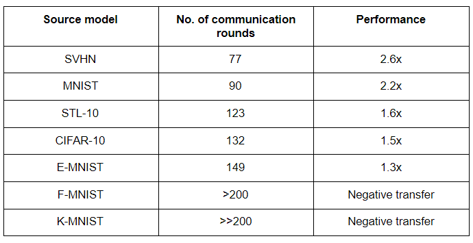

<!-- TODO(a11y): 1 localized body image(s) have empty alt text -->

**_Summary: This blog post provides a summary for each of the Research Talk’s presented during the OpenMined Research Presentations: 25 July 2020. Here is the [link](https://www.youtube.com/watch?v=b-lG-lOv6hA) to the Recording of the Presentation . The OpenMined slack handles of each speakers can also be found below._**

### Privacy & Fairness by Fatemeh Mireshghallah (@Fatemeh)

Fatemeh Mireshghallah is a 3rd year Ph.D. student at USC San Diego and an intern at MSR AI. Fatemeh and her team are working on analyzing the trade-off between utility and privacy while dealing with differential privacy on data containing many subgroups. The earlier works were mostly focussing on data with a 1% imbalance between subgroups and epsilon values between 3 and 10. But their work is focussed on data with imbalances up to 30% and epsilon values beyond the above range. When working on differential privacy, the data consists of a large number of subgroups. Sub-groups containing smaller populations lose their usability compared to those with larger populations. In DP, the utility is a compromise to get privacy. But this property is highly expressive on smaller sub-groups.

They built a smile detection model using resnet-18 on the Celebrity dataset as smiling is not correlated with gender. If there is a skew in the output, it must be due to an imbalance in the dataset. Further, the data is perfectly balanced in terms of smiling and non-smiling to nullify its influence. While looking at the test accuracies, the difference in the accuracy of males and females gets increased with an increase in an imbalance of data (an increase from 70 to 99.9). At higher epsilon levels (around 1), the model almost functioned randomly.

> _“On training, as the number of iterations is increased, differences in the training accuracies of male and female faces got increased when DP is applied. It remains the same if DP is not applied. So, it is possible to get less disparity by stopping early while compromising the accuracy.”_

Presentation of this project can be watched [here](https://www.youtube.com/watch?v=b-lG-lOv6hA&t=0s).

### Interpretable Segmentations by Fatemeh Mireshghallah (@Fatemeh)

Fatemeh Mireshghallah and her team are trying to determine the significant portions of highly sensitive medical images. Successful determination of these portions can help to remove or blacking out unnecessary portions, making it available to a wider range of research purposes. The architecture consists of two models – the interpretability model and the Utility model. The interpretability model is a linear autoencoder that outputs a map called scales map of the same size as that of the input image. Relatively important pixels can be found from the scales map. This map is then fed into the utility model.

The whole process works similarly to reinforcement learning, training on different portions of the images across numerous iterations until the most important features are found. While working with the pancreas dataset, even if the position of the pancreas varies across different images, the model would be able to capture the required portion. Once the interpretability model can capture the required portions, the interpretability model is frozen, multiply the scales to new images and send them to the utility model. Increasing the random noise in the model tends to remove unnecessary portions as the training progresses.

> _“We are looking to expand the same method for other datasets like lung images, COVID datasets, etc. We are also looking for some baseline utility methods like Grad-CAM, occlusion sensitivity to compare our results.”_

Presentation of this project can be watched [here](https://www.youtube.com/watch?v=b-lG-lOv6hA&t=360s)_._

### Automatic Sensitivity Analysis for Differential Privacy by Kritika Prakash (@Kritika)

Kritika Prakash is a Master’s student at IIIT Hyderabad and she leads the Differential Privacy team at OpenMined. Kritika and her team are working on the process of automating the addition of noise to a query using differential privacy. The difficulty in the computation of sensitivity restricts the wide adoption of differential privacy in machine learning and deep learning. The differentially private analysis consists of defining a private input data, passing it through a query function, and obtaining the resultant data. In order to prevent the extraction of private information from this data, it can be noised. When automating the whole process, there are many challenges – defining the private data, calculating the sensitivity while querying it automatically, performing arithmetic operations on numerical data, and finally adding noise to the data automatically making sure that minimum privacy budget is used.

> _“As of now, we have defined what a private scalar is and how to generalize it. Things to be done are adding privacy budget accounting support and determining what’s the best way to add noise to it.”_

Presentation of this project can be watched [here](https://www.youtube.com/watch?v=b-lG-lOv6hA&t=810s)_._

### Smoothed Score-CAM for Sharper Visual Feature Localization by Rakshit Naidu (@Rakshit Naidu (Rocket))

Rakshit Naidu and his team are developing alternative methods for Score-CAM as its output is noisy. They developed two methods of SS-CAM. The first method (SS-CAM(1)) adds noise to the activation function while the second method (SS-CAM(2)) adds noise to the normalized input mask. They generate feature maps as explained in the first talk by Fatemeh Mireshghallah, upsample, multiply them with the input image, and the results are smoothed. A linear combination is applied between the average scores thus generated and the upsampled activation maps to generate the output.

> _“While comparing the results of these CAMs and other older CAM methods, SS-CAM(2) performs better than all the other CAMs. Outputs of insertion and deletion curves support the claim. Fairness evaluation scores, localization evaluation, and human trust evals are also calculated and compared.”_

Presentation of this project can be watched [here](https://www.youtube.com/watch?v=b-lG-lOv6hA&t=1267s)_._

### Selected Transfer in Federated Learning by Tushar Semwal (@Tushar)

Tushar Semwal is a postdoc at the University of Edinburgh. Tushar and his team are working on similarity representation to perform transfer learning in a federated way. By identifying the most similar source model to a target (client) model, we can transfer the trained parameters from the source model to the target model in a federated way to achieve the desired accuracy at a lower number of communication rounds. The challenges are unavailability of target data distribution and negative transfer. The most similar model is found using the Similarity metric and the federated election is done using an electing or voting algorithm.

The similarity between the source and target model is measured by calculating the difference between the activation functions of corresponding hidden layers of the source model and the target model. We need not look at the target data distribution. Centred Kernel Alignment performed better than all others with comparatively fewer datasets for comparing representation between layers of different models. Now to choose the best source model, a federated voting algorithm is developed where the source models are transferred to the client. Clients are voted for the source model with maximum CKA value. Finally, parameters of the source model with maximum parameters are transferred to the client model to continue the federated training.

Choosing USPS handwritten dataset as the target mode and MNIST, K-MNIST, CIFAR-10, E-MNIST, SVHN, F-MNIST, and STL-10 as the source models, the results obtained are tabulated. A native target model without any transfer trained in the USPS dataset took 200 communication rounds to reach 96% accuracy.

<figure class="">

</figure>

_“Still, there are some questions to be answered._

1.  ___When should we start voting(after how many communication rounds)?___
2.  ___Is CKA sufficient or should we look for better representation comparison methods?”___

Presentation of this project can be watched [here](https://www.youtube.com/watch?v=b-lG-lOv6hA&t=1736s)_._

### Privacy-Preserving Pediatric Pneumonia Prediction Project by Georgios Kaissis (@George)

Georgios is a post-doc at the Technical University of Munich and the Imperial College London working in the biomedical imaging analysis group. His team in OpenMined is working on predicting paediatric pneumonia (whether it’s normal, bacterial or viral) from chest x-ray images using OpenMined stacks like PySyft and PyGrid. Their proof of principle indicates that it’s possible to solve this problem through Federated training and Secure Inference. In the process of implementing the whole pipeline, they are also attempting to find bugs in the existing framework and observe real-life difficulties to be faced while turning such a solution into a reality. He also pointed out some of the challenges they have faced so far including lack of batchnorm in ResNet-18 pre-trained model, GPU support, distribution of augmentation of dataset to be performed locally on the nodes, limitation of WebSockets and Grid Nodes etc. Their current result is quite comparable to human baseline and could be improved. He concluded by requesting people who are interested to get on board to reach out to @GKaissis through slack.

> _“Since radiologists are extremely expensive and rare especially in the developing world, it would make sense to offer a solution for example machine learning as a service or inference as a service which is end-to-end encrypted and privacy preserving in order to perform these diagnoses remotely.”_

Presentation of this project can be watched [here](https://www.youtube.com/watch?v=b-lG-lOv6hA&t=2285s)_._

### DKTK JIP Deployment Postmortem by Georgios Kaissis (@George)

DKTK is German cancer consortium which is dedicated to tackling the most demanding clinical challenges in cancer research. On the other hand, JIP (Joint Imaging Platform) is an architecture where 11 German Universities were provided with harmonized hardwares (servers) which are all connected to central repositories and provided with centrally developed tools such as machine learning tools like PyTorch, NLTK etc. Using JIP, people can upload their ML models to the central registry and the local nodes can download and test them on their own use cases. Such architecture aims to increasingly decentralize the task of data processing in the domain of medical imaging. In the DKTK JIP deployment project, Georgios and his colleagues in OpenMined have successfully deployed the PyGrid and PySyft stack on one of the JIP servers and enabled it to be used for privacy-preserving machine learning within the single organization. Recently, JIP has been replaced by it’s open-source version named as DECIPHER which will open the door for anyone interested to leverage the project.

> _“I found it quite interesting that sort of the barrier towards a more widespread deployment specially a sort of federated learning scenario which would connect the individual sites among them were sort of more dependent on the willingness of the IT and IPSec teams to open up the firewalls so the servers could communicate with each other.“_

Presentation of this project can be watched [here](https://www.youtube.com/watch?v=b-lG-lOv6hA&t=2763s)_._

### Benchmarking Differentially Private Residual Networks for Medical Imagery by Sahib Singh (@Sahib)

Sahib Singh has joined as a machine learning research engineer in Ford Research after graduating from Carnegie Mellon University with a Master’s in Analytics and Data Science. His research team in OpenMined has benchmarked two privacy mechanisms named as local-DP and DP-SGD on medical imagery and reported their findings. Originally they have used two datasets, one is the Chest X-ray dataset for pneumonia detection and the other one is diabetic retinopathy dataset for determining diabetics severity of patients.

For benchmarking local-DP, they have generated three more datasets from the two original datasets by adding different scales of perturbations to the images. Then they are passed on to train a ResNet-18 model for getting the desired output. Similarly, for benchmarking DP-SDG three levels of perturbations were added after modifying the dataset gradients by clipping them using L2-norm, then adding random noise and finally multiplying them by the learning rate. Just like the previous case, ResNet-18 is trained using the perturbed datasets.

Their experiment shows that although the original model training accuracy for both the use cases are around 99%, as the level of perturbation in Local-DP increases, the training accuracy gradually decreases. However, the test accuracy in the perturbed models are always higher than their respective training accuracy. They also reported two important observations. Firstly, the perturbed images visually looked quite similar to their original versions, which raises a question about the effectiveness of this mechanism. Secondly, the test accuracy in the perturbed models are higher than the training accuracy. A possible explanation to this phenomena could be that the test images are not perturbed and being passed in their original format. Therefore, it allows the model to train on more complex latent features but being tested on raw images having less complex latent features.

He concluded by mentioning some future research directions including testing the robustness of such Differential Privacy mechanisms on Membership Inference Attacks. Apart from that, some of their upcoming projects will include PrivateNLP and Emotion Analysis.

> _“We want to evaluate privacy both in terms of a theoretical guarantee as well as from a visual standpoint.”_

Presentation of this project can be watched [here](https://www.youtube.com/watch?v=b-lG-lOv6hA&t=3100s)_._

### Privacy Preserving Recommendation Systems by Aditya Patel (@aditya)

Aditya leads the data science team in an India-based gaming platform company called Mobile Premier League. He, along with his colleagues in OpenMined have developed a privacy-preserving recommendation system by implementing Matrix Factorization, one of the core parts of the system using Neural Networks in a federated fashion. For their use-case, they used 100K MovieLens dataset containing movie ratings given by users. Their approach was able to replicate the result achieved by the baseline approach proposed by Ammad-ud-din et. al. In order to add non-linearity to Matrix Factorization, they have also implemented a neural collaborative filtering. Their future works include extending the current model for implicit recommendation tasks like game or songs recommendations etc. and complexify the current architecture to be applied in non-static use-cases like news article recommendations. Finally, he mentioned that they are actively looking for collaborators to join the team.

> _“In every app we use, recommendation systems are powering the search and the recommendation we see on the app. Thus, converting this to a federated fashion or distributed fashion is essential for us to develop better systems.“_

Presentation of this project can be watched [here](https://www.youtube.com/watch?v=b-lG-lOv6hA&t=3668s)_._

### Federated Learning: Computational Complexity by Ayush Manish Agrawal (@ayush)

Ayush is working as a full-time software engineer and part-time researcher in machine learning after graduating from the University of Nebraska. His team in OpenMined is working on understanding the complexity of reproducing different Federated Learning algorithms proposed in existing research papers by implementing them in PyTorch. Along with other objectives, their ultimate goal is to build an open-source standard repository of FL algorithms written in PyTorch and PySyft and publish a compilation of all their experiments as a code-based survey paper which will be the first of its kind. They have already implemented Federated Averaging proposed in a paper where they have been able to surpass the reported accuracy by using a lot less number of hyperparameters than what the authors have used. Currently they are comparing Federated Average with FedProx. Initial result indicates that FedProx outperforms Federated Averaging. Ayush also presented a few other interesting observations found through their experiments.

For future work, they would like to implement the same algorithms in PySyft and develop a standardized metric for comparing different FL algorithms.

> _“\[In the Federated Averaging paper\], authors said that they have a total of 1.6 million parameters in their CNN architecture but when I replicated their architecture I only got around six hundred thousand trainable parameters which was interesting.”_

Presentation of this project can be watched [here](https://www.youtube.com/watch?v=b-lG-lOv6hA&t=4055s)_._

### Adversary’s Utility in Federated Learning by Anupam Mediratta (@anupamme)

Anupam is a PhD student at the _University of Edinburgh._ He begins by stating that the advantages of Federated Learning can also be its vulnerability. That is, decentralized and heterogenous data can lead to Backdoor attacks!  He then gives a quick introduction to backdoor attack followed by some examples such as person identification error, CIFAR backdoor, word prediction, etc. He explains that backdoor attack usually effects nodes with unique features such as cars in green, vertical stripes on background, language attack types, etc. Where, an adversary can call cars with pink colour as bird! Or anything of their choice.

He further speaks of the defences and their cost proposed in various publications such as Krum and Multi-Krum assuming data to be homogeneous but negatively affects the fairness, followed by Norm differential clipping and weak Differential Privacy. Anupam then speaks of the choices available to the Adversary and their effects (pros and cons) such as adding more nodes or poisoning the data or picking optimal sets of triggers! Followed by their trade-offs and advantages.

He then points out that the adversarial utility is not straight forward as its rather a game play between the server and the adversary. So, needs to be calibrated in given scenario.

> Because the distributed attack is better but not always true, and more poisoned data is better but it can make the nodes visible, high attack frequencies leads to better chances of success but with an open problem of “How to select trigger? How to know whether trigger is high or low probability, given the attack budget how to select the triggers optimally?”

Presentation of this project can be watched [here](https://www.youtube.com/watch?v=b-lG-lOv6hA&t=4864s)_._

### Privacy Preserving Meta Learning Group by Harshvardhan Sikka (@Harshsikka)

Harsh completed his Master’s from Harvard and Georgia Tech for Neuroscience and Computer science. Works at Spectral Lab as a Research Scientist Leading Autonomous Adversarial Defence Team and also, working on CV related projects. He is also, a Research Scientist at OpenMined, leading Privacy Preserving Neural Architecture Team. He and his team are working on various projects at OpenMined, out of which the primary focus for the presentation is **Privacy Preserving technology for Multi-Modal Learning and Neural Architecture Search.**

As per Harsh, different architectural search algorithms can be grouped into 3 spaces –  Reinforcement Learning based , Evolutionary and Differential Method. Treating search spaces constant and optimize along it for computational efficiency in Federated Learning setting, though it is tough for traditional setups. At higher level proposes DP FNAS –  a gradient based architectural search to update the client models in the Federated setting and adding noise to the gradients in Differentially Private Framework including theoretical analysis. He then speaks of the good performance by this setup followed by its offshoots in the research directions and the couple of choices made by the publishers such as one, its computationally very efficient and two,  DP perfectly matches their framework, etc. He then speaks of the direction his team is heading to like bench marking the performance of these setups in the same way as they did with the residual network, comparing different stats about the performance and qualitative comparison of generating topology of different primitives, multi-modal stuff modification and other novel contributions.

> “Architecture seems effective in the Federated setting but alone with the Federated setting doesn’t really provide privacy guarantees, because of the sort of sharing of these different sort of intermediate statistics, so applying gradients based on Differential Privacy seems like a useful extension to this general setup.”

Presentation of this project can be watched [here](https://www.youtube.com/watch?v=b-lG-lOv6hA&t=5424s)_._

### Federated Online Learning for Time Series Data by Franz Papst (@Franz Papst)

Franz Papst is a PhD student at Graz University of Technology. He and his team – Tushar Semwal, Santiago Gonzalez, aims to study affirmative online learning for time series data. For which the motivation comes from the idea of many devices on edge receiving constant sensor data, which they want to use as a setting for Federated Learning, using WESAD dataset, a multimodal dataset for various stress and defecting detection consisting of data from 15 subjects. He then speaks of how MNIST like dataset is not available for the time series, but the team managed to find one and create a Non-Federated Learning and ML or DL baseline for the above. The dataset is recorded using chest based devices. The Research team used different methods like LDA and LSTMs and turns out the LSTM performs quite well! He later concludes with the aim is to build Federated Learning based LSTM models after which the team may start focusing on using diffusion network for effective detection followed by experimenting with online learning.

> Training in Federated learning setting and exploring strategies to how to distribute it. One which works for each subject in the test set, also with the imbalanced affected with state labourers. Used a global test set with 30% random subjects. But, the PySyft library not being good enough for the application yet!

Presentation of this project can be watched [here](https://www.youtube.com/watch?v=b-lG-lOv6hA&t=6009s)_._

### Efficient Encrypted ML by Stephen Fox (@fox, @vishal)

Stephen and his team at OpenMined, believes in “_Better Machine Learning than Cryptography_” over the general view of “Better Cryptography than Machine Learning”. The motivation for which comes from the idea of Privacy via encryption, which may also open up ML to security sensitive problems and a question,  Can encryption be used by default? He further mentions, based on the prior works published, which mostly focused on better Neural Network via improving the fundamentals, encrypted ML is rather SLOW! He also mentions some of the limitations of the prior work such as weak set of primitives, small datasets/models, everyones focus being on optimizing for the inference runtime. They chose FALCON for case study. Later ends the presentation by team’s roadmap and status updates.

> “In pursuit of improving crypto-oriented neural architecture search by building on new primitives”

Presentation of this project can be watched [here](https://www.youtube.com/watch?v=b-lG-lOv6hA&t=6338s)_._

---
