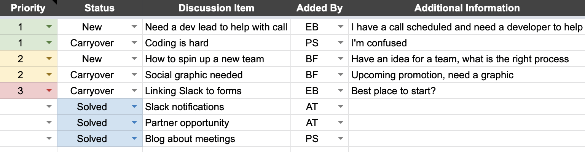

<!-- TODO(a11y): 2 localized body image(s) have empty alt text -->

OpenMined is fortunate to have grown to a community of 7,300+ engineers, researchers, and marketers, dedicated to lowering the barrier-to-entry to private AI technologies through open source code and free education. We currently have 8 development teams, 6 community teams, and 2 research teams with 100+ people meeting each week. As a fully remote, mostly volunteer community, our interactions, meetings, and collaborating are done almost entirely online.

This article outlines what we’ve learned from running thousands of meetings over the past few years. Specifically, it explains how to run effective remote meetings with an open source community across many countries and time zones. While this article is focused on open source communities, many of the principles apply to any type of company or remote work arrangements.

## Why do we care so much about having a positive experience in a meeting?

In an open source community, members are volunteering their time or being paid below market value, typically on a part-time basis. In a regular, paid organization, you can hold someone accountable for their work output, their time, and specific policies. While accountability and norms are important in any functional group, the stakes and tone are different in a volunteer-driven open source community. Open source communities are also typically more distributed than other organizations, meaning the members are spread across the globe with no central location or even satellite locations. This changes how the community interacts with one another. Our online calls are not only important for productivity: they are our prime opportunity to build our community relationships.

## Communicate the Purpose & Agenda

“I survived another meeting that could have been an email.” If you’ve spent any time on LinkedIn (or sometimes Instagram) you’ve probably seen a meme expressing this sentiment. Don’t be that meme. Let’s assume we do need a meeting — make sure the purpose is known ([here is a great Harvard Business Review article](https://hbr.org/2015/03/do-you-really-need-to-hold-that-meeting) mapping how to decide if you need a meeting). The purpose can range from “a quick weekly check in to see what each person is working on to hold us all accountable” to “I am working with a potential partner who is interested in building out a use case, but I need help from a developer to figure out how this aligns with our roadmap.” Make sure all of the meeting participants know why they are in the meeting and what you are looking to discuss. This includes sending everyone an agenda, or worst-case, high level talking points prior to the meeting. People learn and communicate differently so allowing people to prepare ahead of time will maximize the outcomes and inclusion.

<figure class="">

<figcaption>This is a real agenda from one of our weekly team syncs</figcaption></figure>

## Nail Down the Meeting Logistics

Everyone is busy. Most members of an open source community have full time jobs, demanding freelance schedules, or are working towards bachelor/master/PhD level degrees. To have an effective meeting you need the right people in the room, and to have the right people in the room you need to give them the opportunity to be there.

-   Know the time zones of the participants and work to find a reasonable time for all participants.
-   Make sure to give the necessary participants enough lead time, and a few options for times that could work.
-   For recurring meetings, work to have the meeting at the same time every week/month/quarter and work to never reschedule that meeting.
-   If somebody is unable to join that week/month, the meeting carries on as planned.
-   If there are too many people unable to attend, the facilitator can declare the meeting canceled (or delegate that responsibility to somebody else if the facilitator cannot attend).

To avoid delays, always add the conference details in the calendar event details and don’t be shy about also posting the details into a Slack channel (or whatever communication platform you use) with the participants.

## Identify Roles

Every meeting should always have a facilitator. Even if the meeting is intended to be a brainstorm, you need somebody on point to state the purpose of the meeting and to make sure it is moving smoothly. It is also this person’s responsibility to keep everyone focused on the goals at hand and redirect any tangential conversations (with grace and tact). There should also be someone in charge of capturing the notes and any to do items that might come out of the meeting. Not all meetings require notes, but they almost always require some type of next step, even if it is simply “you need some time to think about it, I will make sure to follow up with you in a week to see what progress has been made.” Don’t leave next steps to assumption.

## Choose the Right “Location”

If possible, video conferring is the best way to conduct open source meetings. We use Google Hangouts and prefer that all meeting participants have their video enabled\*. Video gives us the opportunity to see one another, pick up on reactions (smiles, frowns, confusion, overwhelming laughter, etc.) and helps to build better relationships with one another. If someone is having a poor connection, we can choose to cut video (or mute audio when not talking), but always default to seeing one another. You should also ask everyone to be in a physical location where they can speak openly without worrying about someone around them overhearing. This ensures the meeting is most impactful, without someone saying “sorry, I can’t really talk about that right now.” If you can do meetings from home while holding your dog, that checks all the right boxes, increasing morale for all (mostly joking).

_\*We would like to note that, for various reasons, some people strongly prefer to not turn on their video, and that’s okay, too. No one should necessarily be made to feel uncomfortable for the sake of community building._

## Start Light

Most of your community members have probably never met and some of have never spoken with one another outside of Github, Slack, or something along those lines. Take the first few minutes to just chat. Ask questions like “what country are you located in”, “How was your trip to London?”, etc. Andrew, our project founder, starts many of our meetings with a joke to lighten the mood. Build some time for banter into the agenda so nobody feels like we are just wasting time. Keep in mind that, in a work-from-home environment, some people might get lonely or be feeling anxious. It’s nice to begin with light communication — check in with your colleagues.

## Speak Clearly

I am a fast talker and have had to be more mindful of my speed when interacting with non-native English speakers. I once received a direct message from the meeting facilitator mid-meeting, kindly pointing out that I was speaking quickly and that there were others on the call who would benefit from a slower pace. That feedback was helpful for everyone involved. Consider what language is being used in the meeting and whether that is a primary or secondary language for others. Work to adapt your own tendencies to accommodate everyone in the meeting.

## Focus on the Highest Priority Items

You only have so much time to discuss the issues at hand so always build the agenda to focus on the highest priority items. It is the facilitator’s job to guide the meeting agenda. If too much time is being spent on lower priority items, step in and redirect the conversation. If an important discussion breaks out but only involves a small subset of the meeting participants, suggest that they take the conversation offline or continue it later on a separate call. For some of our meetings, we run the meeting using a spreadsheet that has a list of all items we would like to discuss. All participants have access to this spreadsheet and can add to it throughout the week. At the beginning of the meeting, we pick the top three priorities and discuss each of those. If we have time remaining, we pick the next most important item, and so on. When discussing issues, work to discuss the core problems, not just symptoms of a bigger problem. For those familiar, this is a key component of the [Traction EOS Model](https://www.eosworldwide.com/eos-model).

<figure class="">

<figcaption>Note: These items were made up for the purpose of this post.</figcaption></figure>

## Always Send Meeting Recaps

It is not practical for all stakeholders to be a part of every meeting. Even if everyone is a part of it, not everyone will remember all of what was discussed. To help things move smoothly, always recap the high points of the meeting in writing to all the necessary stakeholders. If there were to-dos captured, make sure to send out what needs to be done, by whom, by when.

## Conclusion

Every community is nuanced. The most effective meeting structure is going to vary based upon your mission, culture, and the structure of your community. Consider these principles and adapt your structure to best suit your culture.
