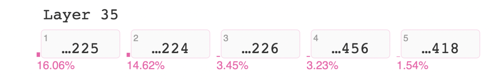
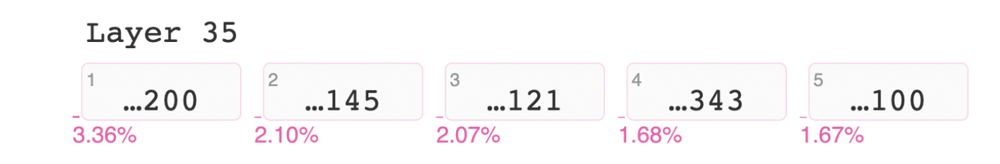
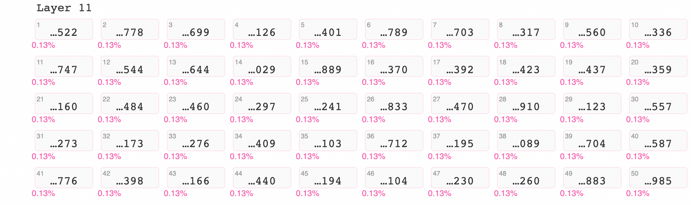
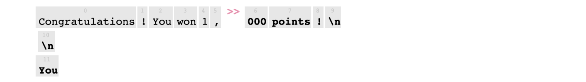
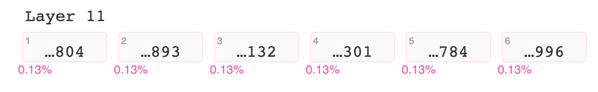

<!-- TODO(a11y): 7 localized body image(s) have empty alt text -->


<!-- TODO(content): tweet embed (verify) -->

## What do GPT-2 and GPT-3 know about us?

Since OpenAI’s release of GPT-2 in 2019 and GPT-3 in 2020, users have praised them for generating remarkably human-like text.

In recent research, members of Berkeley AI Research (BAIR) have shown how these text models [memorized personal information](https://bair.berkeley.edu/blog/2019/08/13/memorization/) \[1\] and that [memorized sequences](https://bair.berkeley.edu/blog/2020/12/20/lmmem/) \[2\], such as phone numbers and copyrighted works, can be teased out of the model weights. This information is in a grey area where it _was_ found on the public internet, but we don’t know if it was meant to be private, and we don’t want it to appear in a generated story or chatbot message.

In February 2021, a company using generative text models on user chats was discovered to leak names and private information. Researchers discovered that their model was using an unusual architecture which made memorization more likely, but it should serve as a warning for developers to take this risk seriously.

<figure class=""><blockquote class="twitter-tweet" data-width="550"><p lang="en" dir="ltr">I was initially excited to see our attack already showing up in the wild but the numbers reported didn’t line up with our experiments – so I dug into it. A THREAD: <a href="https://t.co/3N5xqzEgj7">https://t.co/3N5xqzEgj7</a></p><p>— Ariel Herbert-Voss (@adversariel) <a href="https://twitter.com/adversariel/status/1359363722590834689?ref_src=twsrc%5Etfw">February 10, 2021</a></p></blockquote><p><script async="" src="https://platform.twitter.com/widgets.js" charset="utf-8"></script></p><figcaption>Research scientist Ariel Herbert-Voss comments on the story posted by Yong-Yeol Ahn [3]</figcaption></figure>

## Can we remove this private information?

[BAIR’s 2020 post](https://bair.berkeley.edu/blog/2020/12/20/lmmem/) \[2\] concluded that removing this information is a difficult problem to automate at scale. Consider the following:

-   Personal/private information takes many forms.
-   Some public information looks like private information, for example, the address of Apple headquarters, the phone number of a restaurant or other business.
-   Some personal information is public knowledge, such as Abraham Lincoln’s birthday

GPT-2 does not directly encode where it reads a sequence or how frequent it is. A nuclear option of removing all dates, addresses, or numbers would likely be too restrictive.

## Let’s talk about phone numbers

Phone numbers are the easiest piece of personal information to identify. An app could put a simple filter between the generative model’s output and the internet. We need a more complex process if we’re publishing model weights and embeddings. There are three scenarios to avoid:

-   A prompt such as 867-\_ completes to a memorized phone number.
-   A complete phone number returns other information about the owner.
-   A name (Sarah Connor) returns their personal phone number.

Here we can look inside the model’s thinking after seeing the prompt _“Call 202-”_. I used Jay Alammar’s [ecco](https://github.com/jalammar/ecco) library \[4\] to show the token breakdown of the generated text, and probabilities of the middle and final digits of the number:

```python
output_0 = lm.generate("Call 202-", generate=8, do_sample=False)
```

<figure class="">


</figure>

```python
output_0.layer_predictions(position=3, layer=35, topk=5)
```

<figure class="">



</figure>

```python
output_0.layer_predictions(position=6, layer=35, topk=5)
```

<figure class="">



</figure>

The model determined some sequences are much more likely to appear here.

With that context, here’s my thought process:

-   Is it OK to generate a randomized but still valid phone number?  
    Or should we use -555- phone numbers like in movies?
-   The vocabulary includes a _starter_ token and a _suffix_ token for most three-digit numbers. If we disable all three-digit _suffix_ tokens, the model would stop after generating “202-” or “(202) 707-”. This anonymizes phone numbers, but would cause havoc for all counting numbers over 999.

## Exploring access points

There are four points to mess with GPT-2: vocabulary, input embeddings, output embeddings, and internal weights.

-   By changing the vocabulary and merges.txt, we could remove the ability to recognize some tokens, or swap tokens’ meanings.
-   By moving input embeddings, we could give input numbers similar meaning (disconnecting them from following sequences).
-   By moving output embeddings, we could make the model unlikely to generate numbers (for example, moving them close to ‘wheelbarrow’).
-   By fine-tuning the whole model, we could overwrite previous weights and memorize new sequences. We could add and train a new set of more randomized number tokens.

## Bet it all on +000

[In this notebook](https://colab.research.google.com/drive/1X31TIZjmxlXMXAzQrR3Fl1AnLzGBCpWf?usp=sharing) \[5\], you can see my process to swap all three-digit number suffix tokens with other number tokens. I then remembered all of the token ids which I had changed, and moved their input and output embeddings to match +000.

I use ecco again to view tokens generated to complete a phone number. Here you can see that all of these three-digit number suffix tokens have equal probability.

```python
output_1.layer_predictions(position=7, layer=11, topk=50)
```

<figure class="">



</figure>

Directly prompting phone numbers had odd results — some return text (like “Call 202-**9728–Dental**”), and some formed a four-digit number from two two-digit tokens. In the next round of development, I moved two-digit suffix tokens to +00, and I removed all numbers from merges.txt.

Luckily non-phone number prompts such as “_**Congratulations, you won 1**,_” continue to return valid numbers (“you won 1,000 points!”), now with equal weights for numbers.

### Before editing weights and embeddings

```python
output_2 = lm.generate("Congratulations! You won 1,", generate=6, do_sample=False)
```

<figure class="">



</figure>

```python
output_2.layer_predictions(position=6, layer=11, topk=6)
```

<figure class="">


</figure>

### After editing weights and embeddings

```python
output_3 = lm.generate("Congratulations! You won 1,", generate=6, do_sample=False)
output_3.layer_predictions(position=6, layer=11, topk=6)
```

<figure class="">



</figure>

## Posting the model

This process seems to successfully confound GPT-2’s number process, so I ended up not adding any new tokens or fine-tuning on new data. It would be interesting to see this process work on a larger-sized GPT model, or in other countries’ phone number formats and numerals.

I published my new model vocabulary and embeddings on [huggingface.co/monsoon-nlp/no-phone-gpt2](https://huggingface.co/monsoon-nlp/no-phone-gpt2)  \[6\] — this will still generate some phone numbers, but it is randomized and much less conducive to phone numbers compared to the original [huggingface.co/gpt2](https://huggingface.co/gpt2) \[7\]. Let me know if you are able to decode the original tokens or prompt real personal information!

## Next steps: Addresses

The next type of information which I’d consider excising from GPT models would be global addresses.  
My thought is to collect lines of text from CommonCrawl containing addresses, and then fine-tune GPT-2 _against_ completing the text. To avoid focusing on specific addresses, it might be better to predefine groups of tokens (avoiding all numbers, all city names etc.), or even include an address parser ([libpostal](https://github.com/openvenues/libpostal) \[8\]) in the loss function. This would be more complex and time-consuming than most loss functions, but ought to successfully tune out memorized addresses.

---

## References

\[1\] Carlini, N. “Evaluating and Testing Unintended Memorization in Neural Networks” 13 Aug 2019. [https://bair.berkeley.edu/blog/2019/08/13/memorization/](https://bair.berkeley.edu/blog/2019/08/13/memorization/)

\[2\] Wallace, E.; Tramèr, F.; Jagielski, M; Herbert-Voss, A. “Does GPT-2 Know Your Phone Number?” 20 Dec 2020. [https://bair.berkeley.edu/blog/2020/12/20/lmmem/](https://bair.berkeley.edu/blog/2020/12/20/lmmem/)

\[3\] Herbert-Voss, Ariel; Twitter thread; 9 Feb 2021. [https://twitter.com/adversariel/status/1359363722590834689](https://twitter.com/adversariel/status/1359363722590834689)

\[4\] Alammar, J. GitHub repo: [https://github.com/jalammar/ecco](https://github.com/jalammar/ecco)

\[5\] Doiron, N. Colab notebook: [https://colab.research.google.com/drive/1X31TIZjmxlXMXAzQrR3Fl1AnLzGBCpWf?usp=sharing](https://colab.research.google.com/drive/1X31TIZjmxlXMXAzQrR3Fl1AnLzGBCpWf?usp=sharing)

\[6\] Doiron, N. HuggingFace repo: [https://huggingface.co/monsoon-nlp/no-phone-gpt2](https://huggingface.co/monsoon-nlp/no-phone-gpt2)

\[7\] HuggingFace repo: [https://huggingface.co/gpt2](https://huggingface.co/gpt2)

\[8\] OpenVenues. GitHub repo: [https://github.com/openvenues/libpostal](https://github.com/openvenues/libpostal)
