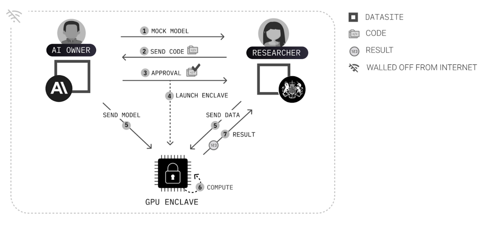
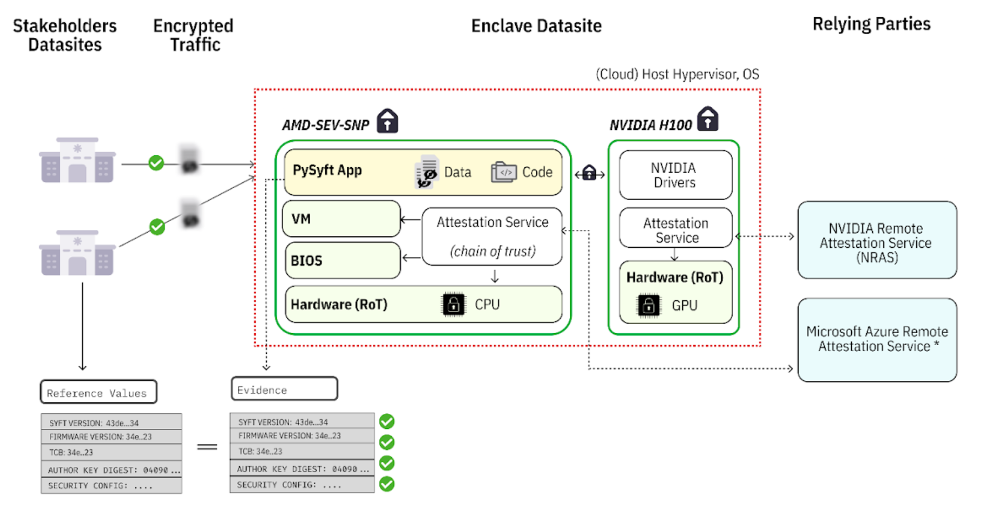
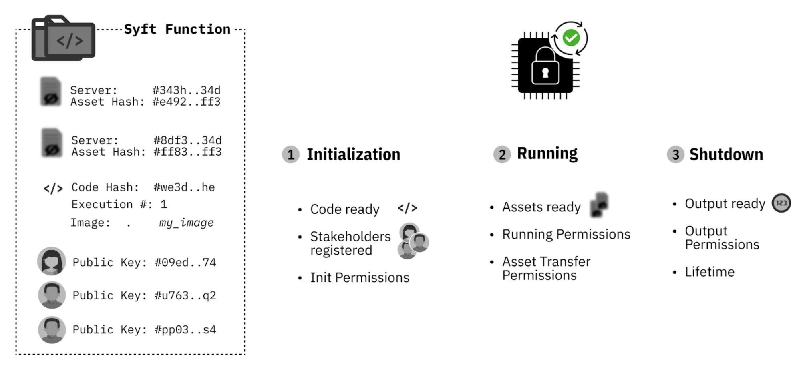

<!-- TODO(content): shortcode(s) present (verify) -->

Andrew Trask\*, Aziz Berkay Yesilyurt\*, Bennett Farkas\*, Callis Ezenwaka\*, Carmen Popa\*, Dave Buckley\*, Eelco van der Wel\*, Francesco Mosconi‡, Grace Han‡, Ionesio Junior\*, Irina Bejan\*, Ishan Mishra§, Khoa Nguyen\*, Koen van der Veen\*, Kyoko Eng\*, Lacey Strahm\*, Logan Graham‡, Madhava Jay\*, Matei Simtinica\*, Osam Kyemenu-Sarsah\*, Peter Smith\*, Rasswanth S\*, Ronnie Falcon\*, Sameer Wagh\*, Sandeep Mandala‡, Shubham Gupta\*, Stephen Gabrie\*l, Subha Ramkumar\*, Tauquir Ahmed\*, Teo Milea\*, Valerio Maggio\*, Yash Gorana\*, Zarreen Reza\*,

Anthropic‡, UK AI Safety Institute§, OpenMined\*

## Summary

Artificial intelligence (AI) safety evaluations often involve exchanging sensitive information, creating privacy and security challenges for both evaluators and AI developers. While secure computation methods have been proposed to provide mutual confidentiality, their practical feasibility remains unproven. This blog post presents a pilot experiment conducted by OpenMined, in partnership with staff from the UK AI Safety Institute (AISI) and Anthropic, to test secure enclaves for AI evaluation. We implemented a small-scale test using cloud infrastructure to evaluate an open-source model (provided by Anthropic as a proxy for their models) against an AISI-hosted CAMEL-bio dataset. Our approach used NVIDIA H100 secure enclave technology and OpenMined’s PySyft framework to maintain data and model privacy throughout the evaluation process, revealing the current boundary of robust security and surfacing the next areas of security work. To our knowledge, this is the first practical test of NVIDIA H100 secure enclaves for AI evaluation across two organizations, providing insights into the end-to-end, practical challenges and potential of this approach for enhancing AI evaluations.

## Introduction

The past decade has witnessed a significant convergence of AI governance research and secure computing technologies, a development that has been driven by the need to address a complex array of ethical, societal, and policy challenges inherent in the rapid advancement of AI systems. This interdisciplinary integration has been motivated by the dual necessities of fostering responsible AI development and deployment, while simultaneously ensuring the preservation of data integrity and the maintenance of robust model security throughout the entire lifecycle of AI applications, from conception to implementation and beyond \[51\].

  
_Figure 1: The multi-step process used to approve and execute an eval on a GPU enclave_

### Evolution of AI Governance

The field of AI governance has undergone significant development over the past decade, progressing from initial ethical frameworks towards increasingly comprehensive global standards and policies. This evolution has been characterized by collaborative efforts among academic institutions, industry leaders, and international organizations working towards the responsible development and deployment of AI technologies. The chronological progression of AI governance can be summarized as follows:

-   **1942-2003**: Initial writing on AI, ethics, and safety \[1, 2, 3, 4, 5, 6\].
-   **2000-2020**: Establishment of numerous AI ethics and safety research organizations \[7, 8, 9, 10, 11, 12, 13, 14, 15, 16, 17\], and the publication of foundational theories of the field \[18, 19, 20, 21, 22, 23, 24, 25\].
-   **2016-2023**: Establishment of key alliances emerge across private, public, and civil society \[26, 27, 28, 29, 30\].
-   **2017-2023**: Establishment of AI safety/ethics teams and policy positions by the largest AI technology companies and governments \[31, 32, 33, 34, 35, 36, 37, 38, 39, 40, 41, 42, 43, 44, 45, 46, 47, 48, 49, 50, 51, 52, 53, 54, 55, 56, 58, 59, 60, 61, 62, 63, 64, 65, 66, 67\].
-   **2022-Present**: Launch of independent AI safety institutes by governments and initiation of legislation to establish AI governance as a global institution.

### Advancements in Secure Enclaves

Concurrent with the progress in AI governance, the development of secure computing technologies has advanced and is likely to be crucial in protecting data confidentiality and integrity during more robust AI processing in the near future. As they progressed, secure hardware technologies were subject to vulnerabilities, such as microarchitectural data sampling \[105, 106, 107, 108\], fault injection \[109\], or side-channel attacks \[110\]. These historical vulnerabilities helped mature CPU enclaves and increase their public trust, with the GPU enclave still under a public beta. Significant advancements from key technology companies have established standards that ensure sensitive information remains secure throughout an information flow, including information flows necessary for AI development and deployment. The evolution of secure enclaves can be summarized as follows:

-   **1980s-2000s**: Initial research and development on secure hardware and co-processors \[57\].
-   **2004-2015**: Launch of commercial secure computing products, including ARM’s TrustZone (2004), Apple’s Secure Enclave in iPhone 5S (2013), Trusted Computing Group’s Trusted Platform Module, and Intel’s Software Guard Extensions (SGX) (2015) \[68, 69, 70, 100\].
-   **2017-2019**: Advancements in secure cloud computing with Azure Confidential Computing and Google’s Asylo, Titan Security Chip, and Project Oak \[71, 72, 73\], culminating in the establishment of the Confidential Computing Consortium \[74\].
-   **2020-2023**: Expansion of secure computing capabilities with Google Confidential VMs, Confidential Space, and Microsoft’s NVIDIA GPU integration for secure AI \[75, 76, 77\].

### Integration of AI Governance and Secure Hardware Technology

As AI governance frameworks and secure computing technologies evolved, early efforts to integrate these fields began to take shape. Concepts like Structured Transparency \[105\] and Structured Access \[106\] emerged, offering blueprints for combining ethical governance with technological safeguards. These frameworks aimed to create secure, transparent AI systems that could be audited without compromising sensitive information. Seminal works in this field, such as “How to Catch a Chinchilla” \[107\] illustrated practical approaches to these challenges, proposing methods that could be used to ensure both transparency and confidentiality in AI systems. Subsequent research further bridged AI governance theory with encrypted computation in practice \[84, 85, 86, 87, 88, 89, 91, 92, 93, 94, 95\]. And finally, policy positions like Biden’s Executive Order on AI directed agencies to secure enclaves in their plans to further safe, secure, and trustworthy AI \[32\].

### Gap Between Theoretical Frameworks and Practical Implementation

Despite these advancements, a significant challenge persists: the concepts developed have largely remained theoretical and have not been extensively tested in end-to-end, real-world scenarios. The disparity between conceptual frameworks and practical application raises critical questions about the feasibility and effectiveness of these approaches when implemented at scale. For example, while a secure enclave might possess the mathematical abilities to enforce confidentiality in a computation, questions remain regarding whether multiple organizations — each with rich, diverse understandings of what they want to remain confidential or not (e.g., concerns relating to proprietary information) — can actually leverage these low-level tools to come to an agreement on what computation they might run together, and enforce that agreement together. The question is not one of technical feasibility, but of practical, sociotechnical usefulness. To address this issue, rigorous, real-world testing is essential to validate these theories and ensure that they can meet the demands of complex AI systems, and the evaluations performed on them, while maintaining the necessary levels of trust, security, and accountability across a wide array of stakeholders.

## Methodology: An Empirical Test

To explore the practical feasibility of secure enclaves, we piloted an end-to-end test. This pilot experiment provided a realistic simulation for assessing the feasibility and effectiveness of the approach _in ensuring mutual privacy while facilitating AI evaluations_. This pilot builds upon the foundation laid by major technology companies in confidential computing and secure enclaves over the past decade. The solution required several key components:

### Key Components of the Solution

-   **NVIDIA H100 Secure Enclave:** which is the first GPU to support confidential computing \[97\].
-   **PySyft:** A framework facilitating responsible, external access to sensitive data, building on structured transparency principles \[98\].
-   **Two Kubernetes Clusters:** scalable, containerized environments at AISI and Anthropic.

Figure 1 provides an overview of the project, illustrating the foundational setup for facilitating multi-party computation through the use of secure enclaves. Central to this setup is the concept of a Datasite \[108\], introduced by PySyft, which serves as a secure server responsible for hosting, protecting and managing access to sensitive assets via various privacy-preserving techniques. In this context, we conducted an investigation into the feasibility of executing an AI evaluation, wherein each organization wanted to maintain confidentiality of their assets.

## Experiment

To evaluate the proposed approach, we implemented the setup above and conducted a multi-phase experiment to run an AI evaluation.

### Infrastructure setup

The infrastructure setup required that each of the parties provision a bare Kubernetes cluster, where their respective Datasite would be deployed. Each cluster required a minimum of 2 worker nodes, with at least 8 CPUs and 16 GB of RAM. Upon deployment of the Datasite, each party was responsible for mounting or uploading both their sensitive assets and a mock version. In this experiment, the sensitive assets were simulated, using GPT-2 as a proxy for Anthropic’s non-public models and a 5-row sample of the CAMEL-bio dataset as a proxy for UK AISI’s confidential datasets. The mock version was generated to simulate the same attributes and interfaces as the original asset, but be entirely fabricated, allowing for prototyping the evaluation. This approach facilitates consensus-building on the evaluation process across stakeholders within both firms without jeopardizing the confidentiality of assets.

In addition to these clusters, a confidential container was provisioned on Microsoft Azure, leveraging AMD-SEV-SNP technology in conjunction with the NVIDIA H100 \[101\]. Within this secure container, PySyft was deployed. Importantly, this model does not require the enclave cloud provider or cloud account holder to be trusted, allowing the enclave to be hosted either on the internal cloud infrastructure of any of the parties or by a third-party provider. This is possible, as illustrated in Figure 2, because the integrity, authenticity, and confidentiality of the enclave is guaranteed via an attestation service run by a relying party. In our case, the relying parties were NVIDIA and Microsoft Azure’s Remote Attestation services, but trust in these companies is not necessarily needed – anyone could run the attestation service, but you need to trust that provider \[103\].

A final step in the setup involved establishing direct communication between the three parties (Anthropic’s Datasite, UK AISI’s Datasite and the Enclave Container). The route exchange is initiated by one of the parties, necessitating updates to the firewall rules to permit for inbound traffic from the specific other party, alongside explicit approval from both parties involved.

  
_Figure 2: GPU enclave attestation architecture_

### AI Evaluation

Once the infrastructure was established, a researcher affiliated with either organization could independently prototype, propose and execute an AI evaluation using both the AI model and test dataset. Importantly, this can be done without requiring direct access to any sensitive data or proprietary assets. The following steps, depicted in Figure 1, outline this process as executing during the pilot:

**1\. Inspection of Mock Assets:** The researcher has access to the mock counterparts of the sensitive assets hosted on the Datasites. This informs the researcher on the nature of the data or models and the potential AI evaluations that can be conducted.

**2\. Prototype & Code Submission:** The researcher develops their AI evaluation code in Python, using the mock assets as a foundation. There are no restrictions on the prototype code, including the ability to import third-party Python packages or code. For this study, we focused on model inference, as the implementation of other AI evaluation tasks in Python has been covered in prior work and can be easily considered in this setup (e.g., AISI’s inspect framework, Project Moonshot, PyRIT, DeepEval, Akto, Garak, Prompt Fuzzer, CyberSecEval, etc.) \[102\]. Once written, the evaluation code is submitted with a series of explicit policies that define how and under what circumstances sensitive assets will be used. These policies are categorized into input, output and runtime policies, and their design implements Structured Transparency.

**3\. Review and Approval Process:** After the evaluation code is submitted to stakeholders (e.g., at AISI and Anthropic) for review, they independently review the code, associated policies, and execution parameters. Although the enclave’s integrity is checked automatically before any operation begins, the stakeholder can independently verify its integrity through the attestation service, ensuring the system layer’s values match each stakeholder’s expectation. As shown in Figure 2, the root of trust in this threat model is grounded in the enclave hardware. Using the hardware’s key, the integrity of each system layer, including the root, BIOS, virtual machine and application, is signed and subsequently verified by a trusted third-party service (e.g. Microsoft Azure’s Remote Attestation Service, NVIDIA Remote Attestation Service).

As part of this process, the stakeholders approve and sign all the code that will be executed during the enclave without seeing the data (benchmarks or weights). Here, we did not obfuscate the model architecture, but we are working to make it possible via a deferred execution model \[104\]. In addition, a distributed log is provided to stakeholders, allowing them to review and verify all actions recorded within the project. Once stakeholders are satisfied with the setup, they provide the final approval for the AI evaluation to proceed.

**4\. Execution:** Following approval, and in accordance with the execution policies, the researcher is authorized to initiate the execution process. As described in Figure 3, this requires binding the enclave to the project, securely transferring the sensitive assets via an encrypted channel, and commencing the computation within the GPU/CPU enclave. The results of the computation are made accessible only to the authorized parties (which in our pilot was the initiating researcher). Finally, the enclave is shut down as soon as the results are shipped and any remaining state is removed from it (following the pre-determined software agreed upon by all parties and signed by the enclave attestation process).

  
_Figure 3: Lifecycle of a job executing within a GPU enclave._

### Assessment

While secure enclaves are well explored in other literature, this pilot is not about the attestation process — but the process by which two organizations might jointly approve a computation containing mutually private assets in an AI pipeline. As such, the dimensions of assessment for the method proposed relies primarily on:

-   perceived trust by the participating parties with regards to the security of the data and model;
-   usability of the platform, particularly focused on the human and time resources required to coordinate a governed AI pipeline;
-   the bureaucratic burden of adopting such a solution, measured as the time required for each party to accumulate the approvals for this pilot to take place.

This experiment provides several baselines for future work. In particular, the overall process of co-creating and approving a computation — even with all stakeholders on a synchronous call — required 28 minutes and 3 seconds of time, of which only 1 minute and 11 seconds was spent waiting for assets to transfer into the enclave, be executed, and the results deposited back to the correct recipient.

It is important to note that the engineering performance is mostly a matter of codebase maturity (the GPU enclaves themselves offer a <5% performance hit \[99\]). As such, the 1 minute and 11 second delay is due to engineering factors which are easily solvable with additional engineering budget (i.e., not research tasks). This aspect of the baseline is not especially interesting, except perhaps to very specific donors or engineering teams who might perform the tasks necessary to realize the GPU enclave’s full performance.

As such, the primary observation from this pilot is a baseline in operational and procedural performance (not computational performance). Future research must investigate ways in which organizations may avoid the 30 minute governance process required to come to an agreement on a computation.

## Future Work

As we progress in this field, several priority areas for research and development have been identified:

-   **Additional engineering scale:** while the purpose of this evaluation was not to demonstrate scale, future work should explore the co-governance process of enclaves in scenarios more commensurate with the scale requirements of recent evaluations. For example, future work should explore how clusters of GPU enclaves might schedule large workloads, including how progress would be tracked and how compute costs would be negotiated in such an environment.
-   **Scale-oriented side-channel attacks:** When scaling to larger clusters of GPU enclaves, it opens up additional surface area by which proprietary information about an AI system could leak through the way in which (e.g., timings) various GPUs in the cluster communicate. This must be researched and addressed.
-   **Shortening and simplifying of the collaboration process:** at the present state, a lot of technical detail was revealed during the collaboration process. Feedback reported that features which summarized low-level guarantees using simpler, more intuitive methods would be desirable. For example, in the call members referred to the “lock icon” that commonly indicates HTTPS is secure (without disclosing all the underlying certificates of the broader HTTPS system). It was reported that a simpler, higher level security interface could be desirable for verifying the integrity of a result produced by a GPU enclave.
-   **Enhancement of Secure Enclave Technologies:** Future research should focus on improving the efficiency and scalability of secure enclave technologies. This includes optimizing computational performance within enclaves and developing more robust protocols for secure data transfer and processing.
-   **Expansion to Other AI Domains:** Exploring the application of this secure enclave approach to other areas of AI research and development is crucial. This includes investigating its potential in fields such as natural language processing, computer vision, and reinforcement learning.
-   **Addressing of model architecture protection:** at the present moment, we used a public model and a public model architecture, which was visible to the external researcher in full. However, in a realistic setting, it would be vital for the external researcher to be able to propose their audit (perhaps using aspects of the model’s API) without learning certain aspects of the internal model architecture. Future work should investigate methods for this (such as the incorporation of NNsight \[104\] to proposed computations).

This pilot experiment contributes to the continuous improvement of robust, secure, and transparent mechanisms for AI evaluation, supporting the responsible advancement of AI technologies. The findings from this work lay the groundwork for future studies and practical implementations in the field of secure AI evaluation.

Acknowledgements: Emma Bluemke‡, Geoffrey Irving§, Jade Leung§, James Walpole§

## References

\[1\]The Human Use of Human Beings. Wikipedia. Retrieved \[2024\], from https://en.wikipedia.org/wiki/The\_Human\_Use\_of\_Human\_Beings

\[2\] Runaround (story). Wikipedia. Retrieved \[2024\], from https://en.wikipedia.org/wiki/Runaround\_(story)

\[3\] Computer Power and Human Reason. (n.d.). Wikipedia. Retrieved \[2024\], from https://en.wikipedia.org/wiki/Computer\_Power\_and\_Human\_Reason

\[4\] Moor, J. H. (2006). The ethics of artificial intelligence. Retrieved \[2024\], from https://web.cs.ucdavis.edu/~rogaway/classes/188/spring06/papers/moor.html

\[5\] Artificial Intelligence: A Modern Approach. (n.d.). Wikipedia. Retrieved \[2024\], from https://en.wikipedia.org/wiki/Artificial\_Intelligence:\_A\_Modern\_Approach

\[6\] Bostrom, N. (2003). Ethical issues in advanced artificial intelligence. In I. Smit, W. Wallach, & G. Lasker (Eds.), Cognitive, emotive and ethical aspects of decision making in humans and in artificial intelligence (Vol. 2, pp. 12–17). International Institute for Advanced Studies in Systems Research and Cybernetics.

\[7\] Future of Humanity Institute. Future of Humanity Institute. Retrieved September 10, 2024, from https://www.futureofhumanityinstitute.org/

\[8\] MIT Media Lab. Ethics and governance. Retrieved \[2024\], from https://www.media.mit.edu/groups/ethics-and-governance/overview/

\[9\] Centre for the Study of Existential Risk. Wikipedia. Retrieved \[2024\], from https://en.wikipedia.org/wiki/Centre\_for\_the\_Study\_of\_Existential\_Risk

\[10\] Data Ethics Group. Retrieved 2024, from https://www.turing.ac.uk/research/interest-groups/data-ethics-group

\[11\] The IEEE Global Initiative on Ethics of Autonomous and Intelligent Systems. IEEE Global Initiative. Retrieved September 10, 2024, from https://standards.ieee.org/industry-connections/activities/ieee-global-initiative/

\[12\] AI Now Institute. Retrieved September 10, 2024, from https://ainowinstitute.org/about

\[13\] DeepMind. (n.d.). Why we launched DeepMind Ethics & Society. Retrieved September 10, 2024, from https://deepmind.google/discover/blog/why-we-launched-deepmind-ethics-society/

\[14\] Machine Intelligence Research Institute. Retrieved 2024, from https://intelligence.org/

\[15\] Existence. Retrieved \[2024\], from https://existence.org/

\[16\] Stuart Russell Center for Human-Compatible Artificial Intelligence. Retrieved \[2024\], from https://inspire.berkeley.edu/o/stuart-russell-center-human-compatible-artificial-intelligence/

\[17\] Institute for Ethics and Emerging Technologies. (n.d.). Wikipedia. Retrieved \[date\], from https://en.wikipedia.org/wiki/Institute\_for\_Ethics\_and\_Emerging\_Technologies

\[18\] Superintelligence: Paths, Dangers, Strategies. (n.d.). Wikipedia. Retrieved \[date\], from https://en.wikipedia.org/wiki/Superintelligence:\_Paths,\_Dangers,\_Strategies

\[19\] Life 3.0. Retrieved \[2024\], from https://en.wikipedia.org/wiki/Life\_3.0

\[20\] Artificial Intelligence and the Law: Some Reflections. Retrieved \[2024\], from https://digitalcommons.law.uw.edu/cgi/viewcontent.cgi?article=1022&context=faculty-articles

\[21\] Floridi, L. (2013). The ethics of information. Oxford University Press. Retrieved from https://academic.oup.com/book/35378

\[22\] Dignum, V. (2019). Responsible artificial intelligence: How to develop and use AI in a responsible way. Springer Cham. https://doi.org/10.1007/978-3-030-30371-6

\[23\] Russell, S. (2019). Human compatible: Artificial intelligence and the problem of control. Viking.

\[24\] Ord, T. (2020). The precipice: Existential risk and the future of humanity. Hachette Books.

\[25\] IEEE Global Initiative on Ethics of Autonomous and Intelligent Systems. (2019). Ethically aligned design: A vision for prioritizing human well-being with autonomous and intelligent systems. Technical report. IEEE.

\[26\] IBM. AI Alliance launches as an international community of leading technology developers, researchers, and adopters collaborating together to advance open, safe, responsible AI. Retrieved \[2024\], from https://newsroom.ibm.com/AI-Alliance-Launches-as-an-International-Community-of-Leading-Technology-Developers,-Researchers,-and-Adopters-Collaborating-Together-to-Advance-Open,-Safe,-Responsible-AI

\[27\] Partnership on AI. Retrieved \[2024\], from https://partnershiponai.org/

\[28\] Global Partnership on AI. Retrieved \[2024\], from https://gpai.ai/

\[29\] Artificial Intelligence Safety Institute Consortium (AISIC). Retrieved \[2024\], from https://www.nist.gov/aisi/artificial-intelligence-safety-institute-consortium-aisic

\[30\] United Nations AI Advisory Body. Retrieved \[2024\], from https://www.un.org/en/ai-advisory-body

\[31\] UNESCO Recommendation on the Ethics of Artificial Intelligence. Retrieved \[2024\], from https://www.unesco.org/en/artificial-intelligence/recommendation-ethics

\[32\] Executive Order on the Safe, Secure, and Trustworthy Development and Use of Artificial Intelligence. Retrieved \[2024\], from https://www.whitehouse.gov/briefing-room/presidential-actions/2023/10/30/executive-order-on-the-safe-secure-and-trustworthy-development-and-use-of-artificial-intelligence/

\[33\] Ethics Guidelines for Trustworthy AI. Retrieved \[2024\], from https://digital-strategy.ec.europa.eu/en/library/ethics-guidelines-trustworthy-ai

\[34\] OECD AI Principles. Retrieved \[2024\], from https://oecd.ai/en/ai-principles

\[35\] Beijing Artificial Intelligence Principles. AI Ethics and Governance Institute. \[Retrieved 12-09-2024\], from https://ai-ethics-and-governance.institute/beijing-artificial-intelligence-principles/

\[36\] UK Government Office for Artificial Intelligence. Guidelines for AI Procurement. UK Government, 2021. \[Retrieved 12-09-2024\], from https://assets.publishing.service.gov.uk/media/60b356228fa8f5489723d170/Guidelines\_for\_AI\_procurement.pdf

\[37\] Directive on Automated Decision-Making. Treasury Board Secretariat, Government of Canada, 2020. \[Retrieved 2024\]. From https://www.tbs-sct.canada.ca/pol/doc-eng.aspx?id=32592

\[38\] Model AI Governance Framework. Retrieved \[2024\], from https://www.pdpc.gov.sg/help-and-resources/2020/01/model-ai-governance-framework

\[39\] Human-Centric AI Guidelines. Government of Japan, 2024. Retrieved \[2024\], from https://www.cas.go.jp/jp/seisaku/jinkouchinou/pdf/humancentricai.pdf

\[40\] G20 Osaka Leaders’ Declaration Annex. Ministry of Foreign Affairs of Japan, 2019. Retrieved \[2024\], from https://www.mofa.go.jp/policy/economy/g20\_summit/osaka19/pdf/documents/en/annex\_08.pdf

\[41\] Recommendation on the Human Rights Impact of Algorithmic Systems. Council of Europe, 2021. Retrieved \[2024\], from https://rm.coe.int/09000016809e1154

\[42\] Australia’s AI Ethics Principles. Australian Government, 2021. Retrieved \[2024\], from https://www.industry.gov.au/publications/australias-artificial-intelligence-ethics-framework/australias-ai-ethics-principles

\[43\] Germany AI Strategy Report. European Commission, 2023. Retrieved \[2024\], from https://ai-watch.ec.europa.eu/countries/germany/germany-ai-strategy-report\_en

\[44\] France AI Strategy Report. European Commission, 2023. Retrieved \[2024\], from https://ai-watch.ec.europa.eu/countries/france/france-ai-strategy-report\_en

\[45\] White Paper on Artificial Intelligence: A European Approach to Excellence and Trust. European Commission, 2020. Retrieved \[2024\], from https://commission.europa.eu/publications/white-paper-artificial-intelligence-european-approach-excellence-and-trust\_en

\[46\] Ethically Aligned Design: A Vision for Prioritizing Human Well-being with Artificial Intelligence and Autonomous Systems. IEEE, 2020. Retrieved \[2024\], from https://standards.ieee.org/wp-content/uploads/import/documents/other/ead\_v2.pdf

\[47\] AI Principles. Future of Life Institute, 2023. Retrieved \[2024\], from https://futureoflife.org/open-letter/ai-principles/

\[48\] The Toronto Declaration: Protecting the Rights to Equality and Non-Discrimination in Machine Learning Systems, 2018. Retrieved \[2024\], from https://www.accessnow.org/press-release/the-toronto-declaration-protecting-the-rights-to-equality-and-non-discrimination-in-machine-learning-systems/

\[49\] Algorithmic Accountability Policy Toolkit. AI Now Institute, 2022. Retrieved \[2024\], from https://ainowinstitute.org/publication/algorithmic-accountability-policy-toolkit

\[50\] Montreal Declaration for a Responsible Development of Artificial Intelligence. Montreal Declaration, 2018. Retrieved \[2024\], from https://montrealdeclaration-responsibleai.com/

\[51\] AI Governance: A Holistic Approach to Implement Ethics into AI. World Economic Forum, 2022. Retrieved \[2024\], from https://www.weforum.org/publications/ai-governance-a-holistic-approach-to-implement-ethics-into-ai/

\[52\] Principled AI: A Framework for Artificial Intelligence Governance. Berkman Klein Center for Internet & Society, Harvard Law School, 2020. Retrieved \[2024\], from https://cyber.harvard.edu/publication/2020/principled-ai

\[53\] Understanding Artificial Intelligence Ethics and Safety. The Alan Turing Institute, 2019. Retrieved \[2024\], from https://www.turing.ac.uk/sites/default/files/2019-08/understanding\_artificial\_intelligence\_ethics\_and\_safety.pdf

\[54\] Google AI Principles. Google, 2024. Retrieved \[2024\], from https://ai.google/responsibility/principles/

\[55\] Microsoft AI Principles and Approach. Microsoft, 2024. Retrieved \[2024\], from https://www.microsoft.com/en-us/ai/principles-and-approach

\[56\] IBM Principles for Trust and Transparency. IBM, 2018. Retrieved \[2024\], from https://www.ibm.com/policy/wp-content/uploads/2018/06/IBM\_Principles\_SHORT.V4.3.pdf

\[57\] AI Principles and Ethics. \[Video\]. YouTube, 2024. Retrieved \[2024\], from https://www.youtube.com/watch?v=WZrKIBYLdHQ

\[58\] George Floyd: Amazon Bans Police Use of Facial Recognition Tech. BBC News, 2020. Retrieved \[2024\], from https://www.bbc.com/news/business-52989128

\[59\] OpenAI Charter. OpenAI, 2024. Retrieved \[2024\], from https://openai.com/charter/

\[60\] DeepMind Ethics & Society Principles. DeepMind, 2017. Archived from the original on 2024. Retrieved \[2024\], from https://web.archive.org/web/20171005214851/https://deepmind.com/applied/deepmind-ethics-society/principles/

\[61\] Meta’s Responsible AI Principles. Meta, 2024. Retrieved \[2024\], from https://ai.meta.com/responsible-ai/#:~:text=Meta’s%20five%20pillars%20of%20responsible%20AI%20that%20inform%20our%20work&text=Everyone%20should%20be%20treated%20fairly,equally%20well%20for%20all%20people.&text=AI%20systems%20should%20meet%20high,behave%20safely%20and%20as%20intended.

\[62\] Intel’s Responsible AI Principles. Intel, 2024. Retrieved \[2024\], from https://www.intel.com/content/www/us/en/artificial-intelligence/responsible-ai.html#:~:text=Internally%2C%20our%20multidisciplinary%20advisory%20councils,equity%20and%20inclusion%3B%20and%20protect

\[63\] Meet Salesforce’s Trusted AI Principles. Salesforce, 2024. Retrieved \[2024\], from https://www.salesforce.com/eu/blog/meet-salesforces-trusted-ai-principles/

\[64\] Sony AI Ethics. Sony, 2024. Retrieved \[2024\], from https://ai.sony/projects/ai-ethics/

\[65\] SAP’s Guiding Principles for Artificial Intelligence. IT Supply Chain, 2024. Retrieved \[2024\], from https://itsupplychain.com/saps-guiding-principles-for-artificial-intelligence/

\[66\] Baidu AI Ethics Guidelines. Baidu, 2024. Retrieved \[2024\], from https://esg.baidu.com/detail/560.html

\[67\] AI Bill of Rights. Office of Science and Technology Policy, The White House, 2024. Retrieved \[2024\], from https://www.whitehouse.gov/ostp/ai-bill-of-rights/

\[68\] Intel Alters Design of Skylake Processors to Enable SGX Extensions. KitGuru, 2024. Retrieved \[2024\], from https://www.kitguru.net/components/cpu/anton-shilov/intel-alters-design-of-skylake-processors-to-enable-sgx-extensions/#:~:text=Intel%20Corp.%20has%20announced%20that,Guard%20Extensions%20(SGX)%20technology.

\[69\] IBM 4758: A Trusted Platform for Cryptographic Processing. Princeton University, 2024. Retrieved \[2024\], from https://www.princeton.edu/~rblee/ELE572Papers/IBM4758copr.pdf?ref=blog.mithrilsecurity.io

\[70\] Apple Announces iPhone 5s: The Most Forward-Thinking Smartphone in the World. Apple Newsroom, 2013. Retrieved \[2024\], from https://www.apple.com/newsroom/2013/09/10Apple-Announces-iPhone-5s-The-Most-Forward-Thinking-Smartphone-in-the-World/

\[71\] Introducing Azure Confidential Computing. Microsoft Azure Blog, 2024. Retrieved \[2024\], from https://azure.microsoft.com/en-us/blog/introducing-azure-confidential-computing/

\[72\] Introducing Asylo: An Open Source Framework for Confidential Computing. Google Cloud Blog, 2024. Retrieved \[2024\], from https://cloud.google.com/blog/products/identity-security/introducing-asylo-an-open-source-framework-for-confidential-computing

\[73\] Project Oak: Control Data in Distributed Systems, Verify All The Things. PLDI 2019, 2019. Retrieved \[2024\], from https://pldi19.sigplan.org/details/deepspec-2019-papers/11/Project-Oak-Control-Data-in-Distributed-Systems-Verify-All-The-Things

\[74\] Confidential Computing Consortium Overview. Confidential Computing Consortium, 2023. Retrieved \[2024\], from https://confidentialcomputing.io/wp-content/uploads/sites/10/2023/03/CCC\_Overview.pdf

\[75\] Introducing Google Cloud Confidential Computing with Confidential VMs. Google Cloud Blog, 2024. Retrieved \[2024\], from https://cloud.google.com/blog/products/identity-security/introducing-google-cloud-confidential-computing-with-confidential-vms

\[76\] Announcing Confidential Space. Google Cloud Blog, 2024. Retrieved \[2024\], from https://cloud.google.com/blog/products/identity-security/announcing-confidential-space

\[77\] Azure Confidential Computing with NVIDIA GPUs for Trustworthy AI. Microsoft Azure Blog, 2024. Retrieved \[2024\], from https://azure.microsoft.com/en-us/blog/azure-confidential-computing-with-nvidia-gpus-for-trustworthy-ai/

\[84\] Secure Multiparty Computation for Machine Learning: Threat Models and Practical Applications. arXiv, 2020. Retrieved \[2024\], from https://arxiv.org/pdf/2004.07213

\[85\] Garfinkel, S. A Tour of Emerging Cryptographic Technologies. Governance.ai, 2024. Retrieved \[2024\], from https://cdn.governance.ai/Garfinkel\_Tour\_Of\_Emerging\_Cryptographic\_Technologies.pdf

\[86\] Trask, A. Safe AI: How Machine Learning Models Can Protect Your Privacy. 2017. Retrieved \[2024\], from https://iamtrask.github.io/2017/03/17/safe-ai/

\[87\] Papernot, N., McDaniel, P., Goodfellow, I., et al. Technical Report on the CleverHans v2.1.0 Adversarial Examples Library. arXiv, 2018. Retrieved \[2024\], from https://arxiv.org/pdf/1802.07228

\[88\] Bonawitz, K., Ivanov, V., Kreuter, B., et al. Towards Federated Learning at Scale: System Design and Implementation. arXiv, 2018. Retrieved \[2024\], from https://arxiv.org/pdf/1812.05979

\[89\] Broughton, M., DiCrescenzo, S., Gennaro, R., et al. Secure Computation from Modular Arithmetic. IACR ePrint Archive, 2018. Retrieved \[2024\], from https://eprint.iacr.org/2018/442

\[91\] Cheng, J., Zhang, Y., Liu, X., et al. Efficient Secure Multiparty Computation with Cryptographic Protocols: A Comparative Study. arXiv, 2022. Retrieved \[2024\], from https://arxiv.org/pdf/2201.05159

\[92\] Li, Y., Wu, Y., Zhang, H., et al. Scalable and Privacy-Preserving Federated Learning with Data Sensitivity Control. arXiv, 2023. Retrieved \[2024\], from https://arxiv.org/pdf/2303.08956

\[93\] Garfinkel, S., & Kroll, J. Open Problems in Technical AI Governance. Governance.ai, 2024. Retrieved \[2024\], from https://cdn.governance.ai/Open\_Problems\_in\_Technical\_AI\_Governance.pdf

\[94\] Understanding AI and Ethics: Key Challenges and Opportunities. \[Video\]. YouTube, 2024. Retrieved \[2024\], from https://www.youtube.com/watch?v=ySZyJipdH9Q

\[95\] Garfinkel, S. Technical Collaboration with the Future of Life Institute. Mithril Security Blog, 2024. Retrieved \[2024\], from https://blog.mithrilsecurity.io/technical-collaboration-with-the-future-of-life-institute/

\[97\] H, J. Confidential Computing on H100 GPUs for Secure and Trustworthy AI. NVIDIA Developer Blog, 2024. Retrieved \[2024\], from https://developer.nvidia.com/blog/confidential-computing-on-h100-gpus-for-secure-and-trustworthy-ai/

\[98\] Trask, A. PySyft: A Library for Enabling Federated Learning and Privacy-Preserving Machine Learning. OpenMined, 2024. Retrieved \[2024\], from https://github.com/openmined/pysyft

\[99\] Miao, H., Liu, W., Wang, Y., et al. (2024). Efficient and Scalable Algorithms for Privacy-Preserving Data Analysis. arXiv. Retrieved \[2024\], from https://arxiv.org/html/2409.03992v2

\[100\] Trusted Computing Group, Trusted Platform Module, Wikipedia, Retrieved \[2024\] from https://en.wikipedia.org/wiki/Trusted\_Platform\_Module

\[101\] Apsey, E., Rogers, P, O’Conner, M, Nerney, R, Confidential Computing on NVIDIA H100 GPUs for Secure and Trustworthy AI, Retrieved October 18, 2024 https://developer.nvidia.com/blog/confidential-computing-on-h100-gpus-for-secure-and-trustworthy-ai/

\[102\] Japan AI Safety Institute, Guide to Red Teaming Methodology on AI Safety, September 25, 2024 https://aisi.go.jp/assets/pdf/ai\_safety\_RT\_v1.00\_en.pdf

\[103\] H. Birkholz, D. Thaler, M. Richardson, N. Smith, W. Pan, Remote Attestation Procedures Architecture (2022), https://www.ietf.org/archive/id/draft-ietf-rats-architecture-22.html

\[104\] Fiotto-Kaufman, J., Loftus, A.R., Todd, E., Brinkmann, J., Juang, C., Pal, K., Rager, C., Mueller, A., Marks, S., Sen Sharma, A., Lucchetti, F., Ripa, M., Belfki, A., Prakash, N., Multani, S., Brodley, C., Guha, A., Bell, J., Wallace, B.C., & Bau, D. (2024). NNsight and NDIF: Democratizing Access to Foundation Model Internals. ArXiv, abs/2407.14561.

\[105\] Dafoe, A., et al. (2020). Structured Transparency: a framework for addressing use/mis-use trade-offs when sharing information. arXiv. Retrieved \[2024\], from https://arxiv.org/pdf/2012.08347

\[106\] Shevlane, T., (2022). Structured Access – An Emerging Paradigm for Safe AI Deployment. arXiv. Retrieved \[2024\], from https://arxiv.org/pdf/2201.05159

\[107\] Shavit, Y., (2023). What does it take to catch a Chinchilla? Verifying Rules on Large-Scale Neural Network Training via Compute Monitoring. arXiv. Retrieved \[2024\], from https://arxiv.org/abs/2303.11341

\[108\] OpenMined Docs, Datasite Server, Retrieved \[2024\], from https://docs.openmined.org/en/latest/components/datasite-server.html
